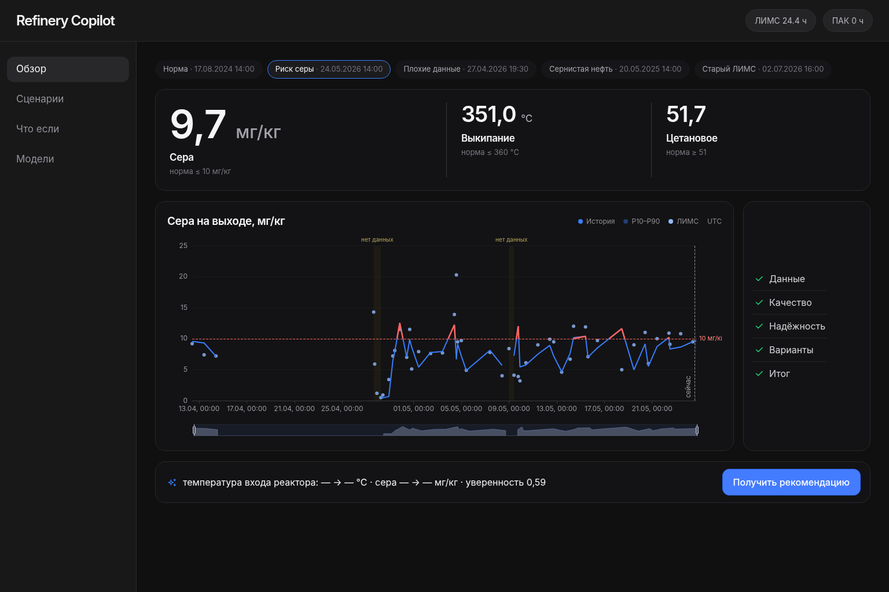
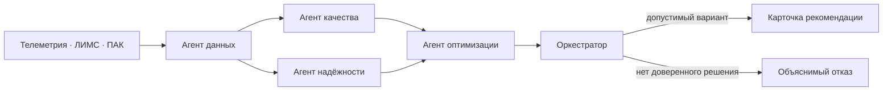
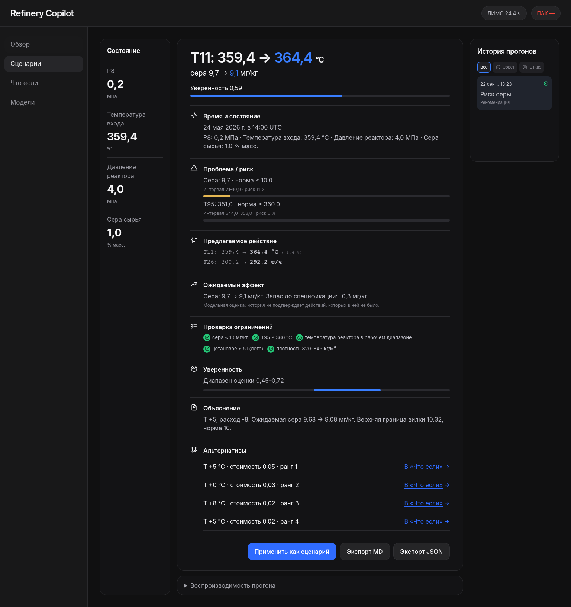
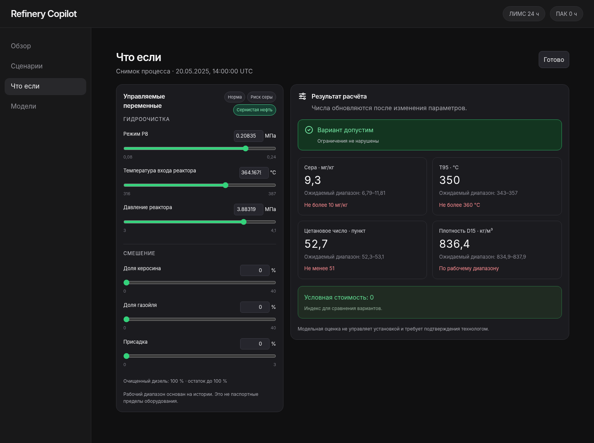
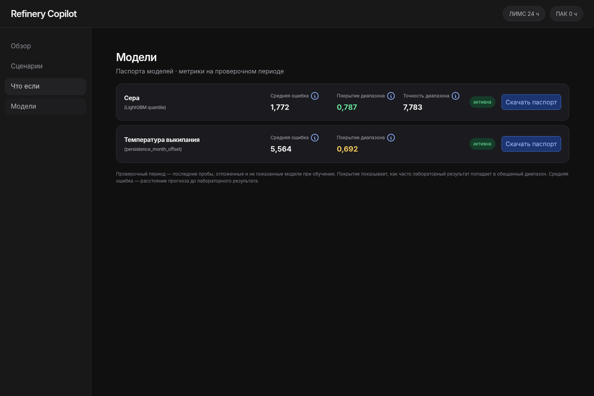
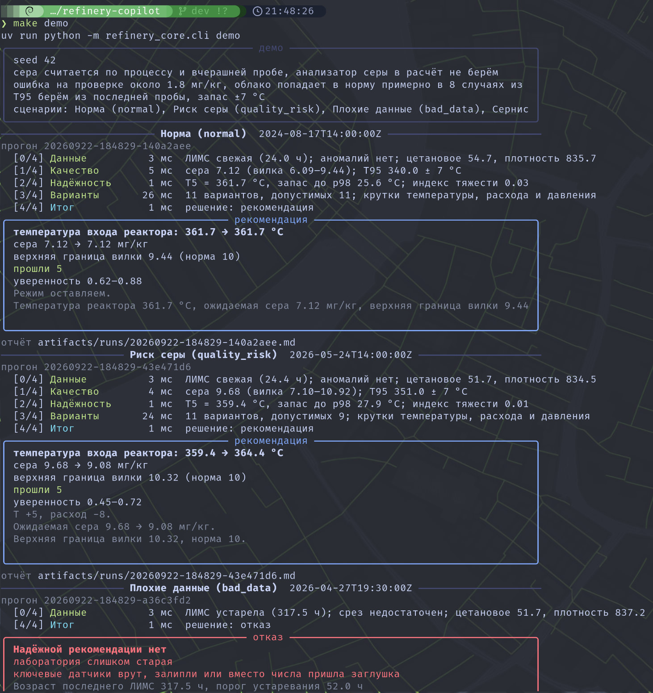

<p align="center">
  <a href="docs/README.en.md">English</a> · <strong>Русский</strong>
</p>

<h1 align="center">Refinery Copilot</h1>

<p align="center">
  <strong>Объяснимый советник оператора дизельной установки</strong><br>
  Прогнозирует качество, проверяет ограничения и предлагает безопасное действие —<br>
  либо честно отказывается при недостатке данных или допустимых вариантов.
</p>

<p align="center">
  
  
  
  
  
  
</p>

<p align="center">
  
</p>

<p align="center">
  <a href="#быстрый-запуск">Запуск</a> ·
  <a href="#как-работает-решение">Как работает</a> ·
  <a href="#модели-и-обучение">Модели</a> ·
  <a href="#демонстрационные-сценарии">Сценарии</a> ·
  <a href="#ограничения-и-допущения">Ограничения</a>
</p>

> Проект разработан для хакатона «Нефтекод».

## Что решает система

Производственная цепочка **АВТ → гидроочистка 24-2000 → блендинг** связана с задержкой отклика качества до 0–3 часов. Refinery Copilot объединяет телеметрию, ЛИМС и ПАК, оценивает текущий режим и варианты действий, а затем возвращает один из двух результатов:

| Результат | Что получает оператор |
| --- | --- |
| **Recommendation** | Действие `текущее → рекомендуемое`, ожидаемый эффект, ограничения, уверенность и альтернативы |
| **Refusal** | Причины отказа: устаревший анализ, аномальные данные, широкая неопределённость или отсутствие допустимого варианта |

Качество и жёсткие ограничения проверяются до сравнения стоимости и производительности.

## Как работает решение



| Агент | Ответственность | Результат |
| --- | --- | --- |
| **Data** | Свежесть, полнота, sentinel-значения и окно телеметрии | Срез данных и флаги качества |
| **Quality** | Прогноз серы и T95 | P10/P50/P90 и риск выхода за спецификацию |
| **Reliability** | Тяжесть текущего режима по доступным признакам | Индекс риска и область применимости |
| **Optimization** | Перебор кандидатных воздействий и фильтр ограничений | Допустимые варианты и их метрики |
| **Orchestrator** | Согласование результатов | Recommendation или Refusal |

## Галерея

<table>
  <tr>
    <td></td>
    <td></td>
  </tr>
  <tr>
    <td align="center">Полный результат прогона: состояние, риски, действие и trace агентов</td>
    <td align="center">Модельная оценка изменения режима и качества продукта</td>
  </tr>
  <tr>
    <td></td>
    <td></td>
  </tr>
  <tr>
    <td align="center">Метрики, период обучения и область применимости</td>
    <td align="center">CLI demo: пять сценариев и Markdown/JSON-отчёты</td>
  </tr>
</table>

## Быстрый запуск

### Linux

Прямой запуск проверен на Debian; те же команды применимы на Astra Linux при наличии Python 3.12 и `uv`. Совместимость с конкретной редакцией Astra Linux следует подтвердить на целевой машине перед эксплуатацией.

**CLI demo** — пять сценариев, карточки решений и отчёты:

```bash
uv sync --group dev
make demo
```

**Веб-интерфейс** — API и dashboard:

```bash
uv sync --group dev
make web
```

После `make web`:

- UI: `http://127.0.0.1:5173`;
- API: `http://127.0.0.1:8000/health`.

`Ctrl+C` останавливает оба процесса.

### Docker Compose

Нужны Docker Engine и Compose plugin:

```bash
git clone https://github.com/KroJIak/refinery-copilot.git
cd refinery-copilot
cp .env.example .env
mkdir -p artifacts/runs artifacts/timeline
docker compose up -d --build
```

После запуска:

- UI: `http://127.0.0.1:8080`;
- API: `http://127.0.0.1:8000/health`.

Проверка состояния:

```bash
docker compose ps
curl http://127.0.0.1:8000/health
```

Данные подключаются в контейнер только для чтения, отчёты сохраняются в `artifacts/`.

### Windows

Рекомендуется **Docker Desktop + WSL2**:

```powershell
git clone https://github.com/KroJIak/refinery-copilot.git
cd refinery-copilot
copy .env.example .env
docker compose up -d --build
```

Нативный запуск возможен из PowerShell или WSL2 при установленном Python 3.12, `uv`, Node.js и npm. Команды `uv sync`, `make demo` и `make web` удобнее выполнять в WSL2.

> Локальные CLI и web-запуски требуют Python 3.12, `uv`, а для web-интерфейса — Node.js 20+ и npm. `data/` и `artifacts/models/` содержат входные данные и модельные артефакты; при их отсутствии сначала выполните подготовку ниже.

## Подготовка данных и моделей

Исходные файлы должны находиться в `data/raw/`:

```text
data/raw/
├── 242000_tags.csv
├── avt_tags.csv
├── ЛИМСы*.xlsx
├── Выгрузка ПАК*.xlsx
└── Теги_хакатон.xlsx
```

Построение датасета и обучение:

```bash
make data
make train
```

Результат:

```text
data/processed/quality_datasets/sulfur.parquet
artifacts/models/sulfur_advisory/
artifacts/models/t95_advisory/
```

Для быстрой проверки одного сценария:

```bash
uv run python -m refinery_core.cli run --scenario quality_risk --t-point 2026-05-24T14:00:00Z
```

## Модели и обучение

Обучение выполняется офлайн. В рабочем контуре LLM не требуется: решение построено на инженерных и математических моделях и работает в закрытой сети.

| Задача | Модель | Почему выбрана |
| --- | --- | --- |
| Сера, P10/P50/P90 | **LightGBM quantile** | Быстрый табличный inference, отдельные квантили и понятные признаки технологического режима |
| What-if по сере | **LightGBM L2 с монотонными ограничениями** | Даёт устойчивый process-only delta для виртуальных воздействий и не использует квантильный градиент напрямую |
| T95 | **Последнее доступное ЛИМС + поправка по месяцу** | На отложенном периоде этот baseline оказался лучше более тяжёлого бустинга |
| Неопределённость | **Conformal calibration (CQR)** | Расширяет интервал после калибровки на отдельном временном отрезке |

Валидация разделяет данные по времени:

```text
train → calibration → holdout
```

Случайное перемешивание строк не используется. Результаты текущих артефактов обучения:

| Модель | Train / Cal / Hold | Hold MAE | Coverage | Дополнительно |
| --- | ---: | ---: | ---: | --- |
| Сера | 1206 / 206 / 47 | 1.77 мг/кг | 0.79 после CQR | Winkler 7.78 после CQR |
| T95 | 1041 / 150 / 39 | 5.56 °C | 0.69 | интервал ±7 °C |

Артефакты и метрики:

- `artifacts/models/sulfur_advisory/metrics.json`;
- `artifacts/models/t95_advisory/metrics.json`;
- `artifacts/models/t95_advisory/baseline.json`.

## Данные и временная корректность

- Телеметрия синхронизируется по времени, а не по номеру строки.
- Результат ЛИМС доступен модели не раньше чем через 4 часа после отбора пробы.
- Возраст анализа передаётся в признаки и влияет на отказ.
- Sentinel-значения очищаются до построения признаков; `Q21 ≈ 307` трактуется как выброс.
- При конфликте источников ЛИМС имеет приоритет над ПАК.
- Единицы измерения сохраняются в срезе и карточке результата.

## Управляемые параметры и ограничения

| Параметр | Ключ интерфейса | Статус |
| --- | --- | --- |
| Температура/режим гидроочистки | `24-2000.P8`, `24-2000.T11` | Исторический модельный диапазон |
| Давление реактора | `24-2000.F19` | Исторический модельный диапазон |
| Доля керосина и газойля | `blend_share_*` | Суммарно с очищенным дизелем = 100% |
| Цетаноповышающая присадка | `blend_additive_pct` | До 3% |

Проверяются:

- сера `≤ 10 мг/кг`;
- T95 `≤ 360 °C`;
- цетановое число `≥ 51` летом и `≥ 49` зимой;
- плотность `820–845 кг/м³`;
- сумма долей блендинга `100%`;
- выход за заданный модельный диапазон;
- свежесть и полнота данных.

При старом ЛИМС, sentinel-значениях, широкой вилке или отсутствии допустимого варианта система формирует отказ.

## Демонстрационные сценарии

| Сценарий | Что показывает | Ожидаемый результат |
| --- | --- | --- |
| `normal` | устойчивый период | не создаёт лишнюю крутку |
| `quality_risk` | сера близко к норме | безопасный вариант или отказ по неопределённости |
| `bad_data` | аномальные данные и старый анализ | отказ с причинами |
| `sour_crude` | сернистое сырьё | изменившийся прогноз и действие |
| `stale_lims` | ЛИМС возрастом около 350 часов | отказ без рискованной рекомендации |

Запуск всех сценариев и сохранение отчётов:

```bash
make demo
```

Артефакты прогона:

```text
artifacts/runs/<run_id>.md
artifacts/runs/<run_id>.json
artifacts/timeline/<run_id>.ndjson
```

## Воспроизводимость и проверки

```bash
make test
make lint
cd frontend && npm ci && npm run lint && npm run typecheck && npm run build
```

Одинаковый `SEED` и одинаковое состояние входных данных дают одинаковое решение и численные результаты. Текст формулировки может отличаться; решение и числа должны совпадать.

## Структура проекта

```text
core/       агенты, модели, ограничения, сценарии и отчёты
backend/    FastAPI REST/SSE-обёртка над ядром
frontend/   React dashboard, What-if и карточка рекомендации
data/      raw и подготовленный Parquet-датасет
artifacts/  модели, отчёты и timeline прогонов
```

## Версия на английском

- [English README](./docs/README.en.md)

---

<p align="center"><sub>Refinery Copilot · Нефтекод · deterministic advisory system for refinery operations</sub></p>
