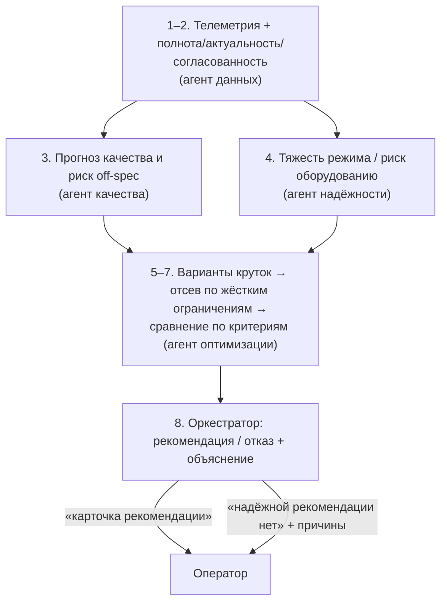
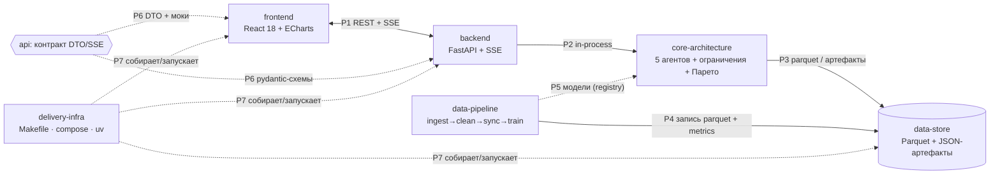

# «Refinery Copilot»: ИИ-советник оператора установок нефтепереработки

## 1. Что это: проблема → решение

Производство товарного дизельного топлива — связанная цепочка **АВТ → гидроочистка 24-2000 → блендинг**. Оператор управляет ею практически «вслепую»: отклик качества на крутку приходит через 0–3 ч[^dop-dinamika], лабораторный анализ (ЛИМС) публикуется через ≤ 4 ч после отбора пробы[^lims-ritm], а ПАК шумит и поточечно с ЛИМС не коррелирует (r ≈ −0.003)[^research01].

**Решение** — детерминированная **мультиагентная система (МАС)**, которая получает состояние процесса, оценивает последствия возможных действий и формирует безопасную, объяснимую рекомендацию оператору: 5 агентов (data → quality → reliability → optimization → orchestrator) прогнозируют качество (LightGBM quantile + MAPIE + SHAP), проверяют жёсткие ограничения, ранжируют варианты по Парето и выдают **карточку рекомендации — либо честный отказ с причинами**. Ядро проверяемо из консоли (`make demo`), витрина — FastAPI (REST + SSE) и React-дашборд. Технические детали — в [[01-ARCHITECTURE]].

## 2. Карта доменов (7 доменов)

Протоколы P1–P7 специфицированы в домене api ([[00-SUMMARY]]). Зависимости строго однонаправлены: `frontend → backend → core → data-store`; домен `api` — виртуальный контракт.

| Домен | Каталог | Назначение | Стек | Файлов (код) | Документов |
| --- | --- | --- | --- | --- | --- |
| **core-architecture** | `core/src/refinery_core/agents·optimize·explain·report` | 5 агентов, движок жёстких ограничений, Парето, отказ, карточка рекомендации, RunReport | Python 3.12, pydantic v2, LightGBM/SHAP (инференс), pandas | ~12 py + 5 тестов | 17 |
| **data-pipeline** | `core/src/refinery_core/data·features·models` | инжест CSV→Parquet, чистка сентинелов, синхронизация + свежесть, признаки, обучение quantile-моделей | Polars/DuckDB, pandas, LightGBM, MAPIE, scipy, sklearn | ~9 py + 4 тестов | 11 |
| **data-store** | `data/` + `artifacts/` | файловое хранилище вместо БД: Parquet-датасеты, JSON-артефакты прогонов, конвенции | Parquet (zstd), JSON, Markdown | 0 кода; 2–3 конвенции | 7 |
| **backend** | `backend/src/app/` | тонкая HTTP-обёртка ядра: REST + SSE-транспорт прогресса агентов, health | FastAPI, pydantic v2, uvicorn, sse-starlette | ~9 py + 2–3 тестов | 8 |
| **api** | `backend/schemas.py` ↔ `frontend/src/types/` | единый контракт REST/SSE: 8 DTO, 8 енумов, протоколы P1–P7, мок-фикстуры | pydantic v2 → OpenAPI → TypeScript | 1 py + 1 ts + 1 spec | 18 |
| **frontend** | `frontend/` | дашборд: тайм-серии, карточка рекомендации, конвейер агентов, светофоры, what-if | React 18, Vite, TS strict, Tailwind v4, ECharts, react-query | ~30 | 17 |
| **delivery-infra** | корень: `Makefile`, `docker-compose*.yml`, `uv.lock` | воспроизводимая сборка/запуск: uv-окружение, compose (api+web), healthchecks | uv, docker-compose, Make, multi-stage Docker | ~7 конфигов | 7 |

Итого: **85 документов доменов** (см. карту ниже).

> [!warning] Правило зависимостей
> Ядро не знает про HTTP и React; backend — тонкая обёртка; фронт не имеет доступа к ядру и
> хранилищу напрямую — только через контракт P1/P6. Изменения контракта — только через домен api.

## 3. Карта документов репозитория

### 3.1. Корневые документы

| Документ | Назначение |
| --- | --- |
| `docs/00-PROJECT-OVERVIEW.md` | этот файл: что это, карта доменов и документов, порядок чтения |
| `docs/01-ARCHITECTURE.md` | тех-стек, архитектурные решения (ADR), сквозные паттерны, деплой, безопасность |
| `docs/README.en.md` | англоязычная аннотация решения (одна строка) |
| `README.md` | запуск, структура проекта, допущения |

### 3.2. Домен core-architecture — 17 документов

| # | Файл | Назначение |
| --- | --- | --- |
| 1 | `00-OVERVIEW` | визитная карточка: слои, индекс, правила дизайна, зависимости P2/P3/P5 |
| 2 | `01-agents-base` | каркас агента `run(ctx) -> AgentStep`: контекст, `input_digest`, тайминги |
| 3 | `02-model-registry` | загрузка моделей из `artifacts/models/`, «ядро не обучает в рантайме» |
| 4 | `03-agent-data` | агент данных: состояние из Parquet, свежесть, детектор аномалий |
| 5 | `04-agent-quality` | агент качества: квантили P10/P50/P90, конформ, `spec_risk` |
| 6 | `05-agent-reliability` | агент надёжности: тяжесть режима, запасы до p2/p98, наработка катализатора |
| 7 | `06-constraints-engine` | жёсткие ограничения (сера ≤ 10, T95 ≤ 360, ЦЧ ≥ 51/49, …), вердикт pass/violate |
| 8 | `07-agent-optimization` | генерация круток (P8/T11/F19, АВТ, блендинг), фильтр ограничений |
| 9 | `08-pareto-front` | Парето «запас качества ↔ стоимость» (присадка ×100) |
| 10 | `09-agent-orchestrator` | конвейер, трейс, решение «рекомендовать / отказаться», карточка рекомендации |
| 11 | `10-refusal` | отказ как первоклассный ответ: причины `RefusalReason` и правила срабатывания |
| 12 | `11-explain-shap` | SHAP TreeExplainer: top-k факторов для карточки |
| 13 | `12-run-report` | сборка `RunReport` (seed, хэши, версии) → JSON + Markdown |
| 14 | `13-scenarios` | 5 пресетов `ScenarioKind`, включая гарантированный отказ |
| 15 | `14-cli` | `cli.py`: команды demo/run, консольный вывод, без сети |
| 16 | `15-tests` | pytest: границы ограничений, отказ, детерминизм, свойства Парето |
| 17 | `90-narrator-llm` | нарратор поверх фактов: LLM опциональна, тумблер off/local/external |

### 3.3. Домен data-pipeline — 11 документов

| # | Файл | Назначение |
| --- | --- | --- |
| 1 | `00-OVERVIEW` | поток ingest→publish, правила дизайна, зависимости P4/P5 |
| 2 | `01-ingest-csv` | чтение raw CSV/XLSX, часовой пояс, dtype-схемы, кэш Parquet |
| 3 | `02-clean-sentinels` | маска сентинелов {307, 251, 252, 240} — первый шаг, `quality_flag`, залипания |
| 4 | `03-sync-freshness` | выравнивание только по времени; анти-утечка ЛИМС ≤ 4 ч; `DataFreshness` |
| 5 | `04-anomaly-params` | офлайн-фит Hampel + PCA T²/SPE, экспорт порогов |
| 6 | `05-features` | окна, лаги 0–3 ч, возраст ЛИМС, наработка катализатора, сезон |
| 7 | `06-train-quantile` | сера: 3× quantile + L2-локализатор what-if; T95 бейзлайн последней пробы; ЦЧ без бустера |
| 8 | `07-conformal-calibration` | MAPIE (EnbPI/ACI), ширина интервала как сигнал отказа |
| 9 | `08-validation-timesplit` | TimeSeriesSplit с gap ≥ 3 ч, holdout 2026, `metrics.json` |
| 10 | `09-publish-registry` | запись `artifacts/models/{target}/` (P5, сторона производителя) |
| 11 | `10-tests` | сентинелы, анти-утечка, детерминизм, gap в каждом фолде |

### 3.4. Домен data-store — 7 документов

| # | Файл | Назначение |
| --- | --- | --- |
| 1 | `00-OVERVIEW` | дерево `data/` + `artifacts/`, кто пишет/читает (P3/P4) |
| 2 | `01-naming-conventions` | имена файлов, Parquet+zstd, версии каталогов, sha256-хэши |
| 3 | `02-dataset-telemetry-242000` | схема телеметрии 24-2000: колонки, флаги качества, партиции |
| 4 | `03-dataset-telemetry-avt` | та же схема для АВТ, теги управляемых переменных |
| 5 | `04-dataset-lims` | ЛИМС: точки отбора, `sample_ts` / `available_ts` (≤ 4 ч) |
| 6 | `05-dataset-pak` | ПАК: сера с 01.2023, D15 с 03.2025, ppm = мг/кг |
| 7 | `06-artifacts-catalog` | `artifacts/models/`, `artifacts/runs/`, `timeline/`, `metrics.json` |

### 3.5. Домен backend — 8 документов

| # | Файл | Назначение |
| --- | --- | --- |
| 1 | `00-OVERVIEW` | слои routes→service→core, правила дизайна, P1/P2/P6 |
| 2 | `01-app-config` | фабрика FastAPI, pydantic-settings, CORS, lifespan, ошибки ядра |
| 3 | `02-core-bridge` | in-process вызов оркестратора (P2), RunManager, `asyncio.Queue` |
| 4 | `03-runs-routes` | `POST /api/runs`, `GET /api/runs/{id}`, отчёты MD/JSON |
| 5 | `04-sse-stream` | `GET /api/runs/{id}/events`: 9 событий + heartbeat, формат кадров, отключения |
| 6 | `05-state-whatif` | `GET /api/state`, `POST /api/whatif` (< 50 мс, модели в памяти) |
| 7 | `06-models-health` | `GET /api/models`, `GET /health` |
| 8 | `07-docker` | multi-stage `python:3.12-slim` + uv, non-root, healthcheck |

### 3.6. Домен api (контракт) — 18 документов

| # | Файл | Назначение |
| --- | --- | --- |
| 1 | `00-SUMMARY` | матрица REST × DTO × SSE; версии; правило заморозки контракта |
| 2 | `data-models/01-timeseries` | DTO TagPoint: `tag_code, ts, value, quality_flag, source, unit` |
| 3 | `data-models/02-data-freshness` | DTO DataFreshness: возраст источника, статусы ok/warn/stale/missing |
| 4 | `data-models/03-quality-assessment` | DTO QualityAssessment: P10/P50/P90, `spec_risk`, SHAP top-k |
| 5 | `data-models/04-recommendation` | DTO карточки рекомендации + `refusal{reasons[]}` |
| 6 | `data-models/05-agent-step` | DTO AgentStep: трейс шага агента |
| 7 | `data-models/06-scenario` | DTO Scenario: 5 пресетов, overrides только управляемых |
| 8 | `data-models/07-run-report` | DTO RunReport: seed, хэши, версии, трейс, карточка |
| 9 | `data-models/08-model-artifact` | DTO ModelArtifact: манифест модели, coverage, диапазон обученности |
| 10 | `enums/01-enums` | AgentRole, FreshnessStatus, RefusalReason, RunStatus, ScenarioKind, QualityTarget, DataSource |
| 11 | `protocols/01-p1-rest-sse` | P1 frontend ↔ backend: REST-спек + SSE-события с примерами |
| 12 | `protocols/02-p2-backend-core` | P2 backend ↔ core: in-process контракт, очередь событий |
| 13 | `protocols/03-p3-core-datastore` | P3 core ↔ data-store: read-only Parquet, запись артефактов |
| 14 | `protocols/04-p4-pipeline-datastore` | P4 pipeline → data-store: перечень записываемых объектов |
| 15 | `protocols/05-p5-pipeline-core` | P5 pipeline → core: формат manifest.json, совместимость версий |
| 16 | `protocols/06-p6-openapi-ts-mocks` | P6: pydantic → OpenAPI → TS-типы; правила версионирования и моков |
| 17 | `protocols/07-p7-infra` | P7: цели Make и сервисы compose как контракт запуска |
| 18 | `90-examples-and-mocks` | JSON-примеры всех ответов и SSE-событий; фикстуры 5 сценариев и мок-SSE |

### 3.7. Домен frontend — 17 документов

| # | Файл | Назначение |
| --- | --- | --- |
| 1 | `00-OVERVIEW` | слои pages→types, правила самодостаточности, P1/P6 |
| 2 | `01-project-setup` | Vite + React 18 + TS strict + Tailwind v4; env `VITE_USE_MOCKS` |
| 3 | `02-types` | TS-зеркала 8 DTO из api/data-models (P6) |
| 4 | `03-service-rest` | REST-клиент: fetch-обёртка, таймауты, типизированные ошибки |
| 5 | `04-service-sse` | SSE-клиент: EventSource, backoff, heartbeat |
| 6 | `05-mocks` | фикстуры 5 сценариев + мок-SSE-симулятор |
| 7 | `06-state` | react-query (REST) + статус-машина прогона (SSE) |
| 8 | `07-components-timeseries` | ECharts: dataZoom, lttb-прореживание из 189 тыс. точек, markLine |
| 9 | `08-components-recommendation-card` | карточка рекомендации + refusal-блок + alternatives |
| 10 | `09-components-agent-pipeline` | конвейер 5 агентов, статусы live из SSE |
| 11 | `10-components-whatif-controls` | ползунки управляемых, индикация нарушений |
| 12 | `11-page-dashboard` | компоновка дашборда + приёмочные критерии |
| 13 | `12-page-recommendation-card` | страница карточки, экспорт отчёта MD/JSON |
| 14 | `13-page-whatif` | симулятор «что если», отклик < 200 мс на моках |
| 15 | `14-page-mnemonic` | SVG-мнемосхема АВТ → гидроочистка → блендинг |
| 16 | `15-page-models` | метрики holdout, важности признаков, диапазоны обученности |
| 17 | `16-page-data-reporter` | репортёр данных: сентинелы, залипания, мёртвые теги |

### 3.8. Домен delivery-infra — 7 документов

| # | Файл | Назначение |
| --- | --- | --- |
| 1 | `00-OVERVIEW` | карта целей/сервисов, порядок запуска |
| 2 | `01-makefile-targets` | help/data/train/demo/run/ui/test/lint/up/down |
| 3 | `02-docker-compose` | api + web (nginx, `proxy_buffering off`), healthchecks, volumes |
| 4 | `03-uv-environment` | pyproject workspace, `uv.lock` в репо, Python 3.12 |
| 5 | `04-env-vars` | `.env.example`: SEED, DATA_DIR, LLM_MODE=off\|local\|external |
| 6 | `05-seeds-reproducibility` | фиксированные сиды, чек-лист детерминизма, хэши данных |
| 7 | `06-release-checklist` | финальная проверка выпуска: `make up`, генеральная репетиция 4 сценариев, pytest+ruff |

## 4. Как читать документацию

### Все роли начинают здесь

`docs/00-PROJECT-OVERVIEW.md` (этот файл) → `docs/01-ARCHITECTURE.md` → дальше по задаче.

### Разработка UI

> [!tip] Фронтенд самодостаточен
> Домен frontend обязан полностью работать **без backend** на моках: статические фикстуры
> 5 сценариев + мок-SSE-симулятор + `VITE_USE_MOCKS=true`. Старт — с контракта, не с кода.

1. [[00-SUMMARY]] — матрица REST × DTO × SSE и перечень событий.
2. `api/enums/01-enums` → `api/data-models/01–08` — типы и их примеры.
3. [[90-examples-and-mocks]] — JSON-примеры всех ответов, фикстуры, сценарий мок-SSE.
4. `frontend/00-OVERVIEW` → `01-project-setup` → `02-types` → `03-service-rest` → `04-service-sse` → `05-mocks` → страницы `11–16` (у каждой — приёмочные критерии).
5. Для деталей транспортного слоя: `api/protocols/01-p1-rest-sse`, `api/protocols/06-p6-openapi-ts-mocks`.

### Разработка backend

1. `api/00-SUMMARY` → `api/data-models/*` — контракт, который реализуешь.
2. `api/protocols/02-p2-backend-core` — как backend зовёт ядро (in-process, очередь событий).
3. `backend/00-OVERVIEW` → `01-app-config` → `02-core-bridge` → `03-runs-routes` → `04-sse-stream` → `05-state-whatif` → `06-models-health` → `07-docker`.
4. Ядро как чёрный ящик: `core-architecture/00-OVERVIEW`, `01-agents-base`, `09-agent-orchestrator`.
5. Ограничения данных: `data-store/00-OVERVIEW` (рантайм read-only).

### Разработка ML

1. [[01-ARCHITECTURE]], ADR-2 — почему LightGBM quantile + MAPIE, а не нейросети.
2. `data-pipeline/00-OVERVIEW` → `02-clean-sentinels` (сентинелы, мёртвые каналы, лаги) → `03-sync-freshness` (анти-утечка ≤ 4 ч, пороги p2/p98) → `05-features` → `06-train-quantile` → `07-conformal-calibration` → `08-validation-timesplit`.
3. Инференс и объяснимость: `core-architecture/04-agent-quality`, `11-explain-shap`, `06-constraints-engine`.

### Знакомство с системой

1. Этот файл + [[01-ARCHITECTURE]] — замысел и архитектурные решения.
2. `core-architecture/10-refusal` — отказ как штатный, первоклассный ответ системы.
3. `delivery-infra/01-makefile-targets` (`make demo`) и `06-release-checklist` — воспроизводимость: проверка решения из консоли.

[^dop-dinamika]: По результатам анализа истории данных: задержка «воздействие → качество» 0–3 ч, шаг рекомендаций 15–60 мин, горизонт прогноза 0–3 ч.
[^lims-ritm]: Метка ЛИМС = момент отбора пробы, публикация ≤ 4 ч; медианный интервал замеров серы — 24 ч.
[^research01]: По результатам анализа истории данных: сентинелы вместо пропусков, D10 мёртв (99.99 %), поточечная корреляция ПАК↔ЛИМС отсутствует; 2026 прижат к границе (среднее Q21 = 10.08 мг/кг).
