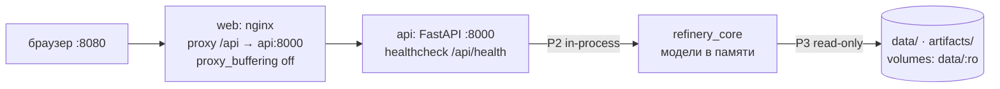

# Архитектура «Refinery Copilot»

Обзор проекта и карта доменов — в [[00-PROJECT-OVERVIEW]]; контракт — [[00-SUMMARY]].

## 1. Технологический стек

| Слой             | Технология                                                                                              | Роль                                                                  | Обоснование                                                                                                  |
| ---------------- | ------------------------------------------------------------------------------------------------------- | --------------------------------------------------------------------- | ------------------------------------------------------------------------------------------------------------ |
| Ядро             | **Python 3.12**                                                                                         | агенты, ограничения, Парето, отчёты                                   | основной язык реализации ядра и backend, зрелая ML/дата-экосистема                                            |
| Данные           | **pandas** (обучение) + **Polars lazy / DuckDB** (чтение) поверх **Parquet**                            | инжест, ленивые окна с pushdown, экосистема sklearn                   | 247+91 МБ CSV → Parquet один раз; ленивые окна с pushdown читаются быстрее полной выгрузки в pandas           |
| Модели           | **LightGBM** `objective=quantile` (P10/P50/P90)                                                         | прогноз серы, T95, D15, ЦЧ                                            | встроенные квантили, `monotone_constraints`, SHAP-совместимость (ADR-2)                                      |
| Неопределённость | **MAPIE** (EnbPI/ACI)                                                                                   | конформная калибровка интервалов; ширина интервала = триггер отказа   | конформный подход: интервалы без допущений о распределении ошибок                                            |
| Объяснимость     | **SHAP** TreeExplainer                                                                                  | top-k факторов в карточке и на странице «Модели»                      | точный Tree SHAP для LightGBM                                                                                |
| Аномалии         | **Hampel** (scipy MAD) + **PCA T²/SPE** (sklearn)                                                       | детектор аномалий входных данных                                      | интерпретируемая классика мониторинга нефтехимических процессов                                              |
| Контракт         | **pydantic v2** → OpenAPI → **TypeScript**                                                              | единый источник DTO, camelCase-алиасы                                 | домен api, P6                                                                                                |
| Backend          | **FastAPI** + uvicorn + **SSE** (sse-starlette)                                                         | REST `/state /runs /whatif /models /health` + стрим прогресса агентов | ADR-5                                                                                                        |
| Frontend         | **React 18** + **Vite** + **TypeScript strict** + **Tailwind v4** + **ECharts** + @tanstack/react-query | дашборд, карточка рекомендации, конвейер агентов, what-if             | ECharts держит 189 тыс. точек (dataZoom + lttb); React 18 стабилен                                           |
| Зависимости      | **uv** + `uv.lock`                                                                                      | воспроизводимое окружение локально и в образах                        | воспроизводимость: «один seed → одно решение» и одно окружение (ADR-1)                                       |
| Развёртывание    | **docker-compose**: `api` + `web` (nginx)                                                               | healthchecks, `depends_on: service_healthy`                           | стандартный локальный запуск api + web с проверками живости                                                  |
| БД               | **нет**                                                                                                 | состояние = `data/` (Parquet) + `artifacts/` (JSON/MD)                | ADR-4                                                                                                        |

## 2. Ключевые архитектурные решения (ADR)

### ADR-1. Детерминированное ядро + LLM только как нарратор

**Почему.** Требование воспроизводимости («один seed → одно решение и одинаковые числа») и закрытый контур on-premise несовместимы с LLM в вычислительном контуре. Все числа в карточке порождает детерминированный пайплайн; LLM (опционально, тумблер `off|local|external`, локально ≤ ~30B параметров) лишь переформулирует уже посчитанные факты. LLM в прогнозном контуре не обязательна: прогноз дают инженерные модели, а применение LLM оправдано, только когда оно обосновано. Паттерн соответствует промышленной практике 2024–2026: детерминированный исполнительный слой (DCS/APC/блокировки) → специализированные агенты → LLM-оркестратор на «медленном» контуре (минуты), никогда не касающийся быстрых петель.

**Альтернативы.** LLM-агенты в каждом роле (отвергнуто: недетерминизм, зависимость от API, цена); полностью без LLM — дефолт и нижняя граница тумблера.
**Цена.** Тексты нарратора ограничены шаблонами поверх фактов; отдельный интерфейс нарратора в core (`90-narrator-llm`).

### ADR-2. LightGBM quantile против нейросетей и PLS

**Почему.** Нужны честные интервалы P10–P90, физические `monotone_constraints`, SHAP и быстрое переобучение. LightGBM quantile даёт всё встроенно; PLS остаётся интерпретируемым бейзлайном для сравнения; LSTM отвергнут по данным: рекуррентное ядро не даёт преимущества на имеющихся данных (хуже объяснимость и воспроизводимость), а статическая ANN зачастую не хуже рекуррентных сетей на серосодержании.

**Альтернативы.** CatBoost quantile — отвергнут: конфликт `monotone_constraints` с `leaf_estimation_method=Exact` (тикет catboost#1896); нейросети — дороже в отладке и объяснении; чистый PLS — бейзлайн, а не ядро.
**Цена.** Задержка 0–3 ч закладывается лаговыми признаками как явное допущение (из сырых корреляций её не вытащить: закрытый контур АСУ, максимум r при лаге 0).

### ADR-3. Отказ — первоклассный исход, а не исключение

**Почему.** Безопасность важнее экономики, и умение отказаться — явное требование к системе, а не сбой. Отказ кодируется типом (`decision="refuse"` + `refusal.reasons[]` из `RefusalReason`: `stale_lims`, `wide_interval`, `out_of_training_domain`, `no_feasible_variant`, `sensor_fault`), попадает в SSE, карточку и артефакты как штатный статус прогона `refused`. Допустимый ответ системы: «Надёжной рекомендации нет: последнее лабораторное значение устарело, а доступные варианты либо нарушают ограничение по качеству, либо выходят за заданный модельный диапазон» — умение корректно отказаться является частью качественного решения.

**Альтернативы.** Всегда выдавать «лучшую» рекомендацию с предупреждением — нарушает приоритет безопасности.
**Цена.** Отдельные правила срабатывания и тест на гарантированный отказ (`stale_lims`-сценарий) в каждом слое: ядро → CLI → моки → UI.

### ADR-4. Parquet вместо SQL-БД

**Почему.** Данные только добавляются (выгрузка 2023–2026), запросы — ленивые окна по времени; состояние системы полностью восстанавливается из `data/` + `artifacts/`. Это закрывает требование закрытого контура и убирает точку отказа: сервисов минимум, меньше точек отказа.

**Альтернативы.** PostgreSQL/TimescaleDB (отвергнуто: лишний сервис, дампы вместо файлов, сложнее воспроизводимость); DuckDB как движок поверх Parquet — разрешён для чтения, но без «базы» как состояния.
**Цена.** Нет транзакций и SQL-агрегаций на лету; согласованность держится конвенциями каталогов и sha256-манифестами; ни один протокол (P1–P7) не использует SQL/ORM.

### ADR-5. SSE против WebSocket для прогресса агентов

**Почему.** Поток строго односторонний (сервер → клиент): события `run_started → agent_started/step/log/agent_finished ×5 → recommendation|refusal → run_finished`. Для одностороннего потока SSE — правильный и более простой выбор: обычный HTTP (работают существующие middleware/CORS/прокси), автоматический реконнект и `Last-Event-ID` из браузерного `EventSource`, минимум кода; в nginx достаточно `proxy_buffering off`.

**Альтернативы.** WebSocket (отвергнут: двунаправленность не нужна; интерактивный копилот отвечает из посчитанных фактов, миллисекундный отклик не требуется); поллинг (теряется «живой» конвейер агентов).
**Цена.** Один запрос = один прогон; реплей при переподключении — из журнала `artifacts/timeline/{run_id}.ndjson` по `Last-Event-ID`.

### ADR-6. camelCase только на границе API

**Почему.** Канон ядра, Parquet и внутренних схем — `snake_case`; camelCase генерируется механически (`alias_generator=to_camel`) на единственной границе backend → frontend. Единственный источник контракта — `backend/src/app/schemas.py` (P6), ручных «переводов» нет. Правило форм: канон/core — `snake_case`; backend — `snake_case` + `alias_generator=to_camel`, `populate_by_name`; frontend — `camelCase` (из alias); data-store — `snake_case`.

**Альтернативы.** camelCase везде (ломает Parquet-конвенции и питонский стиль); ручное зеркаление полей (расхождения типов = баги).
**Цена.** Кодогенерация TS-типов (`make api-types`) и запрет «своих» форматов на фронте: расхождение типов — баг контракта, не локальный фикс.

## 3. Сквозные паттерны

### 3.1. Пайплайн агентов с полным трейсом

Каждый агент — чистая функция контекста: `run(ctx) -> AgentStep`, без сети и глобального состояния. `AgentStep` несёт `run_id, step_idx, agent_role, input_digest (sha256), input_summary, output, notes, number_refs, confidence, started_at/finished_at` — требование трассируемости (система сохраняет и показывает входные данные, оценки агентов и итоговую рекомендацию) выполняется одним механизмом: трейс пишется в `artifacts/runs/{run_id}.json|.md` и стримится в SSE. Единственная точка входа ядра:

```python
class CoreService:
    def start_run(self, scenario: Scenario) -> str: ...          # неблокирующе: → run_id
    def subscribe_events(self, run_id: str) -> "asyncio.Queue[CoreEvent]": ...
    def get_report(self, run_id: str) -> RunReport: ...
    def read_state(self) -> StateAggregate: ...                  # срез состояния для GET /api/state
    def whatif(self, req: WhatifRequest) -> WhatifResult: ...    # < 50 мс, модели в памяти
    def list_models(self) -> list[ModelArtifact]: ...
```

### 3.2. Контракт-первый для независимого фронта

UI разрабатывается независимо, на моках, по **замороженному контракту**: DTO из канонических моделей → OpenAPI → TS-типы + JSON-примеры всех ответов и SSE-событий ([[90-examples-and-mocks]]) + мок-SSE-симулятор. Домен `frontend` самодостаточен и ведёт разработку без backend; после заморозки контракта backend и frontend собираются параллельно и сводятся при интеграции.

### 3.3. Модельный реестр с sha256

Ядро в рантайме **только загружает** модели (P5): `artifacts/models/registry.json` → активный `ModelArtifact` на каждый `QualityTarget`; проверяется sha256 `model.txt` и мажорная `core_version`. Нет артефакта или хэш не сошёлся ⇒ `models_not_loaded` (backend → 503), а не «тихий» прогноз. Обучение — только офлайн в data-pipeline (`make train`), с сидами и `metrics.json` (P4).

## 4. Деплой



| Сервис | Порт | Сборка | Healthcheck / порядок |
| --- | --- | --- | --- |
| `api` | 8000 | multi-stage `python:3.12-slim` + uv, строго из `uv.lock`, non-root | `curl -f /api/health`, interval 10–15 с, `start_period` ≈ 20 с (прогрев реестра) |
| `web` | 8080→80 | node build → nginx; прокси `/api → api:8000` с `proxy_buffering off` (иначе ломается SSE) | `wget` на `/`; `depends_on: {api: {condition: service_healthy}}` |

Volumes: `./data:/app/data:ro`, `./artifacts` (rw). ENV из `.env.example`: `SEED`, `DATA_DIR`, `MODEL_REGISTRY_DIR`, `LLM_MODE=off|local|external` (по умолчанию `off` — закрытый контур). Порядок: `make data` → `make train` → `make demo`/`make up`.

## 5. Безопасность и ограничения

| Ограничение | Значение | Механизм |
| --- | --- | --- |
| Жёсткие нормативы | сера ≤ 10 мг/кг; T95 ≤ 360 °C; ЦЧ ≥ 51 (лето) / ≥ 49 (зима); плотность 820–845 / 800–845 кг/м³; доли бленда = 100 %; присадка ≤ 3 % | движок ограничений режет варианты **до** ранжирования; вердикт каждого правила попадает в `checks[]` карточки; конфликт целей — всегда в пользу ограничений (требование безопасности) |
| Анти-утечка ЛИМС | результат доступен системе не раньше `sample_ts + 4 ч` | маска доступности в sync + возраст ЛИМС как фича; тест «ни одного значения до `available_ts`» |
| Границы моделей | диапазоны обученности и p2/p98 вместо паспортных | `trained_on_range` в `ModelArtifact`; выход из домена = причина отказа `out_of_training_domain`; p2/p98 помечены «допущение» (правило модельных границ) |
| Закрытый контур | работа без интернета, без критической зависимости от внешних API | ядро без сети; LLM за тумблером `off` по умолчанию; всё состояние — локальные файлы |
| Валидация по времени | никакого перемешивания | TimeSeriesSplit + gap ≥ 3 ч, holdout — хвост 2026 |

> [!note] Терминология
> Система — **soft sensor + target calculation + open-loop advisory (human-in-the-loop)**, не MPC
> и не замкнутый контур управления. Телеметрия содержит реакцию АСУ с обратной связью — это
> учитывается при интерпретации результатов и валидации.
