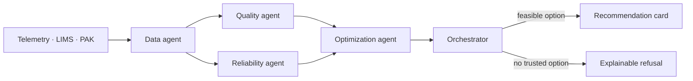

<p align="center">
  <strong>English</strong> · <a href="../README.md">Русский</a>
</p>

<h1 align="center">Refinery Copilot</h1>

<p align="center">
  <strong>An explainable advisory system for diesel-unit operators</strong><br>
  It forecasts product quality, checks hard constraints and proposes a safe action —<br>
  or refuses when data or feasible options are insufficient.
</p>

<p align="center">
  
  
  
  
  
</p>

<p align="center">
  
</p>

> Built for the Neftekod hackathon.

## What it does

The system covers the chain **AVT → 24-2000 hydrotreatment → blending**. It combines telemetry, laboratory information management system (LIMS) data and process analysers (PAK), evaluates the current regime and candidate actions, then returns either a recommendation or an explainable refusal.

| Result | Operator-facing output |
| --- | --- |
| **Recommendation** | Current → recommended action, expected effect, checks, confidence and alternatives |
| **Refusal** | Explicit reasons: stale analysis, anomalous data, wide uncertainty or no feasible option |

Quality and hard constraints are checked before cost or throughput trade-offs.

## How it works



| Agent | Responsibility | Output |
| --- | --- | --- |
| **Data** | Freshness, completeness, sentinels and telemetry window | Data slice and quality flags |
| **Quality** | Sulfur and T95 assessment | P10/P50/P90 and specification risk |
| **Reliability** | Regime severity from available signals | Risk index and applicability range |
| **Optimization** | Candidate actions and hard-constraint filtering | Feasible options and metrics |
| **Orchestrator** | Reconcile agent outputs | Recommendation or refusal |

## Screenshots

<table>
  <tr>
    <td></td>
    <td></td>
  </tr>
  <tr>
    <td></td>
    <td></td>
  </tr>
</table>

## Quick start

### Linux

Host run verified on Debian; the same commands apply to Astra Linux when Python 3.12 and `uv` are available. Verify the exact Astra Linux edition on the target machine before production use.

**CLI demo:**

```bash
uv sync --group dev
make demo
```

**Web interface:**

```bash
uv sync --group dev
make web
```

The UI is available at `http://127.0.0.1:5173`; the API health endpoint is `http://127.0.0.1:8000/health`.

### Docker Compose

Requires Docker Engine and the Compose plugin:

```bash
git clone https://github.com/KroJIak/refinery-copilot.git
cd refinery-copilot
cp .env.example .env
mkdir -p artifacts/runs artifacts/timeline
docker compose up -d --build
```

- UI: `http://127.0.0.1:8080`;
- API: `http://127.0.0.1:8000/health`.

```bash
docker compose ps
curl http://127.0.0.1:8000/health
```

The dataset is mounted read-only; run reports are written to `artifacts/`.

### Windows

Use Docker Desktop with WSL2:

```powershell
git clone https://github.com/KroJIak/refinery-copilot.git
cd refinery-copilot
copy .env.example .env
docker compose up -d --build
```

A native PowerShell or WSL2 run is possible with Python 3.12, `uv`, Node.js and npm. WSL2 is recommended for the Makefile-based commands.

## Data and model preparation

Place the source files in `data/raw/`:

```text
data/raw/
├── 242000_tags.csv
├── avt_tags.csv
├── ЛИМСы*.xlsx
├── Выгрузка ПАК*.xlsx
└── Теги_хакатон.xlsx
```

Build the quality dataset and train the local bundles:

```bash
make data
make train
```

Outputs:

```text
data/processed/quality_datasets/sulfur.parquet
artifacts/models/sulfur_advisory/
artifacts/models/t95_advisory/
```

## Models and training

Training is offline. The runtime does not require an LLM or an external API; the advisory path is based on engineering and mathematical models and can run in a closed network.

| Task | Model | Why |
| --- | --- | --- |
| Sulfur P10/P50/P90 | **LightGBM quantile** | Fast tabular inference with separate quantiles and inspectable process features |
| Sulfur What-if delta | **LightGBM L2 with monotone constraints** | Provides a process-only delta for virtual actions without using the quantile gradient as advice |
| T95 | **Last available LIMS value + month offset** | The baseline outperformed a heavier booster on the held-out period |
| Uncertainty | **Conformal calibration (CQR)** | Calibrates and widens the quantile interval on a separate time segment |

The split is chronological:

```text
train → calibration → holdout
```

The current model artifacts report:

| Model | Train / Cal / Hold | Hold MAE | Coverage | Additional metric |
| --- | ---: | ---: | ---: | --- |
| Sulfur | 1206 / 206 / 47 | 1.77 mg/kg | 0.79 after CQR | Winkler 7.78 after CQR |
| T95 | 1041 / 150 / 39 | 5.56 °C | 0.69 | interval ±7 °C |

Metrics are stored in `artifacts/models/sulfur_advisory/metrics.json` and `artifacts/models/t95_advisory/metrics.json`.

## Temporal correctness and data quality

- Sources are aligned by timestamps, never by row number.
- A LIMS result becomes available to the model no earlier than four hours after sampling.
- Analysis age is a feature and affects refusal logic.
- Sentinel values are cleaned before feature construction; `Q21 ≈ 307` is treated as an outlier.
- LIMS has priority over PAK when quality values conflict.
- Units are retained in the state and recommendation outputs.

## Controls and hard constraints

| Control | Interface key | Boundary |
| --- | --- | --- |
| Hydrotreatment regime | `24-2000.P8`, `24-2000.T11` | Historical model range |
| Reactor pressure | `24-2000.F19` | Historical model range |
| Kerosene and gasoil shares | `blend_share_*` | Shares sum to 100% with treated diesel |
| Cetane improver | `blend_additive_pct` | Up to 3% |

The system checks:

- sulfur `≤ 10 mg/kg`;
- T95 `≤ 360 °C`;
- cetane `≥ 51` in summer and `≥ 49` in winter;
- density `820–845 kg/m³`;
- blending shares sum to `100%`;
- model-range violations;
- data freshness and completeness.

Stale LIMS, sentinels, wide uncertainty or no feasible option produce a refusal.

## Demonstration scenarios

| Scenario | Demonstrates | Expected result |
| --- | --- | --- |
| `normal` | Stable period | No unnecessary action |
| `quality_risk` | Sulfur close to the limit | Safe option or uncertainty-based refusal |
| `bad_data` | Anomalous data and stale analysis | Refusal with reasons |
| `sour_crude` | Sour feedstock | Changed forecast and action |
| `stale_lims` | LIMS age of about 350 hours | Refusal without a risky recommendation |

Run all scenarios and write reports:

```bash
make demo
```

Reports are written as:

```text
artifacts/runs/<run_id>.md
artifacts/runs/<run_id>.json
artifacts/timeline/<run_id>.ndjson
```

## Reproducibility and checks

```bash
make test
make lint
cd frontend && npm ci && npm run lint && npm run typecheck && npm run build
```

The same seed and input state reproduce the same decision and numerical values. The exact wording may differ; the decision and numbers must remain the same.

## Repository map

```text
core/       agents, models, constraints, scenarios and reports
backend/    FastAPI REST/SSE wrapper around the core
frontend/   React dashboard, What-if and recommendation card
data/       raw and processed Parquet data
artifacts/  models, reports and run timelines
docs/       architecture notes and README assets
```

## Further reading

- [Project overview](./00-PROJECT-OVERVIEW.md)
- [Architecture](./01-ARCHITECTURE.md)
- [API summary](./api/00-SUMMARY.md)
- [Russian README](../README.md)
