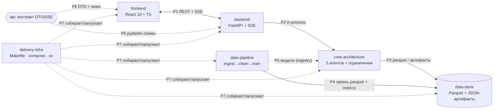

# 00-SUMMARY — карта api-слоя «Refinery Copilot»

> [!info] Роль файла
> Единая точка входа в контракт: матрица взаимодействий доменов, реестр DTO и протоколов,
> правила форм (snake_case ↔ camelCase, время, NaN, сентинелы), Implementation Mapping.
> Канонические типы живут в `api/data-models/` — здесь на них только ссылки.
> Источник истины по формам — файлы этого домена (`api/data-models/`, `api/protocols/`).

## Scope

Этот файл описывает: матрицу взаимодействий 7×7 доменов с P-кодами; индекс 8 data-models;
индекс 7 протоколов; глобальные правила именования и форм; соответствие «домен → протокол →
файлы домена». Не описывает: поля конкретных моделей ([[01-timeseries]]…[[08-model-artifact]]),
детали REST/SSE ([[01-p1-rest-sse]]), енумы ([[01-enums]]), примеры и моки ([[90-examples-and-mocks]]).

## 1. Слои api

```text
           ┌────────────────── 00-SUMMARY (индекс контракта) ──────────────────┐
pydantic v2│ data-models/ (8 DTO)   enums/ ([[01-enums]])                      │
схемы      │ protocols/ (P1…P7)      [[90-examples-and-mocks]] (мок-пакет фронта)│
           └───────────────────────────────────────────────────────────────────┘
backend/src/app/schemas.py ◄── P6 ──► frontend/src/types/  (единый источник)
Порядок чтения: 00 → enums → data-models → protocols → examples-and-mocks
```

## 2. Матрица взаимодействий 7×7

Строка — инициатор, столбец — получатель; ячейка — протокол (P1…P7) либо ✗ (прямой связи нет).

| из ↓ \ в → | core-arch | data-pipeline | data-store | backend | api | frontend | infra |
| --- | --- | --- | --- | --- | --- | --- | --- |
| **core-arch** | ✗ | ✅ P5 | ✅ P3 | ✅ P2 | ✅ P6 | ✗ | ✅ P7 |
| **data-pipeline** | ✅ P5 | ✗ | ✅ P4 | ✗ | ✗ | ✗ | ✅ P7 |
| **data-store** | ✅ P3 | ✅ P4 | ✗ | ✗ | ✗ | ✗ | ✅ P7 |
| **backend** | ✅ P2 | ✗ | ✅ P3 (через core) | ✗ | ✅ P6 | ✅ P1 | ✅ P7 |
| **api** | ✗ | ✗ | ✗ | ✅ P6 | ✗ | ✅ P6 | ✗ |
| **frontend** | ✗ | ✗ | ✗ | ✅ P1 | ✅ P6 | ✗ | ✅ P7 |
| **infra** | ✅ P7 | ✅ P7 | ✅ P7 | ✅ P7 | ✗ | ✅ P7 | ✗ |

Тот же граф:



Зависимости строго однонаправлены: `frontend → backend → core → data-store`; `data-store`
пассивен (пишут только data-pipeline и core); `api` — виртуальный домен контракта.

## 3. Реестр data-models (8 DTO)

Полные поля, валидации и JSON-примеры — в файлах каталога `api/data-models/`.

| Файл | Сущность | Владелец истины | Кто использует |
| --- | --- | --- | --- |
| [[01-timeseries]] | TagPoint — точка телеметрии/лабзамера после чистки | data-pipeline | data-store (parquet), core, backend, frontend |
| [[02-data-freshness]] | DataFreshness — светофор свежести (анти-утечка ЛИМС ≤ 4 ч) | data-pipeline | core (триггер отказа), backend, frontend (бейджи) |
| [[03-quality-assessment]] | QualityAssessment — квантили P10/P50/P90 + SHAP + риск off-spec | core (агент quality) | optimization, orchestrator, backend, frontend |
| [[04-recommendation]] | Recommendation — карточка рекомендации или первоклассный отказ | core (orchestrator) | api, backend, frontend, data-store (`runs/*.json`) |
| [[05-agent-step]] | AgentStep — трейс шага агента | core | api (SSE), frontend (конвейер агентов), data-store |
| [[06-scenario]] | Scenario — вход прогона (5 пресетов) | core (+ пресеты api) | backend, frontend (кнопки пресетов), infra (`make demo`) |
| [[07-run-report]] | RunReport — сводка прогона (1:1 с `artifacts/runs/{run_id}.json`) | core (report/) | data-store, backend (`/runs/{id}`), frontend (экспорт) |
| [[08-model-artifact]] | ModelArtifact — запись реестра моделей | data-pipeline | core (registry P5), backend, frontend (страница «Модели») |

## 4. Реестр протоколов (P1…P7)

Детали — в файлах `api/protocols/`.

| Файл | Протокол | Пара доменов | Канал |
| --- | --- | --- | --- |
| [[01-p1-rest-sse]] | P1 | frontend ↔ backend | HTTP: REST JSON (`/api/*`) + SSE (`text/event-stream`) |
| [[02-p2-backend-core]] | P2 | backend ↔ core-architecture | in-process Python: импорт `refinery_core`, события — `asyncio.Queue` |
| [[03-p3-core-datastore]] | P3 | core-architecture ↔ data-store | файлы: Polars `scan_parquet` (read-only) + запись `artifacts/runs/` |
| [[04-p4-pipeline-datastore]] | P4 | data-pipeline → data-store | файлы: запись `data/processed/*.parquet`, `metrics.json` |
| [[05-p5-pipeline-core]] | P5 | data-pipeline → core-architecture | файловый model registry: `registry.json` + `manifest.json` + `model.txt` |
| [[06-p6-openapi-ts-mocks]] | P6 | api ↔ backend ↔ frontend | pydantic v2 → OpenAPI → TS-типы + мок-фикстуры/мок-SSE |
| [[07-p7-infra]] | P7 | delivery-infra → все | Makefile, docker-compose, uv |

## 5. Глобальные правила форм

Действуют для всех DTO без исключений.

| Правило | Канон / core (pydantic) | Backend (pydantic) | Frontend (TS) | Data-store (Parquet) |
| --- | --- | --- | --- | --- |
| Имена полей | `snake_case` | `snake_case` + `alias_generator=to_camel`, `populate_by_name` | `camelCase` (из alias) | `snake_case` |
| Время | `datetime` aware UTC | ISO 8601 UTC с `Z` | `string` (ISO 8601 UTC) | `timestamp[ms, UTC]` |
| Nullable | `float \| None = None`; nullable-поле присутствует явно, не удаляется | то же, `allow_inf_nan=False` | `number \| null` | `float64`, NaN = «нет значения» |
| Сентинелы {307, 251, 252, 240} | не существуют за пределами data-pipeline: → `null` + `quality_flag` ([[01-timeseries]]) | то же | `null` | остаются только в `data/raw/` |
| NaN/Inf в JSON | запрещены → всегда `null` | то же | `null` | NaN допустим |
| Енумы | `str`-Enum, значения `lower_snake` ([[01-enums]]) | тот же тип | union строковых литералов | `dictionary<string>` |

Дополнительно: тело любой ошибки — `{"error": {"code", "message", "details"}}`; база REST — `/api`;
идентификатор прогона — `YYYYMMDD-HHMMSS-hex8 (UTC)`; `run_id` входит во все события SSE.

## 6. Матрица REST × DTO × коды ошибок (сводка P1)

Полный спек — [[01-p1-rest-sse]]; JSON-примеры каждого ответа — [[90-examples-and-mocks]].

| Метод и путь | Ответ / DTO | Ошибки |
| --- | --- | --- |
| `GET /api/health` | `{status, contract, core, modelsLoaded}` | — |
| `GET /api/state` | `TagPoint[]` + `DataFreshness[]` + `lastRun?` | 400, 503 |
| `POST /api/runs` | **202** `{runId, status:"started", eventsUrl}` | 400, 503 |
| `GET /api/runs` | список сводок `[{runId, status, kind, tPoint, decision, createdAt}]` | — |
| `GET /api/runs/{run_id}` | полный [[07-run-report]] | 404 |
| `GET /api/runs/{run_id}/report.json` / `.md` | файл артефакта (`text/markdown`) | 404 |
| `GET /api/runs/{run_id}/events` | SSE-стрим (ниже) | 404 |
| `POST /api/whatif` | `WhatifResponse` (синхронно, < 50 мс) | 400, 503 |
| `GET /api/models` | [[08-model-artifact]][] | 503 |

SSE-события (строгий порядок задаёт core, P2): `run_started` → цикл [`agent_started` → `step*` /
`log*` → `agent_finished`] × 5 агентов → `recommendation` | `refusal` → `run_finished` | `run_failed`;
`id` = монотонный `seq`; heartbeat — SSE-комментарий `: hb <ISO>` каждые 15 с (не событие).

## 7. Implementation Mapping: кто какой протокол реализует

Ссылки на файлы доменов — по нумерации документов в `docs/<домен>/`.

| Домен | Реализует | Где (файлы домена) |
| --- | --- | --- |
| core-architecture | **P2** (исполняющая сторона: `CoreService.start_run/subscribe_events/get_report/read_state/whatif/list_models`), **P3** (чтение parquet, запись артефактов), **P5** (потребитель registry), **P6** (источник pydantic-схем) | `core-architecture/02` (registry), `core-architecture/09–13` (агенты, карточка, отчёт), `refinery_core/types.py` (енумы, [[01-enums]]) |
| data-pipeline | **P4** (запись `data/processed/`, `metrics.json`), **P5** (поставщик моделей: манифесты + `model.txt`), владелец [[01-timeseries]], [[02-data-freshness]], [[08-model-artifact]] | `data-pipeline/09` (обучение и запись моделей) |
| data-store | Пассивен; контракт поверх P3/P4: схемы датасетов, каталоги, нейминг, хэши | `data-store/00-OVERVIEW.md`, `data-store/06` |
| backend | **P1** (FastAPI-маршруты, SSE-трансляция очереди в кадры), **P2** (вызывающая сторона: worker-поток + `asyncio.Queue`), **P6** (`schemas.py` — единственный источник правды) | `backend/02` (P2-клиент), `backend/03–05` (REST, SSE, health) |
| api | **P6** (контракт: DTO, енумы, версии, моки) — этот домен | `api/*` (данный набор), `frontend/02-types.md`, `frontend/05-mocks.md` |
| frontend | **P1** (fetch/EventSource), **P6** (потребитель TS-типов и моков; офлайн-режим) | `frontend/03–04` (rest/sse-сервисы), `frontend/05-mocks.md` |
| delivery-infra | **P7** (Makefile-цели, compose: `proxy_buffering off` для SSE, healthcheck `/api/health`, volumes `data/:ro`) | `delivery-infra/01–04` |

## 8. Версии и правило заморозки

- Версия контракта: `1.0.0` — живёт в `RunReport.versions.contract` ([[07-run-report]]) и заголовке `X-Api-Version`.
- Ломающие изменения (переименование/удаление поля, новое обязательное поле, новое значение закрытого енума) — **только** через подъём версии; новые поля — только опциональные.
- Енумы закрыты: значения добавляются только в [[01-enums]] и отражаются в TS union-типах.
- **Контракт заморожен; изменения — только через версионирование**: каждая модель имеет JSON-пример и мок-фикстуру ([[90-examples-and-mocks]]) — фронт стартует параллельно и независимо.
- Генерация типов: `make api-types` — OpenAPI из `backend/src/app/schemas.py` → `frontend/src/types/api.gen.ts` ([[06-p6-openapi-ts-mocks]]).
