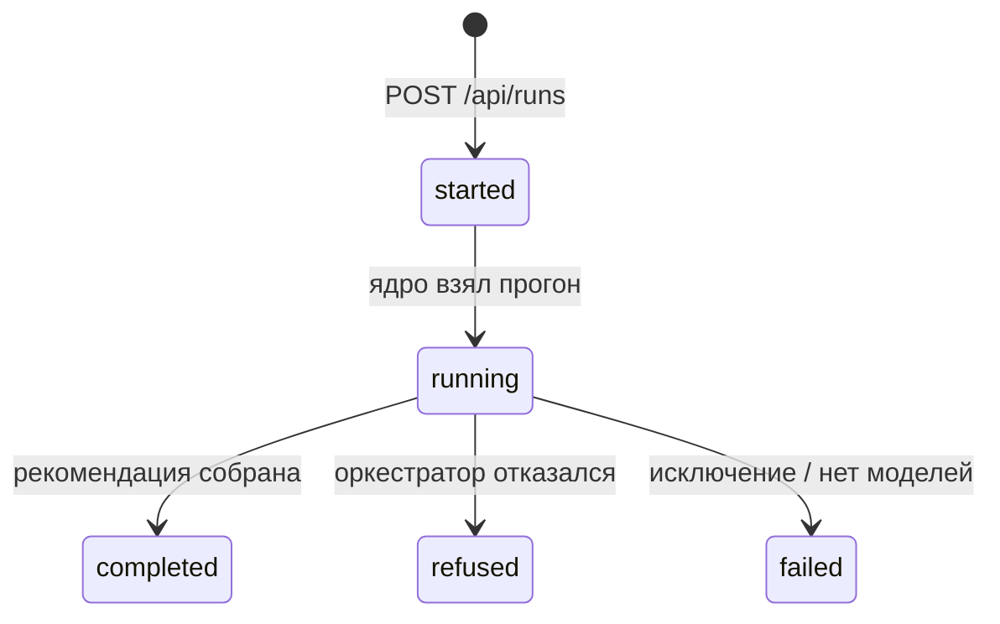

# 07. RunReport

> [!info] Scope
> Каноническое определение сущности **RunReport** — полного отчёта прогона: входы
> (сценарий), свежесть, оценки качества, все шаги агентов (`agents_trace[]`), финальная
> карточка [[04-recommendation]] (или отказ), метрики моделей, версии и хэши данных.
> Владелец истины: core — модуль `report/`. Потребители: data-store (JSON/MD-артефакты),
> backend (`GET /api/runs/{id}`, `/report.{md,json}`), frontend (экспорт).
>
> НЕ охватывает: рендер Markdown (core-architecture/12), логику прогона (оркестратор),
> HTTP-раздачу (backend/03), каталог файлов (data-store/06).

## 1. Каноническая форма

| Поле | Тип | Обязателен | Default | Ограничения | Описание |
| --- | --- | --- | --- | --- | --- |
| `run_id` | `str` | да | — | `YYYYMMDD-HHMMSS-hex8 (UTC)` | идентификатор прогона |
| `created_at` | `datetime` | да | — | aware UTC | время создания |
| `status` | `RunStatus` | да | `started` | enum [[01-enums]], FSM ниже | финальные: `completed` / `refused` / `failed` |
| `scenario` | `Scenario` | да | — | DTO [[06-scenario]] | вход прогона |
| `data_hashes` | `object` | да | `{}` | путь → sha256 | хэши прочитанных данных (из `datasets_manifest.json`) |
| `versions` | `object` | да | `{}` | ключи: `python`, `lightgbm`, `core`, `contract` | версии компонентов |
| `env` | `object` | да | `{}` | ключи: `mode`, `llm_mode`, hostname | окружение прогона |
| `freshness` | `list[DataFreshness]` | да | `[]` | DTO [[02-data-freshness]] | светофоры точек контроля |
| `quality` | `list[QualityAssessment]` | да | `[]` | DTO [[03-quality-assessment]] | оценки качества по целям |
| `agents_trace` | `list[AgentStep]` | да | `[]` | DTO [[05-agent-step]] | полный трейс 5 агентов |
| `recommendation` | `Recommendation` | да | — | DTO [[04-recommendation]] | карточка рекомендации или отказ |
| `duration_ms` | `int \| None` | да | `null` | ≥ 0 | длительность прогона |
| `artifacts` | `object` | да | `{}` | путь → строка | `{report_md, report_json, timeline}` — пути в `artifacts/` |

> [!note] Версия модели и seed
> Версия модели прогона фиксируется дважды: `versions.core` (код ядра) и
> `model_artifact_id` внутри каждой оценки [[03-quality-assessment]] — конкретный активный
> артефакт ([[08-model-artifact]]) с его `created_at` и `core_version`. Сид — в
> `scenario.seed`; любая случайность прогона детерминирована им.

FSM статусов: `started → running → completed | refused | failed`;
отказ — штатный исход, не ошибка.



## 2. Представления по доменам

### 2.1. Frontend (TypeScript)

```ts
export type RunStatus = 'started' | 'running' | 'completed' | 'refused' | 'failed';

export interface RunReport {
  runId: string;
  createdAt: string;
  status: RunStatus;
  scenario: Scenario;                     // из [[06-scenario]]
  dataHashes: Record<string, string>;
  versions: Record<string, string>;
  env: Record<string, string>;
  freshness: DataFreshness[];             // из [[02-data-freshness]]
  quality: QualityAssessment[];           // из [[03-quality-assessment]]
  agentsTrace: AgentStep[];               // из [[05-agent-step]]
  recommendation: Recommendation;         // из [[04-recommendation]]
  durationMs: number | null;
  artifacts: Record<string, string>;
}
```

### 2.2. Backend (pydantic v2, `backend/src/app/schemas.py`)

```python
class RunReport(BaseModel):
    model_config = ConfigDict(alias_generator=to_camel, populate_by_name=True, allow_inf_nan=False)
    run_id: str = Field(pattern=r"\d{8}-\d{6}-[0-9a-f]{8}")
    created_at: datetime
    status: RunStatus
    scenario: Scenario
    data_hashes: dict[str, str] = Field(default_factory=dict)
    versions: dict[str, str] = Field(default_factory=dict)
    env: dict[str, str] = Field(default_factory=dict)
    freshness: list[DataFreshness] = Field(default_factory=list)
    quality: list[QualityAssessment] = Field(default_factory=list)
    agents_trace: list[AgentStep] = Field(default_factory=list)
    recommendation: Recommendation
    duration_ms: int | None = Field(default=None, ge=0)
    artifacts: dict[str, str] = Field(default_factory=dict)
```

### 2.3. Core (dataclass, `refinery_core/report/`)

```python
@dataclass(frozen=True, slots=True)
class RunReport:
    run_id: str
    created_at: datetime
    status: RunStatus
    scenario: Scenario
    data_hashes: Mapping[str, str]
    versions: Mapping[str, str]
    env: Mapping[str, str]
    freshness: tuple[DataFreshness, ...]
    quality: tuple[QualityAssessment, ...]
    agents_trace: tuple[AgentStep, ...]
    recommendation: Recommendation
    duration_ms: int | None = None
    artifacts: Mapping[str, str] = field(default_factory=dict)

    def to_json(self) -> dict: ...
    def to_markdown(self) -> str: ...   # рендер MD — отдельная ответственность (12)
```

### 2.4. Data-store — артефакты прогона (пишет core, P3)

| Файл | Содержимое | Соответствие |
| --- | --- | --- |
| `artifacts/runs/{run_id}.json` | полная каноническая форма | 1:1 с DTO |
| `artifacts/runs/{run_id}.md` | человекочитаемый рендер | производный от JSON |
| `artifacts/timeline/{run_id}.ndjson` | журнал SSE-событий (реплей) | кадры P1 |

> [!note] Правила трансформации
> 1. Core-кортежи → списки; datetime → ISO 8601 UTC; snake_case → camelCase — глобальные правила форм ([[00-SUMMARY]] §5).
> 2. Файлы не перезаписываются: повторный прогон создаёт новый `run_id`.
> 3. `data_hashes` заполняется из `datasets_manifest.json` (sha256 + диапазон дат, пишет P4) — не пересчитывается в рантайме.
> 4. Запись в `artifacts/` — единственное место, куда core пишет (рантайм read-only по `data/processed/`).

## 3. Таблица маппинга полей

| Каноническое | Frontend (TS) | Backend (Py) | Core (Py) | Data-store |
| --- | --- | --- | --- | --- |
| `run_id` / `status` | `runId: string` / `status: RunStatus` | `str` / `RunStatus` | то же | имя `artifacts/runs/{run_id}.json\|.md` |
| `scenario` / `recommendation` | `Scenario` / `Recommendation` | pydantic [[06-scenario]] / [[04-recommendation]] | то же (dataclass) | вложенные JSON-объекты |
| `data_hashes` / `versions` / `env` / `artifacts` | `Record<string, string>` ×4 | `dict[str, str]` ×4 | `Mapping[str, str]` ×4 | фактические пути/хэши |
| `freshness` / `quality` / `agents_trace` | массивы DTO | `list[...]` pydantic | `tuple[...]` dataclass | JSON-массивы |
| `created_at` / `duration_ms` | `createdAt: string` / `durationMs: number \| null` | `datetime` / `int \| None` | `datetime` / `int \| None` | ISO-строка / число |

## 4. JSON-пример

```json
{"run_id": "20260919-080000-3f9c2a", "created_at": "2026-09-19T08:00:00Z", "status": "completed",
 "scenario": {"scenario_id": "b41d9f02", "kind": "quality_risk", "t_point": "2026-06-15T08:00:00Z",
              "overrides": {}, "description": null, "seed": 42},
 "data_hashes": {"data/processed/telemetry.parquet": "e3b0c442…"},
 "versions": {"python": "3.12.6", "lightgbm": "4.5.0", "core": "0.1.0", "contract": "1.0.0"},
 "env": {"mode": "api", "llm_mode": "off"},
 "freshness": [{"point_id": "hdu_product_sulfur", "source": "lims", "status": "warn"}],
 "quality": [{"target": "sulfur", "p50": 9.6, "p10": 8.9, "p90": 10.4, "model_artifact_id": "sulfur-lgbm-a1b2c3d4"}],
 "agents_trace": [{"run_id": "20260919-080000-3f9c2a", "step_idx": 0, "agent_role": "data"}],
 "recommendation": {"run_id": "20260919-080000-3f9c2a", "decision": "recommend"},
 "duration_ms": 12400,
 "artifacts": {"report_md": "artifacts/runs/20260919-080000-3f9c2a.md",
               "report_json": "artifacts/runs/20260919-080000-3f9c2a.json",
               "timeline": "artifacts/timeline/20260919-080000-3f9c2a.ndjson"}}
```

## 5. Инварианты валидации

> [!warning] Проверяются валидатором DTO и тестами `report/`
> 1. `run_id` отчёта = `recommendation.run_id` и `agents_trace[i].run_id` — одна сущность на все вложения.
> 2. `status = completed` ⇒ `recommendation.decision = "recommend"`; `refused` ⇒ `"refuse"`; `failed` ⇒ отчёт без финальной карточки (записывается частично, ответ API — 500-семейство).
> 3. `agents_trace` содержит ровно 5 шагов с уникальными `step_idx` 0–4 в порядке конвейера (для завершённых прогонов).
> 4. `versions.contract` — версия контракта P6; ломающие изменения схемы = подъём этой версии.
> 5. `data_hashes` покрывает все прочитанные датасеты прогона; формат значений — sha256.
> 6. `quality[i].model_artifact_id` указывает на артефакт [[08-model-artifact]], `active` на момент прогона.
> 7. NaN/Inf запрещены во всех вложенных DTO; время — только aware UTC.
> 8. `artifacts` содержит фактические пути записанных файлов; `report_json` обязан совпадать с местом хранения самой формы.
