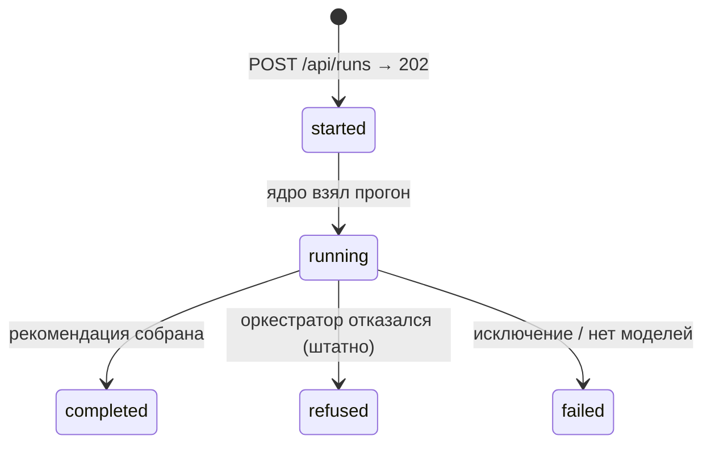
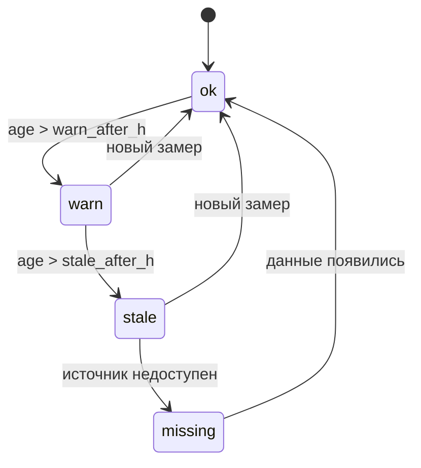

# 01-enums — перечисления контракта «Refinery Copilot»

> [!info] Статус
> Единственный источник енумов в контракте — core (`refinery_core/types.py`); этот файл —
> их контрактное зеркало (P6). Значения — строки `lower_snake`, в TS — union литералов,
> в Parquet — `dictionary<string>`.
> Используются во всех DTO: [[01-timeseries]], [[02-data-freshness]], [[03-quality-assessment]],
> [[04-recommendation]], [[05-agent-step]], [[06-scenario]], [[07-run-report]], [[08-model-artifact]].

## Scope

Этот файл описывает 8 енумов (значения + смысл), конечные автоматы RunStatus и FreshnessStatus,
представления в Pydantic/TS/Parquet и правила маппинга значений. Не описывает: поля DTO
(data-models), статусы UI (фронтовые, не контрактные), логику вычисления свежести (домен data-pipeline).

## 1. Сводная таблица

| Enum | Где используется | Число значений |
| --- | --- | --- |
| [[#2.1 AgentRole]] | [[05-agent-step]], SSE `agent_started`/`agent_finished`/`step`/`log` | 5 |
| [[#2.2 FreshnessStatus]] | [[02-data-freshness]], [[07-run-report]].freshness | 4 |
| [[#2.3 RefusalReason]] | [[04-recommendation]].refusal.reasons | 5 |
| [[#2.4 RunStatus]] | [[07-run-report]].status, `POST /api/runs`, SSE | 5 |
| [[#2.5 ScenarioKind]] | [[06-scenario]].kind, `GET /api/runs` | 5 |
| [[#2.6 QualityTarget]] | [[03-quality-assessment]], [[04-recommendation]], [[08-model-artifact]] | 4 |
| [[#2.7 QualityFlag]] | [[01-timeseries]].quality_flag | 5 |
| [[#2.8 DataSource]] | [[01-timeseries]].source, [[02-data-freshness]].source | 4 |

## 2. Перечисления

### 2.1 AgentRole

Роль агента в конвейере; порядок шагов фиксирован (data=0 … orchestrator=4).

| Значение | Описание |
| --- | --- |
| `data` | чистка, свежесть, аномалии; снимок состояния и светофоры |
| `quality` | прогнозы качества P10/P50/P90 + SHAP ([[03-quality-assessment]]) |
| `reliability` | тяжесть режима, запасы до p2/p98, наработка катализатора |
| `optimization` | варианты круток, фильтр жёстких ограничений, Парето |
| `orchestrator` | сборка решения или отказа ([[04-recommendation]]) |

### 2.2 FreshnessStatus

Возраст данных точки контроля относительно `t_point`; вычисляется core (FSM — §4.2).

| Значение | Описание |
| --- | --- |
| `ok` | возраст ≤ `warn_after_h` (по умолчанию 28 ч) |
| `warn` | старше `warn_after_h`; ритм ЛИМС 24 ч + публикация 4 ч нарушен |
| `stale` | старше `stale_after_h` (52 ч) — кандидат на отказ (`stale_lims`) |
| `missing` | данных нет вовсе |

### 2.3 RefusalReason

Причина штатного отказа ([[04-recommendation]].decision = `refuse`); отказ — первоклассный исход, не ошибка.

| Значение | Описание |
| --- | --- |
| `stale_lims` | ЛИМС устарел (свежесть `stale`/`missing` в ключевой точке) |
| `wide_interval` | интервал неопределённости пересекает границу спецификации |
| `out_of_training_domain` | состояние вне диапазона обученности / модельных p2–p98 |
| `no_feasible_variant` | все варианты отбракованы жёсткими ограничениями |
| `sensor_fault` | ключевые теги мертвы/залипли |

### 2.4 RunStatus

Статус прогона; финальные — `completed`, `refused`, `failed` (FSM — §4.1).

| Значение | Описание |
| --- | --- |
| `started` | прогон принят (`POST /api/runs` → 202) |
| `running` | ядро взял прогон, агенты работают |
| `completed` | рекомендация собрана ([[04-recommendation]], decision=`recommend`) |
| `refused` | оркестратор отказался — **штатный исход**, не ошибка |
| `failed` | исключение / нет моделей / авария потока |

### 2.5 ScenarioKind

Тип сценария [[06-scenario]]; пресеты кнопок фронта и `make demo --scenario`.

| Значение | Описание |
| --- | --- |
| `normal` | нормальный режим |
| `quality_risk` | режим прижат к границе по сере |
| `bad_data` | сентинелы, залипания, мёртвые каналы |
| `sour_crude` | сернистая нефть |
| `stale_lims` | гарантированный отказ по свежести |

### 2.6 QualityTarget

Контролируемая величина и её спецификация (норматив качества товарного дизельного топлива):

| Значение | Единица | Ограничение |
| --- | --- | --- |
| `sulfur` | мг/кг | ≤ 10 |
| `t95` | °C | ≤ 360 |
| `d15` | кг/м³ | 820–845; 800–845 (зимнее) |
| `cetane` | пункт ЦЧ | ≥ 51 (летнее); ≥ 49 (зимнее) |

### 2.7 QualityFlag

Флаг качества точки [[01-timeseries]]; сентинелы-**числа** {307, 251, 252, 240} за пределы
data-pipeline не выходят — наружу уходит `null` + этот флаг.

| Значение | Описание |
| --- | --- |
| `ok` | валидное физическое значение |
| `sentinel` | в сыром значении был сентинел {307, 251, 252, 240} → `value = null` |
| `stuck` | залипший канал (значение не меняется) |
| `outlier` | отброшен Hampel/PCA |
| `missing` | нет данных |

### 2.8 DataSource

Источник измерения.

| Значение | Описание |
| --- | --- |
| `lims` | лаборатория — контрольный факт; публикация ≤ 4 ч после отбора пробы (анти-утечка) |
| `pak` | поточный анализатор |
| `vak` | расчётные ВАК-формулы |
| `kip` | телеметрия КИП |

## 3. Представления: Pydantic / TS / Parquet

| Представление | Правило |
| --- | --- |
| Pydantic (core + backend) | `class X(str, Enum)`, значение = строка `lower_snake`; сериализуется как строка без `.value` |
| Frontend (TS) | `export type X = 'a' \| 'b' \| …`; исчерпывающий `switch` — новое значение = ошибка компиляции |
| Data-store (Parquet) | колонка `dictionary<Utf8>`; допустимое множество значений задаёт этот файл |

```python
# refinery_core/types.py (зеркало — backend/src/app/schemas.py)
from enum import Enum

class RunStatus(str, Enum):
    started = "started"
    running = "running"
    completed = "completed"
    refused = "refused"
    failed = "failed"

class FreshnessStatus(str, Enum):
    ok = "ok"
    warn = "warn"
    stale = "stale"
    missing = "missing"
```

```ts
// frontend/src/types/api.gen.ts (генерация — [[06-p6-openapi-ts-mocks]])
export type RunStatus = 'started' | 'running' | 'completed' | 'refused' | 'failed';
export type FreshnessStatus = 'ok' | 'warn' | 'stale' | 'missing';
export type RefusalReason = 'stale_lims' | 'wide_interval' | 'out_of_training_domain'
  | 'no_feasible_variant' | 'sensor_fault';
export type AgentRole = 'data' | 'quality' | 'reliability' | 'optimization' | 'orchestrator';
export type ScenarioKind = 'normal' | 'quality_risk' | 'bad_data' | 'sour_crude' | 'stale_lims';
export type QualityTarget = 'sulfur' | 't95' | 'd15' | 'cetane';
export type QualityFlag = 'ok' | 'sentinel' | 'stuck' | 'outlier' | 'missing';
export type DataSource = 'lims' | 'pak' | 'vak' | 'kip';
```

```text
# Parquet (пример схемы [[02-data-freshness]] в freshness.parquet)
status: dictionary<Utf8>   # допустимо: ok | warn | stale | missing
source: dictionary<Utf8>   # допустимо: lims | pak | vak | kip
```

## 4. Конечные автоматы

### 4.1 RunStatus

Отказ (`refused`) — штатный исход прогона, а не ошибка: на UI карточка отказа, не авария.



Терминальные состояния: `completed`, `refused`, `failed`. Терминальное состояние фиксируется в
[[07-run-report]].status и совпадает с финальным SSE-событием (`run_finished` для первых двух,
`run_failed` для аварии). Обратных переходов нет; повторный прогон = новый `run_id`.

### 4.2 FreshnessStatus

Переоценивается core на каждом `t_point`; возврат в `ok` — **только** через новый замер.



Анти-утечка ЛИМС: замер становится доступен системе не раньше `available_ts = last_sample_ts + 4 ч`;
`age_hours` считается от `t_point` и валидируется как ≥ 0 — замер с временем отбора позже
`t_point` невозможен ([[02-data-freshness]]).

## 5. Правила маппинга значений

1. **Значение — контракт.** Сравнение всегда по строке значения (`"stale"`), имя члена Enum в Python значением не является; в JSON/TS/Parquet попадает только строка.
2. **Никаких трансформаций регистра.** `lower_snake` везде; camelCase-алиасинг `alias_generator=to_camel` на **имена полей** не распространяется — значения енумов проходят как есть.
3. **Закрытость.** Новое значение = правка этого файла + core + bump minor-версии контракта ([[00-SUMMARY]] §8); на фронте исчерпывающий `switch`/`exhaustive check` подсветит пропущенную ветку.
4. **Неизвестное значение.** Pydantic валидирует: неизвестная строка → 422 (`{"error": {"code": "validation_error", …}}`); backend никогда не пропускает «сырые» строки в полях енумов.
5. **Сентинелы → флаг, не значение.** Числа {307, 251, 252, 240} превращаются data-pipeline в `value: null` + `quality_flag: "sentinel"` ([[01-timeseries]]); сам сентинел наружу не попадает никогда.
6. **`QualityFlag` ≠ `FreshnessStatus`.** Первый — про качество отдельной точки измерения, второй — про возраст данных точки контроля; не смешивать при маппинге `bad_data` → отказ (отказ по данным даёт `sensor_fault`, по свежести — `stale_lims`).
7. **`RunStatus.failed` ≠ `refused`.** `refused` сопровождается заполненным `refusal.reasons` ([[04-recommendation]]) и событием `run_finished`; `failed` — событием `run_failed` c `errorCode` и не несёт карточки.
8. **Parquet.** Енум-колонки всегда `dictionary<Utf8>`; чтение возвращает ту же строку — обратное преобразование в Enum происходит только в pydantic-схемах, в Parquet енум-объекты не пишутся.
