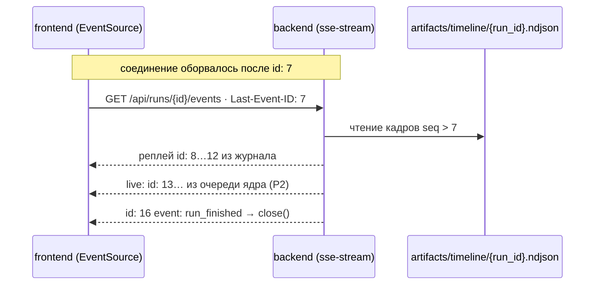
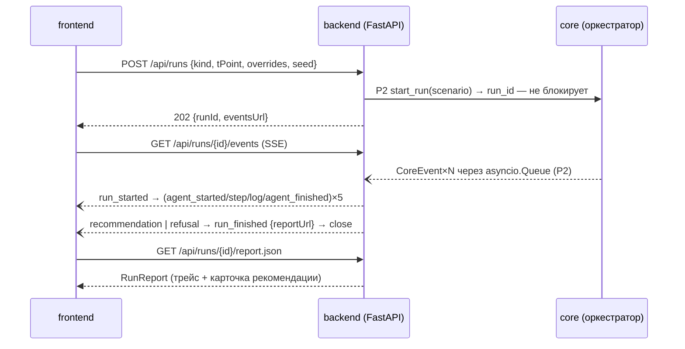
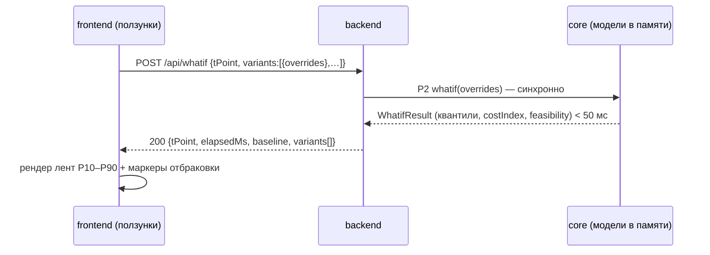

# P1: frontend ↔ backend (REST + SSE)

> [!info] Статус
> Протокол пары **frontend ↔ backend**. Реализуется роутами backend (`routes`, `sse-stream`);
> потребляется frontend-сервисами (`rest-клиент`, `sse-клиент`). Типы — только ссылки
> на канонические модели из `api/data-models/`, здесь они не переопределяются.

## Scope

| | |
| --- | --- |
| **Covers** | 9 REST-эндпоинтов (метод, путь, query/body, ответы, коды ошибок, JSON-примеры); SSE-стрим `GET /api/runs/{run_id}/events`: 9 типов событий + heartbeat, строгий порядок по `seq`, реплей `Last-Event-ID` из таймлайна, сценарий переподключения; 3 mermaid-диаграммы ключевых потоков; общие конвенции JSON |
| **Does NOT cover** | транспортные детали nginx (`proxy_buffering off` — см. [[07-p7-infra]]); in-process контракт backend ↔ core ([[02-p2-backend-core]]); поля DTO (только ссылки); генерация TS-типов и моки ([[06-p6-openapi-ts-mocks]], [[90-examples-and-mocks]]) |

---

## 1. Обзор и каналы

Связь frontend ↔ backend — единственный канал системы для витрины. Два канала:

| Канал | Механизм | Назначение |
| --- | --- | --- |
| REST | HTTP/1.1, JSON UTF-8, база `/api` | синхронные запросы: состояние, запуск/история прогонов, отчёты, what-if, реестр моделей |
| SSE | `text/event-stream; charset=utf-8` | живой прогресс прогона: события агентов, карточка/отказ, финал |

- База всех путей — `/api`; служебный health — `GET /api/health` (docker-compose healthcheck ходит именно сюда, см. [[07-p7-infra]]).
- Версия контракта — заголовок ответа `X-Api-Version: 1.0.0`; ломающие изменения = bump (см. [[07-run-report]] `versions.contract`).
- Аутентификации нет: закрытый on-premise контур за nginx.

## 2. Общие конвенции

> [!warning] Формы данных (следствие глобальных правил форм — [[00-SUMMARY]] §5)
> 1. **camelCase в JSON** — backend сериализует pydantic-модели с `alias_generator=to_camel`; frontend никогда не видит `snake_case`.
> 2. **Время — ISO 8601 UTC с `Z`** (`2026-09-19T08:00:00Z`), всегда aware, без локальных смещений.
> 3. **NaN/Inf запрещены** — пропуск значения передаётся как явный `null`; `qualityFlag` объясняет причину.
> 4. **Енумы — строки `lower_snake`** (`quality_risk`, `stale_lims`, `wide_interval`); закрытый набор из `api/enums/01-enums.md`.
> 5. **Сентинелы {307, 251, 252, 240} не существуют** за пределами data-pipeline — на P1 приходят только `null` + `qualityFlag`.

### 2.1. Формат ошибки

Все ошибки — одним телом (HTTP-код в статусе, детали в `details`):

```json
{"error": {"code": "unmanaged_override", "message": "Тег 'T5' не является управляемым", "details": {"tag": "T5", "allowedTags": ["24-2000.P8", "T11", "F19"]}}}
```

### 2.2. Коды ошибок

| Код | Когда | `error.code` (примеры) |
| --- | --- | --- |
| 400 | неизвестный `kind`; override неуправляемого/неизвестного тега; > 8 вариантов в what-if; неверный ISO-параметр | `unknown_scenario_kind`, `unmanaged_override`, `too_many_variants`, `bad_t_point` |
| 404 | прогон или артефакт не найден | `run_not_found`, `artifact_not_found` |
| 409 | дублирующий запуск: в RunManager уже активен прогон того же сценария (`kind` + `tPoint`) | `run_already_active`[^409] |
| 422 | ошибка pydantic-валидации тела (FastAPI) | `validation_error` |
| 500 | неперехваченное исключение | `internal_error` |
| 503 | реестр моделей пуст или `data/processed/` недоступен | `models_not_loaded`, `data_missing` |

[^409]: Расширение базового набора (400/422/500/503): 409 предотвращает повторную активацию того же сценария, пока прогон активен (двойной клик по кнопке прогона); повторный запуск того же сценария после завершения — легален и создаёт новый `run_id`.

## 3. Используемые модели

| DTO | Где определён | Где встречается в P1 |
| --- | --- | --- |
| TagPoint | [[01-timeseries]] | `GET /state` |
| DataFreshness | [[02-data-freshness]] | `GET /state` |
| QualityAssessment | [[03-quality-assessment]] | `POST /whatif` (ответ) |
| Recommendation | [[04-recommendation]] | SSE `recommendation`/`refusal`, `GET /runs/{id}` |
| AgentStep | [[05-agent-step]] | SSE `agent_started`/`agent_finished`, `GET /runs/{id}` |
| Scenario | [[06-scenario]] | `POST /runs` (тело) |
| RunReport | [[07-run-report]] | `GET /runs/{id}`, `GET /runs/{id}/report.json` |
| ModelArtifact | [[08-model-artifact]] | `GET /models` |

---

## 4. REST-эндпоинты

### 4.1. `GET /api/health` — живость и версии

| | |
| --- | --- |
| Query | — |
| Ответ 200 | `{status, contract, core, modelsLoaded}` |

```json
{"status": "ok", "contract": "1.0.0", "core": "0.1.0", "modelsLoaded": 3}
```

Используется compose-healthcheck ([[07-p7-infra]]) и фронтом для баннера «модели не загружены».

### 4.2. `GET /api/state` — текущее состояние

| | |
| --- | --- |
| Query | `tPoint=ISO` (опц., по умолчанию последний снимок), `tags=P8,T11` (опц., список кодов тегов через запятую) |
| Ответ 200 | `{tPoint, tags: TagPoint[], freshness: DataFreshness[], lastRun?: {runId, decision}}` |
| Ошибки | 400 `bad_t_point` / неизвестный тег; 503 `data_missing` |

```json
{"tPoint": "2026-09-19T08:00:00Z",
 "tags": [{"tagCode": "24-2000.P8", "ts": "2026-09-19T08:00:00Z", "value": 341.2, "qualityFlag": "ok", "source": "kip", "unit": "°C"}],
 "freshness": [{"pointId": "hdu_product_sulfur", "source": "lims", "lastSampleTs": "2026-09-18T06:00:00Z", "availableTs": "2026-09-18T10:00:00Z", "ageHours": 44.0, "status": "stale", "warnAfterH": 28.0, "staleAfterH": 52.0}],
 "lastRun": {"runId": "20260919-080000-3f9c2a", "decision": "recommend"}}
```

### 4.3. `POST /api/runs` — запуск прогона

| | |
| --- | --- |
| Body | `Scenario` без `scenarioId` ([[06-scenario]]): `{kind, tPoint, overrides, description?, seed?}` |
| Ответ 202 | `{runId, status: "started", eventsUrl}` |
| Ошибки | 400 `unknown_scenario_kind` / `unmanaged_override`; 409 `run_already_active`; 422; 503 `models_not_loaded` / `data_missing` |

Запрос:

```json
{"kind": "quality_risk", "tPoint": "2026-06-15T08:00:00Z", "overrides": {"blend_share_kerosene": 0.12}, "description": "2026 прижат к границе по сере", "seed": 42}
```

Ответ:

```json
{"runId": "20260919-080000-3f9c2a", "status": "started", "eventsUrl": "/api/runs/20260919-080000-3f9c2a/events"}
```

Прогон асинхронный: 202 означает «принято ядром» (переход `started → running` в FSM [[07-run-report]]);
прогресс — только через SSE §5.

### 4.4. `GET /api/runs` — список прогонов

| | |
| --- | --- |
| Query | `limit` (опц., 1–200, по умолчанию 50) — новые сверху |
| Ответ 200 | `[{runId, status, kind, tPoint, decision, createdAt}]`; `decision` = `recommend` \| `refuse` \| `null` (для незавершённых) |
| Ошибки | 400 `validation_error` (limit вне диапазона) |

```json
[{"runId": "20260919-080000-3f9c2a", "status": "completed", "kind": "quality_risk", "tPoint": "2026-06-15T08:00:00Z", "decision": "recommend", "createdAt": "2026-09-19T08:00:00Z"},
 {"runId": "20260918-173000-91ab0e", "status": "refused", "kind": "stale_lims", "tPoint": "2026-06-01T12:00:00Z", "decision": "refuse", "createdAt": "2026-09-18T17:30:00Z"}]
```

История — из артефактов `artifacts/runs/`, не из памяти.

### 4.5. `GET /api/runs/{run_id}` — полный прогон

| | |
| --- | --- |
| Ответ 200 | `RunReport` целиком ([[07-run-report]]): сценарий, свежесть, трейс агентов, карточка/отказ |
| Ошибки | 404 `run_not_found` |

Сокращённый пример (полный — в [[07-run-report]] и [[90-examples-and-mocks]]):

```json
{"runId": "20260919-080000-3f9c2a", "createdAt": "2026-09-19T08:00:00Z", "status": "completed",
 "scenario": {"scenarioId": "b41d9f02", "kind": "quality_risk", "tPoint": "2026-06-15T08:00:00Z", "overrides": {}, "description": null, "seed": 42},
 "freshness": [], "quality": [], "agentsTrace": [],
 "recommendation": {"runId": "20260919-080000-3f9c2a", "decision": "recommend"},
 "durationMs": 12400, "artifacts": {"reportJson": "artifacts/runs/20260919-080000-3f9c2a.json"}}
```

### 4.6. `GET /api/runs/{run_id}/report.json` и `GET /api/runs/{run_id}/report.md` — экспорт

| | |
| --- | --- |
| Ответ 200 | `.json` → `RunReport` файлом (`application/json`, `Content-Disposition: attachment`); `.md` → `text/markdown; charset=utf-8` |
| Ошибки | 404 `run_not_found` / `artifact_not_found` |

Тело — 1:1 с артефактами `artifacts/runs/{run_id}.{json,md}` ([[07-run-report]]); примеры — там же.

### 4.7. `POST /api/whatif` — расчёт «что если»

Синхронно, без SSE и без записи артефактов; цель < 50 мс (модели в памяти).

| | |
| --- | --- |
| Body | `{tPoint, overrides, variants: [overrides]}` — до 8 вариантов; ключи — только управляемые теги/доли ([[06-scenario]]) |
| Ответ 200 | `{tPoint, elapsedMs, baseline: QualityTargetItem[], variants: VariantResult[]}` |
| Ошибки | 400 `too_many_variants` / `unmanaged_override` / `bad_t_point`; 422; 503 `models_not_loaded` |

```json
{"tPoint": "2026-09-19T08:00:00Z", "elapsedMs": 31,
 "baseline": [{"target": "sulfur", "p50": 9.6, "p10": 8.9, "p90": 10.4, "specRisk": 0.38, "unit": "мг/кг"}],
 "variants": [{"overrides": {"24-2000.P8": 339.5},
               "quality": [{"target": "sulfur", "p50": 9.1, "p10": 8.4, "p90": 9.8, "specRisk": 0.11, "unit": "мг/кг"}],
               "costIndex": 1.0, "feasible": true, "violations": []},
              {"overrides": {"24-2000.P8": 345.0, "blend_additive_pct": 0.0},
               "quality": [{"target": "sulfur", "p50": 10.3, "p10": 9.5, "p90": 11.2, "specRisk": 0.72, "unit": "мг/кг"}],
               "costIndex": 0.9, "feasible": false, "violations": [{"constraintId": "sulfur_max", "description": "сера ≤ 10 мг/кг"}]}]}
```

### 4.8. `GET /api/models` — реестр моделей

| | |
| --- | --- |
| Ответ 200 | `ModelArtifact[]` ([[08-model-artifact]]) — активные артефакты по каждой цели |
| Ошибки | 503 `models_not_loaded` |

```json
[{"artifactId": "sulfur-lgbm-a1b2c3d4", "target": "sulfur", "algorithm": "lightgbm_quantile",
  "quantiles": [0.1, 0.5, 0.9], "modelUri": "artifacts/models/sulfur-lgbm-a1b2c3d4/model.txt",
  "conformal": {"method": "enbpi"}, "coverage": 0.83, "metrics": {"wape": 0.061, "mae": 0.52},
  "trainedOnRange": {"start": "2023-01-01T00:00:00Z", "end": "2026-06-30T00:00:00Z"},
  "features": ["T5", "T11", "lims_age_h", "cat_age_days"], "monotoneConstraints": {"T5": 1},
  "createdAt": "2026-09-18T20:10:00Z", "seed": 42, "coreVersion": "0.1.0", "active": true}]
```

---

## 5. SSE: `GET /api/runs/{run_id}/events`

`Content-Type: text/event-stream; charset=utf-8`; кэширование запрещено (`Cache-Control: no-cache`).
Один HTTP-запрос обслуживает ровно один прогон: после финального события поток закрывается, `retry:` не выдаётся.

### 5.1. Формат кадра

Каждый кадр — три поля; `data` — JSON в camelCase:

```text
id: 7                      ← seq: монотонный счётчик прогона, начинается с 1
event: agent_finished      ← тип события (§5.2)
data: {"runId":"…","ts":"…", …payload}   ← payload + runId + ts (ISO UTC)
```

- `seq` задаёт **строгий порядок** внутри прогона; источник — `CoreEvent.seq` ядра ([[02-p2-backend-core]] §3), backend не перенумеровывает.
- `ts` — момент публикации события ядром.
- Клиент обязан отбрасывать дубли по `id` (EventSource делает это сам при реплее).

### 5.2. Типы событий (9 событий + heartbeat)

Порядок внутри прогона строгий (задаёт ядро): `run_started` → цикл
[`agent_started` → `step*`/`log*` → `agent_finished`] × 5 → `recommendation` | `refusal` →
`run_finished` | `run_failed`. `run_failed` может прийти в любой момент после `run_started`.

| # | Событие | Payload (data-JSON), BE → FE | Когда |
| --- | --- | --- | --- |
| 1 | `run_started` | `{runId, status:"running", kind, tPoint, seed}` | прогон принят ядром |
| 2 | `agent_started` | `AgentStep` без `output`/`numberRefs` ([[05-agent-step]]) | агент начал работу |
| 3 | `step` | `{runId, stepIdx, agentRole, label, payload: object}` | промежуточный артефакт агента (напр., топ вариантов) |
| 4 | `log` | `{runId, stepIdx, level:"info"\|"warn", message}` | текстовая строка прогресса |
| 5 | `agent_finished` | `AgentStep` полный (с `output`, `numberRefs`, `notes`) | агент закончил |
| 6 | `recommendation` | `Recommendation` с `decision:"recommend"` ([[04-recommendation]]) | собрана карточка рекомендации |
| 7 | `refusal` | `Recommendation` с `decision:"refuse"` и заполненным `refusal` | штатный отказ |
| 8 | `run_finished` | `{runId, status:"completed"\|"refused", durationMs, reportUrl}` | конец прогона |
| 9 | `run_failed` | `{runId, errorCode, message, durationMs}` | авария прогона |
| — | heartbeat | комментарий `: hb 2026-09-19T08:00:15Z` — **не событие**, без `id`/`data` | каждые 15 с, держит соединение; EventSource комментарии игнорирует |

### 5.3. Примеры кадров всех событий

```text
id: 1
event: run_started
data: {"runId":"20260919-080000-3f9c2a","ts":"2026-09-19T08:00:00Z","status":"running","kind":"quality_risk","tPoint":"2026-06-15T08:00:00Z","seed":42}

id: 2
event: agent_started
data: {"runId":"20260919-080000-3f9c2a","ts":"2026-09-19T08:00:00Z","stepIdx":0,"agentRole":"data","startedAt":"2026-09-19T08:00:00Z","inputDigest":"3f9c2a1e8b7d0f31","inputSummary":{"tagsRequested":26}}

id: 3
event: log
data: {"runId":"20260919-080000-3f9c2a","ts":"2026-09-19T08:00:01Z","stepIdx":0,"level":"warn","message":"D10 мёртв (99,99 % сентинелов)"}

id: 4
event: step
data: {"runId":"20260919-080000-3f9c2a","ts":"2026-09-19T08:00:02Z","stepIdx":0,"agentRole":"data","label":"freshness_snapshot","payload":{"stalePoints":["hdu_product_sulfur"]}}

id: 5
event: agent_finished
data: {"runId":"20260919-080000-3f9c2a","ts":"2026-09-19T08:00:03Z","stepIdx":0,"agentRole":"data","startedAt":"2026-09-19T08:00:00Z","finishedAt":"2026-09-19T08:00:03Z","durationMs":3000,"inputDigest":"3f9c2a1e8b7d0f31","inputSummary":{"tagsRequested":26},"output":{"freshness":[{"pointId":"hdu_product_sulfur","status":"stale"}]},"numberRefs":[{"path":"freshness[0].ageHours","value":44.0,"unit":"ч","label":"Возраст ЛИМС"}],"notes":["ЛИМС 44 ч — кандидат на отказ по свежести."],"confidence":0.9}

id: 7
event: agent_finished
data: {"runId":"20260919-080000-3f9c2a","ts":"2026-09-19T08:00:05Z","stepIdx":1,"agentRole":"quality","startedAt":"2026-09-19T08:00:03Z","finishedAt":"2026-09-19T08:00:05Z","durationMs":2100,"inputDigest":"9f2a1c4e8b7d0f31","inputSummary":{"targets":["sulfur","t95"]},"output":{"sulfur":{"p50":9.6,"p10":8.9,"p90":10.4}},"numberRefs":[{"path":"sulfur.p50","value":9.6,"unit":"мг/кг","label":"Прогноз серы P50"}],"notes":["Интервал расширен конформом."],"confidence":0.71}

id: 15
event: recommendation
data: {"runId":"20260919-080000-3f9c2a","ts":"2026-09-19T08:05:01Z","decision":"recommend","tPoint":"2026-06-15T08:00:00Z","state":[{"tag":"Q21","value":9.4,"unit":"мг/кг"}],"risks":[{"target":"sulfur","limit":"≤ 10 мг/кг","limitValue":10.0,"p50":9.6,"p10":8.9,"p90":10.4,"specRisk":0.38}],"actions":[{"tag":"24-2000.P8","unit":"°C","currentValue":341.2,"recommendedValue":339.5,"deltaPct":-0.5}],"checks":[{"constraintId":"sulfur_max","description":"сера ≤ 10 мг/кг","limit":10.0,"unit":"мг/кг","value":9.8,"passed":true}],"confidence":{"p10":0.62,"p90":0.88},"explanation":"Снижение T ГСС уменьшает серу и снимает риск off-spec.","alternatives":[],"refusal":null}

id: 15
event: refusal
data: {"runId":"20260919-080000-3f9c2a","ts":"2026-09-19T08:05:01Z","decision":"refuse","tPoint":"2026-06-01T12:00:00Z","state":[],"risks":[],"explanation":"Надёжной рекомендации нет: последнее лабораторное значение устарело.","alternatives":[],"refusal":{"reasons":["stale_lims","wide_interval"],"details":["Возраст последнего ЛИМС 44 ч > 28 ч","Интервал серы пересекает границу 10 мг/кг"]}}

id: 16
event: run_finished
data: {"runId":"20260919-080000-3f9c2a","ts":"2026-09-19T08:05:12Z","status":"completed","durationMs":12400,"reportUrl":"/api/runs/20260919-080000-3f9c2a/report.json"}

id: 16
event: run_failed
data: {"runId":"20260919-080000-3f9c2a","ts":"2026-09-19T08:00:00Z","errorCode":"models_not_loaded","message":"Реестр моделей пуст: registry.json не найден","durationMs":120}
```

Между любыми двумя кадрами — `: hb <ISO>` каждые 15 с.

### 5.4. Реплей и переподключение

Все события прогона ядро параллельно с очередью пишет в журнал `artifacts/timeline/{run_id}.ndjson`
(кадры §5.1, [[02-p2-backend-core]] §4). Это источник реплея — очередь в памяти не единственное
хранилище, поэтому события **не теряются** при разрыве соединения.

Сценарий переподключения:

1. Соединение рвётся после кадра `id: 7`.
2. `EventSource` автоматически переподключается и шлёт заголовок `Last-Event-ID: 7`.
3. Backend проверяет прогон: не найден → 404 `run_not_found` (EventSource перестаёт retries).
4. Найден → backend **реплеит** из ndjson все кадры с `seq > 7` (кадры до 7 не повторяются —
   дубли отсекаются клиентом по `id`, но реплей с середины экономит трафик).
5. Догнав журнал, backend переключается на live-очередь ([[02-p2-backend-core]] §3) и продолжает
   стрим без пропусков `seq` (журнал и очередь — один и тот же счётчик).
6. Финальное событие (`run_finished`/`run_failed`) → поток закрывается. Повторный `GET` на
   завершённом прогоне отдаёт реплей всего журнала с `seq > Last-Event-ID` и закрывается.
7. Frontend-клиент следит за heartbeat: тишина > 45 с (3 интервала) → форс-реконнект с backoff
   (детали — [[04-service-sse]] frontend).



---

## 6. Диаграммы ключевых потоков

**1. Запрос рекомендации:**



**2. Живой прогресс агентов (что видит EventSource):**

```text
id:1  event:run_started      data:{runId,…}
id:2  event:agent_started    data:{stepIdx:0, agentRole:"data",…}
id:3  event:log              data:{stepIdx:0, level:"warn", message:"D10 мёртв (99,99 % сентинелов)"}
id:4  event:agent_finished   data:{stepIdx:0,…, output:{freshness:[…]},…}
id:14 event:agent_finished   data:{stepIdx:4, agentRole:"orchestrator",…}
id:15 event:recommendation   data:{decision:"recommend", actions:[…], confidence:{p10:0.62,p90:0.88}}
id:16 event:run_finished     data:{status:"completed", reportUrl:"/api/runs/…/report.json"}   ← между кадрами каждые 15 с: `: hb <ISO>`
```

**3. What-if расчёт (синхронный, без SSE):**



---

## 7. Чек-лист соответствия
> 1. Все 9 эндпоинтов имеют JSON-примеры запроса/ответа; все 9 SSE-событий — примеры кадров.
> 2. Ошибки — единым телом `{error:{code,message,details}}`; 409 документирован в §2.2.
> 3. Порядок SSE и типы событий зафиксированы в §5.2.
> 4. camelCase / ISO UTC / без NaN — правила §2 обязательны для каждого примера выше.
