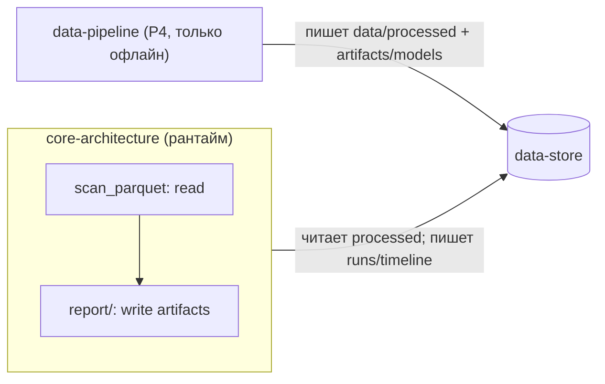

# P3: core-architecture ↔ data-store

> [!info] Суть протокола
> Рантайм ядра **только читает** `data/processed/` (Polars `scan_parquet`, lazy) и **только пишет**
> в `artifacts/` (отчёты прогона и журнал timeline). Ядро никогда не изменяет обработанные
> датасеты, не касается `data/raw/` и не пишет Parquet — писатель датасетов только data-pipeline
> (P4). data-store пассивен: ни SQL, ни ORM, ни сетевого слоя — просто файлы по соглашению.

## Scope

**Covers:** перечень файлов `data/processed/*`, читаемых ядром в рантайме, и их схемы; таблица
«файл → схема → потребитель»; read-only правило и права записи; поведение при отсутствии или
битом файле (отказ прогона, а не деградация); кэширование прочитанного в памяти на прогон.

**Does NOT cover:** как эти файлы создаются (пишущая сторона — [[04-p4-pipeline-datastore]]);
формат model registry и загрузку моделей ([[05-p5-pipeline-core]]); транспорт событий в backend
([[02-p2-backend-core]]); физические конвенции каталогов (data-store/00-OVERVIEW);
поля DTO — только ссылки на [[01-timeseries]], [[02-data-freshness]], [[07-run-report]].

## 1. Что ядро читает в рантайме

Полный перечень read-объектов. Пути относительные от корня репо; в контейнере монтируются
как volumes (`data:ro` — см. [[07-p7-infra]]).

| Файл (каталог) | Операция | Схема / DTO | Кто читает | Когда |
| --- | --- | --- | --- | --- |
| `data/processed/telemetry.parquet` | чтение | [[01-timeseries]] (TagPoint), `source=kip` | агент `data` | каждый прогон и what-if |
| `data/processed/lims.parquet` | чтение | [[01-timeseries]], `source=lims` | агент `data` | каждый прогон и what-if |
| `data/processed/pak.parquet` | чтение | [[01-timeseries]], `source=pak` | агент `data` | каждый прогон и what-if |
| `data/processed/freshness.parquet` | чтение | [[02-data-freshness]] (снимок) | агент `data` | каждый прогон (пересчёт статуса на `t_point`) |
| `data/processed/datasets_manifest.json` | чтение | JSON: sha256, диапазон дат, список тегов | report/ | каждый прогон → `data_hashes` в [[07-run-report]] |
| `artifacts/models/registry.json` + `{artifact_id}/` | чтение | [[08-model-artifact]] | registry (P5) | старт приложения / прогрев |
| `artifacts/runs/{run_id}.json`, `.md` | чтение | [[07-run-report]] | backend (через core) | `GET /api/runs/{run_id}` |

Правила чтения:

1. **Lazy-сканы.** Телеметрия и лаборатория читаются через `pl.scan_parquet(...)`; материализация
   — только окно вокруг `t_point` (лаги 0–3 ч) и срез по нужным `tag_code`. Полная выгрузка
   189 тыс. точек в память запрещена.
2. **Срезы детерминированы.** Окно и фильтры задаются `t_point` и `seed` сценария; один и тот же
   `t_point` обязан давать одинаковый срез (воспроизводимость, delivery-infra/05).
3. **Имена и время.** Имена файлов и колонок — `snake_case`; время — UTC, `timestamp[ms, UTC]`
   (глобальные правила форм — [[00-SUMMARY]] §5).
4. **Сентинелов в рантайме нет.** {307, 251, 252, 240} существуют только в `data/raw/`;
   в processed они уже превращены писателем в `null` + `quality_flag` ([[01-timeseries]]).

```python
# профиль чтения (ядро, агент data) — иллюстрация контракта, не реализация
lf = pl.scan_parquet("data/processed/telemetry.parquet")            # lazy
window = lf.filter(
    (pl.col("tag_code").is_in(ctx.tags))
    & (pl.col("ts") >= ctx.t_point - pl.duration(hours=3))
    & (pl.col("ts") <= ctx.t_point),
).collect()                                                          # материализация окна
```

## 2. Что ядро пишет

| Файл | Операция | Схема / DTO | Когда |
| --- | --- | --- | --- |
| `artifacts/runs/{run_id}.json` | запись (однократно, в конце прогона) | [[07-run-report]] | завершение прогона (completed / refused / failed) |
| `artifacts/runs/{run_id}.md` | запись (однократно) | Markdown-рендер отчёта | завершение прогона |
| `artifacts/timeline/{run_id}.ndjson` | добавление по мере событий | кадры SSE P1 (журнал реплея) | на каждое событие прогона |

```text
artifacts/
  runs/{run_id}.json          # RunReport целиком: трейс + карточка рекомендации или отказ
  runs/{run_id}.md            # человекочитаемый экспорт
  timeline/{run_id}.ndjson    # построчный журнал SSE-событий (replay по Last-Event-ID)
```

Правила записи:

1. **Только `artifacts/`.** Запись в `data/processed/` из рантайма запрещена — проверяется и
   код-ревью, и тестом ядра (пайплайн-тест «ядро не мутирует данные»).
2. **Идемпотентность по `run_id`.** Идентификатор `YYYYMMDD-HHMMSS-hex8 (UTC)` уникален; повторный
   прогон создаёт новый `run_id` и новые файлы — существующие не перезаписываются.
3. **`timeline` = журнал реплея.** Каждая строка — SSE-кадр P1 с монотонным `seq`; backend
   использует его для `Last-Event-ID` при переподключении клиента.
4. **Отказ тоже артефакт.** `failed` и `refused` прогоны записывают полный отчёт (со `RefusalReason`
   или трейсом исключения) — отказ штатен и должен быть виден в истории.

## 3. Read-only правило и права доступа



| Участник | `data/raw/` | `data/processed/` | `artifacts/models/` | `artifacts/runs/`, `timeline/` |
| --- | --- | --- | --- | --- |
| data-pipeline (P4) | чтение | **запись** | запись | — |
| core (рантайм, P3) | — | **только чтение** | чтение (P5) | **запись** |
| backend | — | нет прямого доступа (только через ядро) | нет (через core) | чтение (через core) |
| volumes в compose ([[07-p7-infra]]) | — | `data:ro` | `artifacts:ro`[^vol] | `artifacts` rw |

[^vol]: Контейнер `api` монтирует `./data:/app/data:ro` целиком; `./artifacts` — read-write
    (ядро пишет отчёты). Права дублируются на уровне ОС: read-only mount ловит случайную запись
    в processed даже при ошибке в коде.

> [!warning] Границы
> 1. Ядро не создаёт и не мигрирует схемы датасетов — расхождение схемы = ошибка данных, не повод
>    чинить на месте.
> 2. Backend не читает `data/` и `artifacts/` напрямую — только через `refinery_core` (P2/P3).
> 3. Изменение схемы датасета — новая версия каталога писателем (P4); ядро переключается явно.

## 4. Обработка отсутствия файла = отказ прогона

Отсутствие или нечитаемость любого **обязательного** источника — это не пустой результат, а
**отказ прогона** со статусом `failed` ([[01-enums]], RunStatus) и кодом `data_missing` (backend транслирует
в `503 data_missing` по P1). Частичная работа «без ЛИМС» в рантайме запрещена: расчёт без
контрольного факта недостоверен (анти-утечка и отказ `stale_lims` — отдельные штатные механизмы,
а не замена отсутствию файла).

| Ситуация | Диагностика | Поведение |
| --- | --- | --- |
| Файл не найден (`telemetry/lims/pak/freshness.parquet`, `datasets_manifest.json`) | `data_missing: data/processed/<file>` | прогон → `failed`; SSE `run_failed`; HTTP 503 на новых запросах |
| Parquet не читается (битый zstd/схема) | `data_corrupt: <file>: <причина>` | то же: отказ, не деградация |
| Файл есть, но пустой (0 строк) | `data_missing: <file> (0 rows)` | отказ: пустой файл приравнен к отсутствующему |
| Схема файла не совпала с ожидаемой | `schema_mismatch: <file>: <колонка/тип>` | отказ + явная ошибка; ядро не «догадывается» о схеме |
| `registry.json` нет / нет active-модели / хэш не сошёлся | `models_not_loaded` | прогон не стартует; 503 (детали — [[05-p5-pipeline-core]]) |

```json
{"error": {"code": "data_missing", "message": "Обязательный источник отсутствует",
  "details": {"file": "data/processed/lims.parquet", "run_id": "20260919-080000-3f9c2a"}}}
```

Контроль существования выполняется **до** запуска агентов (pre-flight на старте прогона и при
прогреве приложения), чтобы отказ был быстрым и предсказуемым. События прогона: `run_started`
(потому что прогон принят) → `run_failed {errorCode:"data_missing"}`; терминальный статус `failed`
пишется в `artifacts/runs/{run_id}.json` (правило №4 §2).

## 5. Кэширование в памяти

Модели и данные живут в памяти ядра; диск — источник истины, а не кэш на каждый запрос.

| Объект | Стратегия | Инвалидация |
| --- | --- | --- |
| Модели + конформ-параметры | загружаются один раз при старте (P5, прогрев) | только рестарт приложения / пере-загрузка registry |
| Свежесть (`freshness.parquet`) | снимок в памяти; `age_hours`/`status` пересчитываются на каждом `t_point` | новый прогон читает снимок заново |
| Телеметрия/лаборатория | lazy-скан + материализация окна на прогон; повторные what-if в том же прогоне переиспользуют собранный фрейм | новый `t_point` → новый срез |
| `datasets_manifest.json` | читается на прогон, sha256 → `data_hashes` отчёта | каждый прогон |
| what-if | модели уже в памяти — цель < 50 мс, диск не трогается | — |

> [!note] Почему нет собственного кэша на диске
> data-store пассивен и не даёт «кэширующего сервиса»: единственная быстрая память — процесс
> ядра. Если данным нужен refresh, это новая запись писателя (P4) и новый срез читателя, а не
> фоновая инвалидация — сохраняется детерминизм «один прогон = один зафиксированный срез данных».

## 6. Чек-лист соответствия

- [x] Перечислены все файлы, читаемые ядром в рантайме, с таблицей файл → схема → потребитель.
- [x] Read-only правило по `data/processed/` с матрицей прав и volumes ([[07-p7-infra]]).
- [x] Отсутствие/битость файла = отказ прогона (`data_missing`, статус `failed`, 503 по P1).
- [x] Кэширование: модели в памяти (P5), окна телеметрии на прогон, what-if < 50 мс.
- [x] Типы — только ссылки на [[01-timeseries]], [[02-data-freshness]], [[07-run-report]], [[08-model-artifact]].
