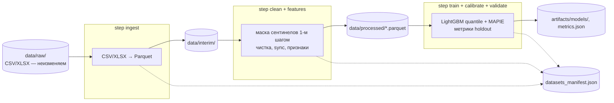

# P4: data-pipeline → data-store (запись)

> [!info] Суть протокола
> data-pipeline — **единственный писатель** в `data/processed/` и владелец записи в
> `artifacts/models/` + `artifacts/metrics.json`. Все записи идут офлайн (цели `make data` /
> `make train`), атомарно (tmp + rename) и обновляют `datasets_manifest.json` — манифест, из
> которого отчёт прогона берёт `data_hashes` ([[07-run-report]]). `data/raw/` неизменяем:
> пайплайн читает его, но никогда не пишет.

## Scope

**Covers:** таблица «какой шаг пайплайна какие файлы пишет» (ingest→interim, clean+features→processed,
train→artifacts); атомарная запись tmp+rename; идемпотентность и перезапуск пайплайна;
версионирование датасетов (v1/v2) и обновление `datasets_manifest.json`; контракт метрик
`metrics.json`. Строение шагов пайплайна (чистка, анти-утечка, признаки) — домен data-pipeline;
здесь только их **эффект записи**.

**Does NOT cover:** чтение этих файлов ядром ([[03-p3-core-datastore]]); формат registry и
manifest.json моделей ([[05-p5-pipeline-core]]); физические конвенции каталогов data-store;
поля DTO — ссылки на [[01-timeseries]], [[02-data-freshness]], [[08-model-artifact]].

## 1. Кто что пишет: шаг пайплайна → файлы



| Шаг пайплайна | Пишет | Схема / содержимое | Режим |
| --- | --- | --- | --- |
| `ingest` | `data/interim/{набор}__{yyyy}.parquet` (сырые dtype-схемы, до чистки) | типы источника; сентинелы ещё на месте | офлайн |
| `clean` + `sync`/`freshness` | `data/processed/telemetry.parquet`, `lims.parquet`, `pak.parquet` | [[01-timeseries]]: сентинелы → `null` + `quality_flag`; ЛИМС с меткой = отбор пробы (`available_ts` + ≤ 4 ч — в freshness, анти-утечка[^lims]); ПАК (сера с 01.2023, D15 с 03.2025 — пустой диапазон легален) | офлайн |
| `sync`/`freshness` | `data/processed/freshness.parquet` | снимок [[02-data-freshness]] по точкам контроля | офлайн |
| `features` | `data/processed/quality_datasets/{target}.parquet` | признаки + метки: `snake_case`, `ts`, `target_value` (+ `available_ts` для анти-утечки) | офлайн |
| `train` + `calibrate` + `validate` | `artifacts/models/…` (модели, манифесты) и `artifacts/metrics.json` | [[08-model-artifact]] (детали P5) / §4 | офлайн |

[^lims]: Метка ЛИМС = момент отбора пробы, публикация через ≤ 4 ч; более раннее попадание
    результата в признаки — анти-утечка.

Правила записи:

1. **Имена `snake_case`, время UTC**, `timestamp[ms, UTC]`, енумы → `dictionary<string>`,
   `float` → `float64` (NaN = «нет значения») — глобальные правила форм ([[00-SUMMARY]] §5).
2. **Только-добавление по годам.** Годовые партиции не переписываются задним числом; новый
   период = новая партиция `{dataset}/{tag}__{yyyy}.parquet`.
3. **`data/raw/` read-only.** Файл-этап ingest создаёт interim-копию; повторный `make data`
   не требует повторного парсинга XLSX и не трогает исходники.
4. **Каждая запись обновляет манифест** (§3) — без обновлённого `datasets_manifest.json` запись
   считается незавершённой и читателем отбрасывается.

## 2. Атомарная запись (tmp + rename)

Никакой записи «на месте»: читатель (ядро, P3) либо видит прежний полный файл, либо новый полный —
никогда половинчатый.

```text
1. пишем полный датасет во временный файл в том же каталоге:
       data/processed/telemetry.parquet.tmp-{run_seed}-{ts}
2. fsync файла (+ каталога)
3. os.replace(tmp, data/processed/telemetry.parquet)   # атомарно на POSIX
4. обновляем datasets_manifest.json тем же приёмом (tmp + replace)
```

- Temp-файл в **том же каталоге** — `rename` атомарен только внутри одной ФС.
- Порядок: датасеты → манифест последним (манифест = фиксация «порции» записей; упал до
  манифеста — новая порция не объявлена, старая осталась консистентной).
- `metrics.json` и файлы моделей — тем же шаблоном (детали моделей — [[05-p5-pipeline-core]]).

## 3. Идемпотентность и перезапуск

| Свойство | Гарантия |
| --- | --- |
| Повторный `make data` | результат байт-в-байт сравним: тот же `data/raw/` + тот же seed ⇒ та же чистка/синхронизация; детерминизм пайплайна (data-pipeline/10) |
| Повторный `make train` | тот же seed ⇒ те же модели; `metrics.json` совпадает; новый артефакт получает новый `artifact_id`, старый не затирается |
| Прерванный запуск | tmp-файлы либо дозаписываются при перезапуске (если шаг детерминирован от raw), либо удаляются; «полузаписанный» processed невозможен по построению (§2) |
| Устаревший processed | пайплайн пересобирает по raw; читатель узнаёт обновление по `datasets_manifest.json` (новый sha256/диапазон) |
| Перезапуск после сбоя записи | манифест не обновлён ⇒ новая порция не видна; читатель работает со старой консистентной версией |

> [!warning] Никакого перемешивания
> Любой сплит — только по времени с gap ≥ 3 ч; сиды фиксированы в конфиге и попадают в
> `metrics.json`. Случайность вне seed'а запрещена (data-pipeline/10, delivery-infra/05).

## 4. `datasets_manifest.json` и `metrics.json`

**Манифест** — единственный мост «что записал писатель» ↔ «что зафиксировал читатель в отчёте»
(`data_hashes` в [[07-run-report]]):

```json
{
  "pipeline_version": "0.1.0",
  "generated_at": "2026-09-19T06:40:00Z",
  "datasets": {
    "data/processed/telemetry.parquet": {
      "sha256": "e3b0c44298fc1c149afbf4c8996fb92427ae41e4649b934ca495991b7852b855",
      "rows": 189214,
      "date_range": {"start": "2023-01-01T00:00:00Z", "end": "2026-09-19T00:00:00Z"},
      "tags": ["24-2000.P8", "T11", "F19", "crude_feed_rate_tph"],
      "schema_version": "v1"
    },
    "data/processed/freshness.parquet": {"sha256": "ab12…", "rows": 8, "schema_version": "v1"}
  }
}
```

**`artifacts/metrics.json`** — метрики валидации по целям `QualityTarget` (пишет шаг validate,
потребляют [[05-p5-pipeline-core]] и страница «Модели»):

```json
{
  "sulfur":  {"wape": 0.061, "mae": 0.52, "pinball_p50": 0.35, "coverage": 0.83},
  "t95":     {"wape": 0.008, "mae": 1.9,  "pinball_p50": 1.1,  "coverage": 0.86},
  "d15":     {"wape": 0.002, "mae": 1.2,  "pinball_p50": 0.7,  "coverage": 0.88},
  "cetane":  {"wape": 0.012, "mae": 0.41, "pinball_p50": 0.28, "coverage": 0.84}
}
```

Каждая запись метрик сопровождается теми же `data_hashes` и версиями (`pipeline_version`,
`lightgbm`, seed) — «откуда метрики» всегда восстанавливается из манифеста.

## 5. Версионирование датасетов

1. **Изменение схемы = новая версия каталога** (`schema_version: v1 → v2`); история не
   переписывается (правило 3 data-store/00).
2. Поля не добавляются молча: любое расширение — новая версия + обновление всех читателей
   (P3) в одном изменении (data-store: «контракт писатель ↔ читатель»).
3. Версия схемы фигурирует в манифесте по каждому датасету; ядро сверяет ожидаемую версию и
   при расхождении отказывает (`schema_mismatch`, [[03-p3-core-datastore]] §4).
4. Модельные артефакты версионируются отдельно — через `artifact_id` и `registry.json`
   ([[05-p5-pipeline-core]]); пайплайн никогда не перезаписывает каталог обученной модели.

## 6. Чек-лист соответствия

- [x] Таблица «шаг → файл → схема»: ingest→interim, clean+features→processed, train→artifacts.
- [x] Атомарность: tmp + `os.replace`, манифест фиксирует порцию последним.
- [x] Идемпотентность: seed-детерминизм, безопасный перезапуск, консистентность при сбое.
- [x] Версионирование: `schema_version` v1/v2, только-добавление, версии в манифесте.
- [x] Форматы `datasets_manifest.json` и `metrics.json`; типы — ссылки на [[01-timeseries]],
      [[02-data-freshness]], [[08-model-artifact]], [[07-run-report]].
