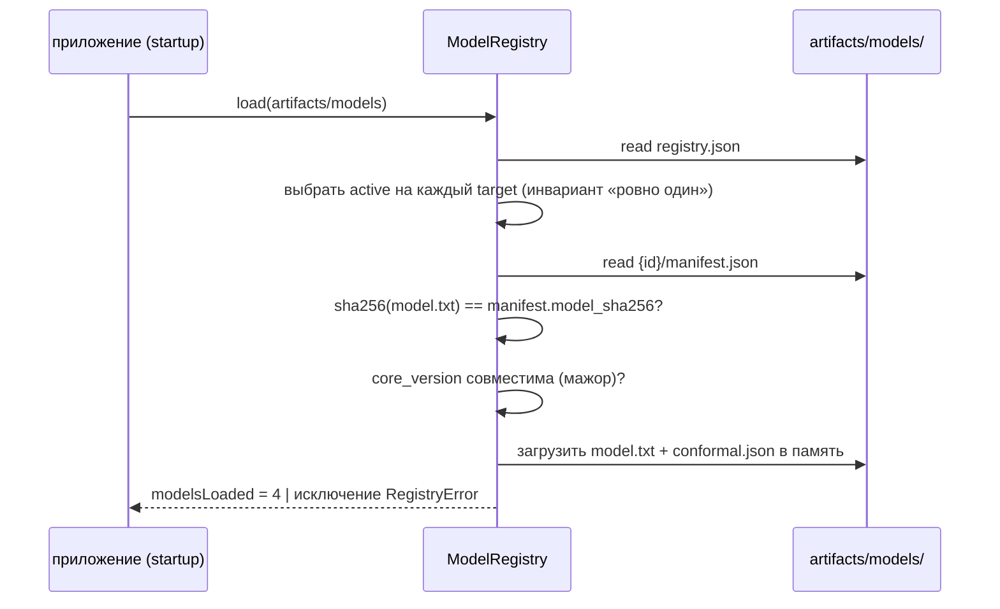

# P5: data-pipeline → core (model registry, файловый обмен)

> [!info] Суть протокола
> Обучение — только офлайн (data-pipeline, `make train`). Ядро **никогда не обучает в рантайме** —
> только загружает модели из файлового реестра `artifacts/models/` по манифестам, проверяя
> sha256 и совместимость версий. Единый источник описания артефакта — [[08-model-artifact]].

## Scope

**Covers:** структура каталога `artifacts/models/`; формат `registry.json` (индекс) и
`manifest.json` (полная каноническая форма [[08-model-artifact]] + `data_hashes`); роль и формат
`metrics.json`; процедура загрузки `ModelRegistry.load()` с sha256-проверкой; выбор активной
модели (одно `active` на `QualityTarget`); все сценарии несовпадения хеша / отсутствия артефакта /
несовместимой версии → отказ с явной ошибкой.

**Does NOT cover:** обучение, калибровка и запись артефактов (производитель — data-pipeline,
запись по P4 [[04-p4-pipeline-datastore]]); использование моделей в прогнозах
([[03-quality-assessment]], core-architecture/04); HTTP-выдача `/api/models` (P1).

## 1. Структура реестра

```text
artifacts/models/
  registry.json                        # индекс: [{artifact_id, target, active, created_at}]
  metrics.json                         # метрики валидации (пишет P4; см. §4)
  artifacts/models/{artifact_id}/      # каталог одного артефакта
    manifest.json                      # каноническая форма [[08-model-artifact]] + data_hashes
    model.txt                          # веса LightGBM: 3 квантильные модели (0.1/0.5/0.9)
    conformal.json                     # параметры MAPIE (EnbPI/ACI)
```

Пример: `artifacts/models/sulfur-lgbm-a1b2c3d4/` — `artifact_id = {target}-{algo}-{hex8}`.

## 2. Формат `registry.json`

Индекс — минимальный: он указывает, **что** загружать; все детали — в manifest.json каждого
артефакта. `target` — значения [[01-enums]] (`sulfur | t95 | d15 | cetane`).

```json
{
  "registry_version": "1.0.0",
  "core_version": "0.1.0",
  "artifacts": [
    {"artifact_id": "sulfur-lgbm-a1b2c3d4",  "target": "sulfur",  "active": true,
     "created_at": "2026-09-18T20:10:00Z"},
    {"artifact_id": "sulfur-lgbm-9f8e7d6c",  "target": "sulfur",  "active": false,
     "created_at": "2026-09-01T19:00:00Z"},
    {"artifact_id": "t95-lgbm-1a2b3c4d",     "target": "t95",     "active": true,
     "created_at": "2026-09-18T20:15:00Z"},
    {"artifact_id": "d15-lgbm-5e6f7a8b",     "target": "d15",     "active": true,
     "created_at": "2026-09-18T20:20:00Z"},
    {"artifact_id": "cetane-lgbm-0d1e2f3a",  "target": "cetane",  "active": true,
     "created_at": "2026-09-18T20:25:00Z"}
  ]
}
```

Правила индекса:

1. **Ровно один `active: true` на каждый `QualityTarget`** — инвариант; реестр с двумя активными
   артефактами на цель невалиден и не загружается.
2. Неактивные артефакты остаются в каталоге (история сравнения метрик), но не загружаются.
3. `registry.json` обновляется только пайплайном (publish, P4) и только целиком (tmp+rename).
4. `core_version` в индексе — подсказка совместимости; строгая проверка — по `manifest.json` артефакта.

## 3. Формат `manifest.json`

Полная каноническая форма [[08-model-artifact]] + `data_hashes` для воспроизводимости:

```json
{"artifact_id": "sulfur-lgbm-a1b2c3d4", "target": "sulfur", "algorithm": "lightgbm_quantile",
 "quantiles": [0.1, 0.5, 0.9], "model_uri": "artifacts/models/sulfur-lgbm-a1b2c3d4/model.txt",
 "conformal": {"method": "enbpi", "params": {"gamma": 0.05, "cv": "split"}}, "coverage": 0.83,
 "metrics": {"wape": 0.061, "mae": 0.52, "pinball_p50": 0.35},
 "trained_on_range": {"start": "2023-01-01T00:00:00Z", "end": "2026-06-30T00:00:00Z"},
 "features": ["T5", "T11", "lims_age_h", "cat_age_days"],
 "monotone_constraints": {"T5": 1},
 "created_at": "2026-09-18T20:10:00Z", "seed": 42, "core_version": "0.1.0", "active": true,
 "data_hashes": {"data/processed/quality_datasets/sulfur.parquet": "e3b0c442…",
                 "data/processed/telemetry.parquet": "ab12cd34…"}}
```

Правила:

1. `data_hashes` манифеста сверяются с `datasets_manifest.json` ([[04-p4-pipeline-datastore]] §4) —
   модель честно привязана к тем данным, на которых обучалась.
2. `trained_on_range` — вход для анти-«вне домена»: состояние на `t_point` вне диапазона —
   причина отказа `out_of_training_domain` ([[01-enums]], core-architecture/10).
3. `monotone_constraints` — физические монотонности (например, T5 ↑ ⇒ сера ↑); матчятся с признаками.
4. Манифест immutable после публикации: исправления = новый `artifact_id`.

## 4. `metrics.json`

Метрики holdout шага validate (формат и семантика — [[04-p4-pipeline-datastore]] §4):
`{target: {wape, mae, pinball_p50, coverage}}`. Пишется пайплайном; дублируется в
`manifest.json → metrics` каждого артефакта, поэтому `GET /api/models` (P1) отдаёт метрики
из манифестов загруженного реестра, не читая диск в рантайме. Файл на верхнем уровне —
сводка последней успешной обучающей порции.

## 5. Загрузка: `ModelRegistry.load()`

```python
# registry.py (ядро) — контракт загрузки
class ModelRegistry:
    def load(self, root: Path = Path("artifacts/models")) -> None:
        """1) registry.json → active-артефакт на каждый QualityTarget
           2) manifest.json → sha256(model.txt) проверен
           3) core_version артефакта совместима
           4) модели + conformal.json → в память (прогрев)"""
```

Последовательность и гарантии:



1. Загрузка происходит **на старте приложения** (lifespan backend, прогрев) и при
   `make demo`/CLI; what-if использует уже поднятые модели (< 50 мс, диск не трогается).
2. sha256 берётся из `manifest.json` и пересчитывается по `model.txt` при каждой загрузке.
3. Реестр в памяти иммутаблен: обновление моделей = рестарт процесса с новым registry.json.

## 6. Выбор активной модели

- **Активирует** артефакт пайплайн: при publish он помечает `active: true` у нового
  `artifact_id` и снимает флаг у предыдущего в той же атомарной перезаписи `registry.json`.
- Критерий выбора — политика пайплайна (обычно лучший pinball/coverage на holdout при
  непустой зоне обученности); ядро политику не оценивает — оно доверяет индексу.
- Ядро обязано найти ровно один активный артефакт **на каждую из 4 целей** `QualityTarget`
  ([[01-enums]]): частичный реестр (например, нет `d15`) делает систему неработоспособной —
  расчёт карточки рекомендации требует всех оценок.

## 7. Ошибки загрузки: отказ + явная ошибка

Любая из ситуаций — не «работаем без этой модели», а **отказ** с явной ошибкой: backend →
`503 models_not_loaded` (P1), прогон не стартует (`run_failed` на pre-flight, см.
[[03-p3-core-datastore]] §4).

| Ситуация | Ошибка / диагностика | Поведение ядра |
| --- | --- | --- |
| `registry.json` отсутствует или невалиден JSON | `models_not_loaded: registry.json missing/invalid` | отказ; 503 |
| Нет `active`-артефакта на какую-то цель | `models_not_loaded: no active artifact for target=<t>` | отказ; 503 |
| Больше одного `active` на цель | `registry_invalid: multiple active for target=<t>` | отказ (инвариант нарушен) |
| **sha256 `model.txt` ≠ хеш из manifest.json** | `artifact_corrupt: {artifact_id}: sha256 mismatch` | артефакт **не загружается**, отказ с явной ошибкой — повреждённые веса никогда не считаются прогнозами |
| `model.txt` / `conformal.json` / `manifest.json` отсутствуют в каталоге | `artifact_incomplete: {artifact_id}` | отказ |
| Мажорная `core_version` артефакта ≠ текущей | артефакт игнорируется как несовместимый; если из-за этого цель осталась без модели → `models_not_loaded` | отказ (минорные расхождения — предупреждение в лог) |
| `data_hashes` манифеста не совпали с `datasets_manifest.json` | `data_drift: {artifact_id}: {file} hash changed after training` | отказ: модель обучена на других данных, чем сейчас лежит в processed |

```json
{"error": {"code": "models_not_loaded",
  "message": "Реестр моделей не загружен",
  "details": {"artifact_id": "sulfur-lgbm-a1b2c3d4",
              "reason": "sha256 mismatch: expected e3b0c442…, got ab12cd34…"}}}
```

> [!warning] Принципы
> 1. Ядро никогда не обучает в рантайме.
> 2. Повреждение/несовместимость = fail-fast, а не тихое использование «последней хорошей» модели.
> 3. Все причины отказа артефакта — структурные коды (`artifact_corrupt`, `registry_invalid`,
>    `data_drift`), пригодные для логов и HTTP-ответа.

## 8. Чек-лист соответствия

- [x] Формат `registry.json` (индекс, инвариант «ровно один active на target») и
      `manifest.json` (канон [[08-model-artifact]] + `data_hashes`).
- [x] `metrics.json` — формат, дублирование в манифестах, выдача через `/api/models`.
- [x] sha256-проверка при каждой загрузке; несовпадение хеша → артефакт не загружается + отказ.
- [x] Выбор активной модели — политика пайплайна, атомарная перезапись registry.json.
- [x] Все ошибки — fail-fast с явными кодами; 503 `models_not_loaded` по P1.
- [x] Типы — только ссылки на [[08-model-artifact]], [[01-enums]], [[03-quality-assessment]].
