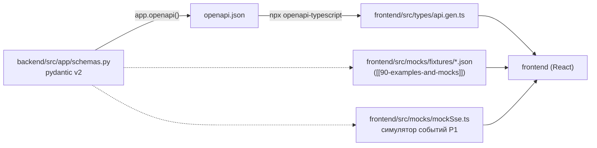

# P6: api ↔ backend ↔ frontend (типы, моки, заморозка контракта)

> [!info] Суть протокола
> Единственный источник контракта — `backend/src/app/schemas.py` (pydantic v2). Из него
> генерируется OpenAPI, из OpenAPI — TS-типы фронта (`openapi-typescript`).
> Фронт получает типы + мок-фикстуры + мок-SSE-симулятор и ведёт разработку **без backend**.
> Ломающие изменения — только через подъём версии контракта.

## Scope

**Covers:** процесс генерации TS-типов (OpenAPI → `openapi-typescript`); правило
`alias_generator=to_camel` (+ `populate_by_name`) и его следствия для JSON/TS; енумы → union
литералов; мок-фикстуры ([[90-examples-and-mocks]]) и мок-SSE-симулятор; переключение
мок-режима фронта единым флагом `VITE_USE_MOCKS` (`true|false`); правило заморозки контракта
(версии, чек-лист,
порядок изменений после заморозки).

**Does NOT cover:** сам формат REST/SSE (эндпоинты и события — [[01-p1-rest-sse]]);
содержимое DTO ([[01-timeseries]]…[[08-model-artifact]]) и [[01-enums]]; реализация
mock-слоя во frontend (frontend/05) — здесь только контрактные требования к нему.

## 1. Поток контракта: pydantic → OpenAPI → TS



Генерация — цель `make api-types` ([[07-p7-infra]]):

```bash
uv run python -c "from app.main import app; import json; print(json.dumps(app.openapi()))" > openapi.json
npx openapi-typescript openapi.json -o frontend/src/types/api.gen.ts
```

Правила:

1. **Типы не переизобретаются**: `api.gen.ts` — сгенерированный файл (артефакт), ручные правки
   запрещены; расхождение типов = баг контракта, а не локальный фикс (frontend правило 2).
2. **DTO не дублируются** ни в backend, ни во frontend — определяются/зеркалятся только здесь
   (правило 1 дизайна api).
3. `openapi.json` коммитится рядом с фронтом как снимок замороженного контракта (§5) — фронт
   может перегенерировать типы даже без поднятого backend.
4. Енумы — `str`-Enum в pydantic ⇒ в OpenAPI `enum`, в TS — union строковых литералов
   ([[01-enums]]); значения добавляются только в api, с отражением в TS union-типах.

## 2. Правило `alias_generator=to_camel`

Канонические поля — `snake_case` (pydantic, Parquet); наружу — `camelCase`:

```python
from pydantic import BaseModel, ConfigDict, AliasGenerator, alias_generators

class TagPoint(BaseModel):
    model_config = ConfigDict(
        alias_generator=alias_generators.to_camel,   # tag_code → tagCode
        populate_by_name=True,                        # валидация по обоим именам
        allow_inf_nan=False,                          # NaN/Inf в JSON запрещены
    )
    tag_code: str
    ts: datetime          # сериализация: ISO 8601 UTC, "…Z"
    value: float | None   # nullable-поля пишутся явно null, не удаляются
```

Следствия (обязательны для любых новых DTO — глобальная таблица трансформаций [[00-SUMMARY]] §5):

| Уровень | Форма |
| --- | --- |
| pydantic (python-код backend/core) | `tag_code`, `snake_case` |
| JSON по P1 (и OpenAPI-схемы) | `tagCode` — сериализация по alias |
| TS (`api.gen.ts`, [[01-timeseries]]) | `tagCode: string` — сразу camelCase |
| `populate_by_name=True` | backend принимает оба имени — внутренние вызовы ядра не переименовывают поля |
| время | `datetime` → `string` (format `date-time`, ISO 8601 UTC) |
| nullable | `float \| None` → `number \| null`; поле присутствует всегда, `null` явный |
| NaN/Inf | запрещены в JSON → всегда `null` |

> [!warning] Проверка алиасов
> Тест контракта (backend/08): для каждой модели `model_json_schema()` и ответ routes
> сравниваются с camelCase-ожиданием. JSON в `snake_case`, «просочившийся» мимо alias-генератора,
> — падение CI, а не правка фронта.

## 3. Мок-фикстуры и мок-SSE

Полный набор JSON-примеров и фикстур описывает [[90-examples-and-mocks]]; P6
фиксирует **требования** к ним:

1. **Статические фикстуры** `frontend/src/mocks/fixtures/{normal,quality_risk,bad_data,refusal}.json`
   — формы [[07-run-report]] / карточки (recommend + refusal); покрывают все 5 сценариев
   `ScenarioKind` ([[01-enums]]) с точки зрения исходов: рекомендация, риск, плохие данные, отказ.
2. **Формат фикстур = формат реальных ответов P1** (те же camelCase-алиасы): мок отдаёт то,
   что отдаст backend, байт-в-байт по структуре. Фикстуры правятся **вместе со схемами** в одном
   изменении контракта.
3. **Мок-SSE-симулятор** `mockSse.ts` воспроизводит последовательность событий §5.2
   ([[01-p1-rest-sse]]): `run_started` → [`agent_started` → `step`/`log` → `agent_finished`] × 5 →
   `recommendation | refusal` → `run_finished`, с задержками между событиями (таймлайн с паузами),
   heartbeat-комментариями каждые 15 с и `id`-монотонностью — чтобы клиент SSE фронта
   (backoff, Last-Event-ID, таймаут heartbeat) отлаживался без backend.
4. **Переключатель**: `VITE_USE_MOCKS=true|false` (а также `VITE_API_BASE`) — при `true` всё
   приложение работает на моках (фикстуры + мок-SSE) без backend, при `false` — на живом API,
   включая what-if (< 200 мс отклик) и отказ; условие приёмки фронта.

```text
frontend/src/
  types/api.gen.ts               # сгенерировано из OpenAPI (P6)
  mocks/fixtures/normal.json     # формы канонических моделей — как реальные ответы P1
  mocks/fixtures/refusal.json
  mocks/mockSse.ts               # симулятор событий P1 с задержками и heartbeat
```

## 4. Версионирование контракта

| Механизм | Значение |
| --- | --- |
| `versions.contract` в [[07-run-report]] | версия контракта, под которой сделан прогон (`"1.0.0"`) |
| заголовок `X-Api-Version` (P1) | та же версия в каждом HTTP-ответе backend |
| OpenAPI `info.version` | синхронизирована с `versions.contract` |

- **Ломающие изменения** (переименование/удаление поля, смена типа, изменение семантики, новые
  значения енумов, изменение порядка/набора SSE-событий) — **только через подъём `contract`-версии**.
- **Новые поля — только опциональные** (добавление не ломает старый фронт).
- Обновление контракта всегда идёт одним изменением: schemas.py + OpenAPI-снимок +
  `api.gen.ts` + фикстуры + примеры [[90-examples-and-mocks]].

## 5. Заморозка контракта

Момент: DTO канонических моделей зафиксированы, перечень SSE-событий утверждён, типы сгенерированы,
моки написаны. После заморозки backend и frontend строятся **параллельно и независимо**.

> [!example] Чек-лист заморозки (всё «да» ⇒ контракт заморожен)
> 1. Все 8 DTO имеют JSON-пример канонической формы в [[90-examples-and-mocks]].
> 2. Каждый DTO имеет мок-фикстуру, покрывающую исходы: recommend и refusal, все 5 сценариев.
> 3. Перечень SSE-событий и их порядок зафиксированы в [[01-p1-rest-sse]]; мок-SSE его воспроизводит.
> 4. `make api-types` проходит зелёным; `api.gen.ts` компилируется TS strict.
> 5. `versions.contract` выставлен; OpenAPI-снимок закоммичен.
> 6. Коды ошибок P1 (400/404/422/500/503 и `error.code`) зафиксированы.

**Порядок изменений после заморозки:**

1. Изменение предлагает один из доменов (backend/frontend) через задачу к api-контракту.
2. Вносятся schemas.py + примеры + фикстуры; ломающее — с bump версии; **не** — с пометкой
   back-compatible.
3. `make api-types` перегенерирует TS; фронту достаточно `git pull` + перегенерация.
4. При интеграции backend и frontend сверяют `X-Api-Version` друг у друга.

## 6. Чек-лист соответствия

- [x] Процесс генерации: pydantic → `app.openapi()` → `openapi-typescript` → `api.gen.ts`
      (цель `make api-types`).
- [x] Правило `alias_generator=to_camel` + `populate_by_name` и следствия для JSON/TS/nullable/времени.
- [x] Енумы → union литералов; источники — [[01-enums]].
- [x] Мок-фикстуры и мок-SSE — требования и ссылка на [[90-examples-and-mocks]]; переключатель
      `VITE_USE_MOCKS` (`true|false`).
- [x] Версионирование: `versions.contract` + `X-Api-Version`; ломающие — только bump.
- [x] Заморозка контракта: чек-лист и процесс изменений.
