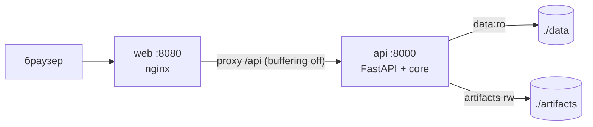

# P7: delivery-infra → все (Makefile, docker-compose, окружение)

> [!info] Суть протокола
> delivery-infra — общий запуск для всех доменов: цели Makefile кодируют порядок запуска, compose
> собирает `api:8000` + `web:8080` (nginx, SSE-friendly), volumes дают ядру read-only доступ к
> данным. Жёсткое правило: **инфра ничего не знает о бизнес-логике** — только цели, сервисы,
> volumes, порты и переменные (delivery-infra, правило 1).

## Scope

**Covers:** контракт Makefile-целей (`help/data/train/demo/run/ui/test/lint/up` и сопутствующие
`down`, `api-types`) как точек входа в протоколы P3–P6; сервисы docker-compose `api` + `web`
(nginx), healthchecks и порядок старта; volumes (`data:ro` для api, `artifacts`); env-переменные
(пути, сиды, LLM-тумблер `off|local|external`); правило нейтральности инфры.

**Does NOT cover:** реализация самих целей (домены: data-pipeline, core, backend, frontend);
Dockerfile-ы (backend/07, frontend/01); значения бизнес-правил; содержимое сценариев
`make demo` (core-architecture/13–14).

## 1. Makefile-цели как контракт запуска

| Цель | Действие | Затрагивает | Предусловие |
| --- | --- | --- | --- |
| `make help` | перечень целей с описанием | — | — |
| `make data` | инжест+чистка+sync → `data/processed/` (P4) | data-pipeline | `data/raw/` на месте |
| `make train` | обучение → `artifacts/models/`, `artifacts/metrics.json` (P4, producer для P5) | data-pipeline | `make data` |
| `make demo` | CLI-прогоны 4–5 сценариев (включая гарантированный отказ) → консоль + `artifacts/runs/*.{json,md}` (P3) | core (CLI) | `make train` |
| `make run` | uvicorn backend `:8000` (P1/P2, реестр моделей из P5) | backend, core | `make data` + `make train` |
| `make ui` | vite dev-сервер `:5173` (proxy `/api` → `:8000`) | frontend | `make api-types` |
| `make test` | pytest: пайплайн, ограничения, отказ, детерминизм | все домены | — |
| `make lint` | ruff (+ формат-проверка) | python-домены | — |
| `make up` / `make down` | docker-compose up/down: `api` + `web` | все сервисы | `make data` + `make train` (данные в volumes) |
| `make api-types` | OpenAPI → `frontend/src/types/api.gen.ts` (P6) | api-контракт | backend-зависимости |

Порядок целей фиксирует порядок запуска: `data` → `train` → (`demo` | `run` | `up`); `ui` и
`test`/`lint` — в любой момент. Инфра проверяет только **наличие входных артефактов**
(например, `make run` падает с подсказкой «запустите make train», если `artifacts/models/registry.json`
нет) — но не интерпретирует их содержимое.

## 2. docker-compose: сервисы

```yaml
# docker-compose.yml — контрактовая схема (детали реализации — delivery-infra/02)
services:
  api:
    build: ./backend                # multi-stage python:3.12-slim + uv (backend/07)
    ports: ["8000:8000"]
    env_file: .env
    environment:
      - SEED=${SEED}                # сиды — сквозные (§4)
      - DATA_DIR=/app/data
      - MODEL_REGISTRY_DIR=/app/artifacts/models
      - LLM_MODE=${LLM_MODE}        # off | local | external
    volumes:
      - ./data:/app/data:ro          # рантайм read-only (P3)
      - ./artifacts:/app/artifacts   # rw: ядро пишет runs/, timeline/ (P3)
    healthcheck:
      test: ["CMD", "curl", "-f", "http://localhost:8000/api/health"]
      interval: 15s
      timeout: 5s
      retries: 5

  web:
    build: ./frontend               # nginx: отдача статики + proxy (frontend/01)
    ports: ["8080:80"]
    depends_on:
      api:
        condition: service_healthy  # web стартует только после живого api
```

nginx (`web`) проксирует `/api` → `api:8000`; обязательные директивы:

```nginx
location /api/ {
    proxy_pass http://api:8000;
    proxy_buffering off;              # критично для SSE: без этого стрим буферизуется и «замирает»
    proxy_cache off;
    proxy_read_timeout 3600s;         # длинные прогоны, heartbeat держит соединение
}
```

| Контракт compose | Значение |
| --- | --- |
| порты | `api: 8000`, `web: 8080` (переопределяются `API_PORT`/`WEB_PORT` из env) |
| healthcheck | `curl -f /api/health` каждые 15 с; `web` ждёт `service_healthy` |
| volumes | `./data:ro` — ядро физически не может писать в processed ([[03-p3-core-datastore]] §3); `./artifacts` rw |
| SSE | `proxy_buffering off` — иначе конвейер агентов не доходит до браузера ([[01-p1-rest-sse]]) |
| версии | образы собираются из того же `uv.lock`, что и локаль (воспроизводимость) |



## 3. Что инфра не делает

> [!warning] Правило нейтральности
> 1. Инфра не знает бизнес-логику: ни одна цель/сервис/healthcheck не содержит правил качества,
>    ограничений, refusal-логики или знаний о схемах датасетов.
> 2. Инфра не пишет и не правит данные: `make data` — это вызов пайплайна (P4), а не скрипты
>    Makefile с логикой чистки.
> 3. Инфра не разрешает конфликты контракта: порты/пути — из env; версии пинятся lock-файлами
>    (`uv.lock`, `package-lock.json`), не «умным» кодом.
> 4. Секреты в репо не хранятся — только `.env.example` с именами и дефолтами (delivery-infra/04).

## 4. Переменные окружения (`.env.example`)

| Переменная | Дефолт | Назначение |
| --- | --- | --- |
| `SEED` | `42` | сквозной сид воспроизводимости: пайплайн, обучение, сценарии («один seed → одно решение») |
| `DATA_DIR` | `./data` (в контейнере `/app/data`) | корень данных; paths читателей P3 строятся от него |
| `MODEL_REGISTRY_DIR` | `./artifacts/models` | путь реестра P5 для `ModelRegistry.load()` |
| `LLM_MODE` | `off` | тумблер нарратора: `off` (без LLM, закрытый контур) / `local` (локальная ≤ 30B) / `external` (внешний API); только текст поверх посчитанных фактов |
| `API_PORT` / `WEB_PORT` | `8000` / `8080` | порты сервисов compose |
| `LOG_LEVEL` | `INFO` | уровень логирования api |
| `VITE_USE_MOCKS` | `false` | `true\|false` — мок-режим фронта (P6): `true` — фикстуры/мок-SSE без backend, `false` — живой API |
| `VITE_API_BASE` | `/api` | база REST/SSE для фронта |

Правила: все окружения — только через `.env.example` (копия → `.env`); тумблер LLM по умолчанию
`off` — система полностью функциональна без сети; пути из env — единственный способ указать
`DATA_DIR`/`MODEL_REGISTRY_DIR` (жёстко зашитых путей в коде нет).

## 5. Чек-лист соответствия

- [x] Все цели `help/data/train/demo/run/ui/test/lint/up` (+ `down`, `api-types`) с контрактом
      «что затрагивает / предусловие»; порядок запуска зафиксирован.
- [x] Сервисы `api:8000` + `web:8080` (nginx), healthcheck `/api/health` 15 с, `service_healthy`.
- [x] Volumes: `data:ro` для api, `artifacts` rw; связь с read-only правилом P3.
- [x] Env: пути (`DATA_DIR`, `MODEL_REGISTRY_DIR`), сиды (`SEED`), LLM-тумблер `off|local|external`.
- [x] SSE-безопасный nginx (`proxy_buffering off`) и правило «инфра ничего не знает о бизнес-логике».
