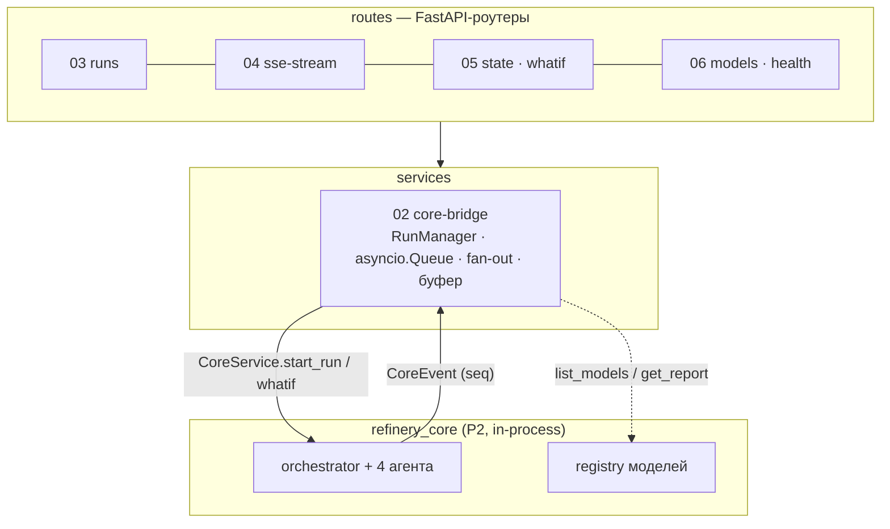
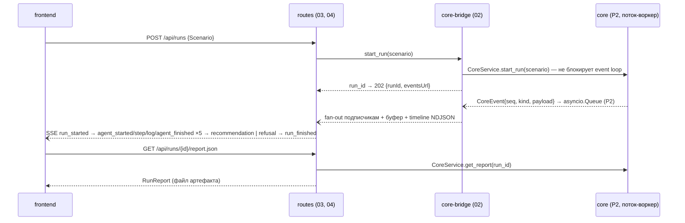

# backend — тонкий HTTP-слой над ядром

> [!quote] Роль домена
> «тонкая HTTP-обёртка ядра: REST + SSE-транспорт прогресса агентов, health, раздача
> отчётов» — стек FastAPI, pydantic v2, uvicorn, sse-starlette; владеет HTTP-поверхностью,
> SSE-очередями, эндпоинтами `/state /runs /whatif /models /health`.

> [!quote] Правило № 1
> «Backend не содержит логики рекомендаций — только транспорт и оркестрация вызовов ядра
> (P2 — вызов, не дублирование)».

## Scope

| Охват (covers) | Не охват (does NOT cover) |
| --- | --- |
| REST-роуты P1 (`/runs`, `/state`, `/whatif`, `/models`, `/health`, отчёты) и SSE-стрим | Логика агентов, движок ограничений, Парето, refusal-правила — всё в [[core-architecture/00-OVERVIEW\|core]] |
| Сервисный слой: core-bridge, RunManager, очереди событий, реплей | Чтение `data/processed/*.parquet` напрямую (запрещено, см. правила) |
| Конфигурация (pydantic-settings), фабрика приложения, маппинг ошибок ядра в HTTP | Определение DTO и эндпоинтов — контракт живёт в [[01-p1-rest-sse\|P1]] |
| `Dockerfile` сервиса api (multi-stage, non-root, healthcheck) | docker-compose, Makefile, nginx — домен [[delivery-infra/00-OVERVIEW\|delivery-infra]] |
| Формат кадров SSE, порядок событий, Last-Event-ID | Поля DTO ([[00-SUMMARY]]) и тексты нарратора ([[90-narrator-llm]]) |

## Слои

Направление зависимостей строгое: `routes → services (core-bridge) → refinery_core`.
Backend импортирует ядро, но ядро никогда не импортирует backend.

```text
frontend ── P1 REST ──► routes (state · runs · whatif · models · health)
                              │
frontend ◄── P1 SSE ───── sse-stream ◄── asyncio.Queue ◄──┐
                              │                           │
                       services/core-bridge ── P2 in-process ──► orchestrator
                              │                                  (refinery_core)
                       (доступ к данным только через ядро, P3)
```

ASCII-слои. В терминах файлов:

| Слой | Каталог | Ответственность | Что запрещено |
| --- | --- | --- | --- |
| routes | `backend/src/app/routers/` | парсинг запроса, вызов сервиса, статус-коды | любая логика, чтение файлов `data/` |
| services | `backend/src/app/services/` | core-bridge, RunManager, очереди, буферы, timeline | HTTP-типы, формат SSE-кадров |
| schemas | `backend/src/app/schemas.py` | DTO контракта (P6, единственный источник) | собственные поля вне [[00-SUMMARY]] |
| core | `refinery_core` | расчёты, агенты, артефакты | — (импортируется, не модифицируется) |



## Поток одного запроса рекомендации



## Индекс документов

Нумерация = порядок реализации; читается сверху вниз.

| # | Файл | Назначение | Оценка строк |
| --- | --- | --- | --- |
| 1 | [[backend/00-OVERVIEW]] | этот обзор: слои, правила, зависимости | 130 |
| 2 | [[01-app-config]] | фабрика приложения, pydantic-settings, LLM-тумблер, `.env.example` | 150 |
| 3 | [[02-core-bridge]] | обёртка [[02-p2-backend-core\|P2]]: воркер, очередь, fan-out, буфер, timeline NDJSON | 210 |
| 4 | [[03-runs-routes]] | `POST /runs`, `GET /runs`, `GET /runs/{id}`, `report.{json,md}`, валидация Scenario | 160 |
| 5 | [[04-sse-stream]] | `GET /runs/{id}/events`: кадры, seq, heartbeat 15 с, Last-Event-ID, без буферизации | 180 |
| 6 | [[05-state-whatif]] | `GET /state` (срез + свежесть + последняя карточка), `POST /whatif` (< 50 мс, 409) | 160 |
| 7 | [[06-models-health]] | `GET /models` из реестра, `GET /health`: версии, данные, модели, LLM-режим | 120 |
| 8 | [[07-docker]] | `backend/Dockerfile`: multi-stage `python:3.12-slim` + uv, non-root, healthcheck | 110 |

## Правила дизайна

> [!warning] Шесть правил backend (дословно + выводы)
> 1. «Backend не содержит логики рекомендаций — только транспорт и оркестрация вызовов ядра
>    (P2 — вызов, не дублирование)».
> 2. «Ни один роут не читает `data/` напрямую — доступ к данным только через ядро (P3 через core)».
> 3. «Ответы и события — только контрактные DTO из `api/data-models/`; сырых dict в responses нет».
> 4. «REST — синхронные ответы; SSE — только из очереди событий конкретного прогона; история
>    прогонов — артефакты, не память».
> 5. **Backend не считает**: ни одного импорта LightGBM/pandas в `backend/src/`; все числа
>    приходят из `refinery_core`. Что считается в `core/src/` — решает [[core-architecture/00-OVERVIEW]].
> 6. **Ошибки ядра маппятся в HTTP-коды** централизованным обработчиком ([[01-app-config]]):
>    `models_not_loaded` / `data_missing` → 503, неизвестный `kind` / неуправляемый override → 400,
>    отсутствие артефакта → 404, занятый what-if-воркер → 409. Ядро не знает про HTTP.

> [!note] Состояние = файлы `runs/`, память — только транспорт
> Единственное «долговременное» состояние backend — каталог `artifacts/runs/`
> (`{run_id}.json`, `{run_id}.md`) и журнал `artifacts/timeline/{run_id}.ndjson`.
> RunManager ([[02-core-bridge]]) держит в памяти только **активные** прогоны и кольцевой
> буфер последнего прогона; после `run_finished`/`run_failed` истина — на диске.
> Перезапуск контейнера не теряет историю: `GET /runs` собирает список из файлов.

## Кросс-доменные зависимости

| Протокол | Пара | Что backend делает | Документ |
| --- | --- | --- | --- |
| P1 | frontend ↔ backend | реализует REST + SSE **ровно как в контракте**, не переопределяя эндпоинты | [[01-p1-rest-sse]] |
| P2 | backend ↔ core | in-process вызов `CoreService`; события — `asyncio.Queue` | [[02-p2-backend-core]] |
| P3 | core ↔ data-store | пользуется опосредованно: ядро читает Parquet и пишет `artifacts/runs/` | [[03-p3-core-datastore]] |
| P6 | api ↔ backend ↔ frontend | `schemas.py` — единственный источник DTO; TS-типы генерируются из OpenAPI | [[06-p6-openapi-ts-mocks]] |
| P7 | infra → backend | цели `make run`/`make up`, сервис api, volumes, `.env` | [[07-p7-infra]] |

> [!example] Готовность домена
> Демо через браузер на реальном API: `POST /api/runs` → SSE-конвейер 5 агентов → карточка
> или отказ в UI → экспорт `report.md`. Фронт ([[frontend/00-OVERVIEW]]) стартовал раньше
> на моках, поэтому расхождение с контрактом P1 = баг backend, а не правка фронта.

## Стек и файлы домена

| Элемент | Выбор | Роль |
| --- | --- | --- |
| Фреймворк | FastAPI + pydantic v2 | роуты, валидация, OpenAPI (P6) |
| Сервер | uvicorn (ASGI) | один процесс; масштабирование не требуется — расчёт в ядре |
| SSE | «ручной» `StreamingResponse` | кадры формируем сами из `CoreEvent` (без зависимости от тяжёлых обёрток) |
| Фоновое выполнение | `anyio.to_thread` | синхронное ядро без блокировки event loop (P2) |
| Конфиг | pydantic-settings | [[01-app-config]], общий `.env` с delivery-infra |
| Каталог | `backend/src/app/` | `config.py`, `main.py`, `schemas.py`, `routers/`, `services/` |

## Порядок чтения

1. [[01-p1-rest-sse]] — что именно обещано фронту (эндпоинты, события, ошибки).
2. [[02-p2-backend-core]] — как backend зовёт ядро.
3. [[backend/00-OVERVIEW]] (этот файл) → [[01-app-config]] → [[02-core-bridge]] — каркас и транспорт.
4. [[03-runs-routes]] → [[04-sse-stream]] → [[05-state-whatif]] → [[06-models-health]] — роуты.
5. [[07-docker]] — упаковка.

## Тестовая стратегия домена

| Уровень | Что проверяется | Инструмент |
| --- | --- | --- |
| Юнит-сервисов | fan-out/буфер/реплей [[02-core-bridge]], what-if слот, валидация Scenario | pytest + фейковый `CoreService` и sink |
| HTTP (TestClient) | коды ошибок 400/404/409/503, контрактные тела ошибок | `httpx.AsyncClient` против `create_app()` |
| SSE | порядок и `seq` кадров, heartbeat 15 с, Last-Event-ID | стрим-парсер в тестах (без браузера) |
| Контракт | OpenAPI ↔ [[01-p1-rest-sse]] (эндпоинты не разъезжаются) | схема из `app.openapi()` (P6) |

Ядро и его математику тестирует сам core ([[15-tests]]) — здесь ядро
подменяется дублёром; интеграционные сценарии (реальные модели + API) —
([[06-release-checklist]]).
