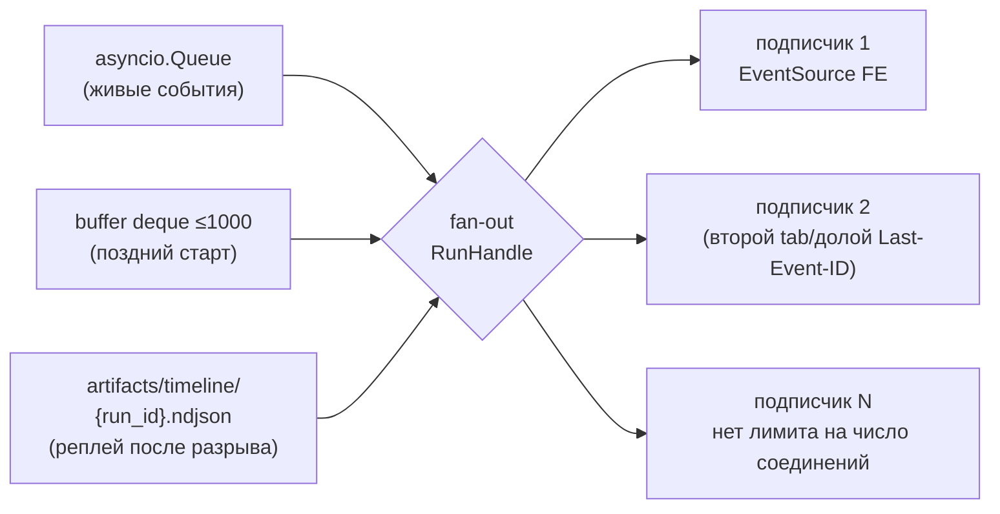

# Core-bridge — обёртка `CoreService` (P2)

Файлы: `backend/src/app/services/core_bridge.py`, `backend/src/app/services/run_manager.py`.
Единственный слой, которому разрешено импортировать `refinery_core`; роутеры видят только
эти классы. Транспорт событий: `CoreEvent` → `asyncio.Queue` → fan-out подписчикам SSE,
с буферизацией и записью журнала `artifacts/timeline/{run_id}.ndjson` для реплея.

## Scope

| Охват (covers) | Не охват (does NOT cover) |
| --- | --- |
| Вызов `CoreService.start_run` в воркере-потоке без блокировки event loop | Внутренности оркестратора — [[09-agent-orchestrator]] |
| `RunManager`: реестр активных прогонов, очереди, fan-out, буфер событий | HTTP-детали и формат SSE-кадров — [[04-sse-stream]] |
| Журнал реплея `artifacts/timeline/{run_id}.ndjson` | Чтение Parquet `data/processed/` (делает ядро, P3) |
| `whatif` c таймаутом и защитой от параллельных вызовов | Логика расчёта what-if — ядро, [[04-agent-quality]] |

> [!quote] Контракт P2 ([[02-p2-backend-core]], дословно)
> «Сеть не используется; backend импортирует `refinery_core`. Ядро синхронно и
> детерминировано, прогон идёт в worker-потоке (`anyio.to_thread`), события — в
> asyncio-очередь через `loop.call_soon_threadsafe`».

> [!note] Sink — внутренняя деталь моста, не часть сигнатуры ядра
> `CoreService.start_run(scenario)` приёмника не принимает: ядро публикует `CoreEvent`
> в очередь своего прогона, мост забирает её через `subscribe_events(run_id)`. «Sink» ниже —
> внутренний приёмник самого [[02-core-bridge]] на потребителе очереди (буфер + timeline +
> fan-out); в контракт P2 он не входит.

## Границы P2

```python
# refinery_core/service.py — вид из backend, НЕ переопределяется здесь (источник: P2)
class CoreService:  # registry + settings — в __init__
    def start_run(self, scenario: Scenario) -> str: ...
    def subscribe_events(self, run_id: str) -> asyncio.Queue[CoreEvent]: ...
    def get_report(self, run_id: str) -> RunReport: ...
    def whatif(self, req: WhatifRequest) -> WhatifResult: ...
    def list_models(self) -> list[ModelArtifact]: ...
    def read_state(self) -> StateAggregate: ...

# CoreEvent = {seq: int, run_id: str, kind: <SSE-событие P1>, payload: dict, ts: datetime}
# read_state — шестая сигнатура канонического набора P2: срез состояния и свежести через
# ядро; вызов каноничен, потребитель — [[05-state-whatif]].
```

`CoreEvent.kind` — ровно перечень событий из [[01-p1-rest-sse]]:
`run_started, agent_started, step, log, agent_finished, recommendation, refusal, run_finished, run_failed`.
backend не вводит собственных видов событий.

## Обёртка CoreBridge

```python
class CoreBridge:
    def __init__(self, core: CoreService, timeline_dir: Path,
                 loop: asyncio.AbstractEventLoop) -> None: ...

    def start_run(self, scenario: Scenario) -> str:
        """Регистрирует прогон в RunManager, запускает core.start_run(scenario) в поток-воркере,
        подписывается на очередь событий (subscribe_events), возвращает run_id."""

    async def whatif(self, req: WhatifRequest, timeout_s: float = 2.0) -> WhatifResult:
        """Синхронный расчёт ядра через to_thread; TimeoutError → whatif_busy (см. 05)."""

    def get_report(self, run_id: str) -> RunReport: ...        # прокси в ядро
    def list_models(self) -> list[ModelArtifact]: ...          # прокси в ядро
    def read_state(self) -> StateAggregate: ...

    def _make_sink(self, run_id: str) -> EventSink:
        """Внутренний приёмник моста: потребляет очередь из subscribe_events(run_id)
        → fan-out подписчикам + буфер + timeline NDJSON."""
```

- **Воркер**: `anyio.to_thread.run_sync(core.start_run, scenario)` — ядро синхронно
  (LightGBM, Polars), event loop не блокируется; события ядро доставляет в очередь прогона
  через `loop.call_soon_threadsafe` (P2), мост забирает их через `subscribe_events(run_id)`.
- **Sink (внутренняя деталь моста)**: потребитель очереди; на каждое `CoreEvent` выполняет
  три действия: (1) fan-out живым подписчикам, (2) append в кольцевой буфер прогона,
  (3) строка JSON в `artifacts/timeline/{run_id}.ndjson`. Порядок сохраняется монотонным
  `seq`, который выставляет ядро (P2).
- **Гарантия финального события**: если поток прогона упал без события, обёртка публикует
  `run_failed` сама (оговорено в P2: «`run_failed` публикуется и при падении потока»).

## RunManager: очередь, fan-out, буфер, реплей

```python
class RunManager:
    max_buffer: int = 1000                          # = maxsize очереди из P2

    def register(self, run_id: str, kind: ScenarioKind) -> RunHandle: ...
    def handle(self, run_id: str) -> RunHandle: ...          # KeyError → 404 роутером
    def active_ids(self) -> list[str]: ...

class RunHandle:
    queue: asyncio.Queue[CoreEvent]                 # на прогон, maxsize=1000 (P2)
    buffer: deque[CoreEvent]                        # последние события для поздних подписчиков
    status: RunStatus                               # started → running → completed/refused/failed
    finished_at: datetime | None
    def subscribe(self, after_seq: int = 0) -> AsyncIterator[CoreEvent]: ...
    async def wait_finished(self) -> RunStatus: ...
```

Поведение подписки (используется [[04-sse-stream]]):



1. **Живой подписчик** получает события из очереди; при переполнении (медленный клиент,
   `maxsize=1000`) очередь не блокирует поток ядра: клиент отстал — событие для него
   восстанавливается из буфера/журнала по `seq` (дубли по `id` отбрасываются, как требует P1).
2. **Поздний подписчик** (открыл страницу после `agent_finished №2`) получает события из
   `buffer` с `seq > after_seq`, затем переключается на живую очередь.
3. **Переподключение**: `Last-Event-ID` → докрутка из `artifacts/timeline/{run_id}.ndjson`
   до текущего `seq` — и дальше из очереди; это ровно гарантия P1 «переподключение —
   `Last-Event-ID` + реплей из журнала».
4. **После финального события** подписка завершается; handle живёт до конца процесса
   только буфером — истина для `GET /runs/{id}` после завершения читается из `runs/*.json`.

## Журнал реплея (timeline NDJSON)

```text
artifacts/timeline/{run_id}.ndjson      # по строке на CoreEvent, append-only
{"seq": 1, "kind": "run_started", "ts": "2026-09-19T08:00:00Z", "payload": {…}}
{"seq": 15, "kind": "recommendation", "ts": "2026-09-19T08:05:01Z", "payload": {…}}
```

- Пишется sink'ом на стороне backend **по мере событий** — поток реплея не зависит от того,
  жив ли процесс; `run_failed` тоже попадает в журнал.
- Только append: перезапись запрещена, повторный прогон = новый `run_id` (правило P3).
- Путь журнала возвращается в `RunReport.artifacts.timeline`
  ([[07-run-report]]), так что фронт/CLI могут докрутить историю без backend-памяти.

> [!note] Почему очередь на прогон, а не глобальная
> P2 фиксирует: «очередь — своя на прогон». Глобальная очередь смешала бы события двух
> прогонов и сломала бы «SSE — только из очереди событий конкретного прогона»
> (правило 4 дизайна backend, [[backend/00-OVERVIEW]]).

## What-if: односписочный воркер

Модели уже в памяти (P5, прогрев в lifespan), расчёт синхронный и быстрый — цель < 50 мс
([[01-p1-rest-sse]]). Но LightGBM-инференс не реентерабелен для нашего
SLA, поэтому расчёты сериализуются:

```python
class WhatifWorker:
    slot: asyncio.Lock                       # один расчёт одновременно
    def __init__(self, bridge: CoreBridge, timeout_s: float = 2.0) -> None: ...
    async def run(self, req: WhatifRequest) -> WhatifResult: ...
        # lock.try_lock → занят: WhatifBusyError → 409 (роут 05)
        # иначе to_thread(core.whatif, req) под asyncio.wait_for(timeout_s)
        # таймаут/исключение → WhatifBusyError / CoreError — слот освобождается в finally
```

- 409 при занятом слоте — быстрый честный ответ фронту (повторить запрос), а не очередь из
  висящих соединений; таймаут 2 с >> цели 50 мс и ловит только деградацию.
- What-if не пишет артефактов и не публикует событий (оговорка P2: «без событий и без
  записи артефактов»).

## Что здесь запрещено

> [!warning] Границы слоя
> 1. Никаких HTTP-типов (`Request`, `Response`, SSE-кадров) — это ответственность [[04-sse-stream]].
> 2. Никаких чтений `data/processed/*.parquet` — только вызовы ядра (правило 2, [[backend/00-OVERVIEW]]).
> 3. Никаких повторных расчётов: bridge не «помогает» ядру досчитать квантиль или стоимость.
> 4. Никаких записей вне `artifacts/timeline/`; `artifacts/runs/` пишет только ядро (P3).
> 5. Тесты слоя — без HTTP: подставной sink и фейковый `CoreService`
>     ([[15-tests]] не покрывает транспорт — это наши тесты).

## Приёмочные критерии

1. Два EventSource на один прогон получают идентичные последовательности `seq` без дублей.
2. Разрыв соединения на `agent_finished` №2 и реконнект с `Last-Event-ID: 4` доигрывает
   события 5…N из журнала, ни одно не теряется и не дублируется.
3. Падение потока прогона (плохой артефакт модели) даёт клиенту событие `run_failed` ≤ 1 с.
4. Два параллельных `POST /whatif` → один 200, второй 409; `elapsedMs` в ответе < 50 в 99 % прогонов.
5. После `run_finished` повторный `GET /api/runs/{id}` работает без записей в памяти
   (только `artifacts/runs/`).
