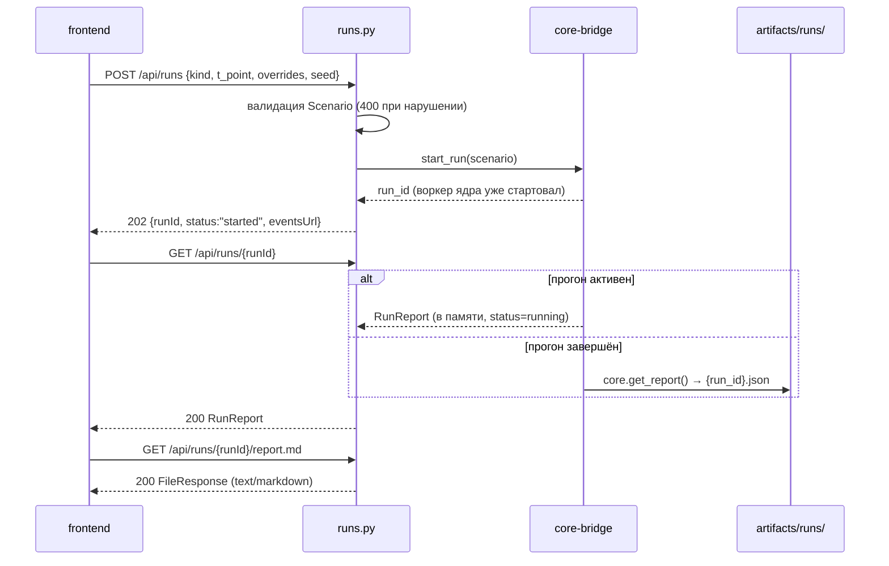

# Роуты прогонов: `POST/GET /api/runs`, отчёты

Файл: `backend/src/app/routers/runs.py`. Запуск прогона, список/сводка и раздача артефактов
`report.{json,md}`. Единственный роутер, который создаёт объекты — и даже он не считает:
передаёт `Scenario` в [[02-core-bridge]] и сразу возвращает 202.

> [!info] Контракт, а не переопределение
> Поля запросов/ответов, примеры JSON и полный перечень ошибок фиксирует
> [[01-p1-rest-sse]] (P1). Здесь — сигнатуры реализации и правила
> валидации на стороне backend; при любом расхождении с P1 правится backend.

## Scope

| Охват (covers) | Не охват (does NOT cover) |
| --- | --- |
| `POST /api/runs` → 202 + `{runId, status, eventsUrl}` | SSE-эндпоинт `GET /api/runs/{id}/events` — [[04-sse-stream]] |
| `GET /api/runs` (список-сводка) и `GET /api/runs/{run_id}` (полный RunReport) | Сборка карточки/трейса — ядро, [[12-run-report]] |
| `GET /api/runs/{run_id}/report.json` и `report.md` — раздача файлов артефактов | Поля DTO Scenario/RunReport — [[06-scenario]], [[07-run-report]] |
| Валидация `Scenario` (kind, overrides, t_point, seed) и коды ошибок 400/404/503 | Логика пресетов сценариев — [[13-scenarios]] |

## Сигнатуры роутов

```python
router = APIRouter(prefix="/api", tags=["runs"])

@router.post("/runs", status_code=202)
async def create_run(payload: ScenarioCreate) -> RunAccepted:
    """Валидирует Scenario → bridge.start_run() → {runId, status: 'started', eventsUrl}."""

@router.get("/runs")
async def list_runs(limit: int = 50, kind: ScenarioKind | None = None) -> list[RunSummary]:
    """Сводка: активные прогоны из RunManager + история из artifacts/runs/ (файлы, не память)."""

@router.get("/runs/{run_id}")
async def get_run(run_id: str) -> RunReport:
    """Полный отчёт: активный прогон — из RunManager, завершённый — core.get_report()."""

@router.get("/runs/{run_id}/report.json")
async def get_report_json(run_id: str) -> FileResponse:
    """Артефакт artifacts/runs/{run_id}.json как файл (application/json)."""

@router.get("/runs/{run_id}/report.md")
async def get_report_md(run_id: str) -> FileResponse:
    """Артефакт artifacts/runs/{run_id}.md (text/markdown) — экспорт отчёта из UI."""
```

Замечания к сигнатурам:

- `ScenarioCreate` — вход P1 без `scenario_id` (его присваивает backend/ядро);
  DTO те же, что в [[06-scenario]], с валидаторами ниже.
- `RunAccepted` = `{"runId": str, "status": "started", "eventsUrl": "/api/runs/{id}/events"}`
  — строка `eventsUrl` отдаётся клиенту, чтобы фронт не собирал URL руками (P1).
- `FileResponse` отдаёт файл как есть: backend не рендерит Markdown и не пересобирает JSON —
  артефакт уже канонический (P3, пишет ядро).

## Валидация Scenario

Проверки, которые backend выполняет **до** передачи в ядро (быстрый отказ 400 вместо
запуска заведомо невалидного прогона):

| Проверка | Ошибка → код | Обоснование |
| --- | --- | --- |
| `kind` ∈ ScenarioKind (`normal, quality_risk, bad_data, sour_crude, stale_lims`) | 400 `unknown_kind` | P1: «неизвестный kind» |
| `overrides`: ключи — только управляемые теги/доли (P8/T11/F19, АВТ-переменные, бленд + присадка ≤ 3 %) | 400 `unmanaged_override` | карточка рекомендации меняет только управляемые |
| `t_point` — aware-UTC и внутри `trained_on_range` активных артефактов | 400 `t_point_out_of_range` | состояние вне диапазона обученности — домен отказа `out_of_training_domain`, но бессмысленный `t_point` отсеиваем сразу |
| `seed` ≥ 0; при `null` — `Settings.seed` из [[01-app-config]] | 400 `validation_error` | воспроизводимость «один seed → одно решение» |
| значения `overrides` — конечные числа (no NaN/Inf) | 400 `validation_error` | правило форм §0 |

```python
class ScenarioCreate(BaseModel):        # зеркало DTO P1, без scenario_id
    kind: ScenarioKind = ScenarioKind.normal
    t_point: datetime
    overrides: dict[str, float] = {}
    description: str | None = None
    seed: int = 42
    # валидаторы: managed_tags(overrides), utc_aware(t_point), finite(overrides)
```

> [!note] Делегирование глубокой валидации ядру
> Backend проверяет форму; семантику («переменная существует в этом срезе», «доли = 100 %»)
> проверяет движок ограничений ядра — и это **штатный отказ** `no_feasible_variant` в карточке,
> а не HTTP-ошибка (безопасность важнее экономики, [[10-refusal]]).

## Коды ошибок роутера

Тело ошибки — контрактное: `{"error": {"code", "message", "details"}}`; маппинг
`CoreError → HTTP` установлен централизованно ([[01-app-config]]).

| Код | HTTP | Сценарий |
| --- | --- | --- |
| `unknown_kind`, `unmanaged_override`, `validation_error`, `t_point_out_of_range` | 400 | невалидный Scenario (таблица выше) |
| `run_not_found` | 404 | `run_id` нет ни в RunManager, ни в `artifacts/runs/` |
| `report_not_found` | 404 | файл `report.{json,md}` отсутствует (прогон не завершился/упал) |
| `models_not_loaded`, `data_missing` | 503 | registry пуст или данные недоступны (P5/P3) — прогон не принимается |
| `internal` | 500 | прочее; детали только при `debug` |

## Поток запуска и жизни прогона



Правило истории: «история прогонов — артефакты, не память» ([[backend/00-OVERVIEW]], правило 4).
`list_runs` сливает два источника: активные из RunManager (чтобы видеть `running` до
появления файла) и файлы `artifacts/runs/*.json`; сортировка по `created_at` desc.

## Чего роутер не делает

> [!warning] Запрещено
> 1. Ждать окончания прогона в `POST /runs` — ответ 202 сразу; прогресс клиент берёт
>    в SSE ([[04-sse-stream]]). Синхронный POST сломал бы таймауты прокси и UX.
> 2. Читать `data/` или `artifacts/models/` напрямую — только через bridge/ядро.
> 3. Формировать `RunReport` вручную — DTO приходит из ядра, сериализацию делает pydantic (P6).
> 4. Принимать второй прогон того же `run_id` — повторный прогон = новый `run_id` (P3).

## Приёмочные критерии

1. `POST /api/runs` с `kind: "unknown"` → 400 `unknown_kind` до старта потока.
2. `POST /api/runs` с `overrides: {"Q21": 9.0}` (неуправляемый лабораторный тег) → 400.
3. `GET /api/runs/{id}` по случайному id → 404; по id завершённого прогона после
   перезапуска сервиса → 200 (источник — файл артефакта).
4. `report.md` открывается как Markdown-документ с трейсом агентов и карточкой рекомендации;
   `Content-Type: text/markdown`.
5. При пустом `artifacts/models/` POST → 503 `models_not_loaded` (не 202!).
