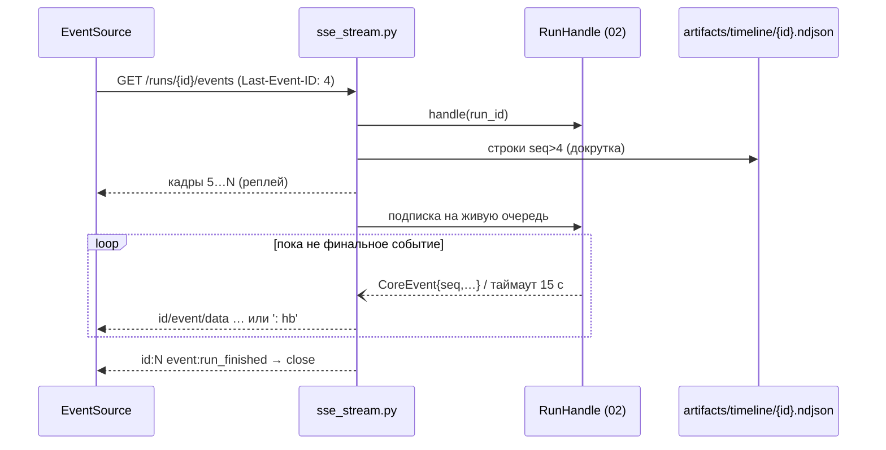

# SSE-стрим прогресса прогона

Файл: `backend/src/app/routers/sse_stream.py`. Единственный потоковый эндпоинт системы:
трансляция `CoreEvent` конкретного прогона в `text/event-stream`. Источник событий —
только очередь/буфер [[02-core-bridge]]; запуск прогонов здесь запрещён.

> [!info] Контракт событий
> Перечень событий, порядок, payload и примеры JSON фиксирует [[01-p1-rest-sse]]:
> `run_started` → [`agent_started` → `step*`/`log*` → `agent_finished`]×5 →
> `recommendation | refusal` → `run_finished | run_failed`. Здесь — транспорт кадра,
> `id`/`seq`, heartbeat, реплей и отключение буферизации.

## Scope

| Охват (covers) | Не охват (does NOT cover) |
| --- | --- |
| `GET /api/runs/{run_id}/events`: `StreamingResponse`, генератор кадров | Смысл и поля payload — контракта P1 и [[05-agent-step]] |
| Формат кадра `event/data/id`, монотонный `seq`, `retry:`-политика | Fan-out, буфер, timeline NDJSON — [[02-core-bridge]] |
| Heartbeat-комментарий `: hb` каждые 15 с | Рендер конвейера агентов — [[09-components-agent-pipeline]] |
| Реплей по `Last-Event-ID` из timeline; снятие буферизации прокси | Запуск/отмена прогонов — [[03-runs-routes]] |

## Сигнатура эндпоинта

```python
router = APIRouter(prefix="/api", tags=["sse"])

@router.get("/runs/{run_id}/events")
async def run_events(run_id: str, request: Request) -> StreamingResponse:
    """text/event-stream; charset=utf-8 — кадры прогона + heartbeat; один запрос = один прогон."""

def _frame(event: CoreEvent) -> str:
    """Сериализация: id: {seq} · event: {kind} · data: {payload-json}\\n\\n (без тел логики)."""

def _heartbeat(now: datetime) -> str:
    """': hb {ISO-8601}\\n\\n' — комментарий SSE, не событие."""

async def _event_stream(handle: RunHandle, last_id: int | None, request: Request) -> AsyncIterator[str]: ...
```

## Формат кадра

Каждое событие несёт `id` = монотонный `seq` (ставит ядро, P2); `event` — вид из P1;
`data` — один JSON-объект payload (переносы строки внутри data запрещены — сериализация
`json.dumps(..., ensure_ascii=False)` в одну строку).

```text
id: 2
event: agent_started
data: {"runId":"20260919-080000-3f9c2a","stepIdx":0,"agentRole":"data","startedAt":"2026-09-19T08:00:01Z","inputDigest":"…"}

id: 15
event: recommendation
data: {"runId":"…","decision":"recommend","state":[…],"actions":[…],"checks":[…],"confidence":{"p10":0.62,"p90":0.88}, …}
```

Пример разметки живого конвейера (P1, дословная структура):

```text
id:1  event:run_started      data:{runId,…}
id:2  event:agent_started    data:{stepIdx:0, agentRole:"data",…}
id:3  event:log              data:{stepIdx:0, level:"warn", message:"D10 мёртв (99,99 % сентинелов)"}
id:4  event:agent_finished   data:{stepIdx:0,…, output:{freshness:[…]},…}
id:14 event:agent_finished   data:{stepIdx:4, agentRole:"orchestrator",…}
id:15 event:recommendation   data:{decision:"recommend", actions:[…], confidence:{p10:0.62,p90:0.88}}
id:16 event:run_finished     data:{status:"completed", reportUrl:"/api/runs/…/report.json"}   ← между событиями каждые 15 с: `: hb <ISO>`
```

## Heartbeat 15 с

Между событиями генератор раз в 15 с отправляет комментарий:

```text
: hb 2026-09-19T08:00:15Z
```

- Комментарий игнорируется EventSource, но (а) держит соединение живым через прокси,
  (б) даёт фронту детектор «тишины > 30 с ⇒ реконнект» ([[04-service-sse]]).
- Реализация — `asyncio.wait_for(queue.get(), timeout=15.0)`; по таймауту отдаём `hb`.
- Heartbeat **не увеличивает** `seq` и не пишется в timeline (он не событие).

## Реплей по Last-Event-ID

> [!quote] Гарантии P1 ([[01-p1-rest-sse]], дословно)
> «один запрос = один прогон (после финального события поток закрывается, `retry:` не
> выдаётся); переподключение — `Last-Event-ID` + реплей из журнала
> `artifacts/timeline/{run_id}.ndjson` (пишет ядро); дубли по `id` отбрасываются».

> [!note] Кто физически пишет журнал
> Для контракта важно лишь, что файл существует и полон к моменту реплея. Приёмник событий
> моста (sink — внутренняя деталь [[02-core-bridge]], в сигнатуру P2 не входит) пишет NDJSON
> в момент получения каждого `CoreEvent` из очереди подписки (см. [[02-core-bridge]],
> «Журнал реплея»), поэтому реплей работает и для прогонов, запущенных до перезапуска сервиса.

Алгоритм генератора при подключении/реконнекте:

1. Заголовок `Last-Event-ID` (целое) или `?lastEventId=` — фолбэк для окружений, где браузер
   не выставляет заголовок после `EventSource.onerror`.
2. Докрутка: строки `artifacts/timeline/{run_id}.ndjson` с `seq > last_id` → кадры
   (источник — RunHandle.buffer для живого прогона, файл — для завершённого/чужого процесса).
3. Далее — живая очередь прогона; дубли (`seq` ≤ последнего отправленного) отбрасываются.
4. Финальное событие (`run_finished`/`run_failed`) закрывает поток; `retry:` не отправляется —
   переподключение к завершённому прогону вместо этого сразу доигрывает реплей и закрывается.
5. Прогон не найден → 404 контрактным телом ошибки (не SSE-кадр).



## Снятие буферизации

SSE ломается любым промежуточным буфером, поэтому стрим выставляет заголовки явно:

```python
headers = {
    "Cache-Control": "no-cache",
    "X-Accel-Buffering": "no",        # nginx: не буферизовать этот ответ
    "Connection": "keep-alive",
    "Content-Type": "text/event-stream; charset=utf-8",
}
```

- Собственный uvicorn-ответ не буферизуется; `X-Accel-Buffering: no` страхует от
  дефолтного `proxy_buffering on`, если nginx соберут без конфига P7.
- Основная конфигурация nginx (`proxy_buffering off` в `web`) — зона ответственности
  [[07-p7-infra]] и [[02-docker-compose]]; backend
  не полагается на неё и держит заголовок у себя.
- `curl -N http://localhost:8000/api/runs/{id}/events` должен печатать кадры по мере
  событий — критерий «снятие буферизации работает» без браузера.

## Отключение клиента и ресурсная гигиена

- `await request.is_disconnected()` проверяется в каждом обороте цикла; разрыв → unsubscribe
  из fan-out, очередь прогона **не** удаляется (её слушают другие подписчики).
- Падение `queue.put` конкретному подписчику не влияет на поток ядра — sink пишет в буфер
  и журнал, не в сокеты ([[02-core-bridge]]).
- Один прогон = много подписчиков допустимо; подписка на завершённый прогон отдаёт реплей
  и закрывается — вечно висящих соединений не остаётся.

> [!warning] Запрещено
> 1. Запускать или отменять прогоны из стрима (только [[03-runs-routes]] / CLI).
> 2. Формировать payload'ы событий здесь — это трансляция `CoreEvent` как есть; любая
>    правка полей = баг контракта P1.
> 3. Отправлять `retry:` — политика реконнекта одна: Last-Event-ID + реплей.
> 4. Держать стрим после `run_finished`/`run_failed`.

## Приёмочные критерии

1. `event/run_finished` приходит ровно после `recommendation`/`refusal`; `seq` строго
   возрастает от 1 до N без пропусков.
2. Отключение сети на 30 с и возврат: браузер доигрывает пропущенные события (Last-Event-ID),
   дубли отсутствуют.
3. Во время тишины агента каждые 15 с приходит `: hb …`; таймаут heartbeat на фронте не срабатывает.
4. Через nginx (compose) стрим не «приходит пачкой в конце» — кадры доходят живьём.
5. Подписка на чужой/несуществующий run_id → 404; на завершённый → реплей + закрытие.
