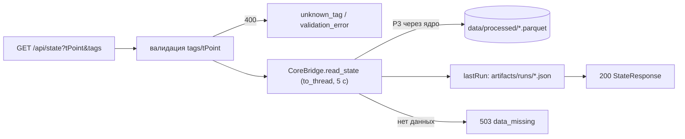

# Роуты состояния и what-if: `GET /api/state`, `POST /api/whatif`

Файл: `backend/src/app/routers/state.py`. Два «быстрых» роутера без прогона: агрегат
текущего среза процесса и синхронный расчёт «что если» на моделях в памяти (SLA < 50 мс).

> [!info] Контракт
> Структура `StateResponse` и `WhatifResponse`, лимит ≤ 8 вариантов и примеры —
> [[01-p1-rest-sse]]. Здесь — реализация, таймауты и коды ошибок backend.

## Scope

| Охват (covers) | Не охват (does NOT cover) |
| --- | --- |
| `GET /api/state`: теги среза + `DataFreshness` + последняя карточка/отказ | Сборка состояния из Parquet — ядро (агент данных, P3) |
| `POST /api/whatif`: синхронный расчёт c overrides, таймаут, 409 при занятом воркере | Логика квантилей/feasibility — ядро ([[04-agent-quality]], [[07-agent-optimization]]) |
| Ошибки 400/404/409/503 роутера | Поля DTO — [[03-quality-assessment]] и др. |
| One-slot воркер what-if ([[02-core-bridge]]) | Контролы what-if на UI — [[10-components-whatif-controls]] |

## GET /api/state — агрегат текущего среза

```python
router = APIRouter(prefix="/api", tags=["state"])

@router.get("/state")
async def get_state(
    t_point: datetime | None = None,       # ?tPoint=ISO; по умолчанию — последний срез данных
    tags: str | None = None,               # ?tags=P8,T11 — CSV-список кодов тегов
) -> StateResponse: ...
    """bridge.read_state(...) → {tPoint, tags: TagPoint[], freshness: DataFreshness[], lastRun?}."""
```

Состав ответа (поля фиксирует P1):

| Блок | Источник | Назначение в UI |
| --- | --- | --- |
| `tPoint` | срез ядра (`freshness.parquet`/телеметрия, P3) | заголовок дашборда, точка отсчёта what-if |
| `tags: TagPoint[]` | телеметрия после чистки (сентинелы → `null` + `quality_flag`) | тайм-серии и мнемосхема [[07-components-timeseries]] |
| `freshness: DataFreshness[]` | свежесть точек контроля, статусы `ok/warn/stale/missing` | светофоры ЛИМС/ПАК — [[02-data-freshness]] |
| `lastRun?: {runId, decision}` | последний файл `artifacts/runs/*.json` (decision `recommend`/`refuse`) | ссылка на последнюю карточку [[04-recommendation]] |

- `lastRun` backend собирает сам из каталога артефактов — «история прогонов — артефакты,
  не память» ([[backend/00-OVERVIEW]], правило 4); содержимое карточки по `runId` фронт добирает
  через `GET /api/runs/{id}`.
- Роутер не фильтрует и не усредняет ряды: `?tags=` передаётся ядру как есть; неизвестный
  тег → 400 `unknown_tag` (валидация по списку тегов из `datasets_manifest.json`, P3).
- Ответ синхронный (один вызов `read_state` в потоке-воркере, таймаут 5 с → 503
  `data_missing` при недоступности Parquet).



## POST /api/whatif — синхронный расчёт

```python
class WhatifVariant(BaseModel):          # зеркало контракта P1
    overrides: dict[str, float]

class WhatifRequest(BaseModel):
    t_point: datetime
    overrides: dict[str, float] = {}     # базовая линия
    variants: list[WhatifVariant]        # ≤ 8, иначе 400

@router.post("/whatif")
async def whatif(req: WhatifRequest) -> WhatifResponse:
    """Синхронный расчёт: whatif_worker.run(req) → 200 {tPoint, elapsedMs, baseline, variants[]}."""
```

Правила выполнения:

| Правило | Значение | Обоснование |
| --- | --- | --- |
| Синхронно, без SSE | 200 с готовым ответом | ползунки UI — интерактив; стрим не нужен |
| Таймаут | 2 с (`WhatifWorker.timeout_s`) | цель < 50 мс (P1); 2 с — ловим только деградацию |
| Один слот расчёта | `asyncio.Lock`, `lock.locked()` → 409 | LightGBM-инференс сериализуем; очередь из висящих POST не растим |
| ≤ 8 вариантов | 400 `too_many_variants` | лимит контракта P1 |
| Overrides — только управляемые | 400 `unmanaged_override` | та же валидация, что в [[03-runs-routes]] |
| Без записи артефактов и событий | — | оговорка P2: whatif «без событий и без записи артефактов» |

Ответ строится ядром: `elapsedMs`, `baseline` (квантили + `specRisk`) и по каждому варианту
`quality[]`, `costIndex`, `feasible`, `violations[]` — backend лишь сериализует DTO
([[01-p1-rest-sse]], пример `WhatifResponse`).

## Коды ошибок роутера

Тело ошибки — контрактное, маппинг задаёт [[01-app-config]].

| Код | HTTP | Сценарий |
| --- | --- | --- |
| `validation_error`, `unknown_tag`, `unmanaged_override`, `too_many_variants` | 400 | форма запроса/лимит 8/неуправляемый тег |
| `whatif_busy` | 409 | слот what-if занят другим расчётом |
| `run_not_found` | 404 | `lastRun` запрошен по несуществующему id (в составе state — просто absent) |
| `models_not_loaded` | 503 | модели не прогреты (whatif невозможен) |
| `data_missing` | 503 | Parquet недоступен / таймаут чтения среза |

> [!note] Почему 409, а не 429/202
> 409 «Conflict» честно описывает состояние ресурса: слот расчёта занят **прямо сейчас**;
> фронт ([[13-page-whatif]]) просто повторяет запрос через debounce ползунков.
> 202 без готового результата усложнил бы UI, 429 подразумевает rate-limit, а не занятость.

## Сравнение с прогоном

| | `POST /api/runs` | `POST /api/whatif` |
| --- | --- | --- |
| Режим | асинхронный 202 + SSE | синхронный 200 |
| Считает | 5 агентов, трейс, карточка, отказ, артефакты | только квантили/feasibility на текущих моделях |
| Пишет на диск | `artifacts/runs/`, `artifacts/timeline/` | ничего |
| Время | секунды–десятки секунд | < 50 мс (цель), таймаут 2 с |
| Отказ | штатный `refusal` в карточке | `feasible: false` + `violations[]` в варианте |

## Кэширование и идемпотентность

- `GET /api/state` — идемпотентный и **некэшируемый**: светофоры свежести меняются с новым
  замером ЛИМС ([[02-data-freshness]], автомат FreshnessStatus); на ответы
  выставляется `Cache-Control: no-store`, чтобы react-query всегда получал актуальный срез.
- `POST /api/whatif` — идемпотентен по телу: одинаковый запрос даёт одинаковый ответ
  (ядро детерминировано, seed фиксирован); кэшировать не нужно — расчёт дешевле кэша.
- Никакого серверного кэша срезов: состояние всегда читается ядром из Parquet/артефактов;
  «память backend» не является источником истины (правило 4, [[backend/00-OVERVIEW]]).
- Параллельные `GET /api/state` безопасны: каждый читает файлы в своём потоке; `whatif`
  — нет (слот), поэтому единственный mutable-ресурс роутера — `WhatifWorker.slot`.

## Пример порядка запросов фронта

```text
1. GET  /api/state                        → тёплый дашборд (светофоры + последняя карточка)
2. POST /api/runs {kind:"quality_risk", …}   → 202 {runId, eventsUrl}
3. GET  /api/runs/{runId}/events          → SSE: прогресс 5 агентов, карточка/отказ
4. POST /api/whatif {tPoint, variants}    → 200 (ползунки) | 409 → debounce → повтор
5. GET  /api/runs/{runId}/report.md       → экспорт отчёта оператором
```

Шаги 1 и 4 не требуют прогона и работают даже до первого `POST /api/runs` — при
загруженных моделях и данных; иначе 503 с кодом `models_not_loaded`/`data_missing`.

## Приёмочные критерии

1. `GET /api/state` без параметров отвечает < 100 мс и содержит все 4 блока; при пустом
   `data/processed/` → 503 `data_missing`.
2. Светофоры UI совпадают со статусами `freshness` (spot-check по `freshness.parquet`).
3. Один `POST /whatif` с 8 вариантами → 200; с 9-м вариантом в списке → 400.
4. Два одновременных `POST /whatif` → 200 + 409; после завершения первого повтор → 200.
5. `elapsedMs` в 99 % ответов < 50; при подмене таймаута 0.001 → 409/503, а не зависание.
