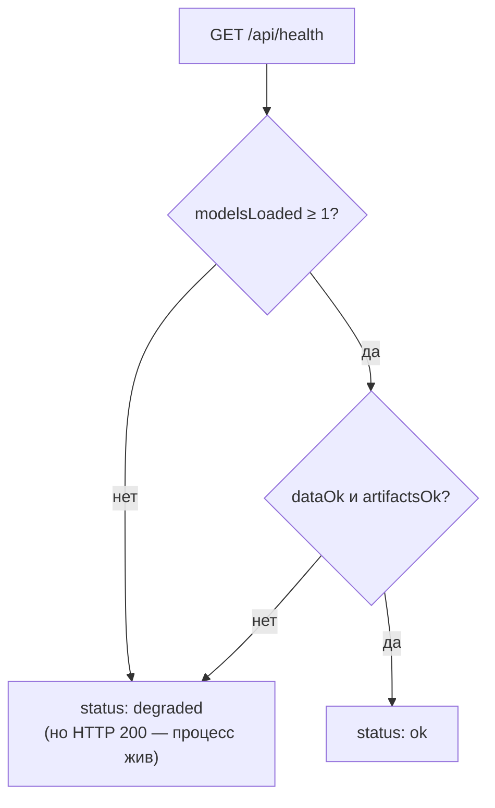

# Служебные роуты: `GET /api/models`, `GET /api/health`

Файл: `backend/src/app/routers/system.py`. Диагностика сервиса: реестр моделей для страницы
«Модели» и живость/готовность для compose-healthcheck. Самый тонкий роутер домена —
оба ответа читают состояние, ничего не вычисляют.

> [!info] Контракт
> Формы ответов фиксируют [[01-p1-rest-sse]] (`GET /api/health` →
> `{status, contract, core, modelsLoaded}`) и [[08-model-artifact]]
> (`ModelArtifact[]`). Здесь — реализация и критерии готовности.

## Scope

| Охват (covers) | Не охват (does NOT cover) |
| --- | --- |
| `GET /api/models`: список активных `ModelArtifact` из реестра (P5) | Содержимое манифестов/весов — [[09-publish-registry\|data-pipeline]] |
| `GET /api/health`: версии, модели загружены, каталоги доступны, LLM-режим | Страница «Модели» UI — [[15-page-models]] |
| Семантика `ok / degraded` для compose `service_healthy` | Dockerfile и healthcheck-команда — [[07-docker]] |
| Коды ошибок (503 при пустом реестре) | Метрики качества моделей — `metrics.json` пайплайна |

## GET /api/models — реестр артефактов

```python
router = APIRouter(prefix="/api", tags=["system"])

@router.get("/models")
async def list_models() -> list[ModelArtifact]:
    """core.list_models() → активные артефакты по каждому QualityTarget (sulfur/t95/d15/cetane)."""
```

- Источник — реестр ядра, загруженный в lifespan ([[01-app-config]]): `registry.json` +
  `manifest.json` по правилам P5 ([[05-p5-pipeline-core]]). Backend
  не читает `artifacts/models/` сам — только через `CoreService.list_models()`.
- Ответ — ровно DTO [[08-model-artifact]]: `artifactId, target,
  algorithm, quantiles, coverage, metrics (WAPE/MAE/pinball holdout), trainedOnRange,
  features, active…`. Сырых dict нет (правило 3 дизайна, [[backend/00-OVERVIEW]]).
- Ровно один `active` артефакт на `target`; если по какой-то цели артефакта нет — цель
  отсутствует в списке, а `/health` переходит в `degraded` (не ошибка 500).

## GET /api/health — живость и готовность

```python
@router.get("/health")
async def health() -> HealthResponse:
    """Диагностика: {status, contract, core, python, modelsLoaded, dataOk, artifactsOk, llmMode}."""
```

| Поле | Откуда | Что означает |
| --- | --- | --- |
| `status` | вычисляется из критериев ниже | `ok` / `degraded` (частичная готовность) |
| `contract` | `Settings`/DTO-версия P6 | версия контракта, ожидаемая фронтом (`1.0.0`) |
| `core` | `refinery_core.__version__` | версия расчётного ядра (проверка совместимости P5) |
| `modelsLoaded` | реестр ядра | число загруженных активных артефактов (цель: 4) |
| `dataOk` | наличие `data/processed/telemetry.parquet` и manifest | данные пайплайна на месте (`make data` выполнен) |
| `artifactsOk` | доступность на запись `artifacts/runs/`, `artifacts/timeline/` | ядро сможет записать артефакты (P3) |
| `llmMode` | `Settings.llm_mode` | `off/local/external` — тумблер нарратора ([[90-narrator-llm]]) |

Семантика статуса:



> [!note] 200 против 503
> `/api/health` — живость процесса для compose-хелсчека ([[07-docker]],
> [[02-docker-compose]]): процесс отвечает ⇒ HTTP 200, а готовность
> выражается полем `status`. Отсутствие моделей — **не** авария процесса (модели появляются
> после `make train`), поэтому 503 зарезервирован для пользовательских роутов
> (`POST /api/runs`, `POST /api/whatif`, `GET /api/models` — `models_not_loaded`).

## Коды ошибок

| Код | HTTP | Сценарий |
| --- | --- | --- |
| `models_not_loaded` | 503 | `GET /api/models` при пустом/несошедшемся реестре (sha256, P5) |
| `internal` | 500 | непредвиденное; детали при `debug` ([[01-app-config]]) |

Полный маппинг ошибок ядра в HTTP и форма тела ошибки — в [[01-app-config]] («Маппинг
ошибок ядра в HTTP»); этот роутер не вводит собственных кодов.

`GET /api/health` сам не бросает ошибок: любая деградация отражается в `status`, чтобы
healthcheck контейнера отличал «процесс мёртв» от «данные ещё не подготовлены».

## Примеры ответов

```json
{"status": "ok", "contract": "1.0.0", "core": "0.1.0", "python": "3.12.6",
 "modelsLoaded": 4, "dataOk": true, "artifactsOk": true, "llmMode": "off"}
```

```json
{"status": "degraded", "contract": "1.0.0", "core": "0.1.0", "python": "3.12.6",
 "modelsLoaded": 0, "dataOk": true, "artifactsOk": true, "llmMode": "off"}
```

Формат ответа `/api/models` — элементы `ModelArtifact` ([[08-model-artifact]]);
сводка по целям, которую увидит страница «Модели»:

| `target` | Что показывает UI | Ключевые поля DTO |
| --- | --- | --- |
| `sulfur` | квантили серы, риск off-spec у границы 10 мг/кг | `quantiles`, `coverage`, `metrics.wape` |
| `t95` | собственная модель T95[^t95] | `trainedOnRange`, `features` |
| `d15` | плотность (с 03.2025 — диапазон ПАК) | `trainedOnRange.start` |
| `cetane` | ЦЧ, границы 51/49 (лето/зима) | `monotoneConstraints` |

[^t95]: Формула T95 не вычислима (точка `24-2000.Pipeline`
    отсутствует) → собственная модель.

## Связь с другими доменами

| Потребитель | Что берёт | Где описано |
| --- | --- | --- |
| compose healthcheck | `/api/health`, 200 + 15 с интервал | [[07-docker]], [[02-docker-compose]] |
| frontend «Модели» | `GET /api/models` → DTO | [[15-page-models]] |
| frontend дашборд | `status`/`modelsLoaded` — зелёный/жёлтый светофор готовности | [[11-page-dashboard]] |
| реестр ядра (P5) | артефакты и проверка sha256/версий | [[05-p5-pipeline-core]] |
| фронт (P6) | сверка `contract` с версией TS-типов | [[06-p6-openapi-ts-mocks]] |

## Что проверяем на приёмке

1. `curl -f http://localhost:8000/api/health` — команда healthcheck; после `make data`
   без `make train` — `{"status":"degraded","modelsLoaded":0,…}` и контейнер healthy.
2. После `make train` — `modelsLoaded: 4`, `status: ok`; фронт
   ([[11-page-dashboard]]) показывает зелёный светофор.
3. `GET /api/models` возвращает 4 артефакта с метриками holdout из `metrics.json`;
   страница «Модели» рендерит их без доработок (данные ровно DTO).
4. `contract` в ответе совпадает с версией OpenAPI-схемы (P6) — фронт по нему решает
   совместимость TS-типов.
5. `llmMode` отражает `.env` ([[04-env-vars]]); переключение
   `off→external` без `LLM_BASE_URL` невозможно — fail-fast на старте ([[01-app-config]]).

> [!warning] Запрещено
> 1. Считать здесь метрики качества — только читать то, что вычислил пайплайн (P4/P5).
> 2. Отдавать пути файловой системы вне DTO (`model_uri` — относительный, P1).
> 3. Проверять здоровье обращением к ядру «вслепую»: только дешёвые проверки файлов и
>    счётчиков реестра — healthcheck ходит каждые 15 с.
