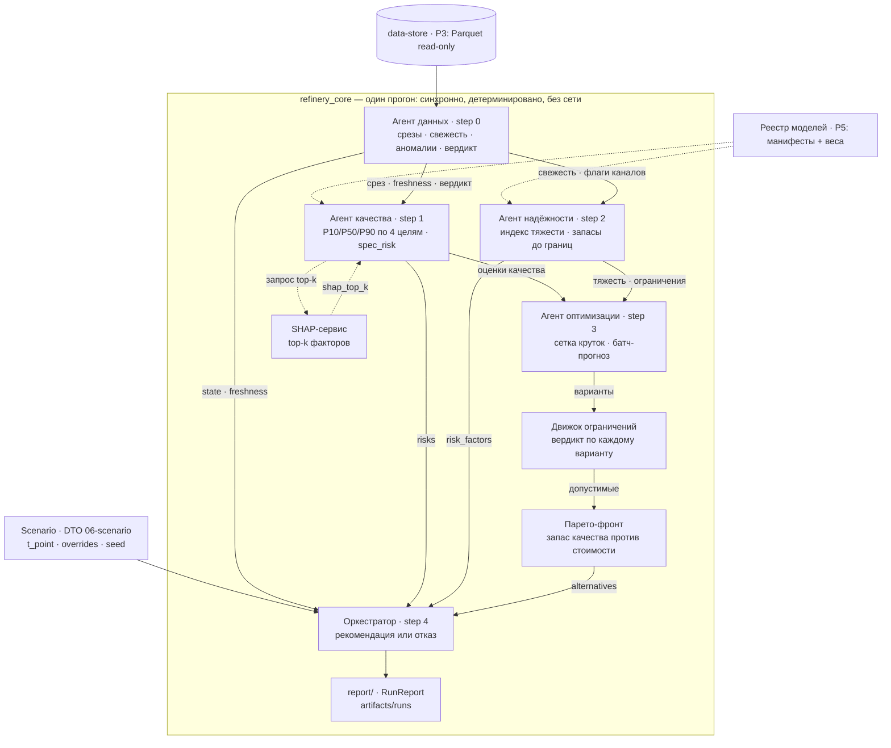

# core-architecture — детерминированное ядро мультиагентной системы

## Scope

Домен `core-architecture` — чистое Python-ядро ИИ-советника оператора: конвейер из пяти агентов,
движок жёстких ограничений, Парето-отбор, SHAP-объяснения и отчёт прогона. Каталог кода:
`core/src/refinery_core/` (`agents/`, `optimize/`, `explain/`, `report/`, `cli.py`).

**Покрывает:** агенты ролей [[01-enums|AgentRole]] (`data → quality → reliability → optimization → orchestrator`),
загрузку моделей из реестра (P5), жёсткие ограничения, отказ как штатный исход, карточку
рекомендации ([[04-recommendation]]) и `RunReport` ([[07-run-report]]).
**Не покрывает:** обучение моделей и запись датасетов (домен data-pipeline), HTTP/SSE-транспорт
(домен backend), схемы Parquet (домен data-store), UI (домен frontend), генерацию контракта (домен api).

Ядро проверяемо без сайта: канонические модели зафиксированы в pydantic.

## Назначение: конвейер агентов без HTTP

Ядро — единственный носитель логики решения. Backend его только вызывает (P2, in-process),
frontend видит результат через SSE ([[02-p2-backend-core]]). Сеть, браузер и FastAPI ядру не нужны:
проверяемость — через CLI и `make demo`.

Ядро детерминированное, работает без интернета; LLM — опциональный «нарратор» на
медленном контуре (формулировка текста), архитектурно некритичен. Это ровно то, как строят
промышленные системы Honeywell/Emerson/Yokogawa и Газпром нефть (ЦУП Омского НПЗ).

Один прогон ядра закрывает все 8 шагов логики одного цикла принятия решения:

| Шаг цикла | Кто выполняет в ядре | Документ |
| --- | --- | --- |
| 1. Получить актуальное состояние | агент данных (step 0) | [[03-agent-data]] |
| 2. Проверить полноту, актуальность и согласованность данных | агент данных: свежесть + аномалии + вердикт | [[03-agent-data]] |
| 3. Оценить текущее/прогнозное качество и риск off-spec | агент качества (step 1) | [[04-agent-quality]] |
| 4. Оценить тяжесть режима / риск для оборудования | агент надёжности (step 2) | [[05-agent-reliability]] |
| 5–6. Сформировать варианты и отбросить нарушающие ограничения | агент оптимизации + движок ограничений | [[07-agent-optimization]], [[06-constraints-engine]] |
| 7. Сравнить оставшиеся варианты | Парето-фронт | [[08-pareto-front]] |
| 8. Выбрать рекомендацию, объяснить — или отказаться | оркестратор (step 4) | [[09-agent-orchestrator]], [[10-refusal]] |## Слоистая архитектура

Слои снизу вверх: базовый класс агента → конкретные агенты → оркестратор → отчёт;
сбоку — общие сервисы (ограничения, Парето, SHAP, реестр), без которых агенты не работают.

```text
┌ cli.py · scenarios ──────────── вход: демо/прогоны, без сети ────────────────┐
│ orchestrator ── data → quality → reliability → optimization                  │
│      │              каждый агент: ctx → AgentStep (трейс)                    │
│      ├── constraints engine ── жёсткие ограничения (вердикт по варианту)     │
│      ├── pareto ── запас качества ↔ стоимость (присадка ×100)                │
│      ├── explain/shap ── top-k факторов (только чтение моделей)              │
│      └── report ── RunReport → artifacts/runs (P3)                           │
│ registry.py ── загрузка моделей из artifacts/models (P5), обучение запрещено │
└narrator (90, опц.) ── только текст поверх фактов, тумблер off/local/external─┘
```

Слои не перескакивают: `cli.py` не вызывает агентов
мимо оркестратора, агенты не пишут файлы отчёта напрямую.

## Поток данных агентов



Контракт каждого шага фиксируется в трейсе [[05-agent-step]]:

| step_idx | Роль [[01-enums|AgentRole]] | Главный выход в трейс | Контракт типов |
| --- | --- | --- | --- |
| 0 | `data` | срез состояния, `DataFreshness[]`, аномалии каналов, вердикт достаточности | [[01-timeseries]], [[02-data-freshness]] |
| 1 | `quality` | `QualityAssessment[]`: квантили, `spec_risk`, `shap_top_k` | [[03-quality-assessment]] |
| 2 | `reliability` | индекс тяжести, запасы до p2/p98, флаги выхода из области обучения | поля внутри `output` шага |
| 3 | `optimization` | допустимые варианты круток с метриками, отсортированный Парето-фронт | элементы `alternatives` из [[04-recommendation]] |
| 4 | `orchestrator` | карточка [[04-recommendation]] **или** `refusal` с [[01-enums|RefusalReason]] | [[04-recommendation]] |

## Индекс документов

Нумерация = порядок реализации (всего 17 документов).

| № | Файл | О чём | Контракты |
| --- | --- | --- | --- |
| 1 | `00-OVERVIEW.md` | этот документ: слои, правила, индекс | — |
| 2 | [[01-agents-base]] | `agents/base.py`: протокол агента, трейс, ошибки | [[05-agent-step]], [[01-enums|AgentRole]] |
| 3 | [[02-model-registry]] | `registry.py`: загрузка моделей по P5, sha256, fallback | [[08-model-artifact]] |
| 4 | [[03-agent-data]] | агент данных: срезы, свежесть, аномалии, достаточность | [[01-timeseries]], [[02-data-freshness]] |
| 5 | [[04-agent-quality]] | агент качества: квантили, приоритет источников, SHAP | [[03-quality-assessment]] |
| 6 | [[05-agent-reliability]] | агент надёжности: индекс тяжести, p2/p98, катализатор | — |
| 7 | [[06-constraints-engine]] | движок жёстких ограничений: проверки и вердикты | [[04-recommendation]], [[01-enums|QualityFlag]] |
| 8 | [[07-agent-optimization]] | сетка/поиск круток: P8/T11/F19, АВТ, блендинг | [[06-scenario]] |
| 9 | [[08-pareto-front]] | недоминируемые варианты «запас ↔ стоимость» | [[04-recommendation]] |
| 10 | [[09-agent-orchestrator]] | конвейер, решение «рекомендовать / отказаться» | [[04-recommendation]], [[02-p2-backend-core]] |
| 11 | [[10-refusal]] | отказ как первоклассный ответ, причины [[01-enums|RefusalReason]] | правила безопасности и отказа |
| 12 | [[11-explain-shap]] | `explain/shap_service.py`: top-k факторов | [[03-quality-assessment]] |
| 13 | [[12-run-report]] | `report/`: RunReport, JSON + Markdown | [[07-run-report]] |
| 14 | [[13-scenarios]] | 5 пресетов `ScenarioKind` (включая гарантированный отказ) | [[06-scenario]] |
| 15 | [[14-cli]] | `cli.py`: команды demo/run, консольный вывод | — |
| 16 | [[15-tests]] | `core/tests/`: границы, отказ, детерминизм, Парето | — |
| 17 | [[90-narrator-llm]] | опциональный нарратор поверх фактов, тумблер LLM | детерминизм текста, closed-loop LLM |

## Правила дизайна ядра

> [!warning] Шесть правил дизайна ядра (дословно)
> 1. «Агент — чистая функция контекста: вход → `AgentStep`; без глобального состояния и без сети.»
> 2. «Ядро не знает про HTTP/React/backend: никаких импортов `fastapi`; события наружу — через очередь (P2).»
> 3. «В рантайме ядро только загружает модели из реестра (P5) — никогда не обучает.»
> 4. «Безопасность важнее экономики: конфликт целей разрешается в пользу ограничений; отказ — штатный результат, не исключение.»
> 5. «Все числа в карточке — из расчёта; нарратор (90) формулирует текст, но не порождает значений.»
> 6. «Детерминизм: каждая случайность фиксируется seed'ом и попадает в `RunReport`.»

Дополнение о трассируемости: каждое число карточки имеет ссылку-происхождение — `number_refs`
внутри [[05-agent-step]] (`{path, value, unit, label}`, JSON-path внутри `output` шага) —
по цепочке «данные → агент → карточка» любой результат проверяется в `artifacts/runs/`.

## Кросс-доменные зависимости

| Протокол | Пара | Что ядро делает | Документ |
| --- | --- | --- | --- |
| P2 | backend ↔ core | in-process вызов оркестратора; события агентов в очередь | [[02-p2-backend-core]] |
| P3 | core ↔ data-store | чтение `data/processed/*.parquet` (read-only); запись `artifacts/runs/` | [[03-p3-core-datastore]] |
| P5 | data-pipeline → core | загрузка активных артефактов [[08-model-artifact]] | [[05-p5-pipeline-core]], [[02-model-registry]] |
| P6 | api ↔ core | pydantic-модели ядра — источник контракта | [[01-timeseries]]…[[08-model-artifact]] |

> [!example] Проверка правил на границах
> `core-architecture` не импортирует backend/frontend и не знает про HTTP/React.
> Реестр пуст или хэш не сошёлся — прогон не стартует
> ([[02-model-registry]]): ядро не «чинит» себя переобучением и не молчит.

[^1]: Правила дизайна core-architecture, warning-блок.
[^2]: Детерминированность ядра: работа без интернета, LLM — опциональный нарратор.
[^3]: Протокол P2: сеть не используется, события агентов — `asyncio.Queue`.
