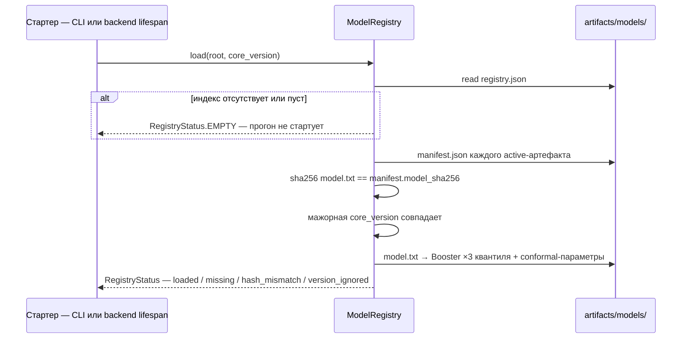

# 02 — Реестр моделей (`registry.py`)

## Scope

Документ описывает загрузку обученных моделей в память ядра при старте: чтение индекса
`registry.json`, выбор активного артефакта [[08-model-artifact]] на каждую цель [[01-enums|QualityTarget]],
sha256-проверку весов, проверку совместимости версий и fallback-поведение при проблемах.

**Покрывает:** `registry.py` — чтение `artifacts/models/`, прогрев моделей в память, ошибки
отсутствия/несовпадения версий, правило «ядро не обучает в рантайме».
**Не покрывает:** обучение и запись артефактов (домен data-pipeline, [[09-publish-registry]]-аналог
`data-pipeline/09`), формат признаков, рантайм-инференс ([[04-agent-quality]]).

> [!quote] Правило рантайма (P5)
> «Ядро **никогда не обучает в рантайме** — только загружает».

> [!quote] Правило реестра
> «В рантайме ядро только загружает модели из реестра (P5) — никогда не обучает.»

## Что лежит в реестре

```text
artifacts/models/
  registry.json                     # индекс: [{artifact_id, target, active, created_at}]
  sulfur-lgbm-a1b2c3d4/
    manifest.json                   # каноническая форма [[08-model-artifact]]: quantiles, conformal,
                                    # coverage, metrics, trained_on_range, features, core_version,
                                    # sha256 весов и хэши обучающих данных (data_hashes)
    model.txt                       # LightGBM: 3 квантильные модели (P10/P50/P90)
  t95-lgbm-…/ · d15-lgbm-…/ · cetane-lgbm-…/     # по одному каталогу на цель QualityTarget
  anomaly/                          # пороги Hampel + PCA T²/SPE из data-pipeline (фит офлайн)
```

Писатель — data-pipeline (P4/P5, «сторона производителя»); ядро — только читатель.
Ровно один артефакт помечен `active=true` на каждый [[01-enums|QualityTarget]].

## Алгоритм загрузки

```python
class ModelRegistry:
    def __init__(self, root: Path, core_version: str) -> None: ...

    def load(self) -> RegistryStatus:
        # 1. registry.json отсутствует / не парсится → RegistryStatus.EMPTY (фатально)
        # 2. для каждого QualityTarget выбрать артефакт с active=true;
        #    нет активного → цель помечается missing
        # 3. manifest.json → ModelArtifact; мажорная core_version != текущей → артефакт игнорируется
        # 4. sha256(model.txt) != manifest.model_sha256 → цель помечается hash_mismatch
        # 5. прогрев: LightGBM Booster ×3 квантиля + conformal-параметры — в память процесса

    def get(self, target: QualityTarget) -> LoadedModel:
        """Загруженная модель: booster, conformal-параметры, trained_on_range, feature list."""

    def anomaly_params(self) -> AnomalyParams:
        """Пороги Hampel/PCA для скоринга среза ([[03-agent-data]]); фит делается только офлайн."""

    def status(self) -> RegistryStatus:
        """Сводка по целям: loaded | missing | hash_mismatch | version_ignored — для /health."""
```

Загрузка выполняется **один раз до старта конвейера** (в backend — на lifespan-прогреве,
[[02-core-bridge]]-аналог `backend/02`; в CLI — до первого сценария), а не на каждом прогоне:
what-if обязан отвечать быстрее 50 мс.

## Проверки и реакции

| Условие | Реакция реестра | Что видит пользователь |
| --- | --- | --- |
| `registry.json` отсутствует или пуст | `EMPTY`: прогон не стартует | CLI — диагноз с путём; backend → `503 models_not_loaded` |
| Нет `active=true` для цели | цель `missing`: прогон не стартует | то же, с перечнем целей |
| sha256 `model.txt` не сошёлся | цель `hash_mismatch`: прогон не стартует | «артефакт повреждён: …» |
| Мажорная `core_version` артефакта ≠ текущей | артефакт **игнорируется** (не грузится) | предупреждение; при отсутствии замены — 503 |
| Минорное расхождение версии | предупреждение в лог, артефакт грузится | ничего |
| `anomaly/` отсутствует | срез считается без аномалий-скоринга, в вердикте [[03-agent-data]] пометка `degraded` | warning в трейсе |

> [!quote] Контракт загрузки (P5)
> «Загрузка: `ModelRegistry.load(Path("artifacts/models"))` — читает `registry.json`, берёт
> `active`-артефакт на каждый `QualityTarget`, проверяет sha256 `model.txt`, поднимает модели
> в память. Нет `active` или хэш не сошёлся ⇒ `models_not_loaded` (backend → 503); расхождение
> мажорной `core_version` ⇒ артефакт игнорируется.»

## Загрузка по шагам



## Конфигурация и наблюдаемость

| Параметр | Откуда | Поведение при отсутствии/ошибке |
| --- | --- | --- |
| `MODEL_REGISTRY_DIR` | `CoreSettings` / `.env` (дефолт `artifacts/models`) | каталога нет → `EMPTY`, диагноз с путём |
| `core_version` | версия пакета `refinery_core` | сравнение мажорной части с `core_version` артефакта |
| правило совместимости | конфиг | минорное расхождение — warning; мажорное — артефакт игнорируется |

`RegistryStatus` — машиночитаемая сводка: `artifact_id`, цель, статус, причина. Её читают
`GET /health` backend ([[06-models-health]]-аналог `backend/06`) и CLI перед `make demo`,
чтобы сбой реестра был виден за секунды, а не на первом отказе агента качества.

## Fallback-поведение: никаких тихих подмен

1. **Не подхватываем неактивные артефакты.** Если активный артефакт бит — реестр не молча
   переключается на предыдущую версию: выбор «что считать активным» — решение производителя
   моделей (data-pipeline) через `registry.json`, а не ядра.
2. **Не переобучаем на месте.** Отсутствие модели — это статус, а не повод для обучения:
   обучение живёт в data-pipeline (`make train`), результат публикуется по P5.
3. **Частичная деградация не маскируется.** Если грузится 3 цели из 4, прогон не стартует с
   точным перечнем недостающего — спросить «какая именно цель не готова» должно быть легко.
4. **Диагностика дешевле угадывания.** `status()` exposes причины по каждой цели; `/health`
   backend ([[06-models-health]]-аналог `backend/06`) отдаёт сводку, а не булев флаг.

## Использование загруженного

| Потребитель ядра | Что берёт из артефакта |
| --- | --- |
| [[04-agent-quality]] | booster-инференс P10/P50/P90; conformal-параметры → ширина интервала; `model_artifact_id` в [[03-quality-assessment]] |
| [[05-agent-reliability]] | `trained_on_range` — признак «состояние вне области обучения» → кандидат отказа `out_of_training_domain` ([[10-refusal]]) |
| [[11-explain-shap]] | feature list и booster для TreeExplainer (только чтение) |
| [[12-run-report]] | `data_hashes` артефакта и версии — в `versions` / `data_hashes` отчёта [[07-run-report]] |

## Приёмочные проверки (для [[15-tests]])

1. Битый sha256 → `load()` возвращает `hash_mismatch`, `get()` бросает `RegistryNotReady`;
   CLI завершается с объяснением, конвейер не запускается.
2. Два активных артефакта на одну цель — ошибка формата `registry.json` (не молчаливый выбор).
3. После `load()` ни один метод ядра не пишет в `artifacts/models/` (право записи — только P4/P5).

[^1]: Форма артефакта: ровно одна запись `active=true` на target.
[^2]: P5: `registry.py` загружает обученные модели/конформ-параметры по манифесту; ядро никогда не обучает в рантайме.
[^3]: [[06-artifacts-catalog]] (домен data-store) — физический каталог `artifacts/models/`.
