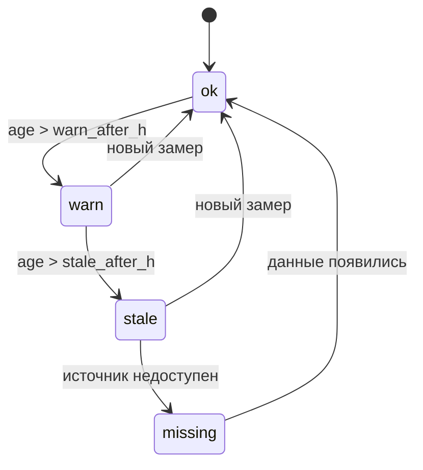

# 03 — Агент данных (роль `data`, step 0)

## Scope

Первый агент конвейера: собирает срез состояния процесса на `t_point`, оценивает свежесть
лабораторных/аналитических точек, прогоняет срез через детектор аномалий и выносит вердикт
«достаточность данных» — вход решения об отказе.

**Покрывает:** сборку состояния из Parquet read-only (P3); `DataFreshness` [[02-data-freshness]]
с анти-утечкой ЛИМС; скоринг аномалий по порогам из артефактов; вердикт достаточности.
**Не покрывает:** инжест/чистку/синхронизацию (домен data-pipeline: `data-pipeline/03-sync-freshness`),
фит параметров аномалий (`data-pipeline/04-anomaly-params`), решение об отказе
(оркестратор, [[10-refusal]]); поля DTO — только [[01-timeseries]] и [[02-data-freshness]].

> [!quote] Правило свежести
> «**Храните возраст анализа.** Важно знать не только последнее доступное значение ЛИМС/ПАК,
> но и сколько времени прошло с момента измерения.»

## Входы и выходы

| | Состав |
| --- | --- |
| Вход | `Scenario.t_point` [[06-scenario]]; реестр ([[02-model-registry]]) — параметры аномалий; `data/processed/*.parquet` через P3 (Polars `scan_parquet`, lazy, read-only) |
| Выход в `output` шага | срезы ключевых тегов; `freshness[]` [[02-data-freshness]]; сводка аномалий каналов с `quality_flag` [[01-enums|QualityFlag]]; вердикт `data_sufficiency` |
| Потребители | агент качества ([[04-agent-quality]]), агент надёжности ([[05-agent-reliability]]), оркестратор ([[09-agent-orchestrator]]) |

## Срез состояния

Срез — значения ключевых каналов в окне перед `t_point` (телеметрия 24-2000 и АВТ:
синхронная 10-минутная сетка, 189 217 точек с 2023-01-01 по 2026-08-07). Агент берёт уже
очищенные данные: сентинелы {307, 251, 252, 240} замаскированы пайплайном.

> [!quote] Правило сентинелов
> Сентинелы «не существуют за пределами data-pipeline: → `null` + `quality_flag`».

> [!info] Что агент видит в quality_flag
> `ok / sentinel / stuck / outlier / missing` [[01-enums|QualityFlag]]. Мёртвые и залипшие каналы известны
> из истории данных и не используются как опорные: D10 — «99.99 % сентинелов (мёртвый тег)»;
> залипания после чистки — T18, W4/W10, F17/F22/F25 (24-2000), F5/F26/P52/F57 (АВТ).

Псевдокод сборки:

```python
def collect_state(ctx: RunContext) -> Slices:
    # 1. окно = [t_point − WINDOW_H, t_point]; WINDOW_H — конфиг (порядка суток)
    # 2. срез управляемых и ключевых тегов: последнее валидное значение + среднее по окну
    # 3. долю сентинелов/залипаний канала в окне — в сводку аномалий
    # 4. Любое чтение — только data/processed/ (рантайм read-only, P3 [[03-p3-core-datastore]])
```

## Свежесть: [[02-data-freshness]]

Анти-утечка — жёсткое правило синхронизации: метка ЛИМС = момент отбора пробы, результат
доступен системе не раньше, чем через 4 часа.

> [!quote] Правило задержки публикации ЛИМС
> «**ЛИМС**: метка времени = **момент отбора пробы**; до публикации результата проходит
> **до 4 часов** (транспортировка + анализ). При исторической валидации результат ЛИМС доступен
> системе только через ≤ 4 ч после метки — иначе утечка будущего.»

Пороги статусов берутся из снимка `freshness.parquet` (пишет data-pipeline); дефолты канона —
`warn_after_h = 28.0`, `stale_after_h = 52.0` (ритм ЛИМС 24 ч + публикация 4 ч; stale —
кандидат на отказ). Для цетанового числа (замеры раз в ~29 суток)
пороги свои — задаются по точке, а не глобально.

```python
def evaluate_freshness(point: FreshnessPoint, t_point: datetime) -> DataFreshness:
    if point.last_sample_ts is None:
        return status_missing()                                  # данных нет вовсе
    available_ts = point.last_sample_ts + point.publication_delay  # ЛИМС: ≤ 4 ч
    if available_ts > t_point:
        return status_missing()                                  # анти-утечка: результата ещё нет
    age_hours = (t_point − point.last_sample_ts) / 1h            # возраст от отбора пробы
    return stale if age_hours > stale_after_h else warn if age_hours > warn_after_h else ok
```

Машина статусов [[01-enums|FreshnessStatus]] (переоценка на каждом `t_point`; возврат — только новый замер):



## Точки контроля и пороги

Пороги задаются по точке (из снимка `freshness.parquet`), а не глобально — у цетана ритм
лаборатории совсем другой, чем у серы:

| point_id | Источник [[01-enums|DataSource]] | Ритм замеров | warn/stale, ч | Роль |
| --- | --- | --- | --- | --- |
| `hdu_product_sulfur` | `lims` | ~24 ч | 28 / 52 (дефолт) | ключевая: контрольный факт серы ГО |
| `pak_hdu_sulfur` | `pak` | 10 мин | 28 / 52 | оперативный уровень/тренд серы |
| `hdu_product_d15` | `pak` | 10 мин (с 05.03.2025) | 28 / 52 | плотность ДТ с гидроочистки |
| `blend_product_cn` | `lims` | ~29 суток | отдельные (конфиг) | ЦЧ товарного — самый «медленный» контроль |

## Аномалии среза

Детектор — Hampel + PCA (T²/SPE), **фит выполнен офлайн** data-pipeline на чистой истории,
в `artifacts/models/anomaly/` лежат пороги; агент делает только скоринг среза и не переобучается
(см. [[02-model-registry]]).

```python
def score_slice(slices: Slices, params: AnomalyParams) -> AnomalyReport:
    # для каждого ключевого канала: Hampel-флаг по окну; PCA T²/SPE против порогов из params
    # итог: quality_flag [[01-enums|QualityFlag]] по каналу + счётчики точек-аномалий в окне
```

Результат включает известные системные находки (мёртвые/залипшие каналы) как постоянные
факторы, а не разовые события: они фигурируют в `notes` шага и в карточке (блок «Проблема/риск»).

## Вердикт «достаточность данных»

Агент не отказывает сам — он классифицирует данные, решение за оркестратором ([[10-refusal]]):

| Вердикт | Условия | Следствие для оркестратора |
| --- | --- | --- |
| `ok` | ключевые точки [[01-enums|FreshnessStatus]] = `ok`/`warn`; опорные каналы чисты | прогон продолжается без ограничений |
| `degraded` | `warn` по ключевым точкам; аномалии части каналов; нет параметров аномалий | прогон продолжается; предупреждения в карточку (блок «Уверенность») |
| `insufficient` | `stale`/`missing` ключевой точки ЛИМС; мертвы опорные каналы; срез не собрался | кандидат отказа: `stale_lims` и/или `sensor_fault` |

```python
def data_sufficiency(freshness: list[DataFreshness], anomalies: AnomalyReport) -> Verdict:
    # insufficient: ключевая точка (сера ГО, товарное ЦЧ) stale/missing ИЛИ опорные каналы не ok
    # degraded:     любые warn / частичные аномалии / скоринг недоступен
    # ok:           иначе
```

Ключевые точки контроля: сера на выходе гидроочистки (ЛИМС «Гидроочистка, отбор 2», ритм
~24 ч: «медианный интервал между замерами: **24.0 ч**»), ПАК-сера (10 мин), D15 (ПАК только
с 05.03.2025), цетановое число (ЛИМС, «всего 42 замера, интервал ~29 суток»).

## Приёмочные проверки (для [[15-tests]])

1. `available_ts > t_point` ⇒ статус `missing`: ни одно значение ЛИМС не появляется раньше
   «отбор + 4 ч» (анти-утечка).
2. Возраст 27 ч → `warn`, 45 ч → `stale` (дефолтные пороги), без данных → `missing`.
3. Vердикт `insufficient` собирает причины в `number_refs`/`notes` — объяснимость отказа
   («нехватка данных» — блок карточки «Проблема / риск»).

[^1]: По истории данных главный факт вместо пропусков — коды «недостоверного значения» (сентинелы): 307, 251, 252, 240.
[^2]: Дефолты свежести: `warn_after_h` / `stale_after_h` = 28.0 / 52.0; warn — ритм ЛИМС 24 ч + публикация 4 ч; stale — кандидат на отказ.
[^3]: По истории данных точка CetaneNumber: 54.3, min 50, max 57.8 (всего 42 замера, интервал ~29 суток).
