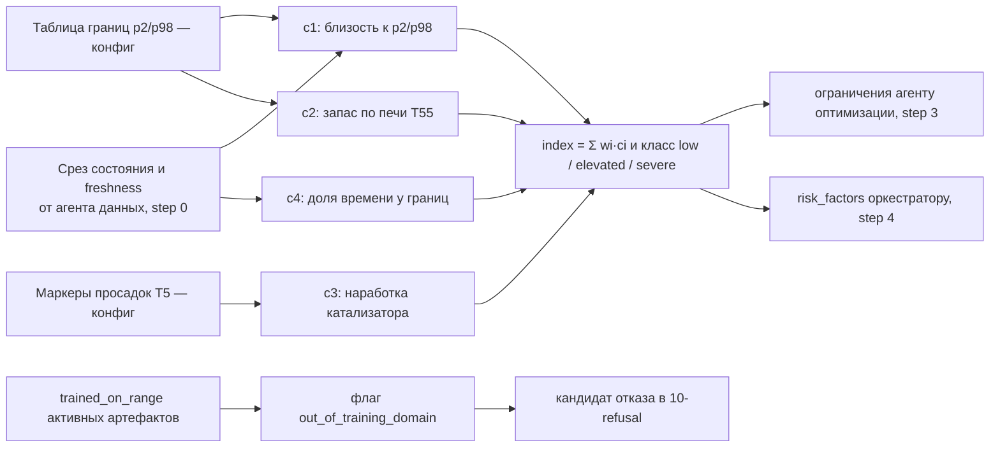

# 05 — Агент надёжности (роль `reliability`, step 2)

## Scope

Третий агент конвейера: сводит режим работы установки к индексу тяжести и факторам риска —
близость управляемых переменных к модельным границам p2/p98, запас по температуре печи,
наработка катализатора, доля времени у границ.

**Покрывает:** индекс тяжести 0..1 и его компоненты; классы риска; вход для отказа
«выход из области обучения» ([[10-refusal]] → `out_of_training_domain`).
**Не покрывает:** прогноз качества ([[04-agent-quality]]); спецификационные ограничения
([[06-constraints-engine]]); ранжирование вариантов ([[08-pareto-front]]); обучение детекторов
аномалий (data-pipeline, `04-anomaly-params`).

> [!quote] Состав агента надёжности
> «*Агент надёжности* — индекс тяжести режима: близость к p2/p98-границам, запас по печи,
> признак наработки катализатора, доля времени у границ.»

> [!quote] Роль агента надёжности
> «Оценивает тяжесть режима и риск для оборудования/катализатора по доступным признакам.
> При отсутствии прямой разметки допускаются прокси-метрики с явным описанием допущений.»

## Модельные границы: p2/p98 и рабочие зоны

Границы берутся из истории без сентинелов; значения — не паспортные
пределы оборудования, а модельное допущение (см. [[06-constraints-engine]]).

| Переменная | p2 | p98 | Рабочая зона p10–p90 |
| --- | --- | --- | --- |
| P8 (гидроочистка) | 0.008 | 0.229 | 0.12–0.21 |
| T11 (гидроочистка) | 11.0 | 381.6 | 350.0–375.5 |
| F19 (гидроочистка) | −0.08 | 251.1 | 162.0–243.3 |
| T5 (кандидат «температура реактора») | 10.5 | 386.9 | 354.0–381.4 |
| F26 (расход сырья объёмный) | −0.15 | 300.2 | 190.0–292.1 |
| F65 (производительность К-2), т/ч | 42.9 | 1181.3 | 790–1073 |
| T55 (выход печи П-3), °C | 20.4 | 385.7 | 378.4–384.3 |
| P22 (давление верха К-2), МПа | 0.358 | 1.205 | 1.08–1.18 |
| W70 (массовый расход фр. 290–350), т/ч | 0.48 | 123.0 | 82.4–114.3 |

> [!quote] Примечания к границам
> «(1) p2/p98 захватывают аварийные/пусковые режимы — как «паспортные» пределы их выдавать
> нельзя; помечать как модельные допущения. (2) T55 в работе зажата
> в 378–386 °C — запас по температуре печи почти отсутствует.»

> [!quote] Рабочие диапазоны
> «**Рабочие диапазоны (p2/p98 без сентинелов)** — основа модельных ограничений: T5 354–381 °C,
> F19 162–243, F65 790–1073 т/ч, T55 378–384 °C (запаса по печи почти нет), P22 1.08–1.18 МПа.»

## Компоненты индекса тяжести

```python
def severity_index(slices: Slices, bounds: BoundsTable, cfg: ReliabilityConfig) -> ReliabilityReport:
    # component 1 — boundary_proximity:
    #   util(v) = (x − p2) / (p98 − p2)                      # позиция в модельном диапазоне, 0..1
    #   близость края = 1 − min(dist_to_p2, dist_to_p98) / EDGE_BAND   # EDGE_BAND — доля диапазона
    # component 2 — furnace_margin:
    #   запас вверх по печи = (верх рабочей зоны T55 − T55_тек) / ширина зоны
    #   вклад = 1 − clamp(запас, 0, 1)                       # у верхней границы ⇒ вклад ≈ 1
    # component 3 — catalyst_age:
    #   дни с последней «просадки» T5 (маркеры: апрель 2024, май 2026) / горизонт нормировки
    # component 4 — time_at_edge:
    #   доля точек окна с util вне [0.05, 0.95]
    # index = clamp(w1·c1 + w2·c2 + w3·c3 + w4·c4, 0, 1)     # веса — конфиг, фиксируются в отчёте
```

Компоненты и веса (`w1..w4`, `EDGE_BAND`, маркеры просадок) — часть `CoreSettings`; их значения
попадают в [[07-run-report]], поэтому индекс воспроизводим и проверяем оператором.

### Запас по печи T55

Ключевой «человеческий» сигнал агента: рабочая зона T55 — 378.4–384.3 °C (p90 = 384.3),
то есть поднять температуру печи почти некуда. Любой вариант оптимизации, требующий роста T55,
агент помечает как тяжёлый режим и передаёт ограничение оптимизатору.

### Наработка катализатора

> [!quote] Признаки наработки катализатора
> «Признаки: … возраст с последних «просадок» T5 в апреле 2024 / мае 2026».

Проксиметрика `cat_age_days` (дни с последней из зафиксированных просадок) входит и в признаки
моделей (data-pipeline, `05-features`), и в индекс тяжести: стареющий катализатор ⇒ тот же
прогноз качества достигается большей температурой ⇒ режим тяжелее при том же качестве.

## Классы риска и выходы

| Класс | index | Действие агента |
| --- | --- | --- |
| `low` | < 0.33 | без ограничений; фиксируется в трейсе |
| `elevated` | 0.33–0.66 | предупреждение в карточку («тяжесть режима»); факторы в `risk_factors` |
| `severe` | ≥ 0.66 | ограничение оптимизатору (например, «не поднимать T55»); вклад в объяснение отказа |

Выходы агента (в `output` шага [[05-agent-step]]):

- `severity_index`, класс, четыре компонента с единицами и `number_refs`;
- `risk_factors[]` — читаемые причины («T55 в 0.4 % от верхней границы печной зоны»);
- `out_of_training_domain: bool` — `t_point` вне `trained_on_range` активного артефакта
  [[08-model-artifact]] или значения управляемых вне p2/p98 ⇒ кандидат отказа `out_of_training_domain`
  (решение — [[10-refusal]]/[[09-agent-orchestrator]]).

## Поток данных внутри агента



## Конфигурация агента

Константы — часть `CoreSettings` и в полном составе попадают в [[07-run-report]] (правило
детерминизма ядра). Значения ниже — стартовая фиксация конфига, а не вывод из данных:

| Константа | Смысл | Стартовое значение |
| --- | --- | --- |
| `w1..w4` | веса компонентов индекса | 0.40 / 0.25 / 0.20 / 0.15 |
| `EDGE_BAND` | полоса у края диапазона для «близости к краю» | 5 % ширины p2–p98 |
| `CLASS_THRESHOLDS` | пороги классов low/elevated/severe | 0.33 / 0.66 |
| `CATALYST_MARKS` | маркеры просадок T5 (апрель 2024, май 2026) | `2024-04`, `2026-05` |
| `CAT_HORIZON_DAYS` | нормировка наработки катализатора | 730 дней |

## Допущения (явные, для карточки)

1. Прямой разметки тяжести режима нет — только прокси (цитата выше).
2. p2/p98 включают пуски/остановы: как пределы их выдавать нельзя — помечать как модельные
   допущения.
3. Маркеры просадок катализатора (2024-04, 2026-05) заданы конфигом, а не выводятся рантаймом.
4. Роли управляющих тегов спорны: «P8 ведёт себя как давление (0.01–0.24), T11 — как температура
   (343–380), F19 — как расход (162–243)» — границы считаются по
   фактическому поведению каналов, выбранная интерпретация документируется ([[06-constraints-engine]]).

## Приёмочные проверки (для [[15-tests]])

1. Значение у границы p98 даёт компонент 1 ≈ 1; в середине зоны ≈ 0 (детерминированно).
2. `index` ∈ [0, 1] при любых входах; веса и пороги читаются из конфига и попадают в отчёт.
3. `out_of_training_domain=true` при `t_point` вне `trained_on_range` — без исключений, штатный флаг.

[^1]: Критерий «Надёжность»: осмысленная оценка тяжести режима/риска и корректные допущения при неполной разметке.
[^2]: По истории данных T55 (выход печи П-3): медиана 368.0, p90 384.3, max 386.2 — рабочая зона очень узкая.
[^3]: Состав агента: индекс тяжести режима; запасы до p2/p98-границ (T5 354–381 °C и др.); наработка катализатора.
