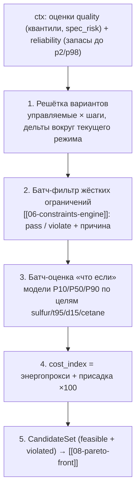

# 07 — Агент оптимизации (`agents/optimization.py`)

Четвёртый шаг конвейера [[09-agent-orchestrator]]: роль `optimization` (enum B.1 в [[01-enums]]),
`step_idx = 3`. Агент — чистая функция контекста ([[01-agents-base]]): на входе `RunContext` с
оценками [[04-agent-quality]] и [[05-agent-reliability]], на выходе `AgentStep` (форма — [[05-agent-step]])
с набором кандидатных круток. Финальное ранжирование — не здесь: Парето-фронт строит [[08-pareto-front]],
решение «рекомендовать / отказаться» принимает [[09-agent-orchestrator]].

## Scope

| | |
| --- | --- |
| **Содержит (covers)** | генерация вариантов круток сеткой по управляемым переменным (P8/T11/F19 + АВТ + доли блендинга + присадка); батч-фильтрация через движок жёстких ограничений [[06-constraints-engine]]; батч-оценка эффекта моделью «что если» (квантили P10/P50/P90); расчёт `cost_index` (энергопрокси + присадка ×100); передача `CandidateSet` в [[08-pareto-front]]; трейс шага и `number_refs` |
| **НЕ содержит (does NOT cover)** | Парето-ранжирование и выбор точки ([[08-pareto-front]]); правило решения и сборку карточки ([[09-agent-orchestrator]], [[10-refusal]]); формулировки правил ограничений ([[06-constraints-engine]]); обучение моделей в рантайме (P5-граница, [[02-model-registry]]) |

## Управляемые переменные

Подтверждённый набор управляемых переменных:

| Участок | Переменная | Тег / имя | Диапазон сетки |
| --- | --- | --- | --- |
| Гидроочистка 24-2000 | температура ГСС на входе реактора Р-202 | `24-2000.P8` | p2–p98 истории, сетка вокруг текущего |
| Гидроочистка 24-2000 | расход сырья на установку (массовый) | `24-2000.T11` | p2–p98, сетка вокруг текущего |
| Гидроочистка 24-2000 | давление на входе реактора Р-202 | `24-2000.F19` | p2–p98, сетка вокруг текущего |
| АВТ | расход нефти | `crude_feed_rate_tph` | p2–p98 (прокси F65 790–1073 т/ч[^p2p98]) |
| АВТ | температура выхода печи | `avt_furnace_outlet_temp_c` | p2–p98 (T55 378–384 °C — «запаса по печи почти нет») |
| АВТ | давление колонны | `avt_column_pressure_mpa_abs` | p2–p98 (прокси P22 1.08–1.18 МПа) |
| Блендинг | доли компонентов: очищенный ДТ / керосин / газойль | `blend_share_diesel` / `blend_share_kerosene` / `blend_share_gasoil` | сумма = 100 % (жёсткое) |
| Блендинг | дозировка цетаноповышающей присадки | `blend_additive_pct` | 0–3 % (жёсткое) |

> [!warning] Правило границ
> «Если для параметра в пакете нет подтверждённого рабочего диапазона, не выдавайте исторический
> min/max за промышленный предел». Паспортные ограничения не выданы, поэтому используем
> консервативные модельные диапазоны p2–p98 из истории, явно помечая их как допущения.
> Ограничений по скорости изменения параметров нет.

> [!note] Проверка роли тегов P8/T11/F19
> Проверка по данным: «Роли управляющих тегов противоречат поведению сигналов… Решение:
> проверить все перестановки ролей по корреляциям с серой и физическим диапазонам, выбранную
> версию явно задокументировать». Сопоставление ролей подтверждено
> по поведению сигналов (P8 = температура, T11 = расход, F19 = давление); ей и следуем,
> результат перестановочной проверки фиксируем в примечании модели (manifest [[08-model-artifact]]).

## Конвейер агента



Тайминг: рекомендации выдаются оператору с шагом 15–60 минут; горизонт
прогноза эффекта — «0–3 часа»; задержка «воздействие → качество» — «0–3 часа» и задаётся как
явное модельное допущение (лаги 0–3 ч в признаках, см. data-pipeline/05-features.md).

## 1. Генерация вариантов (решётка)

```python
@dataclass(frozen=True)
class GridSpec:
    # управляемые и их относительные шаги сетки (доля от текущего значения / абсолютный шаг)
    steps: dict[str, tuple[float, ...]]   # напр. {"24-2000.P8": (-3.0, -1.5, 0.0, +1.5)}
    blend_share_step: float = 0.03        # шаг долей бленда
    additive_step: float = 0.5            # шаг присадки, % (0..3)
    max_combinations: int = 512           # бюджет решётки (детерминированный отсев)

def generate_candidates(ctx: RunContext, grid: GridSpec) -> list[Variant]:
    """Декартово произведение управляемых с отсечкой по budget.
    Доли бленда нормируются в сумму 1.0 до передачи в движок ограничений."""
```

Правила решётки:

1. Дельты задаются **вокруг текущего режима** (состояние из [[03-agent-data]]), а не вокруг нуля —
   рекомендации должны быть достижимы оператором за один шаг 15–60 мин.
2. Доли блендинга перебираются в симплексе (сумма = 100 %); присадка — равномерная сетка 0…3 %.
3. Отсев при превышении `max_combinations` — детерминированный (равномерное прореживание по
   индексу), никаких случайных выборок: seed'ы в прогоне фиксированы (правило дизайна 6 [[core-architecture/00-OVERVIEW]]).
4. Сетка для АВТ включается только если reliability подтвердил запас по печи; иначе АВТ-переменные
   замораживаются на текущих значениях (маркируется в `notes` шага).

## 2. Фильтр жёстких ограничений

Каждый вариант прогоняется через [[06-constraints-engine]] **до** обращения к моделям — дешевле
отбраковать недопустимое без инференса. Перечень жёстких правил и их источники — в [[06-constraints-engine]];
агент только потребляет вердикт:

```python
def filter_variants(variants: list[Variant], engine: ConstraintsEngine) -> tuple[list[Variant], list[Violation]]:
    """engine.check_batch(variants) -> вердикт pass/violate + причина на каждый вариант.
    Возвращает (допустимые, нарушенные). Нарушенные НЕ отбрасываются молча:
    их причины идут в трейс шага — они объясняют «почему не поднять температуру сильнее»."""
```

Базовый набор жёстких проверок: сера ≤ 10 мг/кг;
T95 ≤ 360 °C; ЦЧ ≥ 51 (летнее) / ≥ 49 (зимнее); плотность 820–845 / 800–845 (зимнее) кг/м³;
доли компонентов блендинга = 100 %; присадка ≤ 3 %; выход за модельные диапазоны p2/p98 —
пометка «допущение», вариант отбраковывается как `out_of_training_domain`-риск (см. [[10-refusal]]).

## 3. Оценка эффекта моделью «что если»

Для каждого допустимого варианта считаются квантили по всем целям `QualityTarget`
(sulfur, t95, d15, cetane) на горизонте 0–3 ч. Инференс — теми же моделями из реестра
[[02-model-registry]], что использует [[04-agent-quality]]; путь переиспользуется бэкендом
для роута `POST /api/whatif` ([[01-p1-rest-sse|WhatifResponse]], цель < 50 мс — модели в памяти).

```python
def evaluate_variants(variants: list[Variant], models: ModelRegistry, t_point: datetime,
                      horizon_h: float = 2.0) -> list[EvaluatedVariant]:
    """Батч-построение признаков с подстановкой значений варианта вместо текущего режима,
    один predict на батч (не по варианту за вызов). Возвращает квантили P10/P50/P90
    и spec_risk по каждой цели + margin_to_spec."""
```

Санити-проверка эффекта: оценка чувствительности — «~0,3 мг/кг серы на 1 °C температуры
реактора»; если модельный отклик противоречит санити сильнее чем на порядок,
вариант помечается в `notes` шага (без блокировки прогона).

## 4. Стоимость: `cost_index`

Экономика — стоимостной прокси, не абсолютные цены: «чем больше серы в
гидроочищенном ДТ, тем дешевле его производство (меньше энергозатрат)»; присадка — «дозировка до 3 %,
но 1 т присадки **в 100 раз дороже** 1 т ДТ»[^x100]. Энергопрокси: рост глубины обессеривания ≈ рост
энергозатрат на нагрев/водород — аппроксимируем линейной функцией от снижения серы на выходе
гидроочистки относительно текущего значения (коэффициент фиксируется в конфиге, помечен как допущение).

```python
def cost_index(v: EvaluatedVariant, energy_per_sulfur_unit: float) -> float:
    """cost = energy_per_sulfur_unit * max(0, sulfur_baseline_p50 - sulfur_variant_p50)
             + 100 * additive_tonnes   # присадка ×100 к ДТ
    Безразмерный индекс: нужен только для ПОРЯДКА вариантов, не для рублей."""
```

Приоритет экономики **никогда** не превалирует над качеством: «Недопустимый режим нельзя
"компенсировать" более высокой производительностью или меньшими затратами». Поэтому
`cost_index` участвует только в ранжировании уже допустимых вариантов ([[08-pareto-front]]).

## 5. Выход агента: `CandidateSet` и трейс

```python
def run(ctx: RunContext) -> AgentStep:            # сигнатура каркаса [[01-agents-base]]
    ...                                            # шаги 1–4 выше
    return AgentStep(
        agent_role=AgentRole.optimization,
        input_digest=sha16(ctx.normalized_input()),   # воспроизводимость
        output={  # CandidateSet
            "n_generated": ..., "n_feasible": ...,
            "candidates": [{"variant": {...}, "quality": {...}, "cost_index": ...,
                            "violations": [...]}],
        },
        notes=["Решётка 288 вариантов; 41 прошёл жёсткие ограничения"],
        number_refs=[
            {"path": "candidates[7].quality.sulfur.p50", "value": 9.1, "unit": "мг/кг",
             "label": "Сера при P8 = 339,5 °C"},
            {"path": "candidates[7].cost_index", "value": 3.2, "unit": None,
             "label": "Стоимостной индекс варианта"},
        ],
    )
```

Требования к трейсу: `output` — JSON-объект ([[05-agent-step]]), все числа продублированы
`number_refs` — их потребляют карточка [[04-recommendation]] и нарратор [[90-narrator-llm]];
`input_digest` позволяет воспроизвести прогон при том же seed и хэшах данных ([[12-run-report]]).

## Правила дизайна

> [!warning] Ключевые правила
> 1. Агент не выбирает финальный вариант — только генерирует, фильтрует и оценивает; решение —
>    [[08-pareto-front]] + [[09-agent-orchestrator]].
> 2. Нарушенные варианты не выбрасываются: их причины отбраковки — часть объяснения для оператора.
> 3. Все модели — только чтение из реестра (P5); обучение в рантайме запрещено.
> 4. Ни одного случайного шага: решётка и отсев детерминированы; seed фиксируется в [[06-scenario|Scenario]].
> 5. Экономика — прокси с явно помеченными допущениями; жёсткие ограничения проверяются раньше
>    любых оценок эффекта.

[^p2p98]: Рабочие диапазоны p2/p98 без сентинелов: T5 354–381 °C, F19 162–243, F65 790–1073 т/ч,
T55 378–384 °C («запаса по печи почти нет»), P22 1.08–1.18 МПа — по истории данных.
[^x100]: Стоимостной прокси: 1 т присадки в 100 раз дороже 1 т ДТ.
