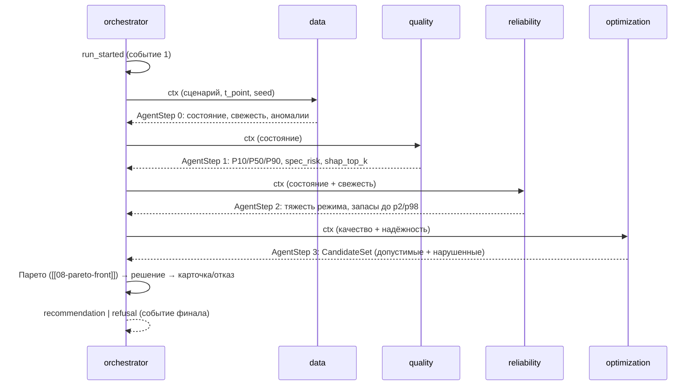

# 09 — Оркестратор (`agents/orchestrator.py`)

Пятый шаг конвейера и единственный агент с правом финального решения: роль `orchestrator`
(enum B.1 в [[01-enums]]), `step_idx = 4`. Оркестратор запускает агентов в фиксированном порядке,
собирает `agents_trace[]`, разрешает конфликт «качество ↔ экономика», принимает решение
«рекомендовать / отказаться», собирает карточку [[04-recommendation]] и эмитит события для SSE
(P2 → P1). Транспорт и HTTP — не здесь: ядро не знает про fastapi, события уходят в `EventSink`
(контракт P2, api/protocols/02-p2-backend-core.md).

## Scope

| | |
| --- | --- |
| **Содержит (covers)** | порядок агентов data→quality→reliability→optimization→orchestrator; сбор `AgentStep` и `number_refs`; разрешение конфликта качество↔экономика; правило решения «рекомендовать / отказаться»; сборка карточки рекомендации ([[04-recommendation]]); эмиссия CoreEvent для SSE-потока; связка с [[10-refusal]] и [[12-run-report]] |
| **НЕ содержит (does NOT cover)** | логику отдельных агентов ([[03-agent-data]]…[[07-agent-optimization]]); формулировки причин отказа ([[10-refusal]]); рендер Markdown-отчёта ([[12-run-report]]); HTTP/SSE-транспорт и очередь backend'а (backend/02-core-bridge.md); запись Parquet (P3-граница) |

## Порядок агентов



Порядок фиксирован и **линеен**: каждый следующий агент потребляет полный контекст предыдущих.
Короткое замыкание (short-circuit) разрешено только «в сторону отказа»: если [[03-agent-data]]
вернул `DataFreshness.status = stale/missing` по ключевым точкам или [[04-agent-quality]] вышел
за порог конформного интервала — optimization и reliability пропускаются, сразу собирается отказ
([[10-refusal]]). Это штатный путь, а не исключение.

## Сбор оценок и трейс

```python
def run_pipeline(scenario: Scenario, registry: ModelRegistry, sink: EventSink) -> RunResult:
    """run_id = YYYYMMDD-HHMMSS-hex8 (UTC); seed из сценария фиксируется до первого шага.
    for step_idx, agent in enumerate(AGENTS):            # data, quality, reliability, optimization
        sink.emit(CoreEvent(seq, run_id, "agent_started", step))
        step_result = agent.run(ctx)                      # чистая функция контекста
        sink.emit(CoreEvent(seq, run_id, "agent_finished", step_result))
        ctx = merge(ctx, step_result)                     # накопление контекста
    return decide(ctx)                                    # шаг 4: сам оркестратор
    """
```

- `agents_trace[]` — все пять `AgentStep` ([[05-agent-step]]): метки времени, `input_digest`,
  `output_json`, `notes`, `number_refs`, `confidence`. Трейс попадает в отчёт [[12-run-report]].
- Каждое событие несёт монотонный `seq`; события пишутся и в журнал
  `artifacts/timeline/{run_id}.ndjson` (реплей при реконнекте SSE).

## Разрешение конфликта «качество ↔ экономика»

| Конфликт | Правило разрешения | Основание |
| --- | --- | --- |
| Вариант дешевле, но запас по сере ниже политики | В пользу качества: экономичный вариант — только в `alternatives` | приоритет качества над экономикой |
| Запас по печи (reliability) почти нулевой, а вариант требует роста температуры | В пользу надёжности: АВТ/ГСС-рост замораживается в [[07-agent-optimization]] | «тяжесть режима» — обязательный критерий |
| Сужение спецификации (зимнее/летнее) против выпуска | В пользу спецификации: сезонные пороги ЦЧ/плотности применяются жёстко | спецификация продукта |
| Свежесть/неопределённость против «хочется дать совет» | В пользу отказа ([[10-refusal]]) | «Умение корректно отказаться — часть качественного решения» |

Общий принцип: конфликт целей разрешается в пользу ограничений; экономика участвует только в
ранжировании уже допустимых вариантов ([[08-pareto-front]]).

## Правило решения «рекомендовать / отказаться»

```python
def decide(ctx: RunContext) -> Recommendation:
    """1. Причины отказа ([[10-refusal]]) — приоритетный путь:
         stale_lims | wide_interval | out_of_training_domain | no_feasible_variant | sensor_fault
       2. Иначе: точка по политике безопасности ([[08-pareto-front]] select_by_policy)
       3. Иначе (нет допустимых) → no_feasible_variant → отказ.
    Инвариант карточки:
      decision == "recommend" ⇒ actions/effects/checks/confidence непусты и refusal is None
      decision == "refuse"    ⇒ refusal.reasons непуст"""
```

## Сборка карточки рекомендации

Карточка [[04-recommendation]] собирается строго из посчитанных фактов:

| Блок карточки | Источник в контексте |
| --- | --- |
| Время и состояние | `state[]` — снимок [[03-agent-data]] (≤ 12 тегов) + `freshness` |
| Проблема / риск | `risks[]` — spec_risk и квантили [[04-agent-quality]] по целям |
| Предлагаемое действие | `actions[]` — теги: текущее → рекомендуемое (только управляемые [[07-agent-optimization]]) |
| Ожидаемый эффект | `effects[]` — квантили варианта, `margin_to_spec` |
| Проверка ограничений | `checks[]` — вердикты [[06-constraints-engine]] по выбранному варианту |
| Уверенность | `confidence` — интервал P10–P90 вероятности прохождения всех проверок |
| Объяснение | `explanation` — шаблон или нарратор [[90-narrator-llm]]; только из `number_refs` |
| Альтернативы | `alternatives[]` — точки Парето-фронта с `pareto_rank` |
| Отказ | `refusal{reasons[], details[]}` — [[10-refusal]], вместо actions/effects/checks |

## Эмиссия событий для SSE

Порядок внутри прогона задаёт ядро (контракт P1, api/protocols/01-p1-rest-sse.md):

| `seq` | Событие | Payload-источник |
| --- | --- | --- |
| 1 | `run_started` | `{runId, status: "running", kind, tPoint, seed}` из [[06-scenario|Scenario]] |
| 2…N | `agent_started` / `step` / `log` / `agent_finished` ×4 | `AgentStep` агентов; `step` — промежуточные артефакты (например, топ-вариантов); `log` — текстовые строки |
| N+1 | `agent_finished` (orchestrator) | финальный шаг с решением |
| N+2 | `recommendation` **или** `refusal` | карточка [[04-recommendation]] целиком |
| N+3 | `run_finished` | `{runId, status: "completed"\|"refused", durationMs, reportUrl}` |

```python
class CoreEvent(NamedTuple):
    seq: int
    run_id: str
    kind: Literal["run_started", "agent_started", "step", "log", "agent_finished",
                  "recommendation", "refusal", "run_finished", "run_failed"]
    payload: dict
    ts: datetime
```

Гарантии: одно событие = один `seq`; дубли отбрасываются потребителем по `id`;
`run_failed` публикуется при падении потока (в отличие от штатного `refused`);
heartbeat — забота backend'а, не ядра.

## Правила дизайна

> [!warning] Ключевые правила
> 1. Оркестратор — тоже агент: сам возвращает `AgentStep` с `step_idx = 4` и попадает в трейс.
> 2. Ни одного числа в карточке «из головы»: каждый блок ссылается на `number_refs` шагов.
> 3. Отказ — штатный исход (`RunStatus.refused`), не исключение; исключение → `run_failed`.
> 4. Ядро синхронно и детерминировано: один seed → одинаковый трейс и одинаковые числа.
> 5. Нарратор ([[90-narrator-llm]]) вызывается в самом конце и не может изменить ни один факт карточки.
