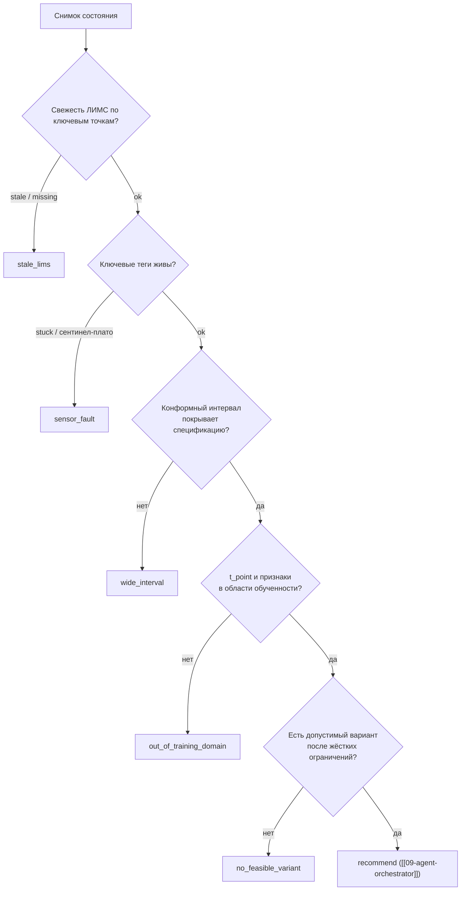

# 10 — Отказ от рекомендации (`agents/refusal.py`)

Отказ — не ошибка и не исключение, а штатный результат прогона со статусом `RunStatus.refused`
(автомат B.9 в [[01-enums]]): «Отказ от рекомендации — первоклассный сценарий: старый ЛИМС +
узкий конформный интервал + выход режима из области обучения = "надёжной рекомендации нет"
с объяснением». Правило продукта: «при нехватке данных или отсутствии
допустимого варианта система должна отказаться от рискованной рекомендации и объяснить причину».
Модуль определяет причины `RefusalReason`, правила их срабатывания и **шаблонный** текст
отказа без LLM.

## Scope

| | |
| --- | --- |
| **Содержит (covers)** | причины `RefusalReason` (5 значений enum `RefusalReason` ([[01-enums]])); правила срабатывания каждой причины; сбор `details[]` с конкретными числами из контекста; приоритезацию причин; шаблон текста отказа без LLM; заполнение `refusal{reasons[], details[]}` карточки [[04-recommendation]] |
| **НЕ содержит (does NOT cover)** | сам конвейер решения ([[09-agent-orchestrator]]); показ отказа в UI (frontend/08, fixed-статус `refused`); транспорт события `refusal` по SSE; катастрофические ошибки прогона (`RunStatus.failed` — это `run_failed`, не отказ) |

## Причины `RefusalReason`

| Причина (enum `RefusalReason`, [[01-enums]]) | Что означает | Триггер срабатывания |
| --- | --- | --- |
| `stale_lims` | устаревший ЛИМС | возраст последней метки ЛИМС по ключевой точке контроля превысил порог: статус `FreshnessStatus.stale` (age > `stale_after_h`, по умолчанию 52 ч) или `missing` в `DataFreshness` ([[02-data-freshness]]). Публикация результата и так задержана: «до публикации результата проходит до 4 часов»[^lims] — прогноз без свежего контрольного факта ненадёжен |
| `wide_interval` | конформный интервал не даёт надёжного запаса | ширина конформного интервала (`interval_width` из [[03-quality-assessment]]) > порога конфига **или** интервал пересекает границу спецификации при запасе меньше требуемого (напр., P90 серы ≥ 10 мг/кг) |
| `out_of_training_domain` | состояние вне диапазона обученности | `t_point` вне `trained_on_range` артефакта [[08-model-artifact]] или значения ключевых признаков вне модельных границ p2–p98 (флаг от [[05-agent-reliability]]) |
| `no_feasible_variant` | все варианты нарушают ограничения | [[07-agent-optimization]] вернул `n_feasible = 0`: жёсткие ограничения ([[06-constraints-engine]]) отбраковали всю решётку |
| `sensor_fault` | ключевые теги мертвы/залипли | детектор [[03-agent-data]] пометил ключевые управляемые/контрольные каналы как `stuck`/`sentinel`-плато; входной вектор не восстанавливается |

> [!note] Терминология
> В ранних проработках триггер назван «узкий конформный интервал» —
> в enum'е та же причина называется `wide_interval`: имеется в виду интервал, **не дающий
> надёжного запаса** (слишком широкий либо пересекающий границу спецификации).

## Правила срабатывания и приоритет



Правила приоритезации:

1. Причины проверяются сверху вниз (свежесть → сенсоры → неопределённость → домен → допустимость):
   первая сработавшая — в `reasons[]`; остальные сработавшие добавляются туда же (несколько причин
   допустимы, как в примере A.4 [[04-recommendation]]: `"reasons": ["stale_lims", "wide_interval"]`).
2. Любая сработавшая причина = отказ; причин «смягчить» отказ ради экономики не существует:
   «Недопустимый режим нельзя "компенсировать" более высокой производительностью или меньшими
   затратами».
3. Отказ — это `RunStatus.refused` с полным трейсом прогона: агенты до точки срабатывания
   отрабатывают, их шаги попадают в отчёт [[12-run-report]]. Исключение агента — другой статус:
   `RunStatus.failed` → событие `run_failed`.

## `details[]`: числа из контекста, не из головы

Каждая причина дополняется деталями с конкретными значениями (формат `string` в карточке):

| Причина | Пример `details` |
| --- | --- |
| `stale_lims` | `Возраст последнего ЛИМС 44 ч > порога 28 ч (warn) / 52 ч (stale)` |
| `wide_interval` | `Интервал серы 8,9–10,4 мг/кг пересекает границу 10 мг/кг (P90 = 10,4)` |
| `out_of_training_domain` | `T5 = 389,2 °C вне модельного диапазона p2–p98 (354–381 °C)` |
| `no_feasible_variant` | `Все 288 вариантов решётки отбракованы: сера > 10 мг/кг у 214, T95 > 360 у 62, присадка > 3 % у 12` |
| `sensor_fault` | `Каналы залипли: W4/W10 (зашкал на 10,0), F17 (серия ≥ 2 ч)` |

Значения берутся строго из `number_refs` шагов агентов — шаблонизатор подставляет готовые числа.

## Шаблон текста отказа без LLM

Текст собирается детерминированным шаблонизатором (`refusal.render()`), LLM не вызывается.
Базовая канва ответа об отказе:

> «Надёжной рекомендации нет: последнее лабораторное значение устарело, а доступные варианты либо
> нарушают ограничение по качеству, либо выходят за заданный модельный диапазон».

```python
REFUSAL_TEMPLATE = {
    "stale_lims": "Последний лабораторный замер ({point}) от {sample_ts}, возраст {age:.0f} ч — "
                  "дольше порога {stale_after_h:.0f} ч; свежего контрольного факта нет.",
    "wide_interval": "Интервал прогноза {target}: {p10:.1f}–{p90:.1f} {unit} — {cross_desc} "
                     "границу спецификации {limit:.0f} {unit}.",
    "out_of_training_domain": "Состояние вне области обученности модели: {feature} = {value:.1f} "
                              "вне {range_desc} (диапазон обученности до {trained_until}).",
    "no_feasible_variant": "Из {n_generated} вариантов жёсткие ограничения нарушили все: {top_cause}.",
    "sensor_fault": "Ключевые каналы неисправны: {channels}.",
}

def render_refusal_text(reasons: list[RefusalReason], facts: dict) -> str:
    """1. Канва отказа (строка выше) — всегда первой.
    2. Далее — предложения по каждой сработавшей причине из REFUSAL_TEMPLATE, в порядке причин.
    3. Финал: 'Дальнейшие действия оператора: {направление по каждой причине — свежая проба /
       проверка КИП / ожидание выхода режима в модельный диапазон}.'
    Ни одного числа, кроме подставленных из facts (number_refs шагов)."""
```

Тот же текст уходит в `explanation` карточки и в SSE-событие `refusal` ([[09-agent-orchestrator]]).
При `LLM_MODE != off` нарратор ([[90-narrator-llm]]) может **переформулировать** этот текст,
но по тем же фактам и с теми же числами; при `off` — всегда шаблон выше.

## Отказ ≠ авария: два терминальных исхода

| | `RunStatus.refused` | `RunStatus.failed` |
| --- | --- | --- |
| Что произошло | конвейер дошёл до решения и обоснованно не рекомендует | исключение в агенте или сборке отчёта |
| Событие SSE ([[09-agent-orchestrator]]) | `refusal` + `run_finished {status: "refused"}` | `run_failed {errorCode, message}` |
| Карточка [[04-recommendation]] | `decision = "refuse"`, `refusal.reasons` непуст | карточки нет |
| Отчёт [[12-run-report]] | полный, с трейсом до точки отказа | трейс до места исключения, статус failed |
| Код выхода CLI [[14-cli]] | 0 (если исход совпал с ожиданием сценария) | 3 |

Отказ — часть объяснимости, а не обработка ошибок: причины не живут в try/except и не попадают
в логи аварий; они собираются из фактов контекста тем же конвейером, что и рекомендация.

## Пример карточки отказа (полная форма)

```json
{"decision": "refuse", "t_point": "2026-06-15T08:00:00Z",
 "state": [{"tag": "Q21", "value": null, "unit": "мг/кг"}, {"tag": "T5", "value": 371.0, "unit": "°C"}],
 "risks": [],
 "refusal": {"reasons": ["stale_lims", "sensor_fault"],
             "details": ["Возраст последнего ЛИМС 60 ч > порога stale 52 ч",
                         "Каналы залипли: W4 (серия значений ≥ 2 ч)"]},
 "explanation": "Надёжной рекомендации нет: последнее лабораторное значение устарело, а ключевые каналы телеметрии неисправны. Дальнейшие действия оператора: отобрать свежую пробу, проверить КИП по перечню каналов.",
 "alternatives": []}
```

## Тестируемость

Отказ покрывается тестами [[15-tests]]: гарантированный отказ сценария «плохие данные»
(сентинелы + старый ЛИМС → `stale_lims`), «ни один вариант не проходит» → `no_feasible_variant`,
и инвариант карточки `refuse` ⇒ `refusal.reasons` непуст, `actions` пусты.

## Правила дизайна

> [!warning] Ключевые правила
> 1. Приоритет безопасности над экономикой: отказ предпочтительнее рискованной рекомендации.
> 2. Отказ объясним: минимум одна причина + детали с числами из расчёта.
> 3. Шаблонный текст без LLM — базовый путь; LLM — только перефразирование тех же фактов.
> 4. Отказ ≠ авария: `refused` — штатный терминальный статус прогона с полным отчётом.
