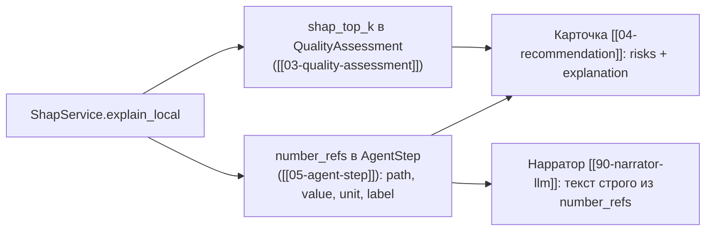

# 11 — Объяснение через SHAP (`explain/shap_service.py`)

Обёртка над SHAP `TreeExplainer` для моделей, уже загруженных реестром [[02-model-registry]].
Назначение — «объяснимость»: перевести вклад признаков в операторский язык. Сервис **только
читает** модели и отдаёт факторы; любые числа через него попадают в `shap_top_k`
([[03-quality-assessment]]) и `number_refs` ([[05-agent-step]]), откуда их берут карточка
[[04-recommendation]] и нарратор [[90-narrator-llm]].

## Scope

| | |
| --- | --- |
| **Содержит (covers)** | локальные объяснения: top-k факторов для конкретного прогноза (путь в `number_refs` шага [[05-agent-step]] и `shap_top_k` карточки качества); глобальные важности (mean \|SHAP\|) — читаются из manifest [[08-model-artifact]]; кэш TreeExplainer'ов по `artifact_id`; запрет обучения; конвертация факторов в текстовые подписи |
| **НЕ содержит (does NOT cover)** | сами модели и их калибровку (P5-граница, data-pipeline/06–07); расчёт квантилей и `spec_risk` ([[04-agent-quality]]); генерацию связного текста объяснения (шаблоны — здесь минимальные, связный текст — [[90-narrator-llm]] и [[10-refusal]]); обучение/дообследование в рантайме |

## Почему TreeExplainer

Модели качества — LightGBM quantile ([[08-model-artifact]], `algorithm = lightgbm_quantile`), для
деревьев точный Tree SHAP вычисляется аналитически и быстро: «Точный полиномиальный Tree SHAP для
LightGBM/CatBoost/XGBoost/sklearn-деревьев; аддитивность (SHAP + base = прогноз)» (проверенный
факт о библиотеках). Отдельный бонус: у
LightGBM есть нативный `pred_contrib=True` (внутри — тот же shap.TreeExplainer), что позволяет
считать вклады в том же батч-вызове, что и прогноз.

Роль SHAP в архитектуре: SHAP-объяснения в карточке прогноза («почему такой прогноз») —
прямое попадание в критерий «Объяснимость»; перевод в операторский язык:
«прогноз серы вырос из-за …, поэтому рекомендация …».

## Интерфейс сервиса

```python
class ShapService:
    def __init__(self, registry: ModelRegistry): ...
        # TreeExplainer кэшируется по artifact_id при первом обращении (прогрев — lifespan backend'а)

    def explain_local(self, artifact_id: str, features_row: dict) -> list[ShapItem]:
        """Локальное объяснение одного прогноза.
        Возвращает top-k (k <= 5) элементов {feature, value, contribution} —
        каноническая форма ShapItem из [[03-quality-assessment]].
        Порядок — по |contribution| по убыванию; тай-брейк — по имени признака (детерминизм)."""

    def explain_batch(self, artifact_id: str, features: pl.DataFrame) -> list[list[ShapItem]]:
        """Батч-вариант для [[07-agent-optimization]]: объяснения выбранного варианта
        и базового режима одним вызовом TreeExplainer (pred_contrib / shap_values)."""

    def global_importances(self, artifact_id: str) -> list[GlobalImportance]:
        """Только чтение manifest [[08-model-artifact]]: список признаков и глобальные
        важности, посчитанные офлайн при обучении (data-pipeline/09-publish-registry.md).
        Рантайм НЕ пересчитывает глобальные важности по новым данным."""
```

## Локальные объяснения → `number_refs` и карточка

Путь локального объяснения в артефакты прогона:



Пример `number_refs` шага quality (форма A.5 [[05-agent-step]]):

```json
{"path": "sulfur.shap_top_k[0]", "feature": "T5", "value": 371.0, "unit": "°C",
 "label": "Температура T5 — главный фактор прогноза серы (+0,42 мг/кг к среднему)"}
```

Правила подписей:

1. `label` — нейтральная фактическая формулировка с числом из расчёта; оценка («сильно выросло»)
   допускается только как знак вклада (+/−), не как новая величина.
2. Все значения факторов и вкладов — из `output` шага; нарратор не имеет доступа к «сырым» данным,
   только к `number_refs` и полям отчёта.
3. Единицы признаков — как в данных (°C, т/ч, МПа, ч); единицы вклада — единицы цели (мг/кг, °C, …).

## Глобальные важности → manifest артефакта

```json
// фрагмент manifest.json (форма manifest [[08-model-artifact]] [[08-model-artifact]])
{"artifact_id": "sulfur-lgbm-a1b2c3d4",
 "features": ["T5", "T11", "lims_age_h", "cat_age_days", "vak_t50"],
 "monotone_constraints": {"T5": 1},
 "global_importances": {"T5": 0.34, "vak_t50": 0.21, "cat_age_days": 0.14}}
```

Глобальные важности (среднее \|SHAP\| по калибровочной выборке, нормированное в доли) считает
data-pipeline при обучении и публикует в manifest — их потребляют страница «Модели»
(frontend/15-page-models.md) и `GET /api/models`. Сервис здесь — только ридер: правило дизайна 3
[[core-architecture/00-OVERVIEW]] («в рантайме ядро только загружает модели из реестра (P5) — никогда не обучает»).

## Монотонности и проверка здравости объяснений

Модели обучены с `monotone_constraints` (физическая правдоподобность),
поэтому вклад признака в локальном объяснении обязан согласовываться со знаком монотонности
(рост `T5` ⇒ вклад серы ≥ 0). Нарушение согласованности — признак несоответствия артефакта
manifest'у; сервис логирует предупреждение в `notes` шага, молча править вклад запрещено.

## Операторский перевод факторов

Словарь подписей признаков (конфиг ядра, единый для карточки, `number_refs` и нарратора):

| Признак | Подпись для оператора | Типичная роль |
| --- | --- | --- |
| `T5` | температура на входе реактора (принадлежность Р-201/Р-202 — открытый вопрос, версия фиксируется в примечании модели) | главный фактор прогноза серы |
| `vak_t50` / `vak_t90` | ВАК-оценки T50/T90 по исправленным формулам | фичи-бейзлайн |
| `lims_age_h` | возраст последнего лабзамера | фактор доверия прогнозу |
| `cat_age_days` | наработка катализатора (с последних просадок T5) | дрейф к концу цикла |
| `month` | сезон (годовой цикл ±10–20 °C) | сезонность режима |

## Границы объяснимости

> [!note] SHAP объясняет прогноз, а не причинность
> Вклад признака — это вклад в модель, не в процесс. Внутри периметра «работают АСУ с обратной
> связью, быстро реагирующие на качество — телеметрия уже содержит реакцию регуляторов;
> учитывать при интерпретации и валидации». Поэтому в карточке факторы
> формулируются как «что повлияло на прогноз», без утверждений о причинности; локальные вклады
> обязаны согласовываться с `monotone_constraints`, но не заменяют их.

## Воспроизводимость и производительность

```python
# - Tree SHAP детерминирован: одинаковые модель + строка ⇒ одинаковые вклады; сид не нужен.
# - Кэш объясняющих обёрток живёт в памяти процесса (P2); повторный прогон с тем же артефактом
#   даёт тот же результат — покрывается тестом [[15-tests]].
# - Бюджет: локальное объяснение — часть what-if пути (< 50 мс на батч ≤ 8 вариантов);
#   top-k считается по тем же значениям, без повторного predict.
```

## Правила дизайна

> [!warning] Ключевые правила
> 1. Только чтение: никаких фитингов, дообучения и пересчёта глобальных важностей в рантайме.
> 2. Все числа объяснений — через `number_refs`/`shap_top_k`; тексты не порождают значений.
> 3. top-k ≤ 5, порядок детерминирован; тай-брейки явные.
> 4. Согласованность с `monotone_constraints` проверяется, но не «чинится» молча.
> 5. Ядро не зависит от наличия shap-объяснений: при их отсутствии поля остаются пустыми
>    массивами (`[]`), а не `null` (правило nullable-полей из [[03-quality-assessment]]).
