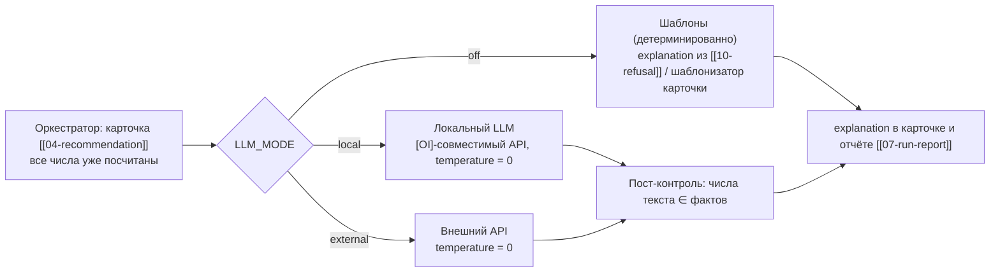

# 90 — Нарратор на LLM (`narrator/`) — опциональный слой

Опциональный слой формулировки текста поверх посчитанных фактов. Нарратор — «только текст поверх
фактов, тумблер off/local/external» (ASCII-слои [[core-architecture/00-OVERVIEW]]). Нарратор
опционален и живёт позади флага; в закрытом контуре по умолчанию `off`:
«LLM_MODE по умолчанию off (закрытый контур)» — env-контракт delivery-infra/04-env-vars.md.

## Scope

| | |
| --- | --- |
| **Содержит (covers)** | интерфейс нарратора (протокол `Narrator`); тумблер `LLM_MODE = off \| local \| external`; режим `off` — детерминированные шаблоны; режим `local` — [OI]-совместимый локальный API; режим `external` — внешний API; промпт только из `number_refs` и полей отчёта; пост-контроль «без цифр из головы»; влияние на воспроизводимость |
| **НЕ содержит (does NOT cover)** | любые расчёты чисел, квантилей, `cost_index`; выбор решения и отказ ([[09-agent-orchestrator]], [[10-refusal]]); шаблон текста отказа (базовый путь — [[10-refusal]], без LLM); транспорт API-ключей (env-слой infra); UI-переключатель (frontend, прокидывается через P1) |

## Место в архитектуре



Ядро и цифры — только из Python: LLM — единственная роль — перефразирование детерминированного
вывода и ответы на вопросы по протоколу. Нарратор архитектурно некритичен: ядро
детерминированное, работает без интернета; LLM — опциональный «нарратор» на медленном контуре
(формулировка текста).

## Интерфейс

```python
class Narrator(Protocol):
    def explain_recommendation(self, rec: Recommendation, refs: list[NumberRef]) -> str:
        """Текст блока «Объяснение» карточки. Вход — только DTO карточки [[04-recommendation]]
        и number_refs шагов ([[05-agent-step]]); никакого доступа к данным и моделям."""

    def explain_refusal(self, refusal: RefusalInfo, refs: list[NumberRef]) -> str:
        """Переформулировка шаблонного текста отказа [[10-refusal]] теми же фактами."""

    def answer_question(self, question: str, report: RunReport) -> str:
        """Вопрос-ответ по отчёту (копилот): ответ строго из полей отчёта [[07-run-report]]."""

def make_narrator(settings: Settings) -> Narrator:
    """Фабрика по settings.llm_mode: off → TemplateNarrator, local → LocalLlmNarrator,
    external → ExternalLlmNarrator. Любая ошибка LLM-провайдера → откат на TemplateNarrator
    (запись предупреждения в notes шага orchestrator), прогон не падает."""
```

## Режим `off` — шаблоны (по умолчанию)

`TemplateNarrator` — детерминированный шаблонизатор: собирает `explanation` из полей карточки
(причина → действие → эффект → проверки → альтернативы), подставляя числа из `number_refs`.
Это базовый путь: текст отказа ([[10-refusal]]) и пояснение рекомендации существуют **без LLM**;
включение нарратора меняет только связность формулировок, не состав фактов.

## Режим `local` — [OI]-совместимый локальный API

Целевая среда — закрытый периметр: «В корпоративном периметре доступен локальный LLM уровня
до ~30B параметров (Qwen 32B и т.п.); ориентироваться на это».

- Протокол — [OI]-совместимый REST API (`POST {base_url}/v1/chat/completions`), поднимаемый
  на стороне заказчика/демо-машины; ядро знает только `base_url` и `model` из env — никакого
  специфичного SDK.
- Ограничения вызова: таймаут (конфиг, единицы секунд — «медленный контур»), одна попытка,
  при недоступности — откат на шаблоны.
- Модель должна отвечать **на русском**; язык фиксируется в системном промпте.

## Режим `external` — внешний API

Тот же интерфейс, провайдер — из env. Ограничение архитектуры: «внешние модели по API разрешены,
но архитектура не должна критически зависеть от внешнего API — целевой контур закрытый
(on-premise)». Поэтому `external` — режим демонстрации, а не дефолт,
и деградация до шаблонов обязательна.

## Промпт: только факты, без цифр из головы

```python
def build_prompt(rec: Recommendation, refs: list[NumberRef]) -> list[Message]:
    """Системное сообщение (константа):
      'Ты — ассистент оператора установки. Формулируй текст ТОЛЬКО из данных в сообщении.
       Запрещено вводить какие-либо числа, не присутствующие в данных. Не давай советов,
       меняющих рекомендацию. Отвечай по-русски, 3–6 предложений: причина → действие →
       ожидаемый эффект → проверки.'
    Пользовательское сообщение — сериализованные факты:
      карточка (state, risks, actions, effects, checks, confidence, alternatives)
      + number_refs (path, value, unit, label).
    Никаких сырых рядов, никаких моделей, никаких "знаний процесса" сверх фактов."""
```

Пост-контроль результата:

```python
def verify_text(text: str, facts: list[NumberRef]) -> str | None:
    """1. Все числа текста обязаны совпадать с числами facts (сравнение по нормализованному
       написанию: '9,6' ≡ '9.6'). Число, которого нет в facts → отказ от текста.
    2. Запрещённые паттерны: «примерно/около <новое число>», проценты и величины не из фактов.
    3. При нарушении — TemplateNarrator (откат), предупреждение в notes. Числа никогда не правятся."""
```

Конструктивная гарантия: «варианты и их метрики, причины отбраковки, проверки
ограничений подаются модели как контекст, выдумывать числа по конструкции невозможно»;
пост-контроль `verify_text` дублирует это проверкой.

## Влияние на воспроизводимость

> [!important] Числа не меняются
> «Дословно один и тот же текст ответа не обязателен. При одинаковом состоянии системы должны
> воспроизводиться одно и то же решение и одинаковые численные результаты» — практический вывод:
> «если используем LLM — температура 0 и/или заготовленные шаблоны формулировок для итоговой
> рекомендации».

Следствия:

1. `temperature = 0` во всех LLM-режимах (параметр фиксируется в конфиге, не в промпте).
2. Нарратор вызывается **после** фиксирования карточки: он не может изменить ни один блок, кроме
   строки `explanation` (и текста отказа при переформулировке).
3. В отчёт [[07-run-report]] пишется `env.llm_mode` — прогон с `off` и прогон с `local` различимы,
   при этом численные поля отчётов идентичны (тест [[15-tests]]: детерминизм чисел независимо
   от режима нарратора).
4. «Безопасно по воспроизводимости: цифры всегда из расчёта, LLM — только текст».

## Связи

- **[[04-recommendation]]**: `explanation` — единственное поле, которое нарратор формулирует;
  при `off` — шаблонизатор карточки.
- **[[10-refusal]]**: шаблон текста отказа живёт там; нарратор лишь перефразирует по фактам.
- **вопрос-ответ по отчёту**: `answer_question` — тот же тумблер провайдера;
  «без LLM копилот отвечает шаблонами по тем же фактам».
- **frontend**: переключатель режима — UI-элемент; правило зависимостей: LLM-слой (тумблер
  «внешняя/локальная/без») живёт в core за интерфейсом нарратора; UI-переключатель — frontend,
  прокидывается через P1.

## Правила дизайна

> [!warning] Ключевые правила
> 1. Нарратор опционален и по умолчанию выключен (`LLM_MODE=off`); без него система полная.
> 2. Вход нарратора — только DTO карточки и `number_refs`; доступа к данным/моделям нет.
> 3. temperature = 0; любая ошибка провайдера — откат на шаблоны, не падение прогона.
> 4. Пост-контроль: число в тексте ∉ фактам → текст бракуется, числа не «чинятся».
> 5. Нарратор никогда не меняет решение, отказ, квантили и `cost_index`.
