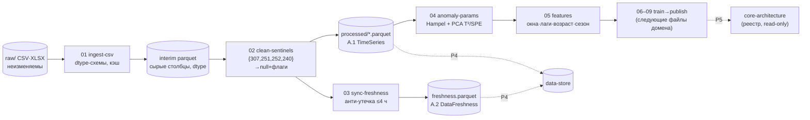
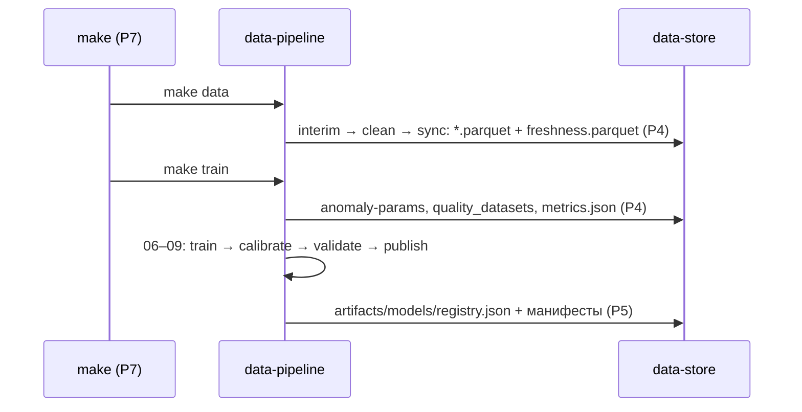

# data-pipeline — офлайн-пайплайн «Refinery Copilot»

> [!note] Назначение домена
> Офлайн-конвейер, который превращает сырые выгрузки (`data/raw/*.csv`, ЛИМС/ПАК XLSX)
> в чистые Parquet-датасеты и обученные квантильные модели. Продукт пайплайна потребляют два
> домена: **data-store** (запись по протоколу P4) и **core-architecture** (модели через реестр P5).
> Пайплайн — единственный домен, которому разрешено писать в `data/processed/`; ядро в рантайме
> только читает (правило 4).

## Scope

**Содержит:** инжест CSV/XLSX, чистку сентинелов/залипаний/выбросов, синхронизацию источников
по времени и freshness-таблицу, офлайн-фит параметров аномалий, построение признаков.
Этапы запуска: `make data` (инжест+чистка → Parquet) и `make train` (признаки+обучение → артефакты).

**Не содержит:** обучение/скоринг в рантайме (это ядро, P5 — только загрузка), HTTP/транспорт,
схемы датасетов-контракты (определяет data-store), схему манифеста моделей (определяет
api/protocols P5). Числа и факты качества данных — по результатам анализа истории данных.

## 1. Поток данных (слои raw → interim → processed)

```text
raw CSV/XLSX ──► ingest ──► clean (маска сентинелов 1-м шагом) ──► Parquet (P4)
                                   │
                sync (только по времени; available_ts = sample_ts + ≤4 ч)
                                   │
     anomaly_fit (Hampel+PCA офлайн → параметры в artifacts)
                                   │
     features (окна, лаги 0–3 ч, возраст ЛИМС, наработка, сезон)
                                   │
     train (LightGBM quantile) → calibrate (MAPIE) → validate (gap ≥ 3 ч)
                                   │
     publish → artifacts/models (P5) ──► ядро только читает (реестр)
```



## 2. Этапы запуска (P7)

| Этап | Команда | Что происходит | Результат этапа |
| --- | --- | --- | --- |
| Этап 1 | `make data` | 01 ingest → 02 clean → 03 sync | валидированный Parquet в `data/processed/` |
| Этап 2 | `make train` | 04 anomaly-params → 05 features → 06–09 train/calibrate/validate/publish | модели в `artifacts/models/` + `artifacts/metrics.json` |

Порядок целей кодирует конвейер: `make data` обязателен до `make train`, оба — до `make demo`/`make run`
(delivery-infra/01). Обе цели идемпотентны: повторный запуск
на тех же `data/raw/` даёт байт-в-байт те же выходные хэши.

## 3. Индекс документов

| # | Файл | Назначение | Ссылается на |
| --- | --- | --- | --- |
| 1 | [[data-pipeline/00-OVERVIEW]] | этот обзор: поток, этапы, правила | правила домена |
| 2 | [[01-ingest-csv]] | чтение `data/raw/*.csv` + ЛИМС/ПАК XLSX; dtype-схемы; кэш CSV→Parquet | data-store/01–05, факты о данных |
| 3 | [[02-clean-sentinels]] | маска сентинелов {307,251,252,240}; залипания; выброс 307 vs реальный выброс; D10 | факты о данных |
| 4 | [[03-sync-freshness]] | выравнивание по времени; анти-утечка ЛИМС ≤ 4 ч; ПАК; freshness-таблица | канон [[02-data-freshness]] |
| 5 | [[04-anomaly-params]] | офлайн-фит Hampel + PCA T²/SPE; экспорт порогов в artifacts | core-architecture/03-agent-data, data-store/06 |
| 6 | [[05-features]] | окна, лаги 0–18 шагов, возраст ЛИМС/ПАК, наработка, сезон, ВАК T50/T90 | признаки, правила источника качества |

Файлы 06–10 (`06-train-quantile` … `10-tests`) продолжают нумерацию и принадлежат тому же домену.

## 4. Правила дизайна (обязательны для всех файлов домена)

> [!warning] Правила data-pipeline
> 1. **Маска сентинелов — безусловный первый шаг.** Ни одна метрика, ни одна фича не считается
>    до замены {307, 251, 252, 240} → `null` + `quality_flag` ([[02-clean-sentinels]]).
> 2. **Никаких NaN-сентинелов наружу.** За границу пайплайна (Parquet → ядро → API) сентинелы
>    не проходят в принципе: в Parquet они хранятся как `null` с флагом `sentinel`
>    («Сентинелы {307, 251, 252, 240} не существуют за пределами
>    data-pipeline: → `null` + `quality_flag`»). NaN/Inf в JSON запрещены — только `null`.
> 3. **Время — UTC, единый часовой пояс.** Все источники в одном поясе;
>    `ts`/`last_sample_ts`/`available_ts` пишутся как `timestamp[ms, UTC]`, ISO 8601 с `Z` наружу.
> 4. **Анти-утечка.** Результат ЛИМС доступен системе не раньше `available_ts = sample_ts + ≤4 ч`;
>    фичи строятся только из данных, доступных к моменту отбора пробы ([[03-sync-freshness]]).
> 5. **Идемпотентность и детерминизм.** Сиды в конфиге; никакого перемешивания рядов;
>    повторный прогон по тем же raw-файлам даёт те же sha256-хэши выходов, которые попадают
>    в `datasets_manifest.json` и `RunReport.data_hashes` (P4).
> 6. **Роли тегов — по поведению значений**, не по справочнику КИП (17 из 26 кодов 24-2000
>    расходятся с данными). Справочник используется только как метка,
>    не как истина.

## 5. Кросс-доменные зависимости

| Направление | Протокол | Что именно |
| --- | --- | --- |
| data-pipeline → data-store | **P4** | `data/processed/{telemetry,lims,pak}.parquet`, `freshness.parquet`, `quality_datasets/{target}.parquet`, `artifacts/metrics.json`, `artifacts/models/…` |
| data-pipeline → core-architecture | **P5** | `artifacts/models/registry.json` + манифесты; ядро никогда не обучает в рантайме |
| delivery-infra → data-pipeline | **P7** | цели `make data` / `make train`; env `DATA_DIR`, `SEED` |
| data-store → data-pipeline | чтение | схемы датасетов — контракты data-store/02–05; пайплайн обязан им соответствовать |

> [!example] Канонические типы, которые производит домен
> - **TimeSeries/TagPoint** (канон [[01-timeseries]]): `tag_code, ts, value, quality_flag, source, unit` — канон
>    в api/data-models/01-timeseries.md, пишется в Parquet по P4.
> - **DataFreshness** (канон [[02-data-freshness]]): `point_id, source, last_sample_ts, available_ts, age_hours, status` —
>    канон в api/data-models/02-data-freshness.md, снимок в `freshness.parquet`.
> Внутренние структуры (параметры Hampel/PCA, гиперпараметры, список лагов) каноном **не являются**
> и за пределы домена не выставляются (правило принадлежности).

## 6. Порядок чтения и карта слоёв

Порядок чтения = порядок реализации = направление потока данных:

```text
00 (этот файл) → 01 ingest → 02 clean → 03 sync/freshness → 04 anomaly-fit → 05 features
              → 06 train → 07 calibrate → 08 validate → 09 publish → 10 tests
```

| Слой | Файлы | Вход | Выход (объект P4/P5) |
| --- | --- | --- | --- |
| raw | — | `data/raw/*.csv`, `data/raw/*.xlsx` | неизменяемы, только хэши в манифест |
| ingest | [[01-ingest-csv]] | CSV/XLSX | interim-parquet, `datasets_manifest.json` |
| clean | [[02-clean-sentinels]] | interim | `telemetry.parquet` (A.1 + quality_flag) |
| sync/freshness | [[03-sync-freshness]] | clean + ЛИМС + ПАК | `lims.parquet`, `pak.parquet`, `freshness.parquet` (канон [[02-data-freshness]]) |
| anomaly-fit | [[04-anomaly-params]] | clean-история | `artifacts/models/anomaly-params/` |
| features | [[05-features]] | всё выше | `quality_datasets/{target}.parquet` |
| train→publish | 06–09 | фичи + параметры | `artifacts/models/{artifact_id}/`, `metrics.json` |



## 7. Опорные факты о данных (по результатам анализа истории данных)

| Факт | Значение | Влияние на пайплайн |
| --- | --- | --- |
| Пропуски в телеметрии | 0.00 % по всем тегам; вместо пропусков — сентинелы | маска сентинелов вместо dropna ([[02-clean-sentinels]]) |
| Сетка | ровно 10 мин, 189 217 строк, 01.2023–08.2026 | ресемплинг не нужен, только dtype-нормализация ([[01-ingest-csv]]) |
| Мёртвый тег | D10 — 99.99 % сентинелов | исключение из фич ([[02-clean-sentinels]]) |
| Залипания | Q20 run 17 293 точки (~120 сут), T18 6 660, F26 63 333 | детектор серий + флаг `stuck` |
| ЛИМС | медианный интервал 24 ч; сера n=1462; ЦЧ — 42 замера | freshness-пороги warn=28 ч / stale=52 ч ([[03-sync-freshness]]) |
| Дубли | T5↔T11 r=1.00, P22≡P23, W70≡F30 | дедупликация кластеров в фичах ([[05-features]]) |
| Сезонный цикл | годовой режимный цикл ±10–20 °C; рост серы в 2026 | месяц/сезон как фича; валидация по времени с учётом сезонности |

[^sem]: Сентинелы {307, 251, 252, 240} вписаны в поток вместо пропусков —
    почти всегда длинными сериями.
