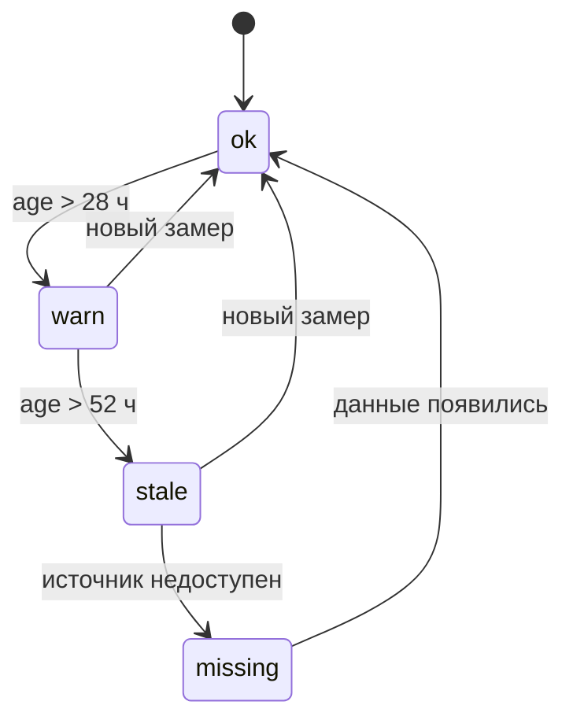

# 03 — Выравнивание по времени и freshness (`data/sync.py`)

> [!note] Назначение
> Сопоставляет три источника знания о качестве — ЛИМС (лаборатория), ПАК (поточные анализаторы),
> ВАК (расчётные формулы) — **только по времени** и строит таблицу свежести `DataFreshness`.
> Ключевое требование — анти-утечка: лабораторный результат появляется в распоряжении системы
> не тогда, когда отобрана проба, а когда он реально опубликован.

> [!quote] Правило задержки публикации
> «Метка времени это момент отбора пробы. До публикации анализа в системе проходит до 4 часов».

## Scope

**Содержит:** правило `available_ts = sample_ts + ≤4 ч` для ЛИМС; асинхронную привязку ЛИМС к
10-минутной сетке телеметрии; ПАК-серии (сера с 01.2023, D15 с 03.2025) и правило ppm = мг/кг;
построение freshness-таблицы [[02-data-freshness]] (age_hours, status ok/warn/stale/missing,
пороги warn/stale); приоритет источников ЛИМС → ПАК → ВАК; единый часовой пояс как инвариант.

**Не содержит:** расчёт признаков (возраст источника как фича — [[05-features]]), решение об
отказе `stale_lims` (принимает core-architecture/10 на основе этой таблицы), рантайм-пересчёт
(ядро пересчитывает `age_hours`/`status` на `t_point` по снимку).

## 1. Анти-утечка ЛИМС

Для каждого лабораторного замера система знает два момента:

| Поле (канон [[02-data-freshness]]) | Определение | Кто ставит |
| --- | --- | --- |
| `last_sample_ts` | метка в файле ЛИМС = **момент отбора пробы** | инжест ([[01-ingest-csv]] §3) |
| `available_ts` | `sample_ts + ≤4 ч` (транспортировка + анализ); фиксируем консервативно `+4 ч` | этот слой |

```python
def compute_available_ts(sample_ts: datetime) -> datetime:
    """ЛИМС: available_ts = sample_ts + 4h (верхняя граница задержки публикации лаборатории).
       ПАК/ВАК: available_ts = ts (анализатор/расчёт публикуются в момент отсчёта)."""
```

Правила анти-утечки (проверяются тестом в data-pipeline/10):

1. **Обучение:** таргет из ЛИМС может входить в обучающую строку только для `t ≥ available_ts`;
   фичи строки — только телеметрия до `sample_ts` ([[05-features]]).
2. **Валидация:** split по времени с gap ≥ 3 ч — gap не меньше горизонта «0–3 ч»
   и не отменяет анти-утечку.
3. **Рантайм:** ядро на `t_point` видит только замеры с `available_ts ≤ t_point` — иначе сценарий
   `stale_lims` превратился бы в подглядывание в будущее.
4. Ни одно значение ЛИМС никогда не появляется в данных **до** `available_ts` — инвариант уровня
   датафрейма, а не соглашение.

## 2. Синхронизация только по времени

> [!quote] Правило приоритета источников
> «Приоритет по качеству: ЛИМС → ПАК → расчётные/виртуальные анализаторы. Если значения
> расходятся, лабораторный результат считается контрольным фактом».

- Источники связываются **исключительно по оси времени** (as-of/join_within), без поточечной
  сверки ПАК↔ЛИМС: поточечная корреляция r = −0.003 ≈ 0, уровни совпадают (медианы 8.37 vs 8.60
  мг/кг, median |Δ| = 1.15), динамика — нет. Поточечная сверка запрещена
  как метод.
- Окно привязки ЛИМС к сетке телеметрии: ближайший шаг 10 мин до `sample_ts` (фича-агрегаты —
  окна **перед** отбором пробы, [[05-features]]).
- Часовой пояс единый во всех источниках — синхронизация не делает
  конвертаций, только проверяет зону `timestamp[ms, UTC]` и монотонность оси.
- ПАК ppm серы = мг/кг (массовая); `24-2000:Mg.Sulfur` соответствует точке «Гидроочистка,
  отбор 2, Дизельное топливо» — та же точка, что и ЛИМС-сера (n = 1462).

## 3. Ритм источников

| Источник | Серия | n | Медианный интервал | Замечание |
| --- | --- | --- | --- | --- |
| ЛИМС | сера «ГО, отбор 2» | 1 462 | **24.0 ч** | лаборатория по сере раз в сутки + публикация ≤ 4 ч |
| ЛИМС | цетановое число | 42 | ~29 суток (696 ч) | редчайший таргет — ЦЧ почти всегда stale |
| ЛИМС | 50/90/95 %.T, D15, CFPP и др. | 44–1 518 | 24–48 ч | 54 серии в 6 точках отбора |
| ПАК | `24-2000:Mg.Sulfur` | 189 649 | 10 мин | полный период, зашкал 20.00 |
| ПАК | `24-2000:D15` | 75 455 | 10 мин | **только с 2025-03-05 10:20** — пустой диапазон 2023–2024 легален |

Пустой диапазон D15 — не дефект: до 05.03.2025 статусы точек D15 корректно `missing`,
это не повод отбрасывать историю 2023–2024 по остальным целям.

## 4. Freshness-таблица [[02-data-freshness]]

На каждый `t_point` (или точку отбора пробы при офлайн-валидации) слой считает снимок канонической
модели **DataFreshness** (канон [[02-data-freshness]]:, api/data-models/02-data-freshness.md): `point_id, source, last_sample_ts,
available_ts, age_hours, status, warn_after_h, stale_after_h`. Пайплайн пишет снимок в
`data/processed/freshness.parquet` (P4); ядро в рантайме пересчитывает `age_hours`/`status` на `t_point`.

Пороги (обоснование — ритм ЛИМС 24 ч + публикация 4 ч):

| Порог | Значение | Смысл |
| --- | --- | --- |
| `warn_after_h` | 28.0 | 24 ч ритм + 4 ч публикации — просрочен один цикл |
| `stale_after_h` | 52.0 | просрочено два цикла — кандидат на отказ `stale_lims` |

```python
def build_freshness(points: list[ControlPoint], asof: datetime) -> pl.DataFrame:
    """Для каждой точки контроля: последний замер с available_ts <= asof →
       last_sample_ts, available_ts, age_hours = (asof - last_sample_ts).h,
       status = fsm(age_hours, warn_after_h=28, stale_after_h=52)."""
```

Статусная машина FreshnessStatus (enum B.2; возврат — только через новый замер):



Мнемоника статусов: `ok` — свежо; `warn` — старше одного цикла, учитывать с осторожностью;
`stale` — старше двух циклов, триггер кандидата на отказ; `missing` — данных нет вовсе
(например, D15 до 03.2025).

## 5. Приоритет источников при сборке таргета

```text
лимс (контрольный факт, sample_ts + ≤4 ч)  ──►  таргет обучения/валидации
   └─ нет замера в окне → ПАК (уровни/тренды, 10 мин) ──► мягкий таргет/фича
         └─ нет → ВАК (расчётные T50/T90, [[05-features]]) ──► только фича, не таргет
```

ВАК-формулы не могут быть таргетом: часть формул не вычислима (`T95` ссылается на несуществующую
точку ЛИМС `24-2000.Pipeline` — открытый вопрос, зафиксирован в примечании модели),
а CFPP систематически занижен на ~11 °C —
используется как фича после калибровки смещения ([[05-features]]).

## 6. Точки контроля и пример строки

Список точек контроля (point_id) фиксируется в конфиге слоя — каждая точка = пара (источник, показатель,
место отбора) и попадает в `freshness.parquet` **всегда**, даже без данных:

| point_id | source | Канонический показатель | Пороги |
| --- | --- | --- | --- |
| `hdu_product_sulfur` | lims | сера «ГО, отбор 2» (Mg.Sulfur, n = 1462) | 28 / 52 ч |
| `hdu_product_sulfur_pak` | pak | `24-2000:Mg.Sulfur` (10 мин, с 01.2023) | 1 / 6 ч |
| `hdu_product_d15` | pak | `24-2000:D15` (только с 05.03.2025) | 1 / 6 ч |
| `hdu_product_t95` | lims | 95%.T «ГО, отбор 2» (n = 1292) | 28 / 52 ч |
| `blend_product_cn` | lims | цетановое число (n = 42) | 28 / 52 ч |

Пример канонической строки (форма A.2, api/data-models/02-data-freshness.md):

```json
{"point_id": "hdu_product_sulfur", "source": "lims", "last_sample_ts": "2026-09-18T06:00:00Z",
 "available_ts": "2026-09-18T10:00:00Z", "age_hours": 44.0, "status": "stale",
 "warn_after_h": 28.0, "stale_after_h": 52.0}
```

Разница офлайна и рантайма: пайплайн считает снимок для **каждой исторической точки отбора пробы**
(чтобы валидация и фичи `lims_age_h` были честными), ядро — один пересчёт на `t_point` прогона;
формула статуса одинаковая.

> [!warning] Инварианты слоя
> 1. Ни одного лабораторного значения до `available_ts` — ни в фичах, ни в таргетах, ни в отчётах.
> 2. Ни одной поточечной сверки ПАК↔ЛИМС — только уровни/тренды, контрольный факт ЛИМС.
> 3. Все метки времени — UTC, единый часовой пояс; зона проверяется assert'ом.
> 4. `freshness.parquet` содержит **все** точки контроля, включая `missing` — светофоры на дашборде
>    строятся по нему без повторных сканов телеметрии (P4).
