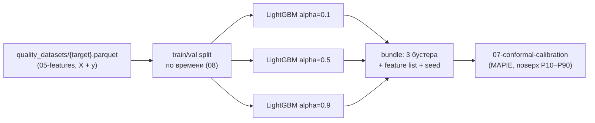

# 06 — Обучение квантильных моделей

Файл: `core/src/refinery_core/models/train.py`. Назначение: офлайн-обучение soft sensor'ов
качества — по три LightGBM-модели (P10/P50/P90) на каждый `QualityTarget` из [[05-features]].
Обучение выполняется **на ноутбуке** командой `make train`; ядро в рантайме модели только
читает из реестра (P5) — ни этот модуль, ни [[09-publish-registry]] не живут в рантайме.

## Scope

**Содержит (covers):**

- выборка обучения: чтение `data/processed/quality_datasets/{target}.parquet` (P4, пишет [[05-features]]);
- LightGBM `objective=quantile` c `alpha` = 0.1 / 0.5 / 0.9[^lgbm];
- `monotone_constraints` — физические монотонности признаков;
- цели: сера, собственная модель T95, D15 (с 05.03.2025), ЦЧ — при наличии данных;
- калибровка смещения ВАК CFPP ≈ −11 °C (как признак с поправкой);
- фиксированные seed'ы и детерминизм.

**НЕ содержит (does NOT cover):** конформную калибровку ([[07-conformal-calibration]]),
валидацию и метрики ([[08-validation-timesplit]]), запись артефактов ([[09-publish-registry]]),
инференс в рантайме (core-architecture, [[10-refusal]]).

## 1. Цели обучения (QualityTarget → данные)

| Target | Метки | Объём меток | Источник меток | Комментарий |
| --- | --- | --- | --- | --- |
| `sulfur` | мг/кг, ≤ 10 | ЛИМС n=1462 (раз в сутки) + ПАК 189 649 т. + Q21 n≈183,6 тыс. | приоритет ЛИМС → ПАК → Q21[^prio] | главная цель; 2026 прижат к границе (годовое Q21 = 10,08) |
| `t95` | °C, ≤ 360 | ЛИМС 95%.T n=1292 (отбор 2) | только лаба | **своя модель**: формула ВАК не вычислима[^t95] |
| `d15` | кг/м³, 820–845 | ПАК с 05.03.2025 (n≈75,5 тыс.) + ЛИМС D15 n=1015 | ПАК плотномер | короткая история — обучать на хвосте, валидация осторожнее |
| `cetane` | ≥ 51 / 49 | ЛИМС **всего 42 замера** (~29 сут интервал) | только лаба | модель «при данных»: либо бейзлайн-константа, либо отключение цели[^cetane] |

> [!note] Почему отдельные модели, а не одна многовыходная
> У целей разные носители меток (лаба/ПАК), разные объёмы и разные физические монотонности.
> Одна модель на цель = прозрачный SHAP, честная валидация на её собственных метках и
> независимая замена артефакта в реестре ([[09-publish-registry]]).

## 2. Архитектура: 3 квантильные модели на цель



Бандл = 3 независимых бустера + `feature_names` + `monotone_constraints` + seed. Ограничение
инварианта p10 ≤ p50 ≤ p90 — на уровне пост-обработки при инференсе (сортировка квантилей);
у самой LightGBM сквозной гарантии согласованности квантилей нет[^lgbm-quantile].

## 3. Сигнатуры (псевдокод)

```python
# models/train.py
@dataclass(frozen=True)
class TrainConfig:
    target: QualityTarget          # sulfur | t95 | d15 | cetane
    quantiles: tuple[float, ...] = (0.1, 0.5, 0.9)
    seed: int = 42                 # один сид на весь пайплайн (delivery-infra/05)
    params: LgbmParams = LgbmParams()   # num_leaves, learning_rate, min_data_in_leaf, …

def load_dataset(target: QualityTarget, data_dir: Path) -> pl.DataFrame:
    """Читает data/processed/quality_datasets/{target}.parquet (схема [[05-features]])."""

def build_monotone_constraints(features: list[str], target: QualityTarget) -> dict[str, int]:
    """Физические монотонности: {feature: +1 | -1 | 0}. См. §4."""

def train_quantile(X, y, alpha: float, cfg: TrainConfig,
                   constraints: list[int]) -> lgb.Booster:
    """objective=quantile, alpha=alpha; seed фиксирован; deterministic=True."""

def train_target(cfg: TrainConfig) -> QuantileBundle:
    """Полный цикл: датасет → монотонности → 3 бустера → bundle (без записи)."""
```

Обучение НЕ вычисляет метрик и НЕ пишет файлы — это границы [[08-validation-timesplit]]
и [[09-publish-registry]] соответственно.

## 4. Монотонные ограничения — физическая правдоподобность

Бустинг умеет «плавать» против физики на редких режимах; `monotone_constraints` запрещает
модели идти против направления, известного из процесса[^lgbm]:

| Признак (из [[05-features]]) | Target | Монотонность | Физика |
| --- | --- | --- | --- |
| T5 / T11 (T реактора, дубли r=1.00) | sulfur | −1 | выше T → глубже гидрообессеривание → сера ниже |
| расход сырья (F19/F26/F17, дубли) | sulfur | +1 | больше нагрузка → меньше время контакта → сера выше |
| наработка катализатора (`cat_age_days`) | sulfur | +1 | деградация катализатора → сера растёт к концу цикла |
| `lims_age_h` (возраст ЛИМС-метки) | sulfur | 0 | служебный признак — физику не задаём |
| месяц/сезон (зимнее/летнее ДТ) | d15, t95 | 0 | годовой цикл ±10–20 °C — немонотонный по номеру месяца |

```python
# пример: sulfur
constraints = build_monotone_constraints(features, "sulfur")
# {"t5_mean_1h": -1, "t11_mean_1h": -1, "feed_rate_mean_1h": +1,
#  "cat_age_days": +1, "lims_age_h": 0, "month_sin": 0, "month_cos": 0}
```

> [!warning] Проверять фактически
> Связка «quantile + monotone» в документации LightGBM отдельно не описана; по веб-обзору
> есть сообщение о неполной монотонности при quantile-объективе[^lgbm-quantile]. Правило:
> после обучения каждого бустера — грубая проверка (прогноз при ±5 % по монотонному признаку
> движется в заданную сторону на валидационном срезе); провал → снять ограничение с этого
> признака и зафиксировать решение в manifest (`monotone_constraints` — то, что реально
> применялось, см. [[09-publish-registry]] и A.8 [[08-model-artifact]]).

Почему LightGBM, а не CatBoost: у CatBoost квантильная регрессия по умолчанию использует
`leaf_estimation_method=Exact`, с которым монотонные ограничения документально
несовместимы[^catboost] — подтверждено исследованием при выборе стека.

## 5. Признаки и цели — связка с [[05-features]]

- Входы: окна усреднения телеметрии (лаги 0–3 ч[^dop]), `lims_age_h`, `cat_age_days`
  (просадки T5 апр-2024 / май-2026), месяц/сезон, ВАК-формулы T50/T90 как фичи,
  CFPP с калибровкой смещения (§6).
- Дубли каналов (T5↔T11 r=1.00, F19↔F17 r=1.00) — не исключать: бустингу они не вредят,
  а SHAP-объяснение становится устойчивее; но в [[09-publish-registry]] список признаков
  фиксируется ровно в том порядке, в котором учились модели.
- Метки — только строки, чей результат «доступен системе» (анти-утечка `available_ts`,
  [[03-sync-freshness]]): учебная пара (X(t), y) строится так, как если бы y стал известен
  в момент t + ≤4 ч[^lims].

## 6. Калибровка смещения CFPP ≈ −11 °C

Исправленная ВАК-формула CFPP систематически занижает уровень относительно ЛИМС:
−20,9 / **−17,4** / −12,6 (p5/медиана/p95) против лабораторной медианы −6,2 °C —
смещение ≈ −11 °C[^vak]. Обработка в пайплайне признаков (не в модели):

```python
def calibrate_cfpp_offset(vak_cfpp: pl.Series, lims_cfpp: pl.Series) -> float:
    """offset = median(lims_cfpp - vak_cfpp) на обучающей части; ≈ +11 °C."""
    # признак `cfpp_calibrated = vak_cfpp + offset`; offset фиксируется в manifest.
```

Правило: offset оценивается **только на train-периоде** и передаётся константой в
[[09-publish-registry]] (поле `conformal.params` или отдельный блок `feature_transforms`) —
иначе валидация на holdout ([[08-validation-timesplit]]) считает смещение с будущих данных.

## 7. Сид и воспроизводимость

- Один `SEED` из окружения (дефолт 42, delivery-infra/04) прокидывается во все бустеры:
  `seed`, `feature_fraction_seed`, `bagging_seed`, `data_random_seed`;
  `deterministic=True`, `force_row_wise=True` — чтобы исключить недетерминизм гистограмм.
- Никаких скрытых случайностей: сэмплирование строк/фичей либо отключено, либо тоже под сидом.
- Итог детерминизма проверяется тестом [[10-tests]] («один сид → одинаковый прогноз»).

```python
LGBM_BASE = dict(objective="quantile", deterministic=True, force_row_wise=True,
                 num_leaves=31, learning_rate=0.05, min_data_in_leaf=40,
                 feature_fraction=0.9, bagging_fraction=0.9, bagging_freq=1,
                 verbosity=-1)  # остальное — перебор вручную на ноутбуке, без Optuna
```

> [!info] Обучение на ноутбуке — осознанное упрощение
> Требование «LLM ≤ ~30B локально» касается нарратора
> (core-architecture/90), а не этого пайплайна: LightGBM на ~180 тыс. точек × десятки
> признаков обучается за минуты на CPU ноутбука. Дистрибутивное обучение, GPU и
> гиперпараметрический поиск — вне скоупа; перебор параметров ручной и
> воспроизводимый (зафиксирован в manifest гиперпараметров, [[09-publish-registry]]).

## 8. Правила дизайна

1. Одна модель = один артефакт = одна цель. Никаких мульти-target бандлов в manifest.
2. Монотонности — только физически обоснованные (§4); «0» по умолчанию; после обучения — проверка фактически.
3. Метки с анти-утечкой: никакая учебная пара не знает будущее раньше `available_ts`.
4. Seed everywhere; результат обучения битовоспроизводим на той же машине/версиях.
5. Квантили сортируются при инференсе (p10 ≤ p50 ≤ p90) — договор с A.3 QualityAssessment.

---

[^prio]: Правило приоритета источников: «Приоритет по качеству: ЛИМС → ПАК → расчётные/виртуальные анализаторы. Если значения расходятся, лабораторный результат считается контрольным фактом».
[^t95]: По истории данных: T95 содержит член `LIMS:24-2000.Pipeline.95%.T` — точки нет в выгрузке (открытый вопрос № 1); без него ≈ 264 °C против лабораторных 347 °C → собственная модель по 95%.T (n=1292).
[^cetane]: По истории данных: «CetaneNumber — 54.3, min 50, max 57.8 (всего 42 замера, интервал ~29 суток)» — на 42 точках бустинг не обучается честно.
[^lgbm]: LightGBM Parameters Reference — https://lightgbm.readthedocs.io/en/latest/Parameters.html: «objective=quantile», параметр «alpha (доля квантили, default 0.9)», «monotone_constraints (1/0/-1)».
[^lgbm-quantile]: Проверенный факт: «Сочетание “quantile + monotone” в документации отдельно не описано; есть issue о неполной монотонности при quantile-объективе… при использовании — проверять на данных».
[^catboost]: там же: «monotone constraints несовместимы с leaf_estimation_method=Exact (дефолт для Quantile; тикет catboost#1896)».
[^dop]: Требование ритма: горизонт прогноза 0–3 ч, шаг рекомендаций 15–60 мин.
[^lims]: Правило задержки публикации ЛИМС: «метка времени = момент отбора пробы; до публикации результата проходит до 4 часов… При исторической валидации результат ЛИМС доступен системе только через ≤ 4 ч после метки — иначе утечка будущего».
[^vak]: По истории данных: «CFPP исправленный систематически занижен относительно ЛИМС (−17 vs −6.2) — требует калибровки».
