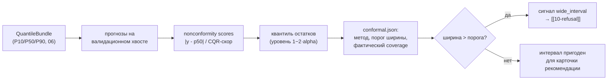
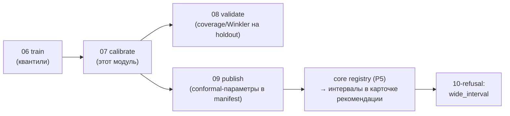

# 07 — Конформная калибровка интервалов

Файл: `core/src/refinery_core/models/calibrate.py`. Назначение: превратить сырые квантили
P10/P50/P90 из [[06-train-quantile]] в честные предикционные интервалы с измеренным покрытием
и зафиксированной шириной; ширина интервала становится **сигналом доверия** для ядра отказа
([[10-refusal]], причина `wide_interval`). Работает офлайн (обучение/калибровка), артефакт
публикует [[09-publish-registry]].

## Scope

**Содержит (covers):** MAPIE поверх квантильных моделей (CQR / EnbPI / ACI[^mapie]);
калибровка на валидационном хвосте по времени; расчёт фактического coverage; правило
«ширина интервала → отказ»; параметры калибровки как сериализуемый блок.

**НЕ содержит (does NOT cover):** метрики holdout и `metrics.json` ([[08-validation-timesplit]]);
запись артефактов ([[09-publish-registry]]); применение порогов в рантайме (core-architecture/10).

## 1. Зачем конформ поверх квантилей

Квантильная регрессия бустинга даёт интервалы без гарантии покрытия: на сдвиге режима
(2026 прижат к границе серы) фактическое покрытие может упасть ниже номинала. Conformal
prediction докалибровывает интервалы по отложенной выборке и даёт
распределённо-свободную гарантию покрытия на этой выборке[^cp].



> [!info] Паттерн из литературы
> «Связка “quantile boosting + conformal-калибровка + правило отказа” — не экзотика, а
> воспроизводимый паттерн из литературы; ширина конформного интервала и/или попадание теста
> в интервал — формальный триггер “отказа от рекомендации” при плохих данных».

## 2. Выбор метода MAPIE

| Метод | Когда применяем | Особенность |
| --- | --- | --- |
| CQR (`ConformalizedQuantileRegressor`) | базовый вариант для всех целей | калибрует границы вокруг готовых P10/P90 — минимальная цена для бандла [[06-train-quantile]] |
| EnbPI (`TimeSeriesRegressor`, `method="enbpi"`) | sulfur, t95 — если остатки автокоррелированы | блочный бутстрап + обновление остатков через `update()`[^mapie] |
| ACI (adaptive conformal inference) | запасной вариант при дрейфе | адаптивный уровень покрытия на ряду |

Практика проекта: начинаем с CQR (дёшево, работает поверх существующих квантилей);
если на валидационном хвосте [[08-validation-timesplit]] покрытие систематически ниже цели —
переключаем цель на EnbPI. Библиотека MAPIE (scikit-learn-contrib) совместима с любым
sklearn-эстиматором[^mapie]; LightGBM-бустеры оборачиваются в sklearn-совместимый адаптер.

## 3. Правило калибровочного набора

> [!warning] Калибровка — тоже по времени
> Калибровочный набор — **временной хвост после обучающего**, с тем же gap ≥ 3 ч
> ([[08-validation-timesplit]] §2). Никогда не калибруем на случайной подвыборке всего
> периода: это та же утечка будущего, что и перемешанный train/test сплит[^tz].

Схема разрезов периода 2023-01-01 → 2026-08-07:

| Срез | Период | Кто использует |
| --- | --- | --- |
| train | 2023-01-01 → 2025-12-31 | обучение квантилей ([[06-train-quantile]]) |
| calibration | 2026-01-01 → 2026-06-30 | подгонка конформных порогов (этот модуль) |
| holdout | 2026-07-01 → 2026-08-07 | финальная честная оценка ([[08-validation-timesplit]]); после калибровки не трогается |

Смещение CFPP ([[06-train-quantile]] §6) и конформные пороги оцениваются **только на train+calibration**.

## 4. Сигнатуры (псевдокод)

```python
# models/calibrate.py
@dataclass(frozen=True)
class ConformalConfig:
    method: str = "cqr"            # "cqr" | "enbpi" | "aci"
    alpha: float = 0.10            # цель: двустороннее покрытие 80 % (P10–P90)
    block_size: int = 18           # BlockBootstrap: 18 точек = 3 ч (для enbpi)
    coverage_target: float = 0.80

def fit_conformal(bundle: QuantileBundle,
                  X_cal: pl.DataFrame, y_cal: pl.Series,
                  cfg: ConformalConfig) -> ConformalParams:
    """CQR/EnbPI калибровка на валидационном хвосте. Возвращает сериализуемые параметры."""

def coverage_score(y_true, lo, hi) -> float:
    """Доля точек в интервале; считаем и на калибровке, и на holdout (08)."""

def interval_quality(y_true, lo, hi) -> float:
    """Средняя ширина интервала — оптимизируем «ширина ↓ при coverage ≥ цели»."""
```

Параметры калибровки (`ConformalParams`) — плоский JSON-совместимый словарь, который
[[09-publish-registry]] кладёт в артефакт как `conformal` (форма manifest [[08-model-artifact]]
[[08-model-artifact]]):

```json
{"method": "enbpi", "params": {"gamma": 0.05, "cv": "split", "block_size": 18},
 "coverage_target": 0.80, "width_threshold": 3.2, "calibrated_on": "2026-01-01..2026-06-30"}
```

## 5. Ширина интервала как сигнал доверия (ядро отказа)

Порог ширины подбирается офлайн, чтобы отсекать состояния, в которых интервал пересекает
границу спецификации[^refusal]:

| Target | Спецификация | Правило wide_interval (пример порога) |
| --- | --- | --- |
| sulfur | ≤ 10 мг/кг | P90 с конформ-добавкой пересекает 10 при P50 ≤ 10 → «риск»; ширина > 3 мг/кг → отказ |
| t95 | ≤ 360 °C | аналогично, ширина > 8 °C → отказ |
| d15 | 820–845 кг/м³ | выход P10–P90 за коридор ширины ±4 кг/м³ |
| cetane | ≥ 51 / 49 | ширина > 1,5 пункта → отказ (данных мало — интервалы широкие) |

Числа порогов — стартовые; итог фиксируется в артефакте и переопределяется только вместе с
переобучением. В рантайме ядро берёт `interval_width` из A.3 QualityAssessment и сравнивает
с порогом — логика отказа целиком в core-architecture/10, здесь только калибровка порога.

```python
def choose_width_threshold(scores_cal, spec_limit: float, p50_cal, hi_cal) -> float:
    """Минимальный порог, при котором доля ложных тревог ≤ 5 % на калибровке
    и интервалы, пересекающие spec_limit, всегда дают wide_interval."""
```

## 6. Связь с остальным пайплайном



Инварианты договора:

1. `conformal_applied = true` в A.3 QualityAssessment ⇔ артефакт содержит непустой блок `conformal`.
2. Калиброванные интервалы сохраняют порядок p10 ≤ p50 ≤ p90 (обрезка/расширение симметричны).
3. Пороги ширины не меняются в рантайме — только переобучением (детерминизм, delivery-infra/05).
4. Если coverage на калибровке < цели − 0,05 → цель помечается «не готова к рекомендации»:
   артефакт публикуется с `active: false` (решение за [[09-publish-registry]]).

## 7. Правила дизайна

1. Конформ — поверх, а не вместо: квантильные модели остаются интерпретируемыми для SHAP
   (core-architecture/11 читает только их).
2. Один метод на цель за раз; переключение метода = новый артефакт, не патч старого.
3. Вся калибровка детерминирована: блоки бутстрапа под сидом из `SEED`.
4. Пороги ширины хранятся вместе с методом — единый источник для [[10-refusal]].

---

[^mapie]: MAPIE (scikit-learn-contrib): https://github.com/scikit-learn-contrib/MAPIE, документация https://mapie.readthedocs.io/en/stable/ — «TimeSeriesRegressor с методами EnbPI (блочный бутстрап + обновление остатков через update()) и ACI (adaptive conformal inference), в паре с BlockBootstrap»; для квантильных моделей — «ConformalizedQuantileRegressor (CQR)».
[^cp]: Conformal prediction — индустриальный стандарт «доверия к прогнозу»: распределённо-свободные гарантии покрытия (например, 95 %) на калибровочном наборе, model-agnostic, дёшев в реальном времени (inductive/split CP).
[^tz]: Правило валидации по времени: «Проверяйте систему на данных, отделённых по времени. Случайное перемешивание строк при train/test split для временных рядов не допускается, если оно приводит к утечке информации из будущего».
[^refusal]: Отказ — штатный первоклассный ответ; причина `wide_interval` — «интервал неопределённости пересекает границу спецификации» (enum `RefusalReason`, [[01-enums]]).
