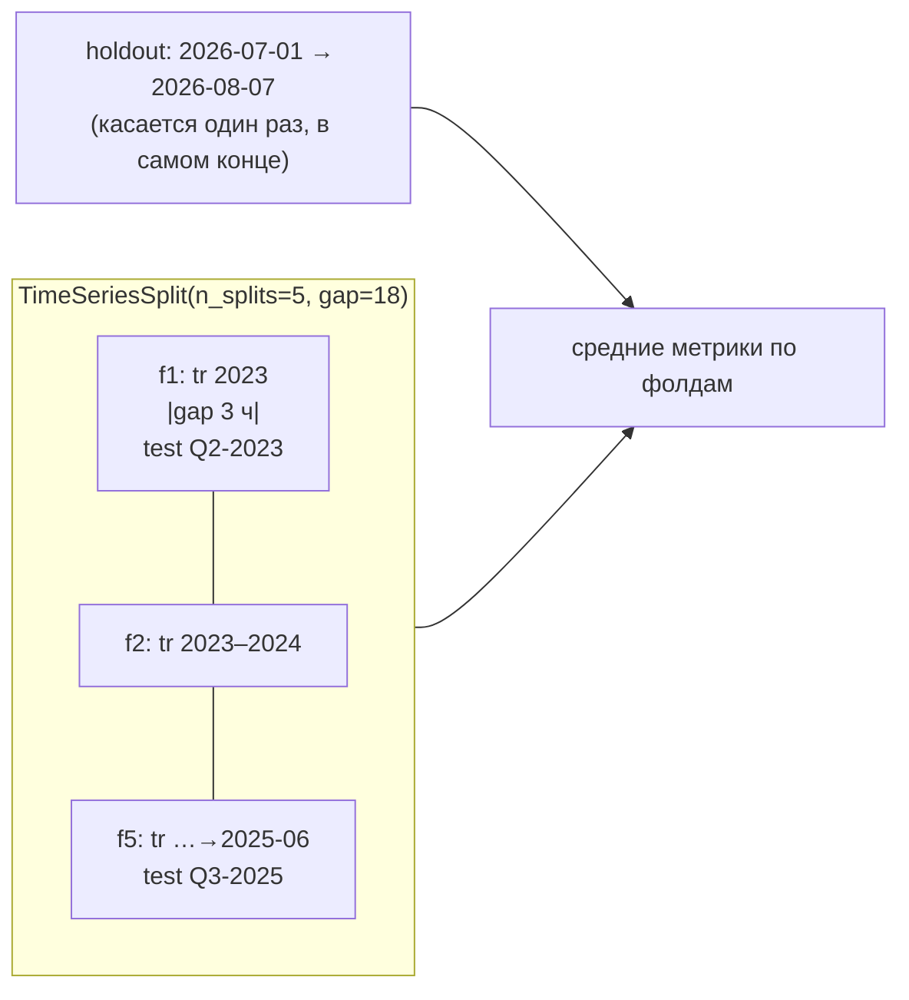

# 08 — Валидация: TimeSeriesSplit с gap, holdout 2026

Файл: `core/src/refinery_core/models/validate.py`. Назначение: единственный валидатор
пайплайна обучения. Никакого перемешивания — все разрезы только по времени; CV-фолды с
gap ≥ 3 ч; финальный holdout — хвост периода (2026). Итог — `artifacts/metrics.json` (P4),
который [[09-publish-registry]] копирует в manifest артефакта.

## Scope

**Содержит (covers):** TimeSeriesSplit с gap; holdout 2026; метрики MAE (сера), coverage
P10–P90, Winkler; таблицу-шаблон результатов; запись `metrics.json`.

**НЕ содержит (does NOT cover):** обучение ([[06-train-quantile]]), калибровку
([[07-conformal-calibration]]), публикацию артефактов ([[09-publish-registry]]), рантайм.

## 1. Запрет перемешивания — правило валидации по времени

> [!danger] Валидация по времени
> «Проверяйте систему на данных, отделённых по времени. Случайное
> перемешивание строк при train/test split для временных рядов не допускается, если оно
> приводит к утечке информации из будущего».

Утечки будущего в нашем пайплайне три источника, и каждый закрыт конструктивно:

| Источник утечки | Защита | Где |
| --- | --- | --- |
| метка ЛИМС публикуется через ≤ 4 ч | `available_ts = sample_ts + 4 ч`; пары (X, y) строятся по доступности | [[03-sync-freshness]], [[06-train-quantile]] §5 |
| лаговые признаки смотрят вперёд | только лаги 0–3 ч назад от `t_point`; окна — до отбора пробы | [[05-features]] |
| автокорреляция рядов через границу сплита | gap ≥ 3 ч между train и test в каждом фолде | этот модуль |

Терминологически наш `gap` — упрощённый аналог embargo из purged cross-validation
(Лопес де Прадо); полный purged/CPCV для 3-летнего датасета избыточен[^purged].

## 2. Схема сплитов



- `TimeSeriesSplit(n_splits=5, test_size=24*7*6, gap=18)` на 10-минутной сетке:
  **gap = 18 точек = 3 ч**[^gap] — покрывает максимальный лаг признаков и горизонт прогноза
  0–3 ч[^dop]; тест-окно — неделя.
- Для целей с редкими метками (ЛИМС раз в сутки: сера n=1462, T95 n=1292) CV считается
  на лабораторных строках: gap = 18 сэмплов сетки ≈ 0,3 сут — при 24-часовом ритме лабы
  это гарантирует, что ни одна метка train не «видит» тестовый режим; дополнительно
  train-фолд обрезается по `available_ts < test_start`.
- **Holdout 2026 — финальный хвост (июль–август 2026)**: трогается один раз после
  заморозки гиперпараметров и калибровки; его метрики публикуются в артефакте
  (`metrics.holdout`) и показываются на странице «Модели» (frontend/15).
- Основание holdout на 2026: год прижат к границе серы (годовое Q21 = 10,08; рост
  8,18 → 10,08 по годам[^data]) — худший и самый честный сценарий.

> [!warning] Никогда
> KFold со `shuffle=True`, случайный holdout, «прогрессия по строкам CSV» — запрещены
> кодом: валидатор принимает только отсортированный по времени датасет и сам проверяет
> монотонность `ts` (тест [[10-tests]]).

## 3. Метрики

| Метрика | Формула / счётчик | По каким целям | Зачем |
| --- | --- | --- | --- |
| MAE | `mean(|y − p50|)` | все; главная — sulfur | операторская наглядность: ошибка в мг/кг |
| WAPE | `Σ|y−p50| / Σ|y|` | sulfur, d15 | сопоставимость при дрейфе уровня |
| pinball | `ρ_τ(y, q)` τ = 0.1/0.5/0.9 | все | качество каждого квантиля по отдельности |
| coverage P10–P90 | доля `p10 ≤ y ≤ p90` | все | проверка конформа [[07-conformal-calibration]] против цели 0,80 |
| Winkler score | `w_α(y, lo, hi)` на P10–P90 | все | покрытие **и** ширина одним числом — не раздуть интервал ради coverage |

```python
def winkler_score(y, lo, hi, alpha: float) -> float:
    """Winkler: (hi-lo) + (2/alpha)·(lo-y)·I[y<lo] + (2/alpha)·(y-hi)·I[y>hi]"""
```

Coverage считается и по фолдам, и на holdout; расхождение между фолдами и holdout > 0,1 —
стоп-сигнал публикации (артефакт выходит с `active: false`, решает [[09-publish-registry]]).

## 4. Сигнатуры (псевдокод)

```python
# models/validate.py
@dataclass(frozen=True)
class ValidationConfig:
    n_splits: int = 5
    gap_points: int = 18          # 18 × 10 мин = 3 ч
    test_weeks: int = 1
    holdout_start: str = "2026-07-01"
    coverage_target: float = 0.80

def make_folds(df: pl.DataFrame, cfg: ValidationConfig) -> list[Fold]:
    """TimeSeriesSplit по ts; assert: ts монотонный, gap ≥ cfg.gap_points в каждом фолде."""

def evaluate_fold(model_bundle, fold: Fold) -> FoldMetrics:
    """MAE, WAPE, pinball×3, coverage, winkler — на тесте фолда (инференс с конформом 07)."""

def validate_target(target: QualityTarget, cfg: ValidationConfig) -> MetricsReport:
    """CV-фолды + holdout 2026 → MetricsReport (без записи файлов)."""

def write_metrics_json(reports: dict[QualityTarget, MetricsReport], path: Path) -> None:
    """artifacts/metrics.json (P4); включает sha256 датасетов и версии."""
```

## 5. Таблица-шаблон результатов (заполняется при первом `make train`)

| Target | Метрика | CV (среднее ± std по 5 фолдам) | Holdout 2026-07–08 | Цель / стоп-сигнал |
| --- | --- | --- | --- | --- |
| sulfur | MAE, мг/кг | TBD | TBD | < 1,0[^mae]; > 1,5 → пересмотр признаков |
| sulfur | WAPE | TBD | TBD | < 0,12 |
| sulfur | coverage P10–P90 | TBD | TBD | 0,80 ± 0,05; иначе метод конформа меняется ([[07-conformal-calibration]] §2) |
| sulfur | Winkler (P10–P90) | TBD | TBD | сравнение между фолдами, без абсолютной цели |
| t95 | MAE, °C | TBD | TBD | < 4 °C |
| t95 | coverage / Winkler | TBD | TBD | как у sulfur |
| d15 | MAE, кг/м³ | TBD | TBD | < 4 кг/м³ (история только с 05.03.2025[^data]) |
| cetane | MAE | — (n=42[^data]) | — | цель отключена до появления данных |
| все | gap в каждом фолде | 18 точек = 3 ч | — | тест [[10-tests]] |

Таблица копируется в итоговый отчёт; численно в `metrics.json` — полными
значениями всех метрик и по фолдам, и на holdout.

## 6. Контракт `artifacts/metrics.json` (P4)

```json
{"sulfur": {"cv": {"mae": 0.61, "wape": 0.072, "pinball_p50": 0.31, "coverage": 0.81, "winkler": 2.9},
            "holdout": {"mae": 0.52, "wape": 0.061, "pinball_p50": 0.35, "coverage": 0.83, "winkler": 3.1},
            "n_splits": 5, "gap_points": 18, "holdout_start": "2026-07-01",
            "data_sha256": {"quality_datasets/sulfur.parquet": "e3b0c442…"}, "pipeline_version": "0.1.0"}}
```

Формат — договор с data-store/06-artifacts-catalog.md и P4; [[09-publish-registry]]
переносит `holdout`-блок в manifest артефакта (поле `metrics` из A.8 [[08-model-artifact]]).

## 7. Правила дизайна

1. Валидатор — единственный источник метрик: [[06-train-quantile]] и [[07-conformal-calibration]]
   метрики не считают, чтобы не размножить определения.
2. Любой сплит — по времени; gap ≥ 3 ч; holdout — один раз, в конце всего процесса.
3. Метрики без конформ-слоя не публикуются: coverage — часть контракта модели.
4. Каждый `metrics.json` фиксирует хэши данных и версию пайплайна — воспроизводимость
   (delivery-infra/05: «хэши данных и версии в отчётах»).

---

[^tz]: Правило валидации по времени — цитата приведена дословно в §1 этого документа.
[^gap]: scikit-learn TimeSeriesSplit — https://scikit-learn.org/stable/modules/generated/sklearn.model_selection.TimeSeriesSplit.html: параметр `gap` («выбрасывает gap сэмплов из конца обучающего окна перед тестовым»); семантика подтверждена проверкой по документации.
[^purged]: Для нашего 0–3-часового горизонта достаточно: TimeSeriesSplit + gap ≥ максимального лага/горизонта… + финальный hold-out по хвосту периода; «CPCV не реализуем — избыточно».
[^dop]: Горизонт прогноза 0–3 ч.
[^data]: По истории данных: «Q21 растёт: 8.18 (2023) → … → 10.08 (2026)»; «D15 … только с 2025-03-05»; «CetaneNumber … всего 42 замера».
[^mae]: ориентир MAE < 1,0 мг/кг обоснован разбросом метки: медиана ЛИМС 8,60, p5–p95 ≈ 4,8–11,6 — ошибка в разы меньше рабочего диапазона.
