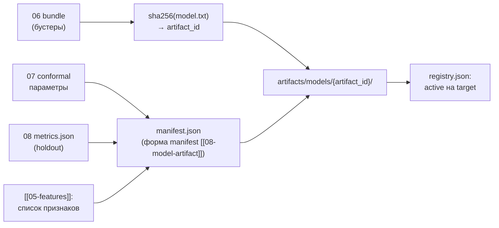

# 09 — Выпуск артефактов и реестр моделей (сторона производителя, P5)

Файл: `core/src/refinery_core/models/publish.py`. Назначение: превратить результаты
[[06-train-quantile]] + [[07-conformal-calibration]] + [[08-validation-timesplit]] в
папку артефакта `artifacts/models/{artifact_id}/` и обновить `registry.json`.
Это **производитель** реестра: читателем является ядро (P5, core-architecture/02 —
`ModelRegistry.load`), которое в рантайме только загружает активные модели.

## Scope

**Содержит (covers):** запись manifest.json (форма manifest [[08-model-artifact]]) + весов `model.txt` + conformal-параметров;
sha256-хэши данных и весов; `trained_on_range`; `registry.json`; выбор активной модели; откат.

**НЕ содержит (does NOT cover):** загрузку/прогрев моделей ядром (core-architecture/02),
инференс, обучение и валидацию ([[06-train-quantile]]–[[08-validation-timesplit]]), запись
`metrics.json` (делает [[08-validation-timesplit]] §6, здесь — только чтение и копирование).

## 1. Каталог артефакта (P5)

```text
artifacts/models/
  registry.json                          # индекс: [{artifact_id, target, active, created_at}]
  sulfur-lgbm-a1b2c3d4/
    manifest.json                        # полная форма manifest [[08-model-artifact]] ModelArtifact + data_hashes
    model.txt                            # LightGBM-бандл: 3 бустера P10/P50/P90
  t95-lgbm-9f1e2d3c/
    manifest.json
    model.txt
```

Имя каталога = `artifact_id = {target}-{algo}-{hex8}`, hex8 — первые 8 символов sha256
`model.txt` (совпадает с примером manifest [[08-model-artifact]]).



## 2. Контракт manifest.json (форма manifest [[08-model-artifact]])

```json
{"artifact_id": "sulfur-lgbm-a1b2c3d4", "target": "sulfur", "algorithm": "lightgbm_quantile",
 "quantiles": [0.1, 0.5, 0.9], "model_uri": "artifacts/models/sulfur-lgbm-a1b2c3d4/model.txt",
 "conformal": {"method": "enbpi", "params": {"gamma": 0.05, "cv": "split"}, "width_threshold": 3.2},
 "coverage": 0.83,
 "metrics": {"wape": 0.061, "mae": 0.52, "pinball_p50": 0.35},
 "trained_on_range": {"start": "2023-01-01T00:00:00Z", "end": "2026-06-30T00:00:00Z"},
 "features": ["t5_mean_1h", "feed_rate_mean_1h", "lims_age_h", "cat_age_days", "cfpp_calibrated"],
 "monotone_constraints": {"t5_mean_1h": -1, "feed_rate_mean_1h": 1, "cat_age_days": 1},
 "hyperparams": {"num_leaves": 31, "learning_rate": 0.05, "min_data_in_leaf": 40},
 "data_hashes": {"quality_datasets/sulfur.parquet": "e3b0c442…", "lims.parquet": "9f86d081…"},
 "feature_transforms": {"cfpp_offset": 11.0},
 "created_at": "2026-09-19T20:10:00Z", "seed": 42, "core_version": "0.1.0", "active": true}
```

Поля и их происхождение:

| Блок manifest | Источник | Смысл для читателя (ядро) |
| --- | --- | --- |
| `features` (порядок = порядок обучения) | [[06-train-quantile]] | сборка вектора X в рантайме; порядок менять нельзя |
| `monotone_constraints` | [[06-train-quantile]] §4 | паспорт физики модели; отображается на странице «Модели» |
| `conformal` + `width_threshold` | [[07-conformal-calibration]] §4–5 | параметр конформа; порог для `wide_interval` ([[10-refusal]]) |
| `coverage`, `metrics` | [[08-validation-timesplit]] §6 | метрики holdout на `/api/models` и в отчётах |
| `trained_on_range` | диапазон ts обучающего набора | вход `out_of_training_domain` для отказа[^domain] |
| `data_hashes`, `seed`, `hyperparams`, `core_version` | пайплайн | воспроизводимость: дата+данные+сид+версии → битовое совпадение |

## 3. Сигнатуры (псевдокод)

```python
# models/publish.py
@dataclass(frozen=True)
class PublishConfig:
    models_dir: Path = Path("artifacts/models")
    activate: bool = True          # делать ли новый артефакт активным

def build_artifact_id(target: QualityTarget, model_txt: bytes) -> str:
    """f"{target.value}-{algo}-{sha256(model_txt)[:8]}\""""

def write_artifact(bundle: QuantileBundle, conformal: ConformalParams,
                   metrics: MetricsReport, cfg: PublishConfig) -> ArtifactRef:
    """model.txt (bytes) → sha256 → каталог → manifest.json (форма manifest [[08-model-artifact]])."""

def update_registry(ref: ArtifactRef, activate: bool) -> None:
    """Читает registry.json, добавляет запись, при activate=True переключает active."""
```

## 4. registry.json и выбор активной модели

```json
{"version": 1,
 "artifacts": [
   {"artifact_id": "sulfur-lgbm-77aa11bb", "target": "sulfur", "active": false, "created_at": "2026-09-17T21:00:00Z"},
   {"artifact_id": "sulfur-lgbm-a1b2c3d4", "target": "sulfur", "active": true,  "created_at": "2026-09-19T20:10:00Z"},
   {"artifact_id": "t95-lgbm-9f1e2d3c",    "target": "t95",    "active": true,  "created_at": "2026-09-19T20:11:00Z"}
 ]}
```

Правило активации:

1. На каждый `QualityTarget` — **ровно одна** `active: true`; проверяется при записи.
2. Новый артефакт активируется только если метрики holdout не хуже стоп-порогов
   ([[08-validation-timesplit]] §5) и coverage в допуске; иначе — публикуется с
   `active: false` (артефакт виден на `/api/models`, но не используется).
3. Активация атомарна: `registry.json` пишется во временный файл + rename — ядро никогда
   не видит полуобновлённый реестр.
4. `core_version` в manifest: расхождение мажорной версии ⇒ читатель игнорирует артефакт[^p5].

## 5. Процедуры отката

> [!example] Откат = перестановка указателя, а не удаление
> Старые каталоги `artifacts/models/{artifact_id}/` никогда не удаляются пайплайном.
> Откат возможен всегда: перечисленные артефакты остаются полными (веса + manifest).

| Ситуация | Процедура |
| --- | --- |
| новая модель хуже на holdout | не активировать (п. 2); активной остаётся прежняя |
| регрессия найдена после активации | `update_registry(prev_id, activate=True)` — ручной флип указателя; прогон с новым артефактом остаётся в `artifacts/runs/` для разбора |
| пересборка истории (v2 датасетов) | обучается новая серия артефактов; старые помечаются в registry комментарием `superseded_by`, не удаляются |
| повреждение `model.txt` | читатель (P5) ловит несовпадение sha256 → `models_not_loaded` (503)[^p5]; производитель — повторный `make train` |

Чек-лист выпуска (`make train`, конец):

- [ ] manifest валиден против формы A.8 (все обязательные поля, p10 ≤ p50 ≤ p90 не требуется — это инвариант инференса);
- [ ] sha256 `model.txt` == hex8 в `artifact_id` и в `data_hashes` — совпадают;
- [ ] ровно одна `active: true` на target;
- [ ] `trained_on_range` покрывает весь train-период и не включает holdout 2026-07+;
- [ ] `artifacts/metrics.json` обновлён до записи registry (порядок: артефакт → метрики → реестр).

## 6. Правила дизайна

1. Пайплайн — единственный писатель `artifacts/models/`; ядро и backend — только читатели
   (правило «пассивного хранилища» data-store/00, P5).
2. Ничего не переписывается задним числом: новый артефакт = новый каталог + новая запись registry.
3. Всё, что нужно ядру для доверия к прогнозу (признаки, диапазоны, пороги, метрики),
   живёт в manifest — никаких внешних «договорённостей».
4. Операции записи атомарны (tmp + rename) для registry; каталог артефакта заполняется
   до появления его записи в registry.

---

[^p5]: Протокол P5: «Ядро никогда не обучает в рантайме — только загружает… Нет active или хэш не сошёлся ⇒ models_not_loaded (backend → 503); расхождение мажорной core_version ⇒ артефакт игнорируется».
[^domain]: [[10-refusal]] (core-architecture): причина `out_of_training_domain` — «состояние вне диапазона обученности/модельных p2–p98» (enum `RefusalReason`, [[01-enums]]); диапазон берётся из `trained_on_range` этого manifest.
