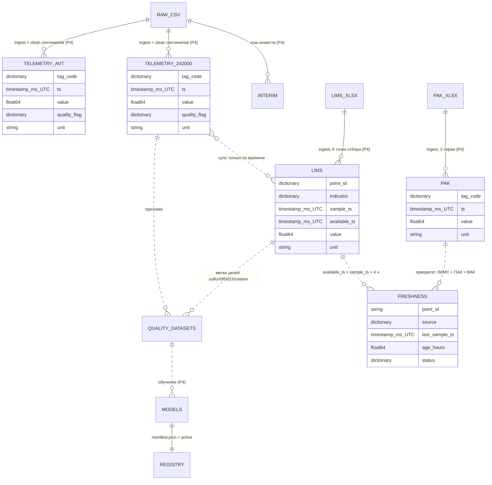
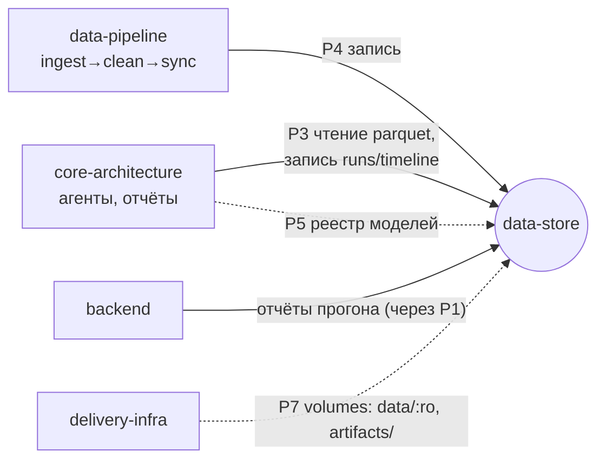

# data-store — пассивное файловое хранилище «Refinery Copilot»

## Scope

| Раздел | Содержимое |
| --- | --- |
| **Содержит** | назначение домена; дерево каталогов `data/` и `artifacts/`; слои `raw / interim / processed` + артефакты; ER-диаграмму датасетов; индекс 7 документов; правила дизайна; кто пишет и кто читает (P3/P4); кросс-доменные зависимости |
| **НЕ содержит** | код; схемы конкретных датасетов (это [[02-dataset-telemetry-242000]], [[03-dataset-telemetry-avt]], [[04-dataset-lims]], [[05-dataset-pak]]); формат артефактов моделей (это [[06-artifacts-catalog]]); логику чистки и инжеста (домен data-pipeline) |
| **Зависит на** | протоколы P3/P4 (пассивность); глобальные правила форм ([[00-SUMMARY]]) и [[03-p3-core-datastore]]/[[04-p4-pipeline-datastore]]; [[01-naming-conventions]] — конвенции имён и времени |

> [!quote] Происхождение домена
> «`database-schema` **заменяется** доменом `data-store`: Parquet-файлы, схемы датасетов,
> соглашения каталогов, JSON-артефакты прогонов». БД не нужна — состояние = Parquet + JSON-артефакты.

Домен не содержит ни строчки кода: это набор конвенций и контрактов «писатель ↔ читатель».
Хранилище пассивно — само ничего не делает, его содержимое полностью определяет состояние
системы и восстанавливается из файлов.

## 1. Слои хранилища

```text
data/
  raw/            исходные выгрузки (CSV/XLSX) — НЕ изменяются никогда
  interim/        кэш инжеста: raw → «сырой» Parquet до чистки (воспроизводим, можно удалить)
  processed/      единственный датасет-источник рантайма: чистые Parquet (zstd), партиции по году
artifacts/
  models/         модели + manifest.json + registry.json (пишет data-pipeline, читает core, P5)
  runs/           {run_id}.json + {run_id}.md — отчёты прогонов (пишет core, P3)
  timeline/       {run_id}.ndjson — журнал событий прогона (реплей SSE)
  metrics.json    метрики валидации пайплайна (пишет data-pipeline)
```

Правила слоёв[^raw]:

1. `data/raw/` — неизменяемый источник. Сентинелы существуют только здесь: «не существуют за пределами data-pipeline: → `null` + `quality_flag`… остаются только в `data/raw/`».
2. `data/interim/` — кэш чтения CSV/XLSX в Parquet до чистки (dtype-схемы, единый часовой пояс); удаляется и пересобирается из `raw/` без потери информации.
3. `data/processed/` — единственное, что читает рантайм: «**рантайм read-only по `data/processed/`** — ядро туда не пишет».
4. `artifacts/` — результаты вычислений (модели, отчёты, метрики); запись разрешена data-pipeline (P4) и core (P3).

## 2. Кто пишет и кто читает

| Объект | Пишет | Читает | Протокол |
| --- | --- | --- | --- |
| `data/processed/*.parquet` (телеметрия, ЛИМС, ПАК, freshness) | data-pipeline | core (Polars `scan_parquet`, lazy) | P4 / P3 |
| `artifacts/models/` + `registry.json` | data-pipeline | core (реестр моделей, прогрев) | P4 / P5 |
| `artifacts/runs/{run_id}.{json,md}`, `artifacts/timeline/{run_id}.ndjson` | core (report/) | backend (раздача отчётов по P1) | P3 |
| `artifacts/metrics.json` | data-pipeline | core, backend, frontend (страница «Модели») | P4 |

> [!warning] Пассивность (штатное правило)
> «`data-store` пассивен: пишут только data-pipeline (P4) и core (артефакты, P3); читают core/backend». Backend читает `data/` только через ядро; frontend не знает о data-store вовсе.

## 3. ER-диаграмма датасетов



Схемы полей каждой сущности — в документах датасетов; канонические DTO (`TagPoint`,
`DataFreshness`, `ModelArtifact`, `RunReport`) определены один раз в домене api
(Часть A) — здесь только физическое Parquet/JSON-представление[^float32].

## 4. Индекс документов

| # | Файл | Назначение | Оценка строк |
| --- | --- | --- | --- |
| 1 | [[data-store/00-OVERVIEW]] | визитная карточка: слои, роли P3/P4, ER, правила | 130 |
| 2 | [[01-naming-conventions]] | имена файлов/каталогов, партиционирование, версии, хэши, время `timestamp[ms, UTC]` | 150 |
| 3 | [[02-dataset-telemetry-242000]] | схема телеметрии гидроочистки 24-2000: 26 тегов, сентинелы, чистка | 190 |
| 4 | [[03-dataset-telemetry-avt]] | схема телеметрии АВТ: 71 тег, D10 мёртвый, W70 | 150 |
| 5 | [[04-dataset-lims]] | схема ЛИМС: 6 точек отбора, 54 серии, анти-утечка ≤ 4 ч, единицы | 190 |
| 6 | [[05-dataset-pak]] | схема ПАК: сера с 01.2023, D15 с 05.03.2025, сверка с ЛИМС только по уровню | 150 |
| 7 | [[06-artifacts-catalog]] | `artifacts/`: models + registry/manifest, runs + timeline, metrics.json | 200 |

Порядок чтения: 00 → 01 → 02–05 → 06. Нумерация = порядок реализации.

## 5. Правила дизайна

> [!warning] Четыре правила домена
> 1. **Пассивность**: пишут только data-pipeline (P4) и core (артефакты, P3); читают core и backend.
> 2. **Без SQL**: «Никакого SQL/ORM: Parquet + JSON полностью восстанавливают состояние — требование закрытого контура on-premise». Ни один протокол P1–P7 не использует БД.
> 3. **Версионирование**: изменение схемы датасета — только новой версией каталога (v1→v2), история не переписывается (детали — [[01-naming-conventions]]).
> 4. **Контракт писатель ↔ читатель**: каждый документ датасета — договор data-pipeline (пишет) и core (читает); поля не добавляются молча — только через версию каталога.

## 6. Кросс-доменные зависимости



- **data-pipeline** ([[01-ingest-csv]], [[02-clean-sentinels]], [[03-sync-freshness]]) — единственный писатель `data/processed/`; определение маски сентинелов, залипаний и анти-утечки — его домен, здесь фиксируются только «что лежит в файле».
- **core-architecture** ([[03-agent-data]], [[12-run-report]], [[02-model-registry]]) — читатель parquet (P3) и реестра моделей (P5), писатель `artifacts/runs/` и `artifacts/timeline/`.
- **api** — канонические формы DTO ([[01-timeseries]], [[02-data-freshness]], [[07-run-report]], [[08-model-artifact]]); физические схемы этого домена ссылаются на них, не дублируя.
- **delivery-infra** — монтирует `data/` как read-only volume и `artifacts/` для записи (P7).

[^raw]: Правило протокола P4: `data/raw/` — неизменяемый источник, только хэши в манифесте.
[^float32]: Каноническое отображение полей в Parquet — таблица форм §0: время `timestamp[ms, UTC]`, nullable → `float64` с NaN = «нет значения», енумы → `dictionary<string>`. Для телеметрии упомянут `float32` — допустимая оптимизация хранения при публикации, контрактным считается `float64`.
