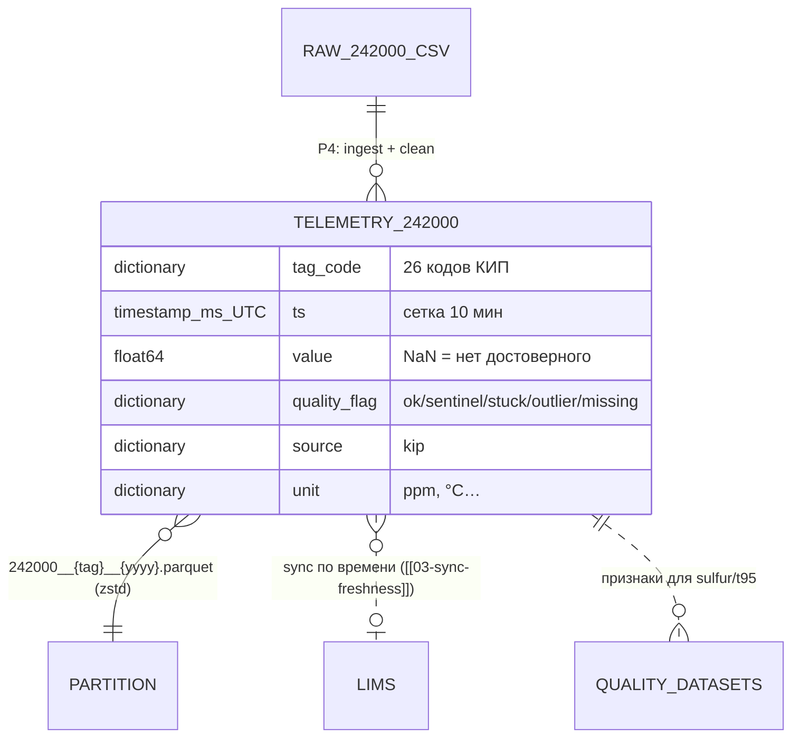

# 02 — Датасет телеметрии 24-2000 (гидроочистка)

## Scope

| Раздел | Содержимое |
| --- | --- |
| **Содержит** | физическую схему Parquet-датасета чистой телеметрии гидроочистки 24-2000; колонки и типы; объём и сетку источника; правила чистки — что изгоняется в `null` + `quality_flag`; пример записи; роли писателя/читателя |
| **НЕ содержит** | телеметрию АВТ ([[03-dataset-telemetry-avt]]); ЛИМС ([[04-dataset-lims]]); ПАК ([[05-dataset-pak]]); алгоритмы чистки и выявления залипаний (домен data-pipeline, [[02-clean-sentinels]]); канонический DTO `TagPoint` ([[01-timeseries]]) |
| **Зависит на** | [[01-naming-conventions]] (имена, время, версии); формы §0/A.1, C.4 (P4); факты — по результатам анализа истории данных |

## 1. Источник и объём

Источник: `data/raw/242000_tags.csv`.

| Параметр | Значение[^razbor1] |
| --- | --- |
| Размер | 189 217 строк × 28 колонок (date + 26 тегов + 1 служебный индекс) |
| Диапазон | 2023-01-01 00:00 → 2026-08-07 00:00 (≈ 189 тыс. точек на тег, шаг 10 мин) |
| Сетка | ровно 10 мин, пропусков нет: «медиана = p99 = max = 10.0 мин» |
| Пропуски | «**0.00 % по всем тегам** — полной сетки ничего не missing» |
| Сентинелы | «Главный факт вместо пропусков — коды „недостоверного значения“ (сентинелы): 307, 251, 252, 240» |

> [!quote] Сентинелы вместо пропусков
> «Они вписаны в поток вместо пропусков и почти всегда длинными сериями».
> Доли сентинелов по тегам: Q20 — 11.65 % (код 307), T12 — 4.56 %, Q21 — 2.97 % (307),
> F2 — 2.88 %, T16 — 1.76 %, F17 — 1.54 %, F19/F9 — 1.23 %, T23 — 0.77 %, F14 — 0.33 %;
> остальные < 0.1 %.

## 2. Схема Parquet (контракт P4 → P3)

Длинный формат: одна строка = точка одного тега. Партиции `{tag}__{yyyy}` ([[01-naming-conventions]] §2).

| Колонка | Тип | Nullable | Описание |
| --- | --- | --- | --- |
| `tag_code` | `dictionary<string>` | нет | короткий код колонки CSV: `P8`, `Q21`, `T5`… (26 значений) |
| `ts` | `timestamp[ms, UTC]` | нет | момент отсчёта; сетка 10 мин, внутри партиции монотонна |
| `value` | `float64` | да (NaN = null) | физическое значение; null = «нет достоверного значения» |
| `quality_flag` | `dictionary<string>` | нет | `ok` / `sentinel` / `stuck` / `outlier` / `missing` |
| `source` | `dictionary<string>` | нет | константа `kip` |
| `unit` | `dictionary<string>` | да | заполняется только подтверждёнными единицами (напр. `Q21` → `ppm`); остальное — `null` до подтверждения[^units] |

Примечания к типам: nullable-поле в Parquet — `float64` с NaN; `float32` — допустимая оптимизация при публикации, контракт — `float64`.

## 3. Правила чистки: что изгоняется и как помечается

Контракт датасета: в `value` не существует ни сентинелов, ни физически невозможных значений. «Сентинелы {307, 251, 252, 240}: не существуют за пределами data-pipeline: → `null` + `quality_flag`».

| Явление | Признак (факты истории данных) | Действие в датасете |
| --- | --- | --- |
| Сентинел {307, 251, 252, 240} | «вписаны в поток вместо пропусков и почти всегда длинными сериями» | `value = null`, `quality_flag = sentinel` — безусловно, первая ступень любого пайплайна[^first] |
| Залипание датчика | серии одинаковых значений: Q20 — 17 293 точки (~120 суток), T18 — 6 660, W4/W10 — 2 868, F9 — 2 299; после чистки сентинелов: T18 — 6.7 % точек в сериях ≥ 2 ч, W4/W10 — 2.5/1.8 %, F15/F22/F17/F25 — 2.5–4.6 % | значение сохраняется (оно измерено), `quality_flag = stuck`; порог серии задаёт data-pipeline |
| Зашкал диапазона | потолки: W4/W10 ≤ 10.0, T18 ≤ 99.99, **Q21 плато ровно 24.90** | плато-зашкал изгоняется: `value = null`, `quality_flag = outlier`[^q21] |
| Физически невозможное | пуски/остановы: F19 min −5.03, F9 min −20.24, P8 min −3.80; пик P8 max 7.0 при p99 0.24 (в 30 раз выше) | `value = null`, `quality_flag = outlier`; правило фильтра (0 < значение < p99.5 или маска «установка в работе») — у data-pipeline |
| Отсутствие точки сетки | в источнике не встречается (сетка полная) | резерв: `value = null`, `quality_flag = missing` |
| Мёртвый канал | в этом датасете нет (см. D10 — [[03-dataset-telemetry-avt]]) | — |

Итоговая статистика качества эталонной чистки Q21 (проверка корректности флагов): 5 618 точек сентинела 307 (2.97 %, максимальная серия 4 441 точки ≈ 31 сутки) → `sentinel`; плато 24.9 — 5 420 точек (2.95 %) на 107 днях → `outlier`; «если плато 24.9 считать отказом, реальных превышений 10 мг/кг ≈ **10.7 % точек**»[^q21].

## 4. Содержательный состав тегов (для читателя)

> [!warning] Справочник КИП противоречит данным
> «Справочник КИП 24-2000 противоречит данным (по анализу команд: 17 из 26 кодов…)» и
> «Тегам доверять по поведению значений, не по описанию».
> В датасете хранятся только коды и значения — интерпретация ролей не входит в контракт хранилища.

Поведенческие опоры (детали и таблица — по результатам анализа истории данных):

- температуры (дубли r ≥ 0.99): T5, T6, T11 (+ T12, T16, T23);
- расходы (дубли r = 0.96–1.00): F19, F26, F17 (+ F9 — поток масштаба сырья, F15 — квенч);
- давления: P13 (2.99–4.05 МПа, r = 0.87 с T5), P3;
- сера на выходе: Q21, ppm — «Q21 — содержание серы на выходе гидроочистки, ppm; значение ~307 в ряде — **выброс**»;
- «официальные» управляемые (P8, T11, F19) по факту ведут себя иначе: «температурное поведение у T5/T6/T11, расходное у F19/F26/F17, давление у P13/P3».

Годовой режимный цикл (без дрейфа датчиков): T5 371.3 → 331.8 → 369.9 → 335.9 °C; Q21 растёт 8.18 → 8.65 → 8.75 → 10.08 ppm — поздний период прижат к границе 10 мг/кг[^razbor1]. Следствие для читателя: валидация по времени с учётом сезонности.

## 5. Пример записи

Точка после чистки (сентинел изгнан):

```json
{"tag_code": "Q21", "ts": "2024-04-21T08:10:00Z", "value": null,
 "quality_flag": "sentinel", "source": "kip", "unit": "ppm"}
```

Нормальная точка:

```json
{"tag_code": "T5", "ts": "2023-01-01T00:00:00Z", "value": 372.1,
 "quality_flag": "ok", "source": "kip", "unit": "°C"}
```

Залипание (значение сохранено, помечено):

```json
{"tag_code": "W4", "ts": "2025-06-14T12:40:00Z", "value": 10.0,
 "quality_flag": "stuck", "source": "kip", "unit": null}
```

## 6. Писатель и читатели

| Роль | Домен | Что делает |
| --- | --- | --- |
| Писатель | data-pipeline (P4) | «ingest → clean (маска сентинелов 1-м шагом) → Parquet (P4)»; пишет партиции и обновляет sha256 в `datasets_manifest.json` |
| Читатель | core-architecture (P3) | «рантайм read-only по `data/processed/`», Polars `scan_parquet`, lazy; агент данных собирает состояние, ядро никогда не пишет в датасет |
| Косвенный | backend → core → P1 | сырые точки наружу идут только как DTO `TagPoint` ([[01-timeseries]]); прямого доступа backend к Parquet нет |

## 7. ER-место датасета



[^razbor1]: По истории данных, таблица «Общая картина» и дрейф по годам.
[^units]: Единицы для КИП в источнике не выгружены; подтверждены только опорные (Q21 = ppm). Остальные — `null`: колонка справочная, на неё нельзя опираться при вычислениях.
[^first]: «Маска сентинелов — безусловный первый шаг любого пайплайна; ни одна метрика не считается до неё» — правила data-pipeline.
[^q21]: По истории данных: «(20, 25] — 5 420 точек (2.95 %) — **плато ровно 24.9** блоками по 144 точки/сутки на 107 днях… — отказ/зашкал анализатора, а не реальная сера».
