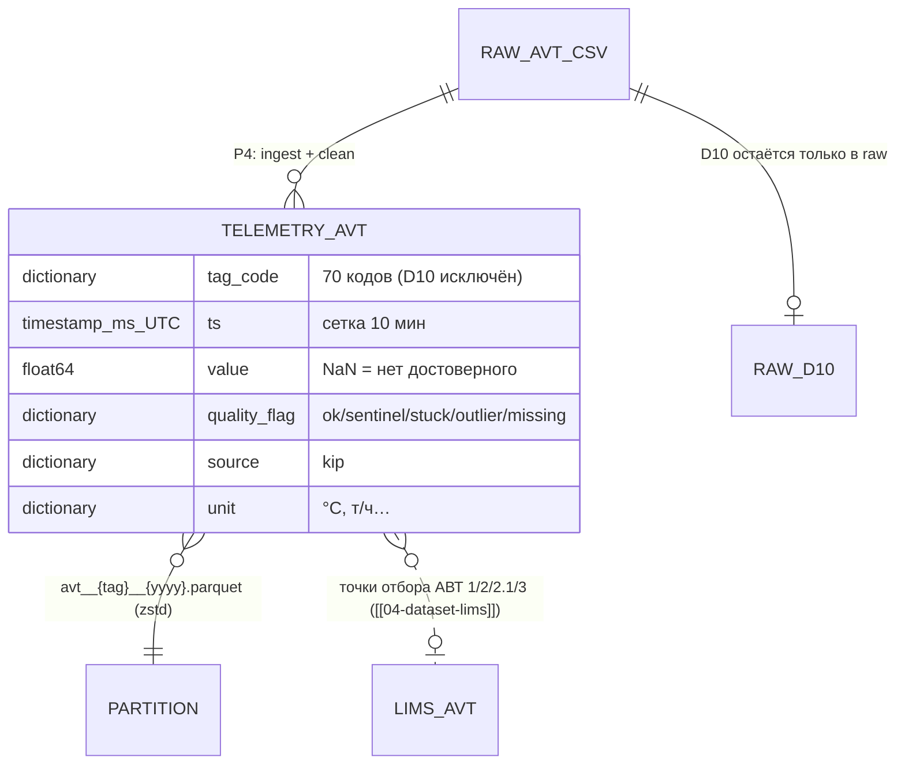

# 03 — Датасет телеметрии АВТ (К-1/К-2/К-10)

## Scope

| Раздел | Содержимое |
| --- | --- |
| **Содержит** | физическую схему Parquet-датасета чистой телеметрии АВТ (71 тег); особенности: мёртвый тег D10, W70 (расхождение справочника), доли сентинелов; правила чистки и исключения; пример записи; роли писателя/читателя |
| **НЕ содержит** | телеметрию 24-2000 ([[02-dataset-telemetry-242000]]); ЛИМС ([[04-dataset-lims]]); ПАК ([[05-dataset-pak]]); алгоритмы чистки ([[02-clean-sentinels]]); разбор позиций тегов на схемах (домен data-pipeline) |
| **Зависит на** | [[01-naming-conventions]] (имена, время, версии); формы §0/A.1, C.4 (P4); факты — по результатам анализа истории данных |

## 1. Источник и объём

Источник: `data/raw/avt_tags.csv`.

| Параметр | Значение[^razbor1] |
| --- | --- |
| Размер | 189 217 строк × 74 колонки (date + 71 тег + 2 служебных индекса) |
| Диапазон | 2023-01-01 00:00 → 2026-08-07 00:00 — тот же период, что у 24-2000 |
| Сетка | ровно 10 мин, пропусков сетки нет (медиана = p99 = max = 10.0 мин) |
| Пропуски | **0.00 % по всем тегам** — как и у 24-2000, «пропуски» закодированы сентинелами {307, 251, 252, 240} |
| Сентинелы по тегам | **D10 — 99.99 %** (мёртвый тег: плотность нефти фактически отсутствует!), F26 — 37.62 %, T39 — 10.2 % (код 252), F28 — 4.89 %, F27 — 2.07 %, F34/F3/F14 — 2–3.3 % |

## 2. Схема Parquet (контракт P4 → P3)

Схема идентична [[02-dataset-telemetry-242000]] §2 — длинный формат, партиции `avt__{tag}__{yyyy}.parquet`:

| Колонка | Тип | Nullable | Описание |
| --- | --- | --- | --- |
| `tag_code` | `dictionary<string>` | нет | короткий код колонки CSV: `T55`, `F65`, `W70`… (70 значений — см. §3 про D10) |
| `ts` | `timestamp[ms, UTC]` | нет | момент отсчёта, сетка 10 мин |
| `value` | `float64` | да (NaN = null) | физическое значение |
| `quality_flag` | `dictionary<string>` | нет | `ok` / `sentinel` / `stuck` / `outlier` / `missing` |
| `source` | `dictionary<string>` | нет | константа `kip` |
| `unit` | `dictionary<string>` | да | заполняется подтверждёнными единицами, иначе `null` |

## 3. Особенности датасета

### 3.1. Мёртвый тег D10

> [!quote]
> «**D10 — 99.99 % (мёртвый тег: плотность нефти фактически отсутствует!)**».

- Решение закреплено правилами пайплайна: «мёртвые каналы (D10 — исключить)» ([[02-clean-sentinels]]).
- Контракт хранилища: D10 **не публикуется** в `data/processed/` — весь поток плотности нефти есть сентинел, писать 189 тыс. строк `null + sentinel` бессмысленно; тег остаётся только в `data/raw/`.
- Факт исключения фиксируется в `datasets_manifest.json` (перечень `excluded_tags` с причиной `dead_channel`) — [[01-naming-conventions]] §5.
- Следствие для потребителей: плотность нефти на входе АВТ в рантайме недоступна; потребность закрывается ЛИМС (D15 по точкам отбора) — [[04-dataset-lims]].

### 3.2. W70 — известное расхождение справочника

> [!quote]
> «Теги КИП АВТ согласованы с данными (расхождение только W70 — массовый расход)»;
> «по данным W70 ≡ F30 с r=1.00 — массовый является парой к объёмному F30».

W70 (массовый расход фр. 290–350 °C, mean 96.0 т/ч) хранится как обычный тег без переименования; его пара к объёмному F30 — знание читателя, не хранилища.

### 3.3. Опорные каналы и залипания

| Явление | Факты истории данных | Контракт датасета |
| --- | --- | --- |
| Сентинелы | F26 — 37.62 %, T39 — 10.2 %, F28/F27/F34/F3/F14 — 2–5 % | `value = null`, `quality_flag = sentinel` |
| Залипания (сырые серии) | F26 — 63 333 точки, T39 — 3 834 | значение сохраняется, `quality_flag = stuck` |
| Залипания после чистки сентинелов | F5 — 7.5 %, F26 — 6.8 %, P52 — 4.7 %, F57 — 4.2 %; у F57 ещё 4.08 % нулей | то же; порог серий — data-pipeline |
| Физически невозможные | F65 min −4.93 (p1 20.96), F5 max 6212 (p99 407), T55 max 417.3 (p99 386.2), отрицательные минимумы P2/P22/P44 | `value = null`, `quality_flag = outlier` |

Опорные «истинные» каналы для читателя: T55 — «температура на выходе из печи П3 (общ., FIRC2470) — единственный явно поименованный выход печи в CSV» (p90 = 384.3 — рабочая зона крайне узкая); F65 — «производительность К-2 по отбензиненной нефти (~900 т/ч — лучший прокси расхода нефти)»; F7/F8/F9 — нефть по трём ходам, сумма ≈ 712 т/ч; дубли: P22≡P23 (r = 1.00), T55≈T48≈T33≈T71 (r = 0.97–0.99)[^razbor8].

### 3.4. Управляемые переменные

Подтверждённые управляемые переменные: расход нефти `crude_feed_rate_tph`, температура выхода печи `avt_furnace_outlet_temp_c`, давление колонны `avt_column_pressure_mpa_abs`. В CSV английских имён нет: «в CSV явно назван только выход П-3 (`T55`)» (см. выше), «таблицы соответствия английских имён и коротких кодов не выдали». Датасет хранит только короткие коды; сопоставление управляемых с кодами (кандидаты: F65/расход, T55/температура печи, P22/давление колонны) — ответственность ядра и сценариев, не хранилища.

## 4. Пример записи

```json
{"tag_code": "T55", "ts": "2026-03-10T06:30:00Z", "value": 380.6,
 "quality_flag": "ok", "source": "kip", "unit": "°C"}
```

```json
{"tag_code": "F26", "ts": "2024-11-02T15:00:00Z", "value": null,
 "quality_flag": "sentinel", "source": "kip", "unit": null}
```

D10 в `data/processed/` отсутствует — соответствующие точки существуют только в `raw/` со значениями-сентинелами.

## 5. Писатель и читатели

| Роль | Домен | Что делает |
| --- | --- | --- |
| Писатель | data-pipeline (P4) | ingest CSV → clean (сентинелы, залипания, исключение D10) → партиции `avt__{tag}__{yyyy}.parquet`; sha256 → `datasets_manifest.json` |
| Читатель | core-architecture (P3) | read-only `scan_parquet`; агент надёжности берёт T55/F65/P22 для индекса тяжести режима, агент оптимизации — сетки круток АВТ ([[07-agent-optimization]]) |
| Косвенный | backend → core | наружу — только DTO `TagPoint` ([[01-timeseries]]) |

## 6. ER-место датасета



[^razbor1]: По истории данных, таблица «Общая картина» и список долей сентинелов.
[^razbor8]: По истории данных: «Ключевые теги» (АВТ), роли каналов, «Модельные диапазоны» (АВТ).
