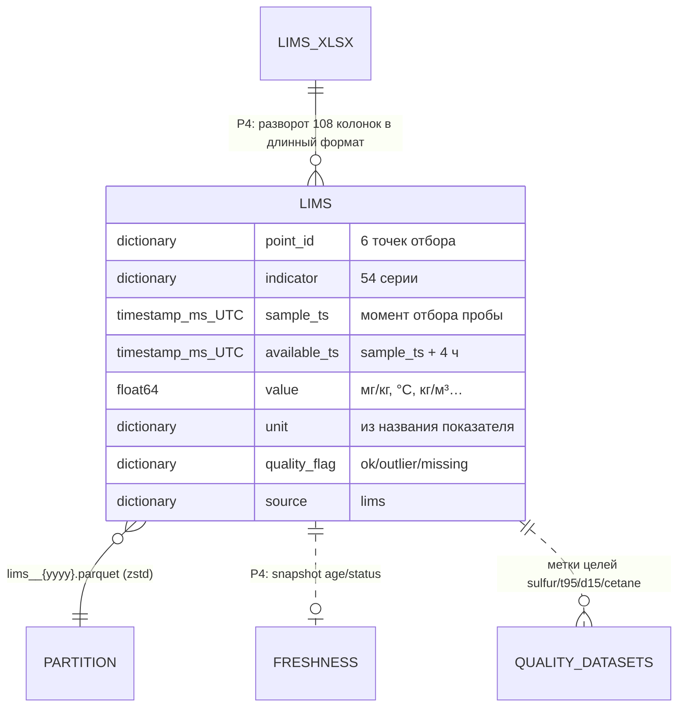

# 04 — Датасет ЛИМС (лабораторные анализы)

## Scope

| Раздел | Содержимое |
| --- | --- |
| **Содержит** | физическую схему Parquet-датасета ЛИМС; точки отбора и серии показателей; колонки и типы; две метки времени (`sample_ts` / `available_ts`) и правило анти-утечки ≤ 4 ч; правило единиц (ошибки строки единиц); правила чистки; пример записи; роли писателя/читателя |
| **НЕ содержит** | вычисление `age_hours`/`status` (это делает data-pipeline в `freshness.parquet`, [[03-sync-freshness]]); ПАК ([[05-dataset-pak]]); приоритеты источников ЛИМС → ПАК → ВАК ([[03-sync-freshness]]); канонический DTO `DataFreshness` ([[02-data-freshness]]) |
| **Зависит на** | [[01-naming-conventions]] (имена, время, версии); [[01-timeseries]], [[02-data-freshness]] (канон), [[04-p4-pipeline-datastore]]; факты — по результатам анализа истории данных |

## 1. Источник и объём

Источник: `data/raw/ЛИМСы 01.01.2023 - н.в_ (2).xlsx` — «1 лист, 1 521 строка × 108 колонок»[^razbor4].

| Параметр | Значение |
| --- | --- |
| Структура листа | 6 блоков «точка отбора», внутри — пары колонок (метка времени, значение) на показатель; строка 1 — показатель, строка 2 — единицы (содержит ошибки), строка 3 — «Количество значений» |
| Содержимое | «Всего **6 точек отбора, 54 серии (точка × показатель), ~35 тыс. замеров**» |
| Диапазон дат | 2023-01-01 → 2026-08-09 |
| Ритм | «Замеры редкие и асинхронные: медианный интервал 24 ч (раз в сутки)»; у цетанового числа 696 ч, у PourPoint отбор-2 — 502 ч |

## 2. Точки отбора и серии

Точки — «положения по ходу процесса (1 — внутри установки, 2 — промежуточные фракции, 3 — конечный выход), не разные временные метки». По 24-2000 — точки до и после установки. `point_id` в датасете — латинский слаг позиции; имя позиции хранится в `datasets_manifest.json`.

| `point_id` | Позиция (источник) | Ключевые серии (n) | Медианный интервал[^razbor4] |
| --- | --- | --- | --- |
| `avt_draw_1` | АВТ, отбор 1 | 50%.T (648), 90%.T (580), 95%.T (649), EBP (648), IBP (648), D15 (219), PourPoint (1255), CFPP (44), I350 (138) | ~48 ч (PourPoint — 24 ч) |
| `avt_draw_2` | АВТ, отбор 2 | 50%.T (212), 90%.T (206), 95%.T (188), EBP (212), IBP (212), D15 (120), CloudPoint (20) | ~26 ч |
| `avt_draw_2_1` | АВТ, отбор 2.1 | 50%.T (191), 90%.T (183), 95%.T (179), EBP (202), IBP (191), D15 (123) | ~27 ч |
| `avt_draw_3` | АВТ, отбор 3 (конечный) | 50%.T (1367), 90%.T (1328), 95%.T (1367), EBP (1367), IBP (1367), CloudPoint (1395), D15 (214) | 24 ч |
| `hdu_feed` | Гидроочистка, отбор 1 (ФРАКЦ_ДИЗ, сырье) | 50%.T (1276), 95%.T (1276), CloudPoint (1256), D15 (42), Mass.Sulfur % масс (132) | 24 ч |
| `hdu_product` | Гидроочистка, отбор 2 (ДТ товарное) | Mg.Sulfur мг/кг (1462), 95%.T (1292), T50 (1252), T90 (1252), CFPP (417), CloudPoint (1201), D15 (1015), FlashPoint (1518), CetaneNumber (42) | 24 ч |

Эталонная точка контроля качества: `hdu_product` + `Mg.Sulfur` — n = 1462, диапазон 2023-01-01 10:00 → 2026-08-09 10:00, «min 0.1, p5 4.81, медиана 8.60, mean 10.12, p95 11.6, max 2120»; «Замеров > 10 мг/кг: 230 (15.7 %)». Цетановое число — «всего 42 замера», медиана 54.3 (min 50, max 57.8)[^razbor4].

## 3. Схема Parquet (контракт P4 → P3)

Партиции `lims__{yyyy}.parquet` по году `sample_ts`. Одна строка = один замер (точка × показатель × время).

| Колонка | Тип | Nullable | Описание |
| --- | --- | --- | --- |
| `point_id` | `dictionary<string>` | нет | слаг точки отбора (§2) |
| `indicator` | `dictionary<string>` | нет | имя показателя как в источнике: `50%.T`, `95%.T`, `Mg.Sulfur`, `CetaneNumber`… |
| `sample_ts` | `timestamp[ms, UTC]` | нет | **момент отбора пробы** — единственная «честная» метка ЛИМС |
| `available_ts` | `timestamp[ms, UTC]` | нет | = `sample_ts + 4 ч`; момент, когда результат легально доступен системе |
| `value` | `float64` | да (NaN = null) | результат анализа |
| `unit` | `dictionary<string>` | нет | единицы из названия показателя (см. §4.2), не из строки единиц |
| `quality_flag` | `dictionary<string>` | нет | `ok` / `outlier` / `missing` (sentinel/stuck к ЛИМС не применяются) |
| `source` | `dictionary<string>` | нет | константа `lims` |

## 4. Правила данных

### 4.1. Анти-утечка: available_ts = sample_ts + ≤ 4 ч

> [!quote] Единственное правило безопасности этого датасета
> «**ЛИМС**: метка времени = **момент отбора пробы**; до публикации результата проходит **до 4 часов**
> (транспортировка + анализ). При исторической валидации результат ЛИМС доступен системе только
> через ≤ 4 ч после метки — иначе утечка будущего».

- В `lims.parquet` фиксируется `available_ts = sample_ts + 4 ч` (верхняя граница задержки) — канон [[02-data-freshness]]: «available_ts = sample + 4 ч (ЛИМС)».
- Читатель обязан фильтровать замеры по `available_ts ≤ t_point`; join с телеметрией — только по времени и только через `available_ts` (механика — [[03-sync-freshness]]).
- Тест пайплайна формулирует запрет: «анти-утечка (ни одного значения до `available_ts`)».

### 4.2. Единицы: строка единиц ненадёжна

> [!quote]
> «Единицы в ЛИМС: строка единиц в файле содержит ошибки, ориентироваться на показатель в названии колонки».

Пример ошибки: «у 50%.T стоит „кг/м3“». Контракт: колонка `unit` заполняется из названия показателя и подтверждённых соответствий (`Mg.Sulfur` → `мг/кг`, `D15` → `кг/м³`, `50%.T`/`95%.T`/`T50`/`T90`/`CFPP`/`CloudPoint` → `°C`, `CetaneNumber` → безразмерное), из строки единиц не берётся ничего. Особый случай: `Mass.Sulfur` точки `hdu_feed` — «0.2–1.1 % масс» (это сера сырья, не мг/кг); в справочнике ЛА у этой точки указана «Среднее сера»[^razbor4].

### 4.3. Чистка значений

| Явление | Факты | Действие |
| --- | --- | --- |
| Явные выбросы | сера `hdu_product`: «явные выбросы: 107, 120, 2120 — 3 замера > 50» | `value = null`, `quality_flag = outlier` (порог/правило — data-pipeline; в датасете помечены) |
| Пропуски/пустые ячейки листа | серии разной длины (n от 20 до 1518) | строка не создаётся вовсе; пустых `value` с `ok` не бывает |
| «Количество значений» (строка 3 листа) | служебная информация источника | в датасет не переносится |
| Сентинелы {307, 251, 252, 240} | к ЛИМС неприменимы | в этом датасете не встречаются |

## 5. Пример записи

Замер серы товарного ДТ, отобранный 09.08.2026 в 10:00:

```json
{"point_id": "hdu_product", "indicator": "Mg.Sulfur",
 "sample_ts": "2026-08-09T10:00:00Z", "available_ts": "2026-08-09T14:00:00Z",
 "value": 8.6, "quality_flag": "ok", "source": "lims", "unit": "мг/кг"}
```

Замер серы сырья (другой масштаб единиц):

```json
{"point_id": "hdu_feed", "indicator": "Mass.Sulfur",
 "sample_ts": "2024-06-14T06:00:00Z", "available_ts": "2024-06-14T10:00:00Z",
 "value": 0.83, "quality_flag": "ok", "source": "lims", "unit": "% масс"}
```

## 6. Писатель и читатели

| Роль | Домен | Что делает |
| --- | --- | --- |
| Писатель | data-pipeline (P4) | «ЛИМС (метка = отбор пробы; +4 ч — в freshness)»; разворачивает 108 колонок XLSX в длинный формат; обновляет sha256 в `datasets_manifest.json` |
| Писатель (снимок) | data-pipeline | `freshness.parquet` — «снимок свежести точек контроля» (канон [[02-data-freshness]]): `age_hours`, `status` ok/warn/stale/missing по порогам 28/52 ч |
| Читатель | core-architecture (P3) | read-only; агент данных строит `DataFreshness` — «свежесть ЛИМС/ПАК → `DataFreshness`» ([[03-agent-data]]); отказ `stale_lims` — [[10-refusal]]; метки целей обучения (sulfur/t95/d15/cetane) |
| Косвенный | backend → core → P1 | бейджи свежести на фронте — через DTO ([[02-data-freshness]]), не через Parquet |

## 7. ER-место датасета



[^razbor4]: По результатам анализа истории данных (таблица точек, статистики серы и прочих показателей, примечание о Mass.Sulfur и единицах).
