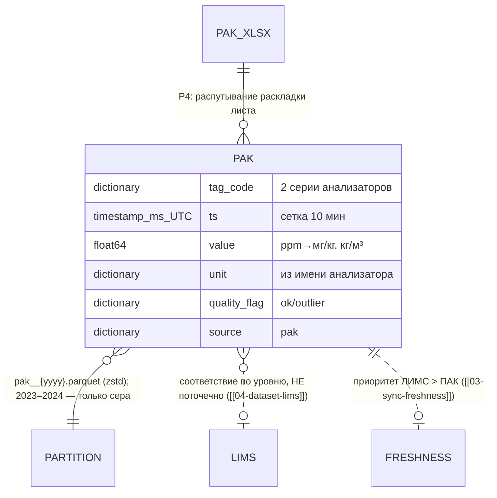

# 05 — Датасет ПАК (поточные анализаторы)

## Scope

| Раздел | Содержимое |
| --- | --- |
| **Содержит** | физическую схему Parquet-датасета ПАК; две реальные серии (`24-2000:Mg.Sulfur` с 01.2023, `24-2000:D15` только с 05.03.2025); колонки и типы; правило «ppm = мг/кг»; правило соответствия точке ЛИМС; запрет поточечной сверки с ЛИМС (r ≈ −0.003); правила чистки; пример записи; роли писателя/читателя |
| **НЕ содержит** | ЛИМС ([[04-dataset-lims]]); телеметрию ([[02-dataset-telemetry-242000]], [[03-dataset-telemetry-avt]]); логику анти-утечки и приоритетов источников ([[03-sync-freshness]]); Q21 (телеметрия, не ПАК) |
| **Зависит на** | [[01-naming-conventions]] (имена, время, версии); формы §0/A.1, C.4 (P4); факты — по результатам анализа истории данных |

## 1. Источник и объём

Источник: `data/raw/Выгрузка ПАК 01.01.2023 - н.в_.xlsx` — «Лист 1: 189 650 строк × 5 колонок»[^razbor5]. Раскладка листа нестандартна: «заголовок колонки = имя анализатора, в самой колонке — единицы + метки времени, значения — в соседней Unnamed». Реальных серий две; «Других анализаторов в выгрузке нет (колонка Unnamed: 2 пуста)»[^razbor5].

| Серия | Ед. | n | Покрытие | Шаг | Статистика[^razbor5] |
| --- | --- | --- | --- | --- | --- |
| `24-2000:Mg.Sulfur` | ppm | 189 649 | 2023-01-01 00:00 → 2026-08-10 00:00 (полный) | 10 мин, «разрывов > 1 ч нет» | min 0, p1 3.13, p5 5.65, median 8.37, mean 8.43, p95 10.99, p99 18.45, **max ровно 20.00 (зашкал)** |
| `24-2000:D15` | кг/м³ | 75 455 | **только с 2025-03-05 10:20** → 2026-08-11 09:54 | 10 мин | min 810.9, p1 829.8, median 835.2, mean 835.4, p95 839.3, p99 845.1, max 852.8 |

## 2. Подтверждённые факты о покрытии

> [!quote] Покрытие подтверждено «как есть»
> «**ПАК D15** (расчётная плотность) начинается только с **05.03.2025** (~75 тыс. точек); сера в ПАК —
> с 01.01.2023 (~190 тыс. точек). Это подтверждено как есть, данных за 2023–2024 по D15 нет».

- Пустой диапазон 2023–2024 у D15 — **легальное состояние датасета**, а не дефект инжеста; читатель не должен считать его ошибкой и «дотягивать» значения.
- Следствие: модель D15 обучается только на хвосте периода, свежесть точки D15 до 03.2025 — статус `missing` ([[02-data-freshness]]).

## 3. Схема Parquet (контракт P4 → P3)

Партиции `pak__{yyyy}.parquet` по году `ts`; одна строка = точка одной серии.

| Колонка | Тип | Nullable | Описание |
| --- | --- | --- | --- |
| `tag_code` | `dictionary<string>` | нет | имя анализатора как в источнике: `24-2000:Mg.Sulfur`, `24-2000:D15` (2 значения) |
| `ts` | `timestamp[ms, UTC]` | нет | момент отсчёта, сетка 10 мин |
| `value` | `float64` | да (NaN = null) | показание анализатора |
| `unit` | `dictionary<string>` | нет | `мг/кг` (сера) / `кг/м³` (D15) — см. §4.1 |
| `quality_flag` | `dictionary<string>` | нет | `ok` / `sentinel` / `outlier` |
| `source` | `dictionary<string>` | нет | константа `pak` |

## 4. Правила данных

### 4.1. ppm = мг/кг; соответствие точке ЛИМС

> [!quote]
> «**ppm серы в ПАК = мг/кг** (массовая). `24-2000:Mg.Sulfur` (ПАК) соответствует точке
> „Гидроочистка, отбор 2, Дизельное топливо“».

Контракт: единица колонки серы пишется `мг/кг` (перевод «ppm = мг/кг» — инжест, не дело читателя); соответствие точке `hdu_product` ([[04-dataset-lims]] §2) фиксируется в `datasets_manifest.json` (маппинг серия → точка ЛИМС), чтобы ядро сопоставляло источники без знания разметки листа.

### 4.2. Чистка

| Явление | Факты истории данных | Действие |
| --- | --- | --- |
| Зашкал анализатора | «max ровно 20.00 (зашкал)» — плато 20.0 аналогично плато Q21 = 24.9 | `value = null`, `quality_flag = outlier` |
| Нули/шум | «< 1 ppm: 0.16 %» | сохраняется с `ok` — интерпретация (уровень/тренд) на стороне читателя |
| Отсутствие D15 до 05.03.2025 | подтверждено «как есть» | строк нет; партиции `pak__2023/2024.parquet` содержат только серу |
| Сентинелы {307, 251, 252, 240} | к ПАК неприменимы | не встречаются; резерв `sentinel` на будущее выгрузки |

### 4.3. Запрет поточечной сверки с ЛИМС

> [!warning] Использовать ПАК можно только по уровням и трендам
> «Согласование ПАК ↔ ЛИМС…: уровни совпадают — медиана ПАК 8.37 vs ЛИМС 8.60 мг/кг,
> median |Δ| = 1.15, mean |Δ| = 3.29 мг/кг; **но поточечная корреляция r = −0.003 ≈ 0**.
> …ПАК сильно зашумлён/усреднён и не отслеживает лабораторные скачки. Для валидации ВАК/моделей
> использовать ПАК можно только по уровням и трендам, контрольный факт — ЛИМС».

- Поточечная сверка ПАК с ЛИМС запрещена как метод; data-store не предоставляет для неё ключей — сопоставление делается только через агрегаты (медианы, скользящие средние).
- Доля точек серы > 10 ppm: «**12.05 %**» — согласуется с ЛИМС (15.7 % замеров) по порядку, но не поточечно[^razbor5].

## 5. Пример записи

```json
{"tag_code": "24-2000:Mg.Sulfur", "ts": "2026-08-09T08:00:00Z",
 "value": 8.41, "quality_flag": "ok", "source": "pak", "unit": "мг/кг"}
```

```json
{"tag_code": "24-2000:D15", "ts": "2026-08-11T09:50:00Z",
 "value": 835.2, "quality_flag": "ok", "source": "pak", "unit": "кг/м³"}
```

```json
{"tag_code": "24-2000:Mg.Sulfur", "ts": "2024-09-02T14:30:00Z",
 "value": null, "quality_flag": "outlier", "source": "pak", "unit": "мг/кг"}
```

## 6. Писатель и читатели

| Роль | Домен | Что делает |
| --- | --- | --- |
| Писатель | data-pipeline (P4) | «ПАК (сера с 01.2023, D15 с 03.2025)»; распутывает раскладку листа (единицы + время в одной колонке, значения в Unnamed); sha256 → `datasets_manifest.json` |
| Читатель | core-architecture (P3) | read-only: оперативная оценка уровня серы (медиана 8.37) рядом с Q21; светофор свежести по ПАК; n ≈ 189 тыс. пар для лаг-анализа |
| Косвенный | backend → core → P1 | наружу — только DTO `TagPoint` с `source = "pak"` ([[01-timeseries]]) |

## 7. ER-место датасета



[^razbor5]: По результатам анализа истории данных (таблица серий, статистики, согласование с ЛИМС).
