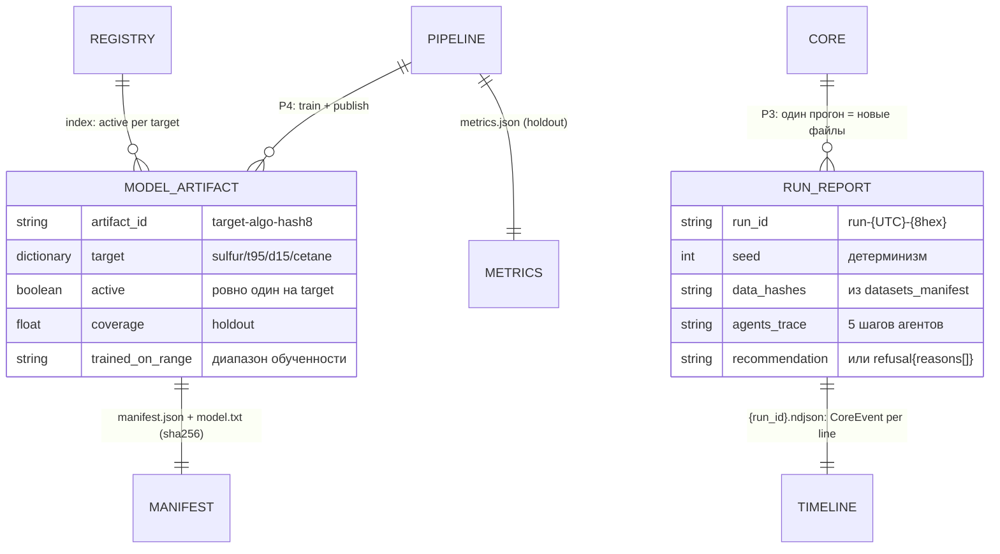

# 06 — Каталог артефактов `artifacts/`

## Scope

| Раздел | Содержимое |
| --- | --- |
| **Содержит** | дерево `artifacts/`; формат `registry.json` и `manifest.json` (модели, P5); формат `runs/{run_id}.{json,md}` (RunReport, P3) и `timeline/{run_id}.ndjson` (журнал реплея); `metrics.json`; правила имён (`run_id`, `artifact_id`), прав записи и только-добавления |
| **НЕ содержит** | схемы датасетов `data/` ([[02-dataset-telemetry-242000]]–[[05-dataset-pak]]); канонические DTO `RunReport`/`ModelArtifact` ([[07-run-report]], [[08-model-artifact]]); логику загрузки моделей ядром ([[02-model-registry]]) и публикацию ([[09-publish-registry]]) |
| **Зависит на** | [[03-p3-core-datastore]], [[04-p4-pipeline-datastore]], [[05-p5-pipeline-core]]; [[07-run-report]], [[08-model-artifact]]; [[01-naming-conventions]] (хэши, версии) |

## 1. Назначение

`artifacts/` — результаты вычислений, в отличие от `data/` (факты процесса). Полное состояние
системы = `data/` + `artifacts/`: «Parquet + JSON полностью восстанавливают состояние —
требование закрытого контура on-premise».

```text
artifacts/
  models/
    registry.json                      # индекс артефактов: [{artifact_id, target, active, created_at}]
    {artifact_id}/
      manifest.json                    # каноническая форма ModelArtifact ([[08-model-artifact]]) + data_hashes + версии
      model.txt                        # веса LightGBM (3 квантильные модели), sha256 проверяется ядром
      conformal.json                   # параметры MAPIE, если вынесены из manifest (uri в manifest)
  runs/
    {run_id}.json                      # RunReport ([[07-run-report]]) — пишет core (P3)
    {run_id}.md                        # тот же отчёт в Markdown
  timeline/
    {run_id}.ndjson                    # журнал событий прогона (реплей SSE), пишет core по мере событий
  metrics.json                         # метрики валидации пайплайна, пишет data-pipeline (P4)
```

## 2. Права записи и чтения

| Объект | Пишет | Читает | Протокол |
| --- | --- | --- | --- |
| `artifacts/models/…` | data-pipeline | core (прогрев реестра), backend (`/api/models`), frontend (страница «Модели») | P4 → P5 |
| `artifacts/runs/{run_id}.{json,md}` | core (`report/`) | backend (раздача отчёта), frontend (экспорт) | P3 |
| `artifacts/timeline/{run_id}.ndjson` | core (по мере событий) | backend/frontend (реплей прогона) | P3 |
| `artifacts/metrics.json` | data-pipeline | core, backend, frontend | P4 |

> [!warning] Границы записи
> «рантайм read-only по `data/processed/` — ядро туда не пишет; запись только в `artifacts/`;
> …повторный прогон создаёт новый `run_id` (файлы не перезаписываются)».

## 3. Модели: registry.json + manifest.json

### 3.1. registry.json

«Индекс: `[{artifact_id, target, active, created_at}]`» (см. [[05-p5-pipeline-core]]):

```json
{
  "artifacts": [
    {"artifact_id": "sulfur-lgbm-a1b2c3d4", "target": "sulfur", "active": true,
     "created_at": "2026-09-19T04:20:00Z"},
    {"artifact_id": "sulfur-lgbm-9f7710e2", "target": "sulfur", "active": false,
     "created_at": "2026-09-12T18:03:00Z"},
    {"artifact_id": "cetane-lgbm-5c41d908", "target": "cetane", "active": true,
     "created_at": "2026-09-19T04:41:00Z"}
  ]
}
```

Правила: на каждый `QualityTarget` (`sulfur`, `t95`, `d15`, `cetane`) ровно один `active = true`; старые артефакты остаются в каталоге и в индексе (только-добавление), деактивируются флагом, но не удалением.

### 3.2. manifest.json

«Полная каноническая форма manifest [[08-model-artifact]] (+ data_hashes)» (см. [[05-p5-pipeline-core]]). Канон ([[08-model-artifact]]): `target, model_uri, quantiles (0.1/0.5/0.9), conformal_params, coverage, trained_on_range`:

```json
{
  "artifact_id": "sulfur-lgbm-a1b2c3d4",
  "target": "sulfur",
  "model_uri": "artifacts/models/sulfur-lgbm-a1b2c3d4/model.txt",
  "model_sha256": "3f1a…c9",
  "quantiles": [0.1, 0.5, 0.9],
  "conformal_params": {"method": "enbpi", "horizon_h": 1.0},
  "conformal_uri": null,
  "coverage": 0.91,
  "trained_on_range": {"from": "2023-01-01T00:00:00Z", "to": "2026-05-31T23:50:00Z"},
  "data_hashes": {"242000__Q21__2026.parquet": "9f2c…e1", "lims__2026.parquet": "77ab…04"},
  "versions": {"core": "0.3.0", "pipeline": "0.3.0", "contract": "1.0"}
}
```

Правила загрузки ядром (P5, сторона читателя): «Нет `active` или хэш не сошёлся ⇒ `models_not_loaded` (backend → 503); расхождение мажорной `core_version` ⇒ артефакт игнорируется». «Ядро никогда не обучает в рантайме» — оно только загружает[^core-train].

`artifact_id` = `{target}-{algo}-{hash8}`: цель обучения, алгоритм, 8 hex от sha256 весов — имя самоописывающее и уникальное без реестра.

## 4. Прогоны: runs/ и timeline/

### 4.1. Формат `run_id`

`run-{yyyymmddTHHMMSSZ}-{8hex}` — например `run-20260919T081530Z-7be21c0a`. Момент старта — UTC, суффикс — случайный гекс (фиксируется в `RunReport.seed`-контексте детерминизма). Требование уникальности абсолютное: «повторный прогон создаёт новый `run_id` (файлы не перезаписываются)».

### 4.2. `{run_id}.json` — RunReport

Маппинг на артефакт 1:1 с каноном [[07-run-report]]: `run_id, seed, data_hashes, versions, agents_trace[], recommendation | refusal, env`:

```json
{
  "run_id": "run-20260919T081530Z-7be21c0a",
  "seed": 20260919,
  "data_hashes": {"datasets_manifest": "e5d0…b2"},
  "versions": {"core": "0.3.0", "contract": "1.0"},
  "agents_trace": [
    {"step_idx": 0, "agent_role": "data", "input_digest": "sha256:…",
     "output_json": {"freshness": "…"}, "confidence": 0.9,
     "started_at": "2026-09-19T08:15:31Z", "finished_at": "2026-09-19T08:15:33Z"}
  ],
  "recommendation": {"confidence": 0.82, "actions": [{"tag": "T5", "from": 371.4, "to": 369.0}]},
  "env": {"llm_mode": "off"}
}
```

Альтернативный исход — `refusal{reasons[]}` (`stale_lims`, `wide_interval`, `out_of_training_domain`, `no_feasible_variant`, `sensor_fault`) — форма [[04-recommendation]]; оба исхода пишутся одинаково, отказ — «штатный результат, не исключение»[^refusal]. `{run_id}.md` — рендер того же отчёта для человека (экспорт по P1: `GET /api/runs/{id}/report.{md,json}`).

### 4.3. `timeline/{run_id}.ndjson` — журнал реплея

Пишется ядром по мере событий, по одному JSON-объекту на строку — кадр события из P2/P1 (см. [[02-p2-backend-core]]: «CoreEvent = {seq: int, run_id: str, kind: <SSE-событие C.1>, payload: dict, ts: datetime}»):

```json
{"seq": 3, "run_id": "run-20260919T081530Z-7be21c0a", "kind": "agent_finished", "payload": {"agent_role": "data", "confidence": 0.9}, "ts": "2026-09-19T08:15:33Z"}
```

Назначение — реплей конвейера в UI без пересчёта прогона (backend читает NDJSON и отдаёт события в том же порядке); девять видов событий + heartbeat (комментарий `: hb`, не событие): `run_started`, `agent_started`, `step`, `log`, `agent_finished`, `recommendation`, `refusal`, `run_finished`, `run_failed` — канон [[01-p1-rest-sse]] §5.2.

## 5. metrics.json

Метрики валидации пайплайна — «`{target: {wape, mae, pinball_p50, coverage}}`» (см. [[04-p4-pipeline-datastore]]):

```json
{"sulfur": {"wape": 0.06, "mae": 0.52, "pinball_p50": 0.27, "coverage": 0.91},
 "t95":    {"wape": 0.012, "mae": 3.9, "pinball_p50": 1.8, "coverage": 0.90}}
```

Считается на holdout по времени (gap ≥ 3 ч, хвост 2026) — механика [[08-validation-timesplit]]; data-store хранит готовый файл рядом с моделями.

## 6. Правила каталога

> [!warning] Пять правил `artifacts/`
> 1. **Только-добавление**: новые артефакты и прогоны не перезаписывают старые; деактивация — флагом `active`.
> 2. **Проверяемость**: каждый бинарный/весовой файл имеет sha256 в своём манифесте; `data_hashes` связывают артефакт с точными версиями входных партиций ([[01-naming-conventions]] §5).
> 3. **Разделение прав**: `data/` пишет только data-pipeline; `runs/`+`timeline/` — только core; `models/`+`metrics.json` — только data-pipeline.
> 4. **Самоописательность**: имена `{artifact_id}`, `{run_id}` восстанавливаются без реестра; реестр — только для выбора `active`.
> 5. **Человекочитаемый дубль**: каждый JSON-артефакт прогона имеет Markdown-версию.

## 7. ER-место каталога



[^core-train]: «registry.py — загрузка моделей… правило «ядро не обучает в рантайме»».
[^refusal]: «Отказ — штатный результат, не исключение» — правило дизайна core-architecture.
