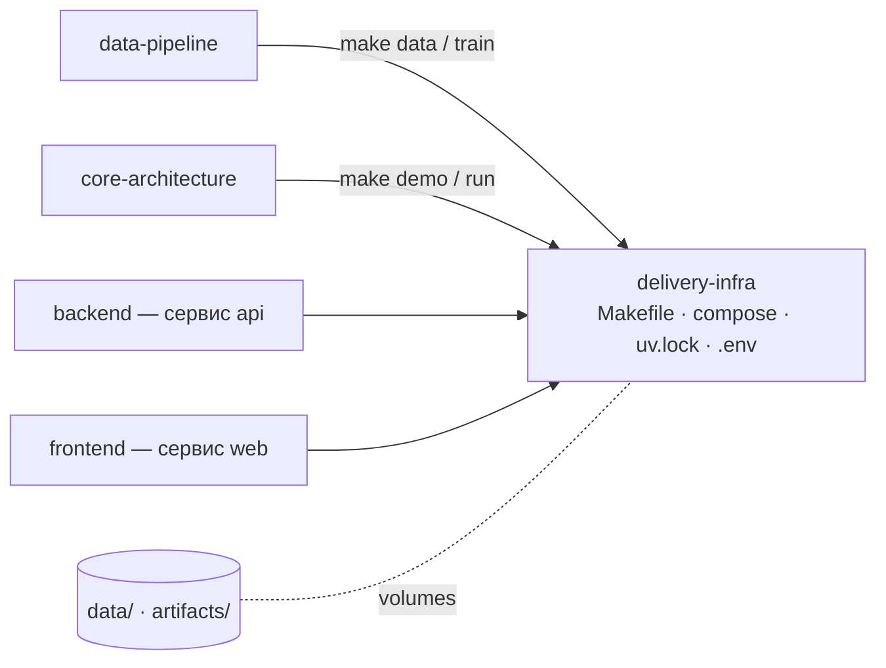
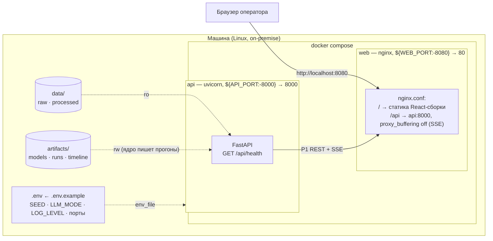

# delivery-infra: сборка, запуск, воспроизводимость

## Scope

Домен отвечает за **воспроизводимые сборку и запуск** решения «Refinery Copilot»: uv-окружение,
цели Make, docker-compose (api + web), переменные окружения, сиды и чек-лист релиза.
Домен знает, **как** поднять систему, но не знает, **что** она считает.

> [!info] Содержит (covers)
> Цели Makefile; сервисы и порты compose; volumes `data/` и `artifacts/`; healthchecks;
> `pyproject.toml` + `uv.lock` как единый источник версий; `.env.example`; фиксированные seed'ы;
> порядок старта и чек-лист релиза.

> [!warning] НЕ содержит (does NOT cover)
> Никакой бизнес-логики: правила расчётов — в core-architecture; схемы данных — в data-store;
> HTTP-контракт — в api; содержимое сценариев — в core-architecture; Dockerfile-ы сервисов —
> в backend/07 и frontend/01 (здесь только их сборка и связка).
> Правило 1: «инфра не знает бизнес-логику: только цели,
> сервисы, переменные; версии пинятся lock-файлами».

## Роль в архитектуре (P7)

Протокол **P7: infra → все**: delivery-infra собирает и запускает
все домены, но ни один домен не зависит от внутренностей инфраструктуры — только от контракта
целей Make и переменных окружения.

## Диаграмма деплоя

Единственная конфигурация демо — **docker compose с двумя сервисами** (закрытый контур,
работа без интернета обязательна):

Порядок запуска кодирует конвейер: `data → train → demo/run`,
compose поднимает `api`, а `web` стартует только после зелёного healthcheck `api`.

## Карта целей и сервисов

| Команда | Что делает | Сервис/артефакт |
| --- | --- | --- |
| `make data` | raw → валидированный Parquet | `data/processed/` (P4) |
| `make train` | модели + `metrics.json` | `artifacts/models/` (P4, P5) |
| `make demo` | демо-сценарии через CLI, включая отказ | `artifacts/runs/` (P3) |
| `make run` / `make ui` | uvicorn `:8000` / Vite dev `:5173` | локальная разработка |
| `make test` / `make lint` | pytest / ruff | качество кода |
| `make up` / `make down` | compose api + web | демо-стенд |
| `make mocks` | фронт на моках без backend | `VITE_USE_MOCKS=true` |

## Индекс документов

| # | Файл | Назначение |
| --- | --- | --- |
| 1 | [[01-makefile-targets]] | цели Make: help/data/train/demo/run/ui/test/lint/up/down/mocks; зависимости и пререквизиты |
| 2 | [[02-docker-compose]] | сервисы api + web, порты 8000/8080, volumes, healthchecks, depends_on, env_file |
| 3 | [[03-uv-environment]] | pyproject-воркспейс, uv.lock, группы зависимостей core/api/dev, Python 3.12, кэш |
| 4 | [[04-env-vars]] | полная таблица переменных окружения, дефолты, где задаются |
| 5 | [[05-seeds-reproducibility]] | сиды python/numpy/lightgbm, версии из uv.lock, sha256 артефактов, проверка повторного прогона |
| 6 | [[06-release-checklist]] | чек-лист релиза |

## Правила дизайна домена

> [!warning] Шесть правил
> 1. Инфра не знает бизнес-логику: только цели, сервисы, переменные; версии пинятся lock-файлами.
> 2. Порядок целей кодирует конвейер: `data` и `train` обязательны до `demo`/`run`.
> 3. Одинаковые версии локально и в Docker: образы собираются строго из того же `uv.lock`.
> 4. Всё окружение — через `.env.example`; тумблер LLM по умолчанию `off` (закрытый контур).
> 5. Никаких секретов в репо: `.env` не коммитится, `.env.example` содержит только дефолты.
> 6. Кросс-платформенность: целевая среда — Linux (в том числе отечественные ОС корпоративного
>    периметра); ничего, что требует сети или внешних реестров в рантайме.

## Кросс-доменные зависимости

| Домен | Что берёт у infra | Что даёт infra |
| --- | --- | --- |
| data-pipeline | цели `make data`, `make train` | сиды, пути `DATA_DIR`/`ARTIFACTS_DIR` |
| core-architecture | `make demo`, `make run` | `SEED`, `MODEL_REGISTRY_DIR`, `LLM_MODE` |
| backend | compose-сервис `api` | порт, env_file, healthcheck |
| frontend | compose-сервис `web`, `make ui`, `make mocks` | `WEB_PORT`, `VITE_*` |
| data-store | volumes | `data/:ro`, `artifacts/` |

Состояние системы полностью восстанавливается из `data/` + `artifacts/` — SQL-БД нет,
что соответствует требованию закрытого контура on-premise.
