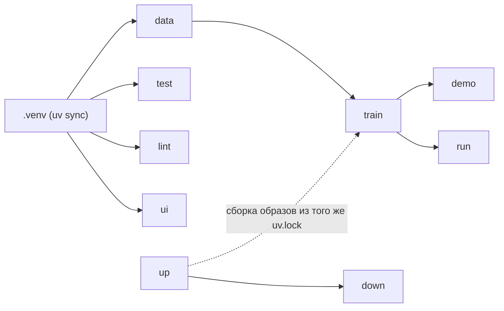

# 01 — Цели Makefile

## Scope

> [!info] Содержит
> Контракт целей: `help`, `data`, `train`, `demo`, `run`, `ui`, `test`, `lint`, `up`,
> `down`, `mocks`; зависимости целей; пререквизиты (uv-окружение, данные, модели);
> порядок `data → train → demo/run`.

> [!warning] НЕ содержит
> Содержимого демо-сценариев (это core-architecture/14);
> реализации Dockerfile-ов ([[02-docker-compose]] собирает их, но не описывает слои);
> бизнес-конфигурации ([[04-env-vars]]).

Makefile — единственный вход для оператора и разработчика: протокол C.7 (P7)
фиксирует перечень целей как контракт запуска. Имена целей менять нельзя — на них ссылается
README, чек-лист релиза [[06-release-checklist]] и [[05-seeds-reproducibility]].

## Каркас Makefile

```make
# Единый интерфейс запуска «Refinery Copilot». Порядок: data → train → demo/run.
.DEFAULT_GOAL := help
API_PORT ?= 8000
VITE_PORT ?= 5173
.PHONY: help data train demo run ui test lint up down mocks

help: ## показать список целей с описаниями
	@awk 'BEGIN {FS = ":.*##"} /^[a-zA-Z_-]+:.*## / \
	  {printf "  \033[36m%-8s\033[0m %s\n", $$1, $$2}' $(MAKEFILE_LIST)

.venv: ## пререквизит: uv-окружение (создаётся один раз, строго из uv.lock)
	uv sync --group dev

data: .venv ## инжест+чистка+sync: raw → data/processed (P4)
	uv run python -m refinery_core.cli data

train: data ## обучение: → artifacts/models + artifacts/metrics.json (P4+P5)
	uv run python -m refinery_core.cli train

demo: train ## 4 демо-сценария через CLI, включая обязательный отказ (P3)
	uv run python -m refinery_core.cli demo

run: train ## uvicorn api на :$(API_PORT)
	uv run uvicorn app.main:app --host 0.0.0.0 --port $(API_PORT)

ui: .venv ## vite dev на :$(VITE_PORT), proxy /api → :8000
	cd frontend && npm run dev -- --port $(VITE_PORT)

test: .venv ## pytest: пайплайн, ограничения, отказ, детерминизм
	uv run pytest

lint: .venv ## ruff: линт + проверка форматирования
	uv run ruff check . && uv run ruff format --check .

up: ## docker compose: api (uvicorn) + web (nginx)
	docker compose up -d --build

down: ## остановить и убрать контейнеры
	docker compose down

mocks: ## фронт на моках без backend (VITE_USE_MOCKS=true)
	cd frontend && VITE_USE_MOCKS=true npm run dev
```

Пояснения к неочевидным решениям:

- `help` — self-documenting: описание цели берётся из её же комментария `##` (шаблон awk из
  общепринятой практики), поэтому документация целей не может разойтись с Makefile.
- `.venv` — файловая цель: существует ⇒ синхронизация не повторяется; удалите каталог —
  окружение пересоберётся из `uv.lock` ([[03-uv-environment]]).
- `data`/`train`/`demo`/`run` — цепочка пререквизитов через зависимости целей, а не через
  напоминания: `make demo` физически не выполнится без свежих моделей.

## Граф зависимостей



Ключевое правило (правило 2): **порядок целей кодирует конвейер** —
`data` и `train` обязательны до `demo`/`run`. Попытка `make run` без моделей упадёт быстро
(пустой `artifacts/models/registry.json` → `models_not_loaded`, P5), а не молча отдает 503.

## Пререквизиты машины

| Пререквизит | Проверка | Для целей |
| --- | --- | --- |
| Python 3.12 | `uv python list` | все локальные |
| uv | `uv --version` | все локальные |
| исходные файлы в `data/raw/` | `ls data/raw/*.xlsx` | `data`, `train` (далее по цепочке) |
| Node.js 20+ | `node --version` | `ui`, `mocks` |
| docker + compose v2 | `docker compose version` | `up`, `down` |
| `.env` | `cp .env.example .env` ([[04-env-vars]]) | `up`, `run`, `ui` |

## Семантика целей

| Цель | Действие | Читает | Пишет | Домен-исполнитель |
| --- | --- | --- | --- | --- |
| `help` | печать целей | Makefile | — | — |
| `data` | инжест + чистка сентинелов + sync/freshness | `data/raw/` | `data/processed/` (P4) | data-pipeline |
| `train` | LightGBM quantile + MAPIE | `data/processed/` | `artifacts/models/`, `metrics.json` (P4/P5) | data-pipeline |
| `demo` | CLI-прогоны 4 демо-сценариев **с обязательным отказом** (`stale_lims`) | models + parquet | `artifacts/runs/*.{json,md}`, timeline (P3) | core |
| `run` | uvicorn api `:8000` | models + parquet | `artifacts/runs/` через P2 | backend |
| `ui` | Vite dev `:5173`, proxy `/api` | — | — | frontend |
| `test` | pytest | всё | — | все |
| `lint` | ruff | всё | — | все |
| `up` | `docker compose up -d --build` | `uv.lock`, `.env` | контейнеры | infra |
| `down` | `docker compose down` | — | — | infra |
| `mocks` | фронт на мок-фикстурах и мок-SSE | `frontend/src/mocks/` | — | frontend |

> [!note] Почему `make demo` = 4 сценария
> Правило инфраструктуры: «`make demo` = 4 демо-сценария с обязательным отказом».
> Состав сценариев (normal, quality_risk, bad_data/sour_crude, stale_lims) задаёт
> core-architecture/14 — здесь фиксируется только то, что отказ обязан попасть в выдачу.

## Типовые сессии

```bash
# Проверка ядра без сайта
make demo                      # data → train → прогоны CLI, отказ виден в консоли

# Локальная разработка
make run                       # терминал 1: api :8000
make ui                        # терминал 2: витрина :5173, proxy /api

# Демо-стенд ([[02-docker-compose]])
make up                        # api :8000 + web :8080, web ждёт healthcheck api
```
