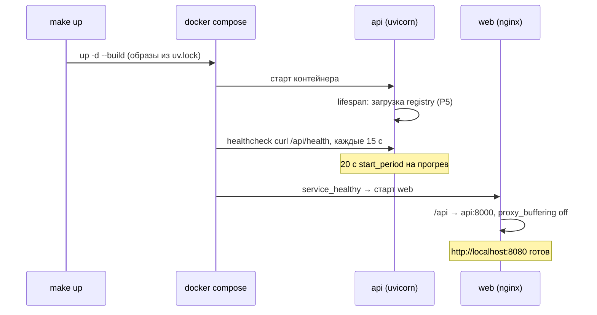

# 02 — docker-compose: api + web

## Scope

> [!info] Содержит
> Состав и связку сервисов: `api` (uvicorn, порт 8000) и `web` (nginx, порт 8080);
> volumes `data/:ro` и `artifacts/`; healthchecks (curl `/health`, интервал/число неудач);
> `depends_on: service_healthy`; `restart`; `env_file`; nginx-настройку для SSE.

> [!warning] НЕ содержит
> Dockerfile-ов сервисов — multi-stage сборка из `uv.lock` описана в backend/07 и
> frontend/01; содержимого переменных ([[04-env-vars]]);
> выбора портов командой ([[01-makefile-targets]]).

Compose — штатная конфигурация развёртывания в закрытой сети on-premise.
Поэтому compose — это **продовая конфигурация демо**, а не побочная опция.

## docker-compose.yml

```yaml
# Демо-стенд «Refinery Copilot»: api (FastAPI/uvicorn) + web (nginx, раздача статики + прокси SSE).
services:
  api:
    build: ./backend            # multi-stage python:3.12-slim + uv (backend/07)
    ports:
      - "${API_PORT:-8000}:8000"   # хост:контейнер; контейнер всегда 8000
    env_file: .env              # SEED, DATA_DIR, LLM_MODE, LOG_LEVEL — см. [[04-env-vars]]
    environment:
      DATA_DIR: /app/data
      ARTIFACTS_DIR: /app/artifacts
    volumes:
      - ./data:/app/data:ro        # рантайм read-only по данным (P3)
      - ./artifacts:/app/artifacts # ядро пишет runs/ и timeline/ — rw
    healthcheck:
      test: ["CMD", "curl", "-fsS", "http://localhost:8000/api/health"]
      interval: 15s               # проверка каждые 15 с
      timeout: 5s
      retries: 5                  # 5 неудач подряд → unhealthy
      start_period: 20s           # прогрев реестра моделей (lifespan) не считается неудачей
    restart: unless-stopped       # переживает падение процесса, не мешает `make down`

  web:
    build: ./frontend           # multi-stage node:build → nginx:alpine (frontend/01)
    ports:
      - "${WEB_PORT:-8080}:80"
    depends_on:
      api:
        condition: service_healthy  # стартует только после зелёного healthcheck api
    restart: unless-stopped
```

## Объяснение ключевых блоков

| Блок | Почему именно так |
| --- | --- |
| `ports` с `${VAR:-default}` | порт меняется только через `.env` ([[04-env-vars]]); внутри контейнера порт фиксирован — меньше путаницы в nginx-конфиге |
| `env_file: .env` | единственная точка окружения; в самом compose нет значений бизнес-конфигурации |
| `./data:/app/data:ro` | протокол P3: рантайм read-only по `data/processed/` — контейнер физически не может испортить данные |
| `./artifacts:/app/artifacts` (rw) | ядро пишет `artifacts/runs/{run_id}.{json,md}` и `timeline/*.ndjson`; модели уже внутри после `make train` |
| `healthcheck` curl `/api/health` | живость + признак «модели загружены» (backend/06); используется `depends_on` |
| `depends_on: service_healthy` | web без api бесполезен: проксирует всё `/api`; старта «до готовности» избегаем |
| `restart: unless-stopped` | автоперезапуск при аварии, но `make down` всё останавливает чисто |

Проверка здоровья руками:

```bash
docker compose ps                      # оба сервиса Up (healthy)
curl -f http://localhost:8000/api/health   # {"status":"ok", "modelsLoaded":3, ...}
docker compose logs api --tail 50      # прогрев реестра моделей, ошибки запуска
```

## nginx для SSE

Классический nginx буферизует проксируемые ответы — тогда SSE-кадры копятся в буфере
и фронт видит весь конвейер агентов одним куском в конце. Критична директива
`proxy_buffering off`:

```nginx
# frontend/nginx.conf (фрагмент; полный файл — frontend/01)
server {
    listen 80;
    root /usr/share/nginx/html;
    index index.html;

    # SPA-роутинг React
    location / {
        try_files $uri /index.html;
    }

    # REST + SSE к api: без буферизации, без таймаута на длинные прогоны
    location /api/ {
        proxy_pass http://api:8000;
        proxy_http_version 1.1;
        proxy_set_header Connection "";
        proxy_buffering off;          # SSE: кадры уходят клиенту немедленно
        proxy_cache off;
        chunked_transfer_encoding on;
        proxy_read_timeout 3600s;     # длинное соединение EventSource
        add_header X-Accel-Buffering no;
    }
}
```

Дополнительные требования P1: заголовок `Content-Type: text/event-stream` отдаёт uvicorn;
heartbeat каждые 15 с (`: hb …`) сам по себе держит соединение, но `proxy_read_timeout`
всё равно должен быть больше времени прогона.

## Порядок старта



## Проверки конфигурации

```bash
docker compose config --quiet       # синтаксис и подстановка .env корректны
docker compose ps --format json     # статус health каждого сервиса
curl -fsS http://localhost:8080/api/health   # прокси доходит до api
curl -N http://localhost:8080/api/runs/<id>/events  # SSE кадры приходят потоком, не батчем
```

> [!warning] Типовая ошибка
> Если в браузере конвейер агентов «оживает» только после завершения прогона — где-то
> включена буферизация (nginx без `proxy_buffering off`, либо прокси между браузером и
> машиной). Это ломает P1 и обязательно проверяется в [[06-release-checklist]].

`docker-compose.override.yml` допускается только для локальных удобств разработки
(например, проброс исходников) и не должен попадать в релиз: пользователь получает поведение
основного файла.
