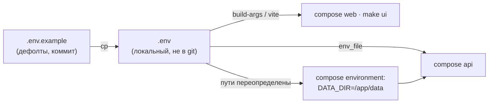

# 04 — Переменные окружения

## Scope

> [!info] Содержит
> Полный перечень переменных: пути данных/артефактов, сиды, `LOG_LEVEL`, тумблер
> `LLM_MODE=off|local|external`, `LLM_BASE_URL`, мок-флаг фронта `VITE_USE_MOCKS`, порты;
> дефолты; где и в каком порядке задаются.

> [!warning] НЕ содержит
> Значений по умолчанию бизнес-правил (нормы серы/ЦЧ
> живут в core-architecture/06); секретов — их в репо нет вовсе (правило 5 домена).

Всё окружение задаётся через `.env` из шаблона `.env.example` (правило 4 домена:
«всё окружение — через `.env.example`; тумблер LLM по умолчанию `off`»).

## .env.example

```bash
# «Refinery Copilot» — шаблон окружения. Скопируйте: cp .env.example .env
# Секретов в репо нет; .env не коммитится.

# --- Воспроизводимость ---
SEED=42                       # единый сид прогона ([[05-seeds-reproducibility]])

# --- Пути ---
DATA_DIR=data                 # data/raw → data/processed (читает всё, пишет P4)
ARTIFACTS_DIR=artifacts       # артефакты: models, runs, timeline
MODEL_REGISTRY_DIR=artifacts/models   # реестр моделей (P5, читает ядро)

# --- Сервис и логи ---
LOG_LEVEL=INFO                # DEBUG | INFO | WARNING | ERROR
API_PORT=8000                 # uvicorn api (compose: хост-порт)
WEB_PORT=8080                 # nginx web (compose: хост-порт)
VITE_PORT=5173                # vite dev-сервер (только make ui/mocks)

# --- LLM-слой (нарратор, core-architecture/90) ---
LLM_MODE=off                  # off | local | external; off = закрытый контур без LLM
LLM_BASE_URL=                 # URL OpenAPI-совместимого эндпоинта для local/external
LLM_MODEL=                    # имя модели (например, Qwen-32B в периметре)

# --- Фронтенд ---
VITE_API_BASE=/api            # база P1 (в compose проксируется nginx'ом)
VITE_USE_MOCKS=false          # true → мок-режим (фикстуры + мок-SSE) без backend; false → live
```

## Полная таблица переменных

| Переменная | Дефолт | Где задаётся | Кто читает | Назначение |
| --- | --- | --- | --- | --- |
| `SEED` | `42` | `.env`, продублирован в `Scenario.seed` | data-pipeline, core | фиксация всех случайностей прогона |
| `DATA_DIR` | `data` | `.env`; в compose переопределён на `/app/data` | pipeline, core, backend | корень данных (`raw/`, `processed/`) |
| `ARTIFACTS_DIR` | `artifacts` | `.env`; в compose — `/app/artifacts` | core, backend | корень артефактов |
| `MODEL_REGISTRY_DIR` | `artifacts/models` | `.env` | core (registry, P5) | где искать `registry.json` и веса |
| `LOG_LEVEL` | `INFO` | `.env` | всё | уровень логов uvicorn и ядра |
| `API_PORT` | `8000` | `.env` / Make (`API_PORT ?= 8000`) | compose, `make run` | хост-порт api |
| `WEB_PORT` | `8080` | `.env` | compose | хост-порт web |
| `VITE_PORT` | `5173` | Make | `make ui`, `make mocks` | порт dev-сервера Vite |
| `LLM_MODE` | `off` | `.env`, UI-переключатель через P1 | core (нарратор) | `off` — без LLM; `local` — до ~30B в периметре; `external` — внешний API |
| `LLM_BASE_URL` | пусто | `.env` | core (нарратор) | обязателен при `local|external`; при `off` игнорируется |
| `LLM_MODEL` | пусто | `.env` | core (нарратор) | идентификатор модели |
| `VITE_API_BASE` | `/api` | `.env` + build-arg | frontend | база REST/SSE; в dev — proxy Vite |
| `VITE_USE_MOCKS` | `false` | `make mocks`, `.env` | frontend | `true` → полный мок-режим без backend; `false` → live |

> [!note] Мок-флаг ровно один
> Канон — `VITE_USE_MOCKS=true|false`; вариант `VITE_API_MODE` из черновика P6 исключён
> при сведении контракта. Признак мок-режима фронт читает только по `VITE_USE_MOCKS`
> ([[05-mocks]], [[frontend/01-project-setup]]).

Дополнительное соглашение: пороги свежести ЛИМС (`warn_after_h=28`, `stale_after_h=52`)
— **бизнес-правила**, а не env-переменные; их переопределение через окружение запрещено,
чтобы пользователь не получил другую систему через `.env`.

## Порядок и точки задания

1. **`.env.example`** — коммитится, содержит только дефолты и комментарии; единственный
   документированный перечень (эта таблица).
2. **`.env`** — создаётся один раз (`cp .env.example .env`); в git не попадает
   (`.gitignore`); compose читает его через `env_file` ([[02-docker-compose]]).
3. **compose `environment:`** — только механические переопределения путей под контейнер
   (`DATA_DIR=/app/data`); бизнес-значения здесь не дублируются.
4. **`VITE_*`** — переменные фронтенда вшиваются в сборку: для прод-образа передаются
   build-arg'ами, для dev-сервера читаются Vite из `.env` в момент `make ui`/`make mocks`.
5. **CLI/код** — переменные читает pydantic-settings backend'а и конфиг ядра; ничего
   не «прорастает» через несколько слоёв: место правки одно — `.env`.



## Правила обращения

> [!warning] Четыре правила
> 1. Секретов в репо нет: если когда-нибудь появится ключ внешнего LLM — только в `.env`
>    на машине демонстрации (целевой контур закрытый).
> 2. `LLM_MODE=off` — дефолт поставки: демо обязано работать без сети и без LLM
>    (правило 4 домена).
> 3. Новая переменная = новая строка в `.env.example` **и** строка в этой таблице одним PR.
> 4. Переменные с одним значением на всех (`warn_after_h`, нормы) в env не выносятся —
>    это конфигурация кода, а не окружения.

## Проверка

```bash
docker compose config | grep -A2 LLM_MODE   # значение реально дошло до контейнера
curl -fsS http://localhost:8000/api/health  # env.llm_mode в ответе health
uv run python -c "from refinery_core.config import Settings; print(Settings())"
```
