# 06 — Чек-лист перед релизом

## Scope

> [!info] Содержит
> Приёмка решения на чистой машине —
> от чистого клона до демо в браузере; проверки compose, healthchecks, сценариев,
> отчётов, тестов и README.

> [!warning] НЕ содержит
> Новых фич («не содержит новые фичи»); метрик качества
> моделей; приёмочных критериев страниц UI (они живут в документах frontend/11–16).

Генеральная репетиция: **тестовые сценарии предоставляет сама система** — значит, поставка обязана подниматься на пустой
машине без единого ручного шага сверх этого чек-листа.

## Блок 1. Чистый клон на пустой машине

> [!important] Условие: свежая директория, Linux, только python 3.12 (через uv), docker,
> Node 20. Никаких предустановленных пакетов проекта.

- [ ] `git clone <repo> && cd refinery-copilot` — клон без ручных доскачиваний
- [ ] `cp .env.example .env` — единственное ручное действие с окружением ([[04-env-vars]])
- [ ] `make data` — завершается без ошибок; появились `data/processed/*.parquet`,
      `freshness.parquet`, `datasets_manifest.json`
- [ ] `make train` — появились `artifacts/models/<target>/` (manifest.json + model.txt),
      `artifacts/metrics.json`, `artifacts/models/registry.json`
- [ ] `make demo` — в консоли 4 сценария, **включая штатный отказ** (`stale_lims`);
      созданы `artifacts/runs/<run_id>.{json,md}` и `artifacts/timeline/<run_id>.ndjson`
- [ ] ни на одном шаге не потребовался интернет сверх установки зависимостей
      (закрытый контур)

## Блок 2. docker compose

- [ ] `make up` — собирает образы из того же `uv.lock` и поднимает стенд
- [ ] `docker compose ps` — `api` и `web` в статусе `Up (healthy)`
- [ ] `curl -fsS http://localhost:8000/api/health` → `{"status":"ok", "modelsLoaded":N}`
- [ ] `curl -fsS http://localhost:8080/api/health` — прокси nginx доходит до api
- [ ] healthcheck api зелёный при `interval: 15s / retries: 5` без рестартов
      ([[02-docker-compose]])
- [ ] `make down` — останавливает всё чисто; повторный `make up` работает

## Блок 3. Демо в браузере (генрепетиция сценариев)

- [ ] `http://localhost:8080` открывается; дашборд грузит состояние и светофоры свежести
- [ ] Запуск прогона: события агентов приходят **потоком** (SSE не буферизуется:
      `proxy_buffering off` проверен — конвейер оживает по ходу, а не в конце)
- [ ] Прогнаны все 5 пресетов: `normal`, `quality_risk`, `bad_data`, `sour_crude`, `stale_lims`
- [ ] Сценарий `stale_lims` показывает **отказ** с причинами — отказ виден в UI как
      первоклассный результат
- [ ] What-if откликается интерактивно; карточка рекомендации полная (actions → effects →
      checks → confidence → explanation)
- [ ] Экспорт отчёта `.md` и `.json` скачивается и открывается
- [ ] Страница «Модели» показывает артефакты с метриками holdout

## Блок 4. Воспроизводимость

- [ ] Двойной прогон одной точки: `diff` нормализованных отчётов пуст — решение и все
      числа совпадают ([[05-seeds-reproducibility]], правило воспроизводимости)
- [ ] `RunReport.versions` заполнен из lock; `data_hashes` совпадают между прогонами
- [ ] `LLM_MODE=off` в поставке: нарратор отвечает шаблонами, числа — из расчёта

## Блок 5. Качество кода и репозиторий

- [ ] `make test` — pytest зелёный (пайплайн, ограничения, отказ, детерминизм)
- [ ] `make lint` — ruff без замечаний
- [ ] В репо нет секретов: `.env` в `.gitignore`; коммитится только `.env.example`
- [ ] `docker compose config --quiet` — без предупреждений
- [ ] README актуален: команды совпадают с [[01-makefile-targets]], порты и переменные —
      с [[04-env-vars]]; описано, что где открывать за 5 минут демо

## Сводная таблица приёмки

| # | Проверка | Команда | Ожидаемый результат |
| --- | --- | --- | --- |
| 1 | Чистый клон | `git clone … && cp .env.example .env` | без ручных фиксов |
| 2 | Данные | `make data` | `data/processed/` заполнен |
| 3 | Модели | `make train` | `artifacts/models/` + `metrics.json` |
| 4 | Ядро | `make demo` | 4 сценария, отказ виден |
| 5 | Стенд | `make up` | api+web healthy |
| 6 | Живость | `curl /api/health` (8000 и 8080) | `status: ok` |
| 7 | Сценарии | браузер | 5 пресетов, SSE поток, карточка рекомендации |
| 8 | Отчёты | `artifacts/runs/` | json+md+timeline созданы |
| 9 | Повтор | diff двух прогонов | пусто (кроме аудит-полей) |
| 10 | Качество | `make test lint` | зелёные |
| 11 | README | глазами | совпадает с реальностью |

```mermaid
flowchart LR
    CLONE["1. чистый клон"] --> D["2. make data"]
    D --> T["3. make train"]
    T --> DEMO["4. make demo + отказ"]
    DEMO --> UP["5. make up + healthchecks"]
    UP --> UI["7. сценарии в браузере"]
    UI --> REP["8. отчёты"]
    REP --> REPR["9. повторный прогон"]
    REPR --> QA["10. test + lint"] --> READ["11. README"] --> DONE["чек-лист пройден"]
```

> [!warning] Правило приёмки
> Чек-лист выполняется **полностью и на чистой машине**; частичное «работает у меня»
> приёмкой не считается. Любой провал — возвращение в соответствующий домен,
> а не обходной фикс в инфраструктуре.
