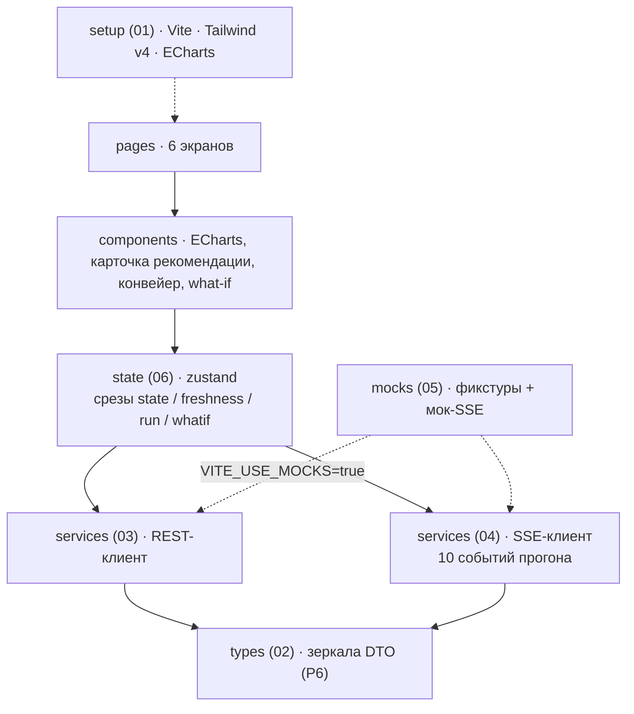
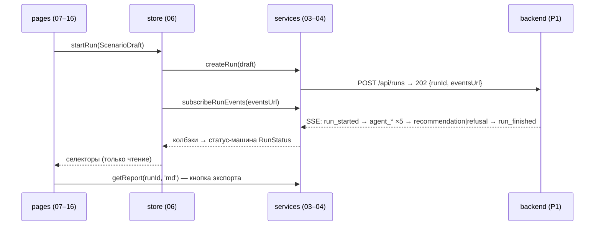

# Домен frontend — «Refinery Copilot»

Каталог: `frontend/` (+ `Dockerfile`, `nginx.conf`). UI разрабатывается независимо:
замороженный контракт, TS-типы, мок-фикстуры и мок-SSE позволяют вести разработку без backend,
поэтому набор документов самодостаточен: от установки до сервисов и моков. Единственный канал к системе —
протокол [[01-p1-rest-sse]]; типы приходят из контракта через [[06-p6-openapi-ts-mocks]].
**Приложение полностью работает без backend на моках** ([[05-mocks]]) — это условие приёмки домена.

## Scope

| Файл | Назначение | Содержит | НЕ содержит |
| --- | --- | --- | --- |
| [[frontend/00-OVERVIEW]] | этот документ | слои, индекс, правила, зависимости | код компонентов |
| [[01-project-setup]] | каркас проекта | Vite + React 18 + TS strict, Tailwind v4, ECharts, eslint, каталоги, скрипты, dev-старт на моках | дизайн-система, бизнес-логика |
| [[02-types]] | TS-типы контракта | зеркала 8 DTO + енумы как union-типы, правило регенерации | собственные форматы данных |
| [[03-service-rest]] | REST-клиент | fetch-обёртка, формат ошибки, getState/createRun/getRun/getReport/whatif/getModels | SSE, бизнес-логика |
| [[04-service-sse]] | SSE-клиент | EventSource + Last-Event-ID, парсинг 10 событий, heartbeat/reconnect | рендер конвейера |
| [[05-mocks]] | мок-режим | фикстуры 5 сценариев, мок-SSE с таймлайном агентов, `VITE_USE_MOCKS` | реальные вызовы |
| [[06-state]] | стор | zustand-срезы state/freshness/run/whatif, экшены, селекторы, кэш тайм-серий | серверное состояние вне срезов |

Документы 07–16 (компоненты и 6 страниц — тайм-серии, карточка рекомендации, конвейер агентов, what-if,
дашборд и др.) описаны в общем плане домена; их контракт уже
зафиксирован здесь: страницы потребляют только стор и сервисы из [[06-state]]/[[03-service-rest]]/
[[04-service-sse]], а данные каждого экрана — из таблицы ниже.

## Слоистая архитектура

Направление зависимостей строгое: страница знает про стор и компоненты; стор — про сервисы;
сервисы — про типы. Моки подменяют сервисы на транспортном уровне, не трогая всё выше.

```text
pages (07–16)     дашборд · карточка рекомендации · what-if · мнемосхема · модели · репортёр
   │                страницы НЕ зовут API напрямую
components        timeseries(ECharts) · карточка рекомендации · конвейер агентов · whatif-контролы
   │
state (06)        zustand-стор: срезы state / freshness / run / whatif + кэш тайм-серий
   │                экшены прогона = события SSE → статус-машина RunStatus
services (03–04)  rest-клиент (fetch, типизированные ошибки)  │  sse-клиент (EventSource, backoff)
   │                 └── 05 mocks: фикстуры 5 сценариев + мок-SSE-симулятор (VITE_USE_MOCKS=true)
types (02)        TS-зеркала DTO из api/data-models (P6) ◄──────────────────┘
setup (01)        Vite · React 18 · TS strict · Tailwind v4 · ECharts · eslint
```



## Правила дизайна

> [!warning] Ключевые правила frontend
> 1. **Страницы не зовут API напрямую**: REST — только через сервисы ([[03-service-rest]]) и стор
>    ([[06-state]]); SSE — только через клиент-обёртку ([[04-service-sse]]).
> 2. **Все числа — из контракта**: любое значение в UI берётся из DTO ([[02-types]]) или из
>    REST/SSE. Никакого «магического доменного кода»: пороги 10 мг/кг, 360 °C, 51/49 ЦЧ,
>    820–845 кг/м³, 3 % присадки живут в полях `checks[]`/`risks[]` карточки
>    ([[04-recommendation]]) — фронт их не дублирует, только отображает.
> 3. **Типы не переизобретаются**: всё из api/data-models ([[01-timeseries]]…[[08-model-artifact]],
>    енумы — [[01-enums]]); расхождение типов = баг контракта, а не локальный фикс.
> 4. **Мок-режим обязателен**: `VITE_USE_MOCKS=true` поднимает всё приложение без backend
>    ([[05-mocks]]) — фикстуры из [[90-examples-and-mocks]].
> 5. **Тяжёлые ряды прореживаются на клиенте**: lttb-сэмплинг до ~5–10 тыс. точек из 189 тыс. +
>    dataZoom; «все точки в DOM» — запрещено.
> 6. **Единственный канал к системе — P1**: никаких обращений к core и data-store, никаких
>    импортов из ядра.
> 7. Отказ — штатный исход: UI обязан одинаково уметь показывать `recommend` и `refuse`
>    (сценарий `stale_lims` в моках).

## Данные на экранах (мост к документам 07–16)

| Экран | Основные DTO/события | Источник в приложении |
| --- | --- | --- |
| Дашборд | `StateResponse`, `DataFreshness`, события прогона 1–10 | `stateSlice` + `runSlice` |
| Карточка рекомендации | `Recommendation` ([[04-recommendation]]), `RunReport` | `runSlice.card`, `getReport` |
| Что если | `WhatifRequest`/`WhatifResponse` | `whatifSlice` |
| Мнемосхема | `TagPoint` ([[01-timeseries]]) + статусы freshness | `stateSlice` + кэш рядов |
| Модели | `ModelArtifact` ([[08-model-artifact]]) | `getModels` |
| Репортёр данных | `DataFreshness`, `QualityFlag` ([[01-enums]]), находки из логов `data` | `freshnessSlice` + `runSlice.logs` |

## Поток данных: запуск прогона (сквозной кадр демо)



Пунктирная ветка `VITE_USE_MOCKS=true`: `SVC` заменяется моками [[05-mocks]] — кадр для
оператора не меняется.

## Кросс-доменные зависимости

| Протокол | Пара | Что получает frontend |
| --- | --- | --- |
| P1 | frontend ↔ backend | REST-эндпоинты `/api/state`, `/api/runs`, `/api/whatif`, `/api/models`, `/api/health`, отчёты; SSE-стрим `/api/runs/{id}/events` — [[01-p1-rest-sse]] |
| P6 | api ↔ frontend | TS-типы (OpenAPI-кодоген или ручное зеркало) + мок-фикстуры + мок-SSE — [[06-p6-openapi-ts-mocks]] |
| P7 | infra → frontend | compose-сервис `web` (nginx), proxy `/api → api:8000` с `proxy_buffering off` для SSE; `make ui` |

> [!note] Фронт не знает о data-store и core
> Офлайн-режим — только через моки; никакой прямой работы с
> Parquet или ядром из браузера.

## Старт без backend (быстрый путь)

```bash
cd frontend
npm ci
VITE_USE_MOCKS=true npm run dev   # http://localhost:5173, все данные — фикстуры
```

Подробности окружения, скриптов и структуры каталогов — в [[01-project-setup]]; порядок реализации
файлов совпадает с нумерацией документов: types → services → mocks → state → components → pages.

## Правило «управляемые переменные» (для what-if и карточки)

Перечень управляемых тегов (P8/T11/F19, АВТ-переменные `crude_feed_rate_tph`,
`avt_furnace_outlet_temp_c`, `avt_column_pressure_mpa_abs`, доли бленда + присадка ≤ 3 %)
— домен ядра; фронт получает его **через контракт**: `overrides` в [[06-scenario]] и
`violations`/`feasible` в ответе what-if ([[01-p1-rest-sse]]). Ползунки рисуются по списку
управляемых, полученному из ответов API, а не по локальному справочнику; нарушение ограничения
подсвечивается по `violations[]`, а не по пересчёту порогов на клиенте.

[^приёмка]: Приёмка домена: дашборд на моках прогоняет все 5 сценариев, отказ виден,
live-обновление конвейера агентов работает ([[05-mocks]], [[frontend/00-OVERVIEW]] правило 3).
