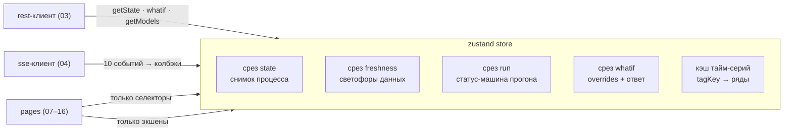
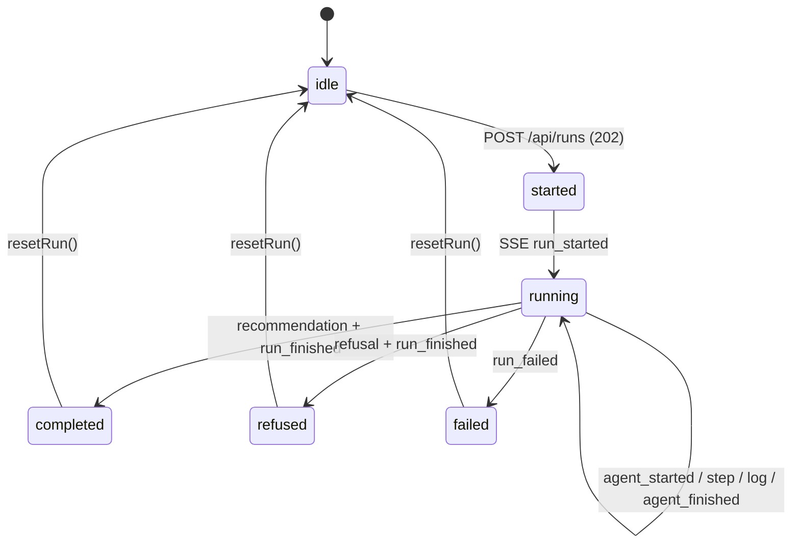

# 06 — Управление состоянием (`src/store/`)

Рекомендуемый лёгкий подход: **zustand** — один стор, четыре среза, без провайдеров и
бойлерплейта (альтернатива для этой же схемы — `context + useReducer`, контракты срезов
идентичны). Серверное состояние не тянуть отдельной библиотекой кэша запросов: объём REST
маленький (7 эндпоинтов, [[03-service-rest]]), а «серверная» динамика — это SSE, которая всё
равно живёт в срезе `run`. Тяжёлое — только тайм-серии, для них свой кэш в этом же сторе.

## Scope

Содержит: состав срезов `state` / `freshness` / `run` / `whatif`, экшены, селекторы, кэш
тайм-серий, статус-машину прогона из SSE, правила подключения страниц. НЕ содержит: серверного
состояния вне срезов, логики fetch/SSE (это [[03-service-rest]]/[[04-service-sse]]), рендера.

## Компоненты стора



```text
src/store/
├── store.ts          # create<RootStore>()(...slices), тип RootStore
├── slices/
│   ├── stateSlice.ts # tPoint, tags[], lastRun
│   ├── freshnessSlice.ts # DataFreshness[] + итоговый «светофор»
│   ├── runSlice.ts   # статус-машина прогона: шаги, логи, карточка
│   └── whatifSlice.ts# overrides, variants, статус запроса
├── timeseriesCache.ts# кэш рядов (отдельное Map-хранилище, без реактивной перерисовки)
└── selectors.ts      # именованные селекторы (единственная точка доступа страниц)
```

## Срезы и экшены

```ts
// Срез state — «что сейчас с процессом» (обновление: getState)
interface StateSlice {
  tPoint: string | null;
  tags: TagPoint[];                 // снимок значений ( TagPoint из [[01-timeseries]] )
  loadState(p?: { tPoint?: string; tags?: string[] }): Promise<void>;
}

// Срез freshness — светофоры источников (обновляется тем же loadState)
interface FreshnessSlice {
  freshness: DataFreshness[];       // [[02-data-freshness]]
  worstStatus(): FreshnessStatus;   // missing > stale > warn > ok — для шапки дашборда
}

// Срез run — один активный прогон (обновление: колбэки subscribeRunEvents)
interface RunSlice {
  runId: string | null;
  status: RunStatus | 'idle';       // FSM ниже, значения [[01-enums]]
  kind: ScenarioKind | null;
  steps: Record<number, AgentStepStatus>;    // по stepIdx: idle|running|done
  trace: AgentStep[];               // полные AgentStep ([[05-agent-step]]) по agent_finished
  logs: LogPayload[];
  card: Recommendation | null;      // и recommend, и refuse — одна модель [[04-recommendation]]
  errorCode: string | null;         // из run_failed
  reportUrl: string | null;         // из run_finished
  startRun(draft: ScenarioDraft): Promise<void>;  // createRun + subscribeRunEvents + подписка колбэков
  resetRun(): void;
}

// Срез whatif — симулятор «что если»
interface WhatifSlice {
  overrides: Record<string, number>;         // текущие ползунки
  baseline: WhatifQualityPoint[] | null;
  variants: WhatifVariant[] | null;
  elapsedMs: number | null;
  status: 'idle' | 'loading' | 'ready' | 'error';
  setOverride(tag: string, value: number): void;   // внутри — debounce ~150 мс → requestWhatif()
  requestWhatif(): Promise<void>;                  // POST /api/whatif (≤ 8 вариантов, [[03-service-rest]])
}
```

## Статус-машина прогона

События [[04-service-sse]] переводят FSM; терминальные состояния — `completed` / `refused` /
`failed` (отказ — штатный исход, не ошибка). Переходы соответствуют [[01-enums]] B.4:



## Кэш тайм-серий

Ключ — `${tagCode}|${from}|${to}|${agg}`; значение — уже **прореженный** ряд (lttb до ~5–10 тыс.
точек из 189 тыс., правило 5 [[frontend/00-OVERVIEW]]):

```ts
interface TimeseriesCache {
  get(key: string): TagPoint[] | undefined;
  put(key: string, points: TagPoint[]): void;   // вытеснение: LRU, лимит ~40 рядов на сессию
  invalidateTag(tagCode: string): void;         // при новом tPoint/прогоне
}
```

Политика: TTL 10 мин (данные исторические, не тикают); инвалидиция тега при новом прогоне;
ряды живут вне zustand-реактивности (`timeseriesCache.ts`), компонент подписывается только на
факт загрузки (`isLoading(key)`) — иначе ECharts перерисовывался бы на каждый put.

## Селекторы

```ts
// src/store/selectors.ts — страницы используют только эти имена
export const selectTPoint(s: RootStore): string | null;
export const selectFreshnessBadges(s: RootStore): { pointId: string; status: FreshnessStatus }[];
export const selectRunStatus(s: RootStore): RunStatus | 'idle';
export const selectActiveSteps(s: RootStore): { stepIdx: number; role: AgentRole; status: AgentStepStatus }[];
export const selectCard(s: RootStore): Recommendation | null;   // рекомендация ИЛИ отказ
export const selectIsRefusal(s: RootStore): boolean;            // card.decision === 'refuse'
export const selectWhatifReady(s: RootStore): boolean;
export const selectViolations(s: RootStore): string[];          // variants[].violations для подсветки
```

## Правила

> [!warning] Дизайн стора
> 1. **Страницы не зовут API**: только экшены (`loadState`, `startRun`, `requestWhatif`, …) и
>    селекторы; ESLint-запрет импорта `services/*` — [[01-project-setup]].
> 2. Колбэки SSE — единственный писатель среза `run`; состояние из REST не смешивается с
>    событиями (после `run_finished` итог сверяется `getRun` при открытии отчёта).
> 3. Все типы полей — из [[02-types]]; никаких локальных зеркал DTO и доменных констант
>    (правило 2 [[frontend/00-OVERVIEW]]).
> 4. Один активный прогон на сессию; повторный `startRun` до финала — сначала `resetRun()`.
> 5. Что-бы-если debounce 150 мс и ≤ 8 вариантов за запрос (400 иначе, [[01-p1-rest-sse]]).
> 6. Мок/лайв не различаются здесь: стор работает с `api` из [[05-mocks]].
