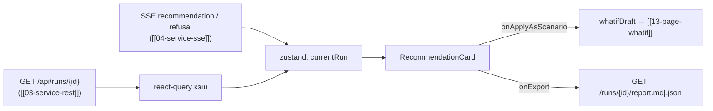

# 08 — Компонент «Карточка рекомендации» (`RecommendationCard`)

Единственный рендерер карточки рекомендации: **состояние → риск → действие («тег: с→до») → эффект →
проверенные ограничения → уверенность (P10–P90) → объяснение**. Данные — DTO
`Recommendation` из [[04-recommendation]] (зеркало в [[02-types]]), приходят из SSE-события
`recommendation` / `refusal` или из `GET /api/runs/{id}` ([[03-service-rest]]).

> [!important] Инварианты источника (проверять defensive, не чинить локально)
> Из [[04-recommendation]]: `decision = 'recommend'` ⇒ непусты `actions/effects/checks/confidence`
> и `refusal is null`; `decision = 'refuse'` ⇒ `refusal.reasons` непуст. Отказ — **штатный**
> первоклассный исход, а не ошибка: рендерится отдельной карточкой,
> не через toast/error.

## Scope

| Содержит (covers) | НЕ содержит (does NOT cover) |
| --- | --- |
| 7 блоков карточки в фиксированном порядке; компактный и полный режим | генерация рекомендаций, любые числа «своей головой» |
| Отказ-карточка: красная, `RefusalReason[]` + details + «что делать оператору» | триггеры отказа (ядро, оркестратор) |
| Список альтернатив (Парето) с переводом в what-if («примять как сценарий») | расчёт Парето (агент optimization) |
| Чек-лист проверенных ограничений (сера/T95/ЦЧ/плотность/доли/присадка/p2–p98) | повторная проверка ограничений на фронте |
| SHAP top-k [[03-quality-assessment]] как мини-бары «почему» | обучение моделей, расчёт SHAP |

## API компонента

```ts
import type { Recommendation, QualityAssessment } from '../types/api.gen';

export interface RecommendationCardProps {
  recommendation: Recommendation;        // decision: 'recommend' | 'refuse'
  quality?: QualityAssessment[];         // для SHAP-баров рядом с блоком «Эффект»
  mode?: 'full' | 'compact';             // full — все 7 блоков; compact — действие+уверенность
  showAlternatives?: boolean;            // default true (в compact скрыт)
  onApplyAsScenario?: (rec: Recommendation, alt?: AlternativeItem) => void;
  onExport?: (format: 'md' | 'json') => void;   // прокидывается со страницы [[12-page-recommendation-card]]
  showExport?: boolean;                  // default false — на дашборде экспорт не нужен
}
```

## Макет (полный режим, `decision: 'recommend'`)

```text
┌─ RecommendationCard ──────────────────────────────────────────────────────┐
│ ▸ шапка: run_id · t_point · бейдж scenario kind · светофоры свежести       │
│ ┌──────────────────────────────────────────────────────────────────────┐  │
│ │ 1 СОСТОЯНИЕ  state[]: тег | значение | единица (≤ 12 позиций)         │  │
│ │ 2 РИСК       risks[]: цель | лимит | p50 (p10–p90) | spec_risk-бар    │  │
│ │ 3 ДЕЙСТВИЕ   actions[]: «24-2000.P8: 341.2 °C → 339.5 °C (−0.5 %)»    │  │
│ │              стрелка ↓ зелёная / ↑ оранжевая по знаку delta_pct       │  │
│ │ 4 ЭФФЕКТ     effects[]: цель | было p50 → станет p50 | запас до спеки │  │
│ │              + SHAP top-k мини-бары (±вклад) из quality[].shapTopK    │  │
│ │ 5 ОГРАНИЧЕНИЯ checks[]: ✓ зелёная строка / ✗ красная (passed: false)  │  │
│ │ 6 УВЕРЕННОСТЬ confidence {p10: 0.62, p90: 0.88} — шкала-полоса        │  │
│ │              + бейджи возраста ЛИМС/ПАК (предупреждение о старых)     │  │
│ │ 7 ОБЪЯСНЕНИЕ explanation — абзац текста (только текст поверх фактов)  │  │
│ └──────────────────────────────────────────────────────────────────────┘  │
│ ▸ Альтернативы (Парето):  [Присадка 1,5 % · rank 2 · cost 1.5] [примять]  │
│ [ Примять как сценарий ]  [ Экспорт MD ] [ Экспорт JSON ]                  │
└──────────────────────────────────────────────────────────────────────────┘
```

## Блоки — источник → рендер

| № блока | Поле DTO | Рендер |
| --- | --- | --- |
| Время и состояние | `t_point`, `state: StateItem[]` | таблица ≤ 12 строк «тег — значение — единица»; единицы из `unit` (не угадываем) |
| Проблема / риск | `risks: RiskItem[]` | строка на цель: `limit` (текст «≤ 10 мг/кг») + p50 крупно + (p10–p90) мелко + `spec_risk` как горизонтальный бар 0..1 (красный > 0.3) |
| Действие | `actions: ActionItem[]` | моноширинно: `tag: current → recommended` + `delta_pct`; в compact-режиме — только этот блок |
| Ожидаемый эффект | `effects: EffectItem[]` | `baseline_p50 → action_p50` по каждой цели + `margin_to_spec` («запас до спецификации 0.9 мг/кг») |
| Проверка ограничений | `checks: CheckItem[]` | чек-лист: ✓/✗ + `description` + `value limit`; невыполненных не бывает при recommend — если ✗, показываем как баг-плашку (инвариант ядра нарушен) |
| Уверенность | `confidence: {p10, p90}` | полоса P10–P90 на шкале 0–1; предупреждение о старых/пропущенных данных — бейджи `DataFreshness` из [[06-state]] |
| Объяснение | `explanation: string` | абзац; никаких вычислений, только текст оркестратора |

## Отказ (`decision: 'refuse'`) — отдельная красная карточка

```text
┌─ ✖ НАДЁЖНОЙ РЕКОМЕНДАЦИИ НЕТ ─────────────────────────────────────────────┐
│ Причины (RefusalReason):                                                   │
│  • stale_lims            — ЛИМС устарел (возраст 44 ч > 28 ч)              │
│  • wide_interval         — интервал серы 8.9–10.4 пересекает границу 10    │
│ Детали: refusal.details[] — нумерованный список человеческим языком        │
│ Что делать: подсказка по причине (stale_lims → «закажите лаб. анализ»;      │
│             out_of_training_domain → «выйдите из экстремального режима»)   │
│ Объяснение: explanation (цитата дословно)                                  │
└────────────────────────────────────────────────────────────────────────────┘
```

- Красная рамка/фон, заголовок: «Умение корректно отказаться — часть качественного решения».
- `RefusalReason` — закрытый union из [[01-enums]]: `stale_lims | wide_interval | out_of_training_domain |
  no_feasible_variant | sensor_fault`; карта «причина → совет оператору» — статический словарь компонента.
- Кнопка «примять как сценарий» на отказ-карточке **скрыта** (нечего примять).

## Кнопка «примять как сценарий»

```ts
// перевод actions[] (+ выбранной альтернативы) в overrides для POST /api/whatif
buildOverrides(actions: ActionItem[]): Record<string, number>
//   → { '24-2000.P8': recommendedValue, 'blend_additive_pct': 1.5, ... }
// ключи — только управляемые теги; валидация на 400/422 ([[01-p1-rest-sse]] §2.1) — тост с message
```

- `onApplyAsScenario(rec, alt)` вызывает навигацию на [[13-page-whatif]] c предзаполненными
  ползунками (через [[06-state]] — zustand-слайс `whatifDraft`); сама страница делает `POST /api/whatif`.
- Кнопка задизейблена, если `actions[]` пуст или содержит только `delta_pct: null` без значений.

## Поток данных



1. На дашборде карточка получает свежий `Recommendation` из статуса прогона (SSE) — live-режим.
2. На странице [[12-page-recommendation-card]] — из react-query по `runId` (история) + SSE только для активного прогона.
3. Компонент не зовёт API сам (правило 1 [[frontend/00-OVERVIEW]]) — только колбэки.

## Приёмо-сопутствующие правила

- Числа форматируются локалью `ru-RU` (запятая-десятичная), единицы — как в `unit` источника; `null` → «—» (нет данных), никаких 0 по умолчанию.
- Заголовки блоков — фиксированные формулировки карточки: «Время и состояние», «Проблема / риск», «Предлагаемое действие», «Ожидаемый эффект», «Проверка ограничений», «Уверенность», «Объяснение».
- Сценарная подпись обязательна: «модельная оценка; история не подтверждает действий, которых в ней не было» — мелким шрифтом под «Эффектом».
- Compact-режим используется в мини-конвейере дашборда [[11-page-dashboard]]; полный — на [[12-page-recommendation-card]].

## Компактный режим (дашборд)

```text
┌─ compact ────────────────────────────────────────────────┐
│ 24-2000.P8: 341.2 → 339.5 °C (−0.5 %)     ✓ 3/3 проверки │
│ сера → 9.1 [8.4–9.8] мг/кг (было 9.6)   увер. 62–88 %    │
│ [ Примять как сценарий ]   подробнее → карточка (12)      │
└──────────────────────────────────────────────────────────┘
```

В compact: только «Действие» + «Эффект» одной строкой + уверенность; `risks`/`state`/`checks`
свёрнуты в счётчик «✓ 3/3 проверок»; объяснение — tooltip по иконке «i». Отказ-карточка в
compact **не ужимается**: причины всегда видны полностью (штатный исход важнее краткости).

## Форматирование чисел

```ts
// utils/format.ts — единственный форматтер карточки
formatValue(value: number | null, unit: string | null): string   // ru-RU, 1–2 знач. цифры, null → '—'
formatDelta(deltaPct: number | null): string                     // '+2.1 %' / '−0.5 %' / '' при null
formatConfidence(ci: ConfidenceInterval): string                 // '62–88 %'
```

- Округление: температуры/расходы — 1 знак, сера/ЦЧ — 1–2 знака, доли — проценты с 0 знаков;
  `null` никогда не превращается в 0.
- Стрелка действия — по знаку `delta_pct`, а не по «интуиции» (снижение температуры — тоже действие).
- Все единицы — из полей `unit` DTO; компонент не подставляет единицы «по смыслу тега».

## Интеграция с конвейером

- Компонент получает `recommendation` из того же редьюсера, что и [[09-components-agent-pipeline]];
  после события `recommendation` карточка появляется **без** перезапроса REST (данные уже в статусе прогона).
- Для прогона из истории карточка берёт `RunReport.recommendation` ([[07-run-report]] через [[03-service-rest]]) —
  один и тот же компонент рендерит live и архивный прогон, ветвление только в источнике данных ([[06-state]]).
- SHAP-бары рисуются только при непустом `quality[].shapTopK`; нет данных — блок скрывается,
  не рисуется заглушка с выдуманными вкладами.
