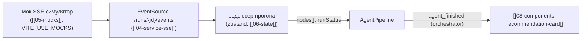

# 09 — Компонент «Конвейер агентов» (`AgentPipeline`)

Вертикальный конвейер 5 агентов `data → quality → reliability → optimization → orchestrator`
с живыми статусами из SSE ([[04-service-sse]]) и раскрывающимися шагами [[05-agent-step]]:
`notes[]`, `number_refs[]`, тайминги. Обеспечивает прозрачность прогона: система сохраняет
и показывает входные данные, оценки агентов и итоговую рекомендацию.

## Scope

| Содержит (covers) | НЕ содержит (does NOT cover) |
| --- | --- |
| Вертикальный конвейер 5 ролей `AgentRole` ([[01-enums]]) со статусами | запуск агентов, любые расчёты |
| Маппинг SSE-событий `agent_started` / `step` / `log` / `agent_finished` на статусы | SSE-транспорт, реконнект, backoff (см. [[04-service-sse]]) |
| Раскрытие шага: `AgentStep` целиком (JSON-вью + человекочитаемые `notes`/`number_refs`) | редактирование выходов; повторные запросы шагов |
| Бейджи времени: `duration_ms`, «выполняется… N с» тикающий | вердикты о качестве работы агентов |
| `input_digest` (sha256, 16 hex) как бейдж воспроизводимости | хэширование входов (ядро, P2) |
| Mini-режим для дашборда (только 5 узлов + статусы) | карточка рекомендации (отдельный компонент [[08-components-recommendation-card]]) |

## API компонента

```ts
import type { AgentStep, RunStatus } from '../types/api.gen';

export interface AgentNodeState {
  agentRole: 'data' | 'quality' | 'reliability' | 'optimization' | 'orchestrator';
  status: 'pending' | 'running' | 'done' | 'skipped';   // skipped — не бывает, резерв контракта
  step?: AgentStep;          // полный шаг после agent_finished
  startedAt?: string;        // из agent_started (AgentStep без output)
  logTail: string[];         // последние ≤ 5 событий `log` этого агента
}

export interface AgentPipelineProps {
  nodes: AgentNodeState[];            // собирает [[06-state]] из потока SSE
  runStatus: RunStatus;               // started → running → completed | refused | failed
  runId: string | null;
  variant?: 'full' | 'mini';          // mini — для дашборда, высота ~5 строк
  defaultExpanded?: number | null;    // step_idx раскрытого узла (mini: всегда null)
  onOpenStep?: (step: AgentStep) => void;
}
```

## Макет (full)

```text
┌─ AgentPipeline ────────────────────────────────────────────────────────────┐
│ ● Данные           ✓ 2.1 s   [a3f9c1…]   ▸ раскрыть                        │
│ │  «D10 мёртв (99,99 % сентинелов)», «свежесть ПАК ok»  ← log-tail        │
│ ● Качество         ✓ 2.1 s   [9f2a1c4e8b7d0f31]  ▼ раскрыт                  │
│ │   Заметки: «Прогноз серы у верхней границы; конформ расширил интервал…»  │
│ │   Числа:  Прогноз серы P50 = 9.6 мг/кг · P90 = 10.4 мг/кг (кликабельны) │
│ │   JSON:   { "sulfur": { "p50": 9.6, … } }        [copy]                  │
│ ● Надёжность       ⠙ выполняется… 3 с                                       │
│ ● Оптимизация      ○ ожидает                                                │
│ ● Оркестратор      ○ ожидает                                                │
│ Итог прогона: running · seed 42 · t_point 2026-09-19T08:00Z                 │
└─────────────────────────────────────────────────────────────────────────────┘
```

Статусы узлов: `pending` ○ серый → `running` ⠙ спиннер (от `agent_started`) → `done` ✓ зелёный
(от `agent_finished`). Ребро между узлами анимируется током в момент перехода.

## Маппинг SSE-событий на состояние

| Событие ([[01-p1-rest-sse]] §5.2) | Действие редьюсера ([[06-state]]) |
| --- | --- |
| `run_started` | `runStatus = running`, все узлы `pending`, `runId` фиксируется |
| `agent_started` | узел `agentRole` → `running`, `startedAt`; событие несёт `AgentStep` **без** `output`/`numberRefs` |
| `step` | промежуточный артефакт → в `logTail`/временную копилку узла (`{stepIdx, label, payload}`) |
| `log` | `message` → в `logTail` узла по `stepIdx` (level `warn` — жёлтый маркер) |
| `agent_finished` | узел → `done`, `step = AgentStep` полный; `duration_ms` → бейдж; дедуп по `id`(seq) |
| `recommendation` / `refusal` | узел orchestrator → `done`; итог уходит в [[08-components-recommendation-card]] |
| `run_finished` / `run_failed` | `runStatus` терминален; при `run_failed` текущий узел красится красным + `errorCode` |
| heartbeat `: hb` | игнорируется (комментарий SSE), сбрасывает таймер «соединение живо» |

Гарантии транспорта: события идут строго по `id` = монотонный `seq`; дубли отбрасываются,
реплей после реконнекта — `Last-Event-ID` из журнала `artifacts/timeline/{run_id}.ndjson`
(эта логика — в [[04-service-sse]], компонент только потребляет готовый `nodes[]`).

## Раскрытый шаг — рендер [[05-agent-step]]

| Элемент | Источник в `AgentStep` | Рендер |
| --- | --- | --- |
| Человекочитаемые выводы | `notes[]` | список буллетов — **первичный** просмотр |
| Ключевые числа | `number_refs[]` (`{path, value, unit, label}`) | плашки «label = value unit»; клик → копирование |
| Время | `started_at` / `finished_at` / `duration_ms` | бейдж у заголовка узла; «выполняется… N с» тикает от `startedAt` |
| Хэш входа | `input_digest` | моноширинный бейдж — воспроизводимость (один seed → один digest) |
| Вход | `input_summary` | сворачиваемый JSON (`{}` по умолчанию) |
| Выход | `output` | сворачиваемый JSON с подсветкой; кнопка «copy» |
| Самооценка | `confidence` | мини-бар 0..1 в шапке узла (если не null) |

JSON-вью: ленивый, `JSON.stringify(payload, null, 2)` в `<details>`; без виртуализации
(шаги ≤ 5, объёмы малые) — правило «тяжёлые ряды не в DOM» здесь не применимо.

## Поток данных



- Компонент не подписывается на EventSource сам: он — чистая функция от `nodes[]` (правило 1 домена).
- На моках `nodes[]` идёт от мок-симулятора с таймлайном событий и паузами — конвейер выглядит живым без backend.
- Mini-вариант (дашборд): 5 строк по ~24 px без раскрытия; клик по узлу при `variant: 'mini'` —
  навигация к полному конвейеру, не разворачивание inline.

## Правила дизайна

- Роли — человеческие названия с ролью-ключом: «Данные (`data`)», «Качество (`quality`)», «Надёжность (`reliability`)», «Оптимизация (`optimization`)», «Оркестратор (`orchestrator`)».
- Порядок узлов фиксирован `step_idx` 0–4, не сортируется по приходу событий.
- Ничего не вычисляем: значения плашек — дословно `number_refs`; если `notes` пуст — показываем «без текстовых выводов», не выдумываем.
- Терминальный `runStatus: 'refused'` — не красим весь конвейер красным: отказ штатный, красным только `failed`.

## Потеря соединения и дозаполнение

- Если SSE-соединение оборвалось на середине прогона ([[04-service-sse]] реконнектится с
  `Last-Event-ID`), конвейер остаётся в последнем консистентном состоянии; у заголовка — бейдж
  «догружаем журнал…»: узлы дозаполняются реплеем из `artifacts/timeline/{run_id}.ndjson`
  прозрачно для компонента (логика в [[04-service-sse]]/[[06-state]]).
- `run_failed` при неопределённом узле: текущий `running`-узел красится красным с подписью
  `errorCode` из события; остальной прогресс не сбрасывается.
- Терминальное состояние не меняется задним числом: поздние дубли по `id` (seq) отброшены
  редьюсером, компонент защищён от «поздних» событий проверкой `runStatus`.

## Мок-режим

Мок-SSE-симулятор [[05-mocks]] проигрывает таймлайн событий с паузами (сотни мс — секунды),
чтобы конвейер выглядел живым в демо-режиме без backend. Компонент не знает о моке: тот же `nodes[]`,
те же статусы; `VITE_USE_MOCKS=true` лишь подменяет источник потока ([[06-state]]).
Для демонстрации предусмотрен «кнопка ×2» — ускорение таймлайна мока вдвое (фича мока, не компонента).

## Доступность

- Каждый узел — кнопка с `aria-expanded`; статусы дублируются текстом («выполняется… 3 с»),
  не только спиннером/цветом; warn-строки лога несут иконку, а не только жёлтый цвет.
- Автопрокрутка к новому раскрытому узлу — только если пользователь уже смотрит на конвейер (без «прыжков» страницы).
- В mini-варианте конвейер читается как список статусов («Данные — готово, 2.1 s»…) без раскрытия.
