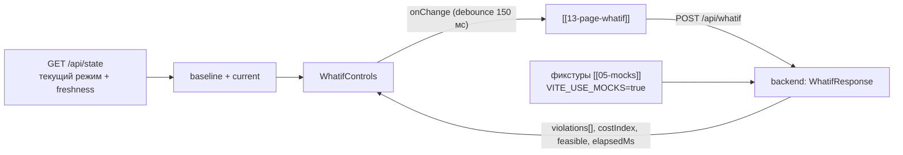

# 10 — Компонент «Контролы what-if» (`WhatifControls`)

Ползунки по **подтверждённому перечню управляемых переменных**:
гидроочистка `{P8, T11, F19}`, АВТ `{crude_feed_rate_tph, avt_furnace_outlet_temp_c,
avt_column_pressure_mpa_abs}`, блендинг `{доли компонентов, Σ = 100 %, присадка ≤ 3 %}`.
Живой пересчёт: debounce ~150 мс → `POST /api/whatif` (SLA бэкенда < 50 мс[^sla]), подсветка
нарушенных ограничений и стоимостной прокси.

## Scope

| Содержит (covers) | НЕ содержит (does NOT cover) |
| --- | --- |
| Генерация ползунков из реестра управляемых (диапазоны p2/p98, шаг, единицы) | вызов `POST /api/whatif` (делает [[13-page-whatif]] через [[03-service-rest]]) |
| Дебаунс значений и запрос «сброс к текущему режиму» | прогноз и feasibility (ядро, синхронно) |
| Пресеты сценариев `ScenarioKind` ([[06-scenario]]) как быстрые кнопки | проверка ограничений по существу — вердикт приходит в `violations[]` |
| Локальная индикация «выход за p2/p98», «доли Σ ≠ 100 %», «присадка > 3 %» до запроса | рендер прогноза (страница, [[07-components-timeseries]]) |
| Отображение `costIndex` и статуса `feasible` варианта | расчёт экономики (присадка ×100 — ядро[^x100]) |

## Реестр управляемых (источник ползунков)

```ts
// src/features/whatif/controlledVariables.ts — единственный реестр, импортирует диапазоны из /api/state
export interface ControlledVar {
  key: string;               // ключ overrides ('24-2000.P8' | 'crude_feed_rate_tph' | 'blend_share_kerosene' | ...)
  group: 'hdu' | 'avt' | 'blend';
  label: string; unit: string;
  p2: number; p98: number;   // модельный диапазон истории — допущение, не паспортные пределы[^p298]
  step: number;
  current?: number;          // текущее значение из /api/state (базовая линия)
}
```

| Группа | Переменные (ключ overrides) | p2 … p98 (история) | Шаг |
| --- | --- | --- | --- |
| Гидроочистка | `24-2000.P8` (T ГСС вход Р-202) | 0.01 … 0.23 | 0.01 |
| Гидроочистка | `24-2000.T11` (расход сырья) | 11.0 … 381.6 | 1 |
| Гидроочистка | `24-2000.F19` (давление Р-202) | −0.08 … 251.1 | 1 |
| АВТ | `crude_feed_rate_tph` (расход нефти) | 42.9 … 1181.3 | 5 |
| АВТ | `avt_furnace_outlet_temp_c` (T выхода печи) | 20.4 … 385.7 | 0.5 |
| АВТ | `avt_column_pressure_mpa_abs` (давление колонны) | 0.36 … 1.21 | 0.01 |
| Блендинг | `blend_share_kerosene` / `blend_share_gasoil` / доля очищенного ДТ (остаток) | 0 … 1, **Σ = 1** | 0.01 |
| Блендинг | `blend_additive_pct` (цетаноповышающая присадка) | 0 … **3.0** | 0.1 |

> [!warning] Допущение на экране
> Диапазоны p2/p98 захватывают пуски/остановы и помечаются подписью «модельный диапазон
> (допущение), не паспортные пределы». Ползунок за пределами p10–p90
> рабочей зоны подсвечивается жёлтым, но не блокируется (нужны и «плохие» значения для демо).

## API компонента

```ts
import type { ScenarioKind } from '../types/api.gen';

export interface WhatifControlsProps {
  variables: ControlledVar[];
  overrides: Record<string, number>;             // текущая позиция ползунков (whatifDraft, [[06-state]])
  onChange: (next: Record<string, number>) => void;   // дебаунсится внутри страницы перед POST
  baseline: Record<string, number> | null;       // текущий режим из /api/state — для «сброса»
  requestState: 'idle' | 'pending' | 'ok' | 'error';
  elapsedMs?: number;                            // elapsedMs из WhatifResponse — бейдж «расчёт 31 мс»
  violations?: { key: string; message: string }[];   // violations[] ответа — какие ползунки виноваты
  costIndex?: number | null;                     // costIndex варианта
  feasible?: boolean | null;
  scenarioButtons?: { kind: ScenarioKind; label: string }[];   // пресеты
  onPreset?: (kind: ScenarioKind) => void;
}
```

## Макет

```text
┌─ WhatifControls ───────────────────────────────────────────────────────────┐
│ Гидроочистка            [сброс]                                            │
│  P8  T ГСС в реактор     0.17 ────●────── 0.23   (баз. 0.17)               │
│  T11 Расход сырья      348.0 ──────●──── 381.6   ↑ +2.1 % к базовой        │
│  F19 Давление          201.7 ────●────── 251.1                             │
│ АВТ                                                                        │
│  Расход нефти          899.5 ─────●───── 1181.3                            │
│  T выхода печи         368.0 ────●────── 385.7   ⚠ рабочая зона узкая      │
│ Блендинг (Σ = 100 %)                                                       │
│  Очищенный ДТ          0.64 ▓▓▓▓▓▓▓░░░ (остаток, read-only)                │
│  Керосин / газойль     0.12 / 0.24  ✓ Σ = 100 %                            │
│  Присадка ≤ 3 %        1.5 % ──●──────── 3.0                               │
│ ───────────────────────────────────────────────────────────────────────   │
│ Пресеты: [норма] [риск-2026] [сернистая нефть] [плохие данные] [отказ]     │
│ Вердикт: ✓ допустимо · стоимость costIndex 1.5 · расчёт 31 мс              │
└─────────────────────────────────────────────────────────────────────────────┘
```

## Поведение

1. **Дебаунс**: перетаскивание обновляет локальный `overrides` мгновенно (плавный ползунок),
   `onChange` наружу — после 150 мс тишины; страница делает `POST /api/whatif` (один вариант
   или батч до 8 `variants[]`). Бейдж `requestState: 'pending'` — серый спиннер у заголовка.
2. **Подсветка нарушений**: `violations[]` из ответа маппится на `key` — ползунок получает
   красную рамку и текст причины (`message`); `feasible: false` — плашка «вариант нарушает
   ограничения» над кнопкой. Локальные проверки **до** запроса: Σ долей ≠ 100 %, присадка > 3 %,
   выход за p2/p98 — жёлтая рамка, запрос всё равно уходит (бэкенд — источник истины).
3. **Стоимость**: `costIndex` — вертикальный мини-бар + число; подпись «присадка ×100 к цене ДТ»[^x100].
   Рост стоимости при росте присадки — ожидаемое поведение, не баг.
4. **Пресеты**: `onPreset(kind)` подставляет фикстурные overrides пресета ([[06-scenario]])
   одним махом; «сброс» возвращает `baseline` (текущий режим из `/api/state`).
5. **Ограничение запросов**: в полёте максимум 1 запрос; новый `onChange` отменяет предыдущий
   (`AbortController` на уровне страницы/[[03-service-rest]]).

## Поток данных



## Правила дизайна

- Ключи overrides — **только управляемые**: если в `overrides` попал неуправляемый тег, бэкенд ответит 400/422 — тост с `error.message`, ползунок не создаём (реестр — единственный источник).
- Слайдер блендинга: две доли двигаются свободно, третья (очищенный ДТ) = `1 − Σ` read-only, чтобы Σ всегда = 100 %.
- Единицы и формат чисел — из `ControlledVar` (ru-RU); доля — в процентах на экране, в `overrides` — доля 0..1.
- `elapsedMs` показываем всегда: честная демонстрация SLA < 50 мс[^sla] — модели в памяти.

## Пресеты сценариев → overrides

| Кнопка (`ScenarioKind`) | Что подставляет ([[06-scenario]], фикстуры [[05-mocks]]) |
| --- | --- |
| `normal` | базовый режим, все ползунки = baseline |
| `quality_risk` | режим 2026 «прижат к границе серы»; доля керосина 0.12 |
| `sour_crude` | повышенная сера сырья → требует реакции по P8/блендингу |
| `bad_data` | пресет для дашборда; на what-if показывает поведение при недостоверных данных |
| `stale_lims` | гарантированный отказ на прогоне; в what-if не применяется (скрыта, тултип «сценарий для прогона») |

- `onPreset` подменяет весь `overrides` одним вызовом (не ползунок-за-ползунком); после подстановки
  страница выполняет один пересчёт.
- Пресет не пишет в `Scenario` сущность — это только предзаполнение ползунков; `POST /api/runs`
  со сценарием остаётся на дашборде ([[11-page-dashboard]]).

## Клавиатура и доступность

- Каждый ползунок — нативный `input[type=range]` + числовое поле рядом (ввод точного значения);
  ↑/↓ — шаг `step`, PgUp/PgDn — ×10 шага.
- Доля блендинга: изменение одной доли перераспределяет read-only остаток, числовые поля
  синхронизированы; невозможно ввести Σ ≠ 100 % финально (промежуточно — жёлтая индикация).
- `violations[]` озвучиваются: у виноватого ползунка `aria-invalid` + текст причины в live-region.

[^sla]: [[01-p1-rest-sse]] C.1: `POST /api/whatif` синхронно, цель < 50 мс.
[^x100]: 1 т присадки в 100 раз дороже 1 т ДТ.
[^p298]: p2/p98 включают пуски/остановы — консервативное допущение.
